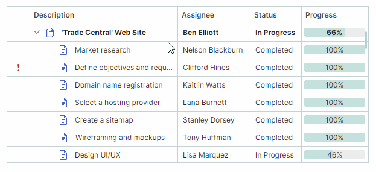
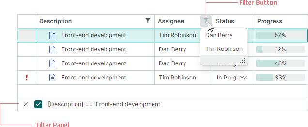
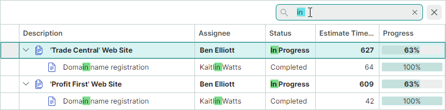
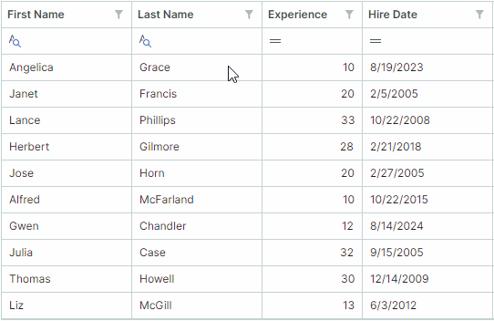
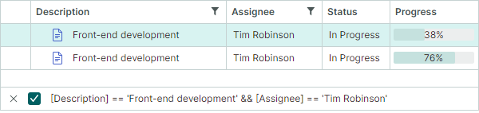

# Фильтрация и поиск

Контролы TreeList и TreeView поддерживают функции фильтрации и поиска данных, которые позволяют находить узлы по их значениям.


## Фильтры колонок (TreeList)

Пользователи могут фильтровать колонки TreeList с помощью меню фильтра. 
Чтобы открыть меню фильтра для колонки, наведите указатель мыши на заголовок колонки, пока не появится кнопка фильтра, а затем нажмите её. Открытое меню фильтра содержит все уникальные значения этой колонки. Выберите пункт в меню фильтра, чтобы отфильтровать колонку по этому значению.



Пользователи могут фильтровать TreeList по нескольким колонкам. Фильтры, применённые к нескольким колонкам, объединяются оператором AND.


### Режимы отображения 'List' и 'Checked List'

Меню фильтра могут представлять пункты (значения колонки) с помощью одного из двух режимов отображения:

- `List` (по умолчанию) — Обычный список, позволяющий выбрать один пункт за раз.

    


- `CheckedList` — Список с флажками, позволяющий пользователям выбирать несколько пунктов одновременно.

    


Вы можете установить режим отображения меню фильтра глобально для всех колонок, либо задать его для отдельных колонок, используя следующие свойства:

- `TreeListControl.ColumnFilterPopupMode` (значение по умолчанию — `List`) — Задаёт режим отображения по умолчанию для всех меню фильтра колонок. Этот параметр применяется к колонкам, у которых свойство `TreeListColumn.FilterPopupMode` установлено в `null`.

- `TreeListColumn.FilterPopupMode` (значение по умолчанию — `null`) — Задаёт режим отображения меню фильтра для отдельных колонок. Когда это свойство установлено, оно переопределяет глобальный параметр (`TreeListControl.ColumnFilterPopupMode`).

Следующий пример применяет режим отображения `CheckedList` ко всем колонкам, а режим `List` — к колонке _City_.

``` cs
treeList.ColumnFilterPopupMode = Eremex.AvaloniaUI.Controls.DataControl.FilterPopupMode.CheckedList;
treeList.Columns["City"].FilterPopupMode = Eremex.AvaloniaUI.Controls.DataControl.FilterPopupMode.List;
```

### Панель фильтра

После применения фильтра внизу появляется панель фильтра. Она отображает текущие применённые критерии фильтра и позволяет временно отключить и очистить фильтр.




Чтобы узнать, как выполнять фильтрацию программно, см. следующий раздел:

- [Фильтрация в коде](#фильтрация-в-коде-treelist-и-treeview)


### Связанный API

**Члены контрола TreeList**

- `AllowColumnFiltering` — Получает или задаёт, разрешены ли кнопки фильтра для всех колонок. Вы можете использовать свойство колонки `ColumnBase.AllowColumnFiltering`, чтобы переопределить глобальный параметр для отдельных колонок.

    Например, чтобы отключить кнопки фильтра для всех колонок, кроме одного, установите свойство `TreeListControl.AllowColumnFiltering` в `false`, а свойство `ColumnBase.AllowColumnFiltering` целевой колонки — в `true`.

- `ColumnFilterButtonDisplayMode` — Получает или задаёт, всегда ли видны кнопки фильтра, или они появляются только при наведении пользователем указателя мыши на заголовок колонки (по умолчанию).

- `ColumnFilterPopupMode` — Получает или задаёт режим отображения по умолчанию (`List` или `CheckedList`) для всех меню фильтра колонок. Используйте свойство колонки `FilterPopupMode`, чтобы переопределить этот параметр для отдельных колонок.

- Событие `CustomColumnDisplayText` — Позволяет предоставлять пользовательский отображаемый текст для значений колонки, включая значения в меню фильтра и на панели фильтра. Когда событие `CustomColumnDisplayText` возникает для значений на панели фильтра, параметр события `Node` возвращает `null`.

- `FilterPanelText` — Получает текстовое представление фильтра, отображаемого на панели фильтра.

- `FilterPanelDisplayMode` — Получает или задаёт режим видимости панели фильтра. Доступные варианты: 

    - `Auto` (по умолчанию) — Панель фильтра появляется, когда фильтр применён к любой колонке.
    - `Never` — Панель фильтра всегда скрыта.

- `FilterString` — Получает или задаёт критерии фильтра, применённые к контролу. Вы можете использовать это свойство, чтобы [построить фильтр в коде](#фильтрация-в-коде-treelist-и-treeview). Свойство `FilterString` поддерживается контролами TreeList и TreeView.

- `IsFilterEnabled` — Получает или задаёт, активен ли фильтр. Свойство `IsFilterEnabled` поддерживается контролами TreeList и TreeView.

- `IsFilterPanelVisible` — Получает, видна ли панель фильтра в данный момент.


**Члены колонки**

 - `ColumnBase.AllowColumnFiltering` — Получает или задаёт, разрешена ли кнопка фильтра для текущей колонки. Чтобы включить или отключить кнопки фильтра для всех колонок, см. параметр `TreeListControl.AllowColumnFiltering`. Параметр `ColumnBase.AllowColumnFiltering` позволяет переопределить параметр `TreeListControl.AllowColumnFiltering` для отдельных колонок.
 - `ColumnBase.ColumnFilterMode` — Получает или задаёт, как фильтруются данные колонки. Доступные варианты:

    - `Value` — Данные колонки фильтруются по исходным значениям.
    - `DisplayText` — Данные колонки фильтруются по отображаемому тексту ячейки.

<!-- TODO 
Explore this feature. When data is filtered by values and when by display text by default.
-->

- `ColumnBase.FilterPopupMode` — Получает или задаёт режим отображения меню фильтра (`List` или `CheckedList`) для отдельных колонок. Когда это свойство установлено, оно переопределяет свойство `ColumnFilterPopupMode` контрола.

 - `ColumnBase.IsFiltered` — Получает, применён ли фильтр к текущей колонке.
 - `ColumnBase.RoundDateTimeForColumnFilter` — Получает или задаёт, следует ли игнорировать составляющую времени значений DateTime при построении фильтров для колонок, отображающих значения DateTime. Это свойство действует для фильтров, созданных с помощью меню фильтра колонки и [строки автофильтра](#строка-автофильтра-treelist).

<!-- TODO
Add screenshots for RoundDateTimeForColumnFilter
 -->


## Панель поиска (TreeList и TreeView)

Панель поиска помогает пользователю быстро находить строки по содержащимся в них данным. Когда пользователь вводит текст в панели поиска, контрол отображает те строки, которые содержат введённый текст.



- Функция поиска не чувствительна к регистру.
- Для поиска данных используется оператор сравнения **Contains** (Содержит).
- Поиск данных выполняется по всем колонкам контрола TreeList.

Установите свойство `SearchPanelDisplayMode` контрола (унаследованное от класса `DataControlBase`) в одно из следующих значений, чтобы включить панель поиска:

- `SearchPanelDisplayMode.Always` — Контрол постоянно отображает панель поиска.
- `SearchPanelDisplayMode.HotKey` — Контрол отображает панель поиска, когда пользователь нажимает горячую клавишу CTRL+F. Сочетание клавиш ESC очищает панель поиска. Последующее нажатие клавиши ESC закрывает панель. Пользователь также может активировать панель поиска из контекстного меню заголовка колонки.

Свойство `TreeListControlBase.FilterMode` задаёт, какие узлы отображаются при обнаружении совпадений. Поддерживаются три режима фильтрации:

- `FilterMode.ShowMatches` — Отображает узлы, соответствующие тексту поиска.
- `FilterMode.ShowMatchesWithAncestors` — Отображает узлы, соответствующие тексту поиска, и их родительские узлы.
- `FilterMode.ShowBranchesWithMatches` — Отображает целые ветви, если они содержат узлы, соответствующие критериям фильтра.

### Поиск в свёрнутых узлах

Во время поиска/фильтрации данных контролы TreeList/TreeView могут выполнять поиск в свёрнутых узлах. Установите параметр `TreeListControlBase.ExpandNodesOnFiltering` в `true`, чтобы выполнять поиск в свёрнутых узлах и автоматически разворачивать их при обнаружении совпадения. 

Контролы выполняют поиск только среди текущих загруженных узлов. Для [иерархических источников данных](data-binding/index.md#иерархический-источник-данных) вы можете установить свойство `AllowDynamicDataLoading` в `false`, чтобы отключить динамическую загрузку узлов и загрузить все узлы сразу. 

### Связанный API

- `DataControlBase.IsSearchPanelVisible` — Получает, видна ли панель поиска в данный момент.
- `DataControlBase.SearchPanelHighlightResults` — Задаёт, выделять ли текст поиска в найденных узлах. Значение свойства по умолчанию — `true`.
- `DataControlBase.SearchText` — Получает или задаёт текст поиска. Вы можете присвоить значение этому свойству, чтобы отфильтровать контрол в коде. Эта функциональность фильтрации поддерживается даже если панель поиска скрыта или отключена (свойство `SearchPanelDisplayMode` установлено в `SearchPanelDisplayMode.Never`).
- `DataControlBase.ShowSearchPanelCloseButton` — Позволяет скрыть встроенную кнопку закрытия панели поиска.
- `TreeListControlBase.ExpandNodesOnFiltering` — Задаёт, следует ли разворачивать свёрнутые узлы во время поиска/фильтрации данных, когда их дочерние узлы соответствуют текущим критериям фильтра/поиска. 

### Пример
Следующий код делает панель поиска постоянно видимой и включает отображение отфильтрованных узлов вместе с их родителями. Свойство `SearchText` используется для установки текста поиска.

``` csharp
treeList.SearchPanelDisplayMode = SearchPanelDisplayMode.Always;
treeList.FilterMode = FilterMode.ShowMatchesWithAncestors;
treeList.SearchText = "department";
```

## Строка автофильтра (TreeList)

Строка автофильтра — это специальная строка, отображаемая над всеми узлами TreeList. Она позволяет пользователю вводить текст в её ячейках, чтобы фильтровать данные по соответствующим колонкам.


- Функциональность фильтра не чувствительна к регистру.
- Чтобы выполнять поиск в свёрнутых узлах и разворачивать их при обнаружении совпадения, установите параметр `TreeListControlBase.ExpandNodesOnFiltering` в `true`. См. также: [Поиск в свёрнутых узлах](#поиск-в-свёрнутых-узлах).
- Режим фильтрации контрола по умолчанию — отображать только узлы, соответствующие указанным критериям. Установите свойство `TreeListControlBase.FilterMode` в `FilterMode.ShowMatchesWithAncestors`, чтобы отображать целевые узлы вместе с их родителями.

### Включение строки автофильтра

Установите свойство `TreeList.ShowAutoFilterRow` в `true`.

### Включение селекторов оператора фильтра во время выполнения

Вы можете разрешить пользователям выбирать логику фильтрации для ячеек строки автофильтра во время выполнения. Когда эта функция активна, в каждой ячейке строки автофильтра появляется значок оператора фильтра. Пользователи могут щёлкнуть этот значок, чтобы открыть выпадающее меню и выбрать нужный оператор.



Используйте следующие свойства, чтобы включить селекторы оператора фильтра:

- `TreeListControl.ShowConditionInAutoFilterRow` (по умолчанию `false`) — Задаёт видимость по умолчанию селекторов оператора фильтра для всех ячеек строки автофильтра (колонок). 
- `ColumnBase.ShowConditionInAutoFilterRow` — Включает или отключает селектор оператора фильтра для отдельной колонки. Это свойство переопределяет параметр `TreeListControl.ShowConditionInAutoFilterRow`.


### Указание операторов фильтра в коде

Используйте свойство `ColumnBase.AutoFilterCondition`, чтобы программно указать операторы фильтра для отдельных ячеек строки автофильтра (колонок). Поддерживаются следующие операторы фильтра:

- `Contains` (применим к строковым значениям) — Значения строк должны содержать введённый текст.
- `Default` — Режим по умолчанию. 

    - `Default` эквивалентен опции `Contains` для типов данных String и Object. 
    - `Default` эквивалентен опции `Equals` для остальных типов данных.

- `DoesNotContain` (применим к строковым значениям) — Значения строк не должны содержать введённый текст. 
- `DoesNotEqual` — Значения строк в целевой колонке не должны совпадать с введённым значением.
- `EndsWith` (применим к строковым значениям) — Значения строк должны заканчиваться введённым текстом. 
- `Equals` — Значения строк должны совпадать с введённым значением.
- `Greater` — Значения строк должны быть больше введённого значения.
- `GreaterOrEqual` — Значения строк должны быть больше или равны введённому значению.
- `Less` — Значения строк должны быть меньше введённого значения.
- `LessOrEqual` — Значения строк должны быть меньше или равны введённому значению.
- `StartsWith` (применим к строковым значениям) — Значения строк должны начинаться с введённого текста. 


### Указание значений фильтра

Свойство `ColumnBase.AutoFilterValue` позволяет установить значение для конкретной ячейки строки автофильтра в коде. Вы можете использовать свойство `ColumnBase.AutoFilterValue`, чтобы отфильтровать TreeList, даже если строка автофильтра скрыта.


### Пример

Следующий код активирует строку автофильтра и отображает узлы, у которых значения в колонке 'Name' начинаются с "M".

``` csharp
treeList1.ShowAutoFilterRow = true;
TreeListColumn colName = treeList1.Columns["Name"];
colName.AutoFilterCondition = AutoFilterCondition.StartsWith;
colName.AutoFilterValue = "M";
```

## Динамическая фильтрация узлов с помощью события

Событие `CustomNodeFilter` позволяет скрывать определённые узлы на основе пользовательского условия. Это событие возникает для каждого узла в следующих случаях:

- Изменяется источник элементов контрола.
- Узлы контрола фильтруются (например, с помощью панели поиска и/или строки автофильтра).
- Вызывается метод `RefreshData` контрола.

Используйте параметр события `Node`, чтобы определить текущий обрабатываемый узел. Чтобы скрыть узел, установите параметр события `Visible` в `false`.

### Пример - Фильтрация строк с помощью события

В следующем примере контрол Tree List отображает список объектов _ProjectTask_. Событие `CustomNodeFilter` обрабатывается для реализации пользовательской фильтрации узлов. Узлы скрываются в зависимости от значения свойства _ProjectTask.Status_.

Предполагается, что пример содержит переключаемую кнопку "Enable Filter", которая активирует и деактивирует пользовательскую фильтрацию. При нажатии кнопки обработчик события `ToggleButton.IsCheckedChanged` вызывает метод `RefreshData`, чтобы обновить узлы treelist и повторно вызвать событие `CustomNodeFilter`.

``` xml
<ToggleButton Name="btnEnableFilter" Content="Enable Filter" IsCheckedChanged="BtnEnableFilter_IsCheckedChanged"/>

<mxtl:TreeListControl x:Name="treeList" CustomNodeFilter="TreeList_CustomNodeFilter">
<!-- ... -->
```

``` cs
using Eremex.AvaloniaUI.Controls.TreeList;

private void BtnEnableFilter_IsCheckedChanged(object sender, RoutedEventArgs e)
{
    treeList.RefreshData();
}

private void TreeList_CustomNodeFilter(object sender, TreeListCustomNodeFilterEventArgs e)
{
    bool filterEnabled = btnEnableFilter.IsChecked == true;
    if (!filterEnabled)
        return;
    ProjectTask task = e.Node.Content as ProjectTask;
    e.Visible = task.Status!= DemoData.TaskStatus.Completed;
}
```

## Фильтрация в коде (TreeList и TreeView)

Начиная с версии 1.2, вы можете использовать свойство `DataControlBase.FilterString`, чтобы программно фильтровать данные в контролах TreeList и TreeView.

``` cs
treeList.FilterString = "[Description] == 'Front-end development' && [Assignee] == 'Tim Robinson'";
```


Строка фильтра состоит из отдельных выражений фильтра, объединённых [логическими операторами (AND или OR)](#логические-операторы).

### Очистка и отключение фильтра

- Чтобы очистить фильтр, установите свойство `FilterString` в `null` или пустую строку.
- Чтобы временно отключить фильтр, используйте свойство `DataControlBase.IsFilterEnabled`.

### Указание колонок

В строке фильтра колонки должны обозначаться по имени поля, заключённому в квадратные скобки. Примеры:

- `[FirstName]`
- `[Position]`

### Указание констант

- Числовые константы должны указываться в стандартных числовых форматах. Примеры: 

    - `500`, `0`
    - `10.314`, `.5` 
    - `12.0m`/`12.0M`, `12d`/`12D`, `12f`/`12F`
    - `-32.5`
- Строковые константы должны быть заключены в одинарные кавычки (`'`). Чтобы вставить `'` как литерал, используйте нотацию `''`. Примеры: 

    - `'Research and Development'`
    - `'Clair de lune'`
    - `'O''Neil'`

- Константы DateTime и DateTimeOffset должны быть заключены в символы `#` и указаны с использованием инвариантной культуры. Примеры:

    - `#2018-03-22#`
    - `#2018-03-22 13:18:51#`
    - `#2018-03-22 13:18:51.94944#`

- Константы DateOnly и TimeOnly должны быть заключены между строками `#!` и `!#`. Примеры:

    - `#!2026-01-01!#`
    - `#!12:23:45!#`

- Логические константы:
    - `true`, `True` или `TRUE` 
    - `false`, `False` или `FALSE`


### Логические операторы

Вы можете использовать следующие логические операторы для объединения отдельных выражений в строке фильтра:

- `&&`, `and`, `And` или `AND`
- `||`, `or`, `Or` или `OR`

``` cs
treeList.FilterString = "[Price] < 5 OR [Price] > 15";
```

### Операторы и функции

В следующей таблице перечислены доступные операторы и функции для построения выражений фильтра:

| Операторы и функции | Описание | Пример |
| --- | --- | --- |
| `=` или `==` | Равно | `[Price] = 500` |
| `!=` или `<>` | Не равно | `[Price] != 500` |
| `<` | Меньше | `[Price] < 700` |
| `>` | Больше | `[Price] > 600` |
| `<=` | Меньше или равно | `[Price] <= 600` |
| `>=` | Больше или равно | `[Price] >= 800` |
| `is null` | Выбирает значения null | `[Region] is null` |
| `is not null` | Выбирает значения, отличные от null | `[Region] is not null` |
| `IsNull` | Выбирает значения null | `IsNull([Region])` |
| `IsNullOrEmpty` | Выбирает значения null и пустые строки | `IsNullOrEmpty([Region])` |
| `In` | Выбирает элементы, имеющие любое из указанных значений. | `[City] In ('Beijing', 'Shenzhen', 'Chengdu')` |
| `Contains` | Выбирает элементы, содержащие указанную строку. Оператор Contains не чувствителен к регистру. | `Contains([Name], 'lan')` |
| `StartsWith` | Выбирает элементы, начинающиеся с указанной строки. Оператор StartsWith не чувствителен к регистру. | `StartsWith([Product], 'CPU')` |
| `EndsWith` | Выбирает элементы, заканчивающиеся указанной строкой. Оператор EndsWith не чувствителен к регистру. | `EndsWith([Product], '9950X')` |
| `!`, `not`, `Not` или `NOT` | Оператор отрицания | `!Contains([Maker], 'amd')` |


### Расширенные выражения фильтра

Вы можете использовать класс `Eremex.AvaloniaUI.Controls.Data.Filtering.ExprStringBuilder`, чтобы создавать расширенные критерии фильтра. Эти критерии фильтра могут включать операции над операндами, вызовы поддерживаемых функций и многое другое. Чтобы построить критерии фильтра, используйте члены класса `ExprStringBuilder`.

Чтобы получить строку фильтра, вызовите метод `ToString` результирующего объекта `ExprStringBuilder`. Затем вы можете присвоить эту строку фильтра свойству `DataControlBase.FilterString` целевого контрола.


``` cs
// [Price] * [Stock] > 5000m
// Note: All operands ([Price], [Stock] and '5000') must be of the same data type (e.g., decimal). Otherwise, the control will fail to evaluate the expression.
var filter = ExprStringBuilder.Property("Price").Multiply(ExprStringBuilder.Property("Stock")).GreaterThanValue(5000m);
var filterString = filter.ToString();
control.FilterString = filterString;
```

!!! Important

    В настоящее время операнды выражения (типы данных колонок и константы) должны иметь один и тот же тип данных. Использование разных типов данных (например, decimal и integer) в одном выражении в настоящее время не поддерживается.


``` cs 
// [PropertyA] IN (([PropertyB] + 2m) % 3.0, 'ABC', null)
var filterString = ExprStringBuilder.Property("PropertyA").In(ExprStringBuilder.Property("PropertyB").AddValue(2m) .ModuloValue(3d), ExprStringBuilder.Constant("ABC"), ExprStringBuilder.Null()).ToString();
control.FilterString = filterString;
```

### Указание значений перечисления

Чтобы указать значения перечисления в строке фильтра, вам следует построить критерии фильтра с помощью класса `Eremex.AvaloniaUI.Controls.Data.Filtering.ExprStringBuilder`.
Метод `ExprStringBuilder.ToString` позволяет получить строку фильтра, которую можно присвоить свойству `FilterString` целевого контрола.

Вам также необходимо зарегистрировать тип перечисления с помощью метода `EnumProcessingHelper.RegisterEnum` перед тем, как строка фильтра будет присвоена целевому контролу.

#### Примеры - Использование значений перечисления в выражениях фильтра

Следующие два примера создают выражения фильтра для колонки _EmploymentType_. Эта колонка отображает значения перечисления _EmploymentKind_.

``` cs
public enum EmploymentKind
{
    [Display(Name = "Full Time")]
    FullTime,
    [Display(Name = "Part Time")]
    PartTime,
    Contract
}
```

##### Пример 1

Приведённое ниже выражение использует функцию `ExprStringBuilder.EqualValue`, чтобы выбрать строки, у которых колонка _EmploymentType_ равна _EmploymentKind.Contract_.
Обратите внимание на метод `EnumProcessingHelper.RegisterEnum`, используемый для регистрации перечисления _EmploymentKind_.

``` cs
using Eremex.AvaloniaUI.Controls.Data.Filtering;

EnumProcessingHelper.RegisterEnum(typeof(EmploymentKind));

// [EmploymentType] = 'Contract'
var filterString1 = ExprStringBuilder.Property("EmploymentType").EqualValue(EmploymentKind.Contract).ToString();
control.FilterString = filterString1;
```


##### Пример 2

Следующее выражение использует функцию `ExprStringBuilder.InValues`, чтобы сгенерировать оператор _In_. Это выражение проверяет, равна ли колонка _EmploymentType_ значению _EmploymentKind.FullTime_ или _EmploymentKind.PartTime_.

``` cs
// [EmploymentType] IN ('FullTime', 'PartTime')
var filterString2 = ExprStringBuilder.Property("EmploymentType").InValues(EmploymentKind.FullTime, EmploymentKind.PartTime).ToString();
control.FilterString = filterString2;
```


<br>
<br>

<sup>*</sup> Эта страница переведена с использованием технологий машинного перевода.
