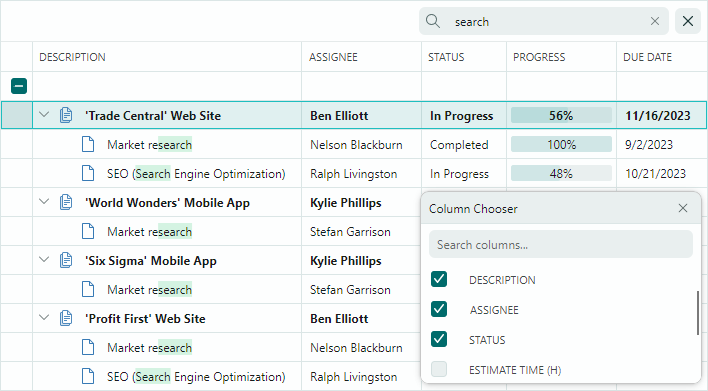

# TreeList и TreeView

Библиотека Eremex Controls включает два контрола для работы с данными, предназначенных для отображения иерархических данных в виде дерева — `TreeListControl` и `TreeViewControl`. Они отображают элементы источника данных в виде узлов (строк). Если узел содержит дочерние узлы, вы можете развернуть его, чтобы отобразить следующий уровень иерархии узлов.

`TreeList` поддерживает несколько колонок:

`TreeView` — это одноколоночный контрол:

Контролы происходят от общего предка, поэтому у них есть много общих функций:

- [Привязка данных](data-binding/index.md) — Вы можете привязывать контролы к Self-Referential (плоским) и иерархическим источникам данных.
- [Несвязанный режим](data-binding/unbound-mode.md) — Позволяет вручную создавать структуру узлов.
- [Встроенные флажки узлов](nodes.md#встроенные-флажки) — Позволяют выбирать отдельные узлы.
- [Сортировка данных](sorting.md) — Позволяет сортировать дочерние узлы одного уровня по возрастанию или убыванию. TreeList поддерживает сортировку данных по одному или нескольким колонкам.
- [Иконки узлов](nodes.md#иконки-узлов) — Позволяют отображать пользовательские иконки перед значениями ячеек в колонке иерархии.
- [Стили](styles.md) — Позволяют настраивать параметры внешнего вида элементов контролов в различных состояниях.
- [Панель поиска](filter-and-search.md#панель-поиска-treelist-и-treeview) — Помогает пользователю быстро находить узлы по содержащимся в них данным.
- [Операции редактирования данных](data-editing/index.md) — Пользователь может редактировать значения ячеек, если редактирование данных включено. Вы можете встраивать в ячейки редакторы Eremex и пользовательские редакторы для редактирования и представления значений ячеек особым образом.
- [Проверка данных](data-validation.md) — Механизм проверки помогает вам проверять ввод пользователя и значения источника данных, а также отображать ошибки в ячейках.
- [Встроенные и пользовательские контекстные меню](context-menus.md)
- [Поддержка атрибутов аннотации данных](columns.md#использование-атрибутов-для-настройки-параметров-автоматически-создаваемых-колонок) — Контролы TreeList и TreeView учитывают специальные атрибуты аннотации данных, применённые к свойствам источника данных. Вы можете использовать атрибуты аннотации данных, чтобы задать пользовательскую видимость, положение, состояние «только для чтения» и отображаемое имя для автоматически создаваемых колонок.
- [Перетаскивание узлов](node-drag-and-drop.md) — Пользователь может перетаскивать узел в пределах контрола и в другой контрол.
- [Высокая производительность при работе с большими объёмами данных](performance-and-data-virtualization.md) — Механизм виртуализации данных для вертикальной и горизонтальной прокрутки повышает производительность контрола при отображении большого количества строк и колонок.

Специфичные для TreeList функции включают:

- [Несвязанные колонки](data-binding/unbound-columns.md) — Вы можете добавлять несвязанные колонки (те, что не привязаны к полям источника данных) и заполнять их данными вручную с помощью события.
- [Меню фильтров колонок](filter-and-search.md#фильтры-колонок-treelist) — Вы можете фильтровать данные с помощью выпадающих меню, отображающих уникальные значения колонки. Щёлкните кнопку фильтра в заголовке любой колонки, чтобы открыть параметры фильтрации.
- [Строка автофильтра](filter-and-search.md#строка-автофильтра-treelist) — Специальная строка, позволяющая пользователю фильтровать данные по колонкам.
- [Шаблоны заголовков колонок](columns.md#заголовки-колонок) — Позволяют отображать пользовательское содержимое в заголовках колонок, включая изображения.
- [Множественное выделение узлов (подсветка)](nodes.md#множественное-выделение-узлов-подсветка) — Вы можете включить режим множественного выделения узлов, чтобы позволить пользователю выделять (подсвечивать) несколько узлов одновременно.
- [Группы колонок](bands.md) — Позволяют визуально группировать несколько колонок под общим заголовком.
- [Фиксированные колонки](columns.md#фиксированные-колонки) — Позволяют определённым колонкам оставаться видимыми и закреплёнными у левого или правого края контрола TreeList, пока другие колонки прокручиваются по горизонтали.
- [Best Fit](columns.md#best-fit) — Эта функция изменяет размер колонок до минимальной ширины, необходимой для полного отображения содержимого колонки (значений и заголовков) без обрезки.
- [Операции изменения размера и перемещения колонок](columns.md#перемещение-колонок)
- [Экспорт в форматы XLSX, PDF, CSV и изображений](export.md)

Дополнительную информацию смотрите в следующем разделе: [Обзор контролов TreeList и TreeView](treelist-and-treeview-overview.md).

 
 

* Эта страница переведена с использованием технологий машинного перевода.
