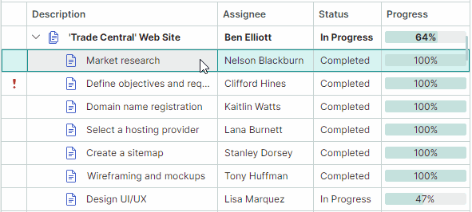

# Перетаскивание узлов (Drag-and-Drop)

Элементы управления TreeList и TreeView поддерживают функциональность перетаскивания узлов (drag-and-drop) как внутри самих контролов, так и во внешние контролы. Функция drag-and-drop реализована в базовом классе TreeList и TreeView — `TreeListControlBase`. Этот класс предоставляет API для включения и обработки операций перетаскивания узлов.



<!-- TODO
Update animation with row previews
 -->

При перетаскивании узлов отображаются их превью. Однако если включено платформенное перетаскивание узлов (требуется для [перетаскивания узлов между приложениями](#включение-перетаскивания-узлов-между-приложениями)), превью узлов недоступны.

## Включение перетаскивания узлов

Установите свойство `TreeListControlBase.AllowDragDrop` в `true`, чтобы включить перетаскивание узлов. В этом случае пользователь может перетаскивать узел как внутри элемента управления TreeList/TreeView, так и за его пределы.
Операция перетаскивания перемещает узел в другую позицию, а также изменяет позицию соответствующего бизнес-объекта в источнике данных.

Если узел перетаскивается во внешний элемент управления, поведение по умолчанию для TreeList/TreeView заключается в удалении узла из текущего контрола и удалении соответствующего бизнес-объекта из источника данных контрола. Информацию о том, как предотвратить удаление узлов и бизнес-объектов, смотрите в разделе [Перетаскивание узлов между элементами управления](#перетаскивание-узлов-между-элементами-управления).

Перетаскивание нескольких узлов поддерживается, если включён множественный выбор узлов с помощью свойства `DataControlBase.SelectionMode` (см. [Узлы — множественный выбор (подсветка) узлов](nodes.md#множественное-выделение-узлов-подсветка)).

Элементы управления TreeList и TreeView не поддерживают автоматические операции копирования во время перетаскивания. Нажатие клавиши CTRL не влияет на операцию.

### Включение перетаскивания узлов между приложениями

Чтобы разрешить перетаскивание узлов между приложениями, включите свойство `UsePlatformRowDragDrop` для элемента управления, который является источником операций перетаскивания.

!!! Tip

    Свойство `UsePlatformRowDragDrop` включает режим перетаскивания, в котором операции обрабатываются платформой Avalonia. Во время платформенных операций перетаскивания превью узлов не отображаются.


## Режим перетаскивания узлов — начало перетаскивания в ячейках или использование специальных маркеров перетаскивания

TreeList поддерживает два режима перетаскивания узлов, различающихся способом инициации операции перетаскивания. Выбрать нужный режим можно с помощью свойства контрола `RowDragMode`.

- Режим `RowDragMode.Row` (по умолчанию) — пользователи могут начать операцию перетаскивания в любой ячейке узла.

    


    В этом режиме поведение активации редактора ячейки по умолчанию следующее:
    
    1. Сначала пользователь должен сфокусировать ячейку.
    
    2. Затем щелчок внутри сфокусированной ячейки активирует редактор ячейки.
    
    Чтобы активировать редактор ячейки одним щелчком, включите активацию редактора ячейки при отпускании кнопки мыши. Установите свойство контрола `DataControlBase.EditorShowMode` в значение `EditorShowMode.PointerReleased`.

- Режим `RowDragMode.DragHandle` (новый, начиная с v1.4) — пользователи могут начать операцию перетаскивания, перетаскивая специальный маркер перетаскивания (drag handle). Маркеры перетаскивания отображаются в области индикатора строки (Row Indicator), которая автоматически появляется слева от узлов при активации режима `RowDragMode.DragHandle`.

    

    В режиме `DragHandle` редакторы ячеек по умолчанию активируются одним нажатием внутри ячейки. Изменить это поведение можно с помощью свойства контрола `DataControlBase.EditorShowMode`.

    Если включён множественный выбор узлов, маркеры перетаскивания отображаются для каждого выбранного узла.


**Связанный API:**

- `RowIndicatorWidth` — задаёт ширину области индикатора строки (Row Indicator), в которой отображаются маркеры перетаскивания.


## Перетаскивание отсортированных данных

Узлы TreeList и TreeView могут быть [отсортированы](sorting.md). Операции перетаскивания узлов в отсортированных элементах управления TreeList и TreeView по умолчанию отключены. Установите свойство `TreeListControlBase.AllowDragDropSortedNodes` в `true`, чтобы включить перетаскивание в отсортированных контролах.

Если данные отсортированы и узел перетаскивается на позицию до или после другого узла, элемент управления автоматически обновляет значение(-я) перетаскиваемого узла в отсортированном(-ых) колонке(-ах), чтобы сохранить текущий порядок сортировки. Значения перетаскиваемого узла в отсортированных колонках устанавливаются равными соответствующим значениям целевого узла.

## Обработка операций перетаскивания с помощью событий

Элементы управления TreeList и TreeView содержат события, которые помогают управлять операциями перетаскивания узлов и реагировать на них.

### Начало перетаскивания

Событие `TreeListControlBase.StartDrag` возникает, когда операция перетаскивания вот-вот начнётся. Используйте следующие параметры события, чтобы получить информацию о текущей операции перетаскивания.

- `e.Data` — задаёт объект `DragDropData`, содержащий данные текущей операции перетаскивания.
- `e.DragElement` — визуальный элемент, который перетаскивается.
<!-- TODO
что такое параметр DragElement (Avalonia.Controls.Border)
 -->

- `e.Effects` — задаёт эффект перетаскивания. Установите этот параметр в `DragDropEffects.None`, чтобы отменить текущую операцию перетаскивания. Эффект перетаскивания также определяет вид значка курсора мыши.
- `e.Nodes` — массив объектов `TreeListNode`, которые будут перетащены. Этот массив содержит один объект, если перетаскивается только один узел.


## Пример — предотвращение начала перетаскивания для определённых узлов

Следующий обработчик события `StartDrag` отключает операции перетаскивания для узлов, содержащих дочерние элементы.

``` cs
private void TreeList_StartDrag(object sender, TreeListStartDragEventArgs e)
{
    if(e.Nodes[0].HasChildren)
        e.Effects = Avalonia.Input.DragDropEffects.None;
}
```

## Обработка этапа перетаскивания во время drag-and-drop

Событие `TreeListControlBase.DragOver` возникает многократно, пока пользователь перетаскивает узел(-ы) над другим узлом. Аргументы события позволяют определить информацию, связанную с текущей операцией перетаскивания:

- `e.DragNodes` — массив [узлов](nodes.md) treelist (`TreeListNode`), которые перетаскиваются. Этот массив содержит один объект, если перетаскивается только один узел.
- `e.TargetNode` — узел treelist, над которым перетаскивается узел(-ы).
- `e.DropPosition` — задаёт потенциальную позицию сброса относительно целевого узла. Доступны следующие варианты:
    - `DropPosition.Before` — перетаскиваемый узел(-ы), в случае сброса, будет добавлен на том же уровне иерархии перед целевым узлом.
    - `DropPosition.After` — перетаскиваемый узел(-ы), в случае сброса, будет добавлен на том же уровне иерархии после целевого узла.
    - `DropPosition.Inside` — перетаскиваемый узел(-ы), в случае сброса, будет добавлен как дочерний элемент целевого узла.

- `e.KeyModifiers` — указывает, нажата ли клавиша ALT, SHIFT и/или CTRL во время события `DragOver`.
- `e.Data` — задаёт объект `DragDropData`, содержащий данные текущей операции перетаскивания.
- `e.Effects` — задаёт эффект перетаскивания. Установите этот параметр в `DragDropEffects.None`, чтобы отменить текущую операцию перетаскивания. Эффект перетаскивания также определяет вид значка курсора мыши.


### Пример — предотвращение сброса узлов на корневом уровне

Следующий обработчик события `DragOver` предотвращает сброс узлов рядом с корневыми узлами. Код по-прежнему позволяет сбрасывать узлы как дочерние элементы корневых узлов.

``` cs
private void TreeList_DragOver(object sender, TreeListDragEventArgs e)
{
    if(e.TargetNode?.Level == 0 && (e.DropPosition==DropPosition.Before || e.DropPosition == DropPosition.After)) 
        e.Effects = Avalonia.Input.DragDropEffects.None;
}

```
## Завершение перетаскивания

Для управления этапом сброса операции перетаскивания доступны два события:

- `TreeListControlBase.Drop` — возникает, когда узел вот-вот будет сброшен на другой узел treelist. Аргументы события совпадают с аргументами события `TreeListControlBase.DragOver`.

    Чтобы отменить операцию сброса в определённых случаях, обработайте событие `Drop` и установите его параметр `e.Handled` в `true`.

    Если узел сброшен за пределами текущего элемента управления TreeList/TreeView, событие `Drop` для этого контрола не возникает. Дополнительную информацию смотрите в описании события `TreeListControlBase.CompleteDragDrop` ниже.

    ### Пример — изменение значений сброшенного узла

    Следующий обработчик события `Drop` изменяет значение перетаскиваемого узла(-ов) при его сбросе. Предполагается, что источник данных содержит поле _"Assignee"_. Приведённый ниже код устанавливает значение поля _"Assignee"_ сброшенного узла равным значению поля _"Assignee"_ целевого узла.

    ``` cs
    private void TreeList_Drop(object sender, TreeListDragEventArgs e)
    {
        if (e.DropPosition != DropPosition.Inside)
            return;
        TreeListControl treeList = e.Source as TreeListControl;
        string newAssignee = treeList.GetCellValue(e.TargetNode, "Assignee").ToString();
        foreach (TreeListNode node in e.DragNodes)
        {
            treeList.SetCellValue(node, "Assignee", newAssignee);
        }
    }
    ```

- `TreeListControlBase.CompleteDragDrop` — возникает после завершения операции перетаскивания внутри текущего элемента управления или за его пределами.

    Событие `TreeListControlBase.CompleteDragDrop` возникает после события `TreeListControlBase.Drop`.

    Для события `TreeListControlBase.CompleteDragDrop` доступны следующие аргументы:

    - `e.DragNodes` — массив [узлов](nodes.md) treelist (`TreeListNode`), которые были сброшены.
    - `e.Effects` — возвращает эффект перетаскивания, установленный в обработчике события `Drop` элемента управления, на который был сброшен узел.

    Смотрите также: [Перетаскивание узлов между элементами управления](#перетаскивание-узлов-между-элементами-управления)

    
## Параметры перетаскивания

Элементы управления TreeList/TreeView предоставляют следующие параметры для настройки операций перетаскивания узлов:

- `TreeListControlBase.AutoExpandOnDrag` — задаёт, разворачиваются ли автоматически свёрнутые узлы при наведении на них во время операции перетаскивания.
- `TreeListControlBase.AutoExpandDelayOnDrag` — задаёт задержку перед автоматическим разворачиванием свёрнутых узлов, когда указатель мыши находится над ними во время операции перетаскивания.
- `TreeListControlBase.AllowScrollingOnDrag` — задаёт, выполняет ли TreeList/TreeView автоматическую прокрутку узлов при перетаскивании узла к верхнему или нижнему краю контрола.


## Перетаскивание узлов между элементами управления

Перетаскивание узлов (строк) автоматически поддерживается между элементами управления `TreeListControl`, `TreeViewControl` и `DataGridControl`. Используйте параметр `AllowDragDrop`, предоставляемый этими контролами, чтобы включить для них функциональность перетаскивания.

### Визуальная индикация перетаскивания

При перетаскивании узла (строки) элементы управления `TreeListControl`, `TreeViewControl` и `DataGridControl` визуально указывают потенциальную позицию сброса.


### Автоматическое перемещение узла (строки) и его элемента из исходного контрола в целевой

`TreeListControl`, `TreeViewControl` и `DataGridControl` поддерживают автоматическое перемещение перетаскиваемого узла (строки) между этими элементами управления во время операции перетаскивания: в целевой контрол добавляется новый узел (строка), содержащий перетаскиваемые данные, а перетаскиваемый узел (строка) затем удаляется из исходного контрола. Соответствующий элемент (бизнес-объект) также переносится между источниками данных исходного и целевого контролов.

Автоматическое перемещение узла (строки) и соответствующего элемента происходит, если тип данных элементов исходного контрола совпадает с типом данных элементов целевого контрола или совместим с ним. Для проверки совместимости типов данных используется метод `Type.IsAssignableFrom`.

Чтобы предотвратить удаление узла (строки) и элемента в исходном контроле во время операции перетаскивания во внешние элементы управления, вы можете выполнить одно из следующих действий:

- Обработать событие `Drop` целевого контрола и установить его параметр события `e.Effects` в значение `Avalonia.Input.DragDropEffects.None`.

- Обработать событие `TreeListControlBase.CompleteDragDrop` исходного контрола и установить параметр события `e.Handled` в `true`.

    ``` cs
    private void TreeList_CompleteDragDrop(object sender, TreeListCompleteDragDropEventArgs e)
    {
        e.Handled = true;
    }
    ```

### Перетаскивание в другие элементы управления

Элементы управления `TreeListControl`, `TreeViewControl` и `DataGridControl` не поддерживают автоматическое перетаскивание строк/узлов в другие элементы управления (например, в стандартный `DataGrid` Avalonia). Чтобы разрешить перетаскивание узлов/строк в такие контролы, включите для них функциональность перетаскивания с помощью присоединённого свойства `Avalonia.Input.DragDrop.AllowDrop`. Обработайте присоединённое событие `Avalonia.Input.DragDrop.Drop` целевого контрола, чтобы принимать перетаскиваемые узлы (строки). При обработке события `DragDrop.Drop` вы можете получить доступ к перетаскиваемым узлам (строкам) через параметр события `Data`.

<br>
<br>

<sup>*</sup> Эта страница переведена с использованием технологий машинного перевода.
