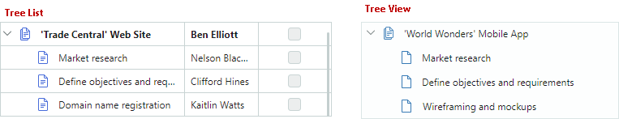
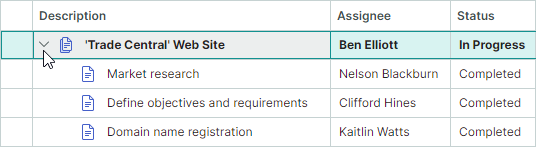
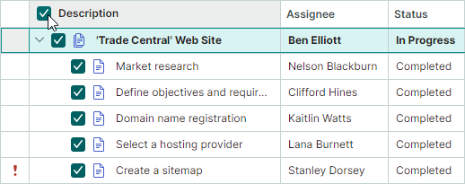
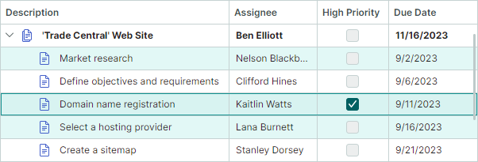

# Узлы

Класс `TreeListNode` инкапсулирует узел в контролах TreeList и TreeView.
Узел TreeView отображает одно значение, тогда как узел TreeList может отображать несколько значений (по значению для каждой колонки).



## Создание и доступ к узлам

В связанном режиме контролы TreeList и TreeView автоматически создают узлы для всех элементов источника данных.
Вы можете обращаться к созданным узлам с помощью следующих свойств:

- `TreeListControlBase.Nodes` — Корневые узлы.
- `TreeListNode.Nodes` — Дочерние узлы узла.

Вам нужно создавать узлы вручную, когда контрол работает в [несвязанном режиме](data-binding/unbound-mode.md).

Смотрите также: [Поиск узлов](#поиск-узлов).

## Получение и установка значений узла

Свойство `TreeListNode.Content` определяет объект данных узла. Вы можете привести значение этого свойства к типу вашего бизнес-объекта и затем считывать отдельные значения.
В [несвязанном режиме](data-binding/unbound-mode.md) вы можете вручную назначить объект свойству `TreeListNode.Content`. Не назначайте объекты свойству `TreeListNode.Content` в связанном режиме.

Чтобы получить и задать значения отдельных ячеек, вы можете использовать следующие методы:

- `GetCellValue` и `GetCellDisplayText`
- `SetCellValue`

## Сфокусированный узел

Используйте свойство `TreeListControlBase.FocusedNode`, чтобы получить доступ к текущему сфокусированному узлу (узлу, который получает события клавиатуры). Чтобы получить данные (бизнес-объект) сфокусированного узла, используйте унаследованное свойство `DataControlBase.FocusedItem`.

Событие `TreeListControlBase.FocusedNodeChanged` позволяет реагировать на перемещение фокуса между узлами.

Смотрите также: [Множественное выделение узлов (подсветка)](#множественное-выделение-узлов-подсветка).

## Иконки узлов

Контролы TreeList и TreeView поддерживают иконки узлов. Эти иконки отображаются перед значениями ячеек в [колонке иерархии](columns.md#колонка-иерархии).


Установите свойство `TreeListControlBase.ShowNodeImages` в значение `true`, чтобы включить иконки узлов.

Следующие подходы позволяют предоставлять иконки узлов:

- Используйте свойство `TreeListControlBase.NodeImageFieldName`, чтобы указать свойство (поле) бизнес-объекта, которое возвращает иконку узла (объект `IImage`).

- Используйте свойство `TreeListControlBase.NodeImageSelector`, чтобы указать селектор (объект `ITreeListNodeImageSelector`), который возвращает иконки узлов для конкретных узлов.

- В несвязанном режиме вы можете задать иконку узла с помощью свойства `TreeListNode.Image`.

### Пример

Следующий код отображает изображения для узлов, имеющих определённое значение ячейки.

В примере создаётся объект `NodeImageSelector`, который возвращает изображения в зависимости от свойства бизнес-объекта _OnVacation_.

``` xml
xmlns:mxtl="https://schemas.eremexcontrols.net/avalonia/treelist"

<Grid.Resources>
    <local:MyNodeImageSelector x:Key="myNodeImageSelector" />
    ...
</Grid.Resources>

<mxtl:TreeListControl 
    Grid.Column="0" Grid.Row="1" Name="treeList2"
    ChildrenSelector="{StaticResource mySelector}"
    ItemsSource="{Binding Employees}"
    NodeImageSelector="{StaticResource myNodeImageSelector}"
    ShowNodeImages="True"
    >
...
</mxtl:TreeListControl>
```

``` csharp
using Avalonia.Media.Imaging;
using Avalonia.Platform;

public class MyNodeImageSelector : ITreeListNodeImageSelector
{
    IImage onVacationImage;
    IImage defaultImage;

    public MyNodeImageSelector()
    {
        onVacationImage = new Bitmap(AssetLoader.Open(
            new Uri("avares://AvaloniaApp1/Assets/plane.png")));
        defaultImage = null;
    }
    public IImage SelectImage(TreeListNode node)
    {
        Employee row = node.Content as Employee;
        return row.OnVacation? onVacationImage: defaultImage;
    }
}
```


## Разворачивание и сворачивание узлов

Пользователь может разворачивать и сворачивать узлы, имеющие дочерние элементы, следующими способами:

- Щёлкнуть кнопки разворачивания узла
 
  
  
- Нажать клавиши "+" и "-" на клавиатуре


Вы можете скрыть кнопки разворачивания узлов с помощью свойства `TreeListControlBase.ShowExpandButtons`. В этом случае узлы можно разворачивать и сворачивать только в коде и с клавиатуры.


В коде вы можете управлять разворачиванием узлов с помощью следующих членов API:

- `TreeListControlBase.AutoExpandAllNodes` — Определяет, следует ли автоматически разворачивать узлы при загрузке.
- `TreeListControlBase.CollapseAllNodes` — Сворачивает все узлы.
- `TreeListControlBase.ExpandAllNodes` — Разворачивает все узлы.
- `TreeListControlBase.ExpandNodesOnFiltering` — Определяет, следует ли выполнять [поиск](filter-and-search.md) в свёрнутых узлах во время поиска/фильтрации данных, и автоматически разворачивать их, если их дочерние узлы соответствуют текущим критериям фильтра/поиска. Контролы TreeList и TreeView выполняют поиск только среди уже загруженных узлов. Для [иерархических источников данных](data-binding/index.md#иерархический-источник-данных) вы можете установить свойство `AllowDynamicDataLoading` в значение `false`, чтобы отключить динамическую загрузку узлов и загрузить все узлы сразу.

- `TreeListNode.IsExpanded` — Позволяет разворачивать/сворачивать отдельный узел или получать его состояние развёрнутости.

Логическое свойство/поле в источнике элементов контрола (`DataControlBase.ItemsSource`) может хранить состояния развёрнутости узлов. Используйте свойство `TreeListControlBase.ExpandStateFieldName`, чтобы указать это свойство. После установки этого свойства состояния развёрнутости узлов синхронизируются со значениями, хранящимися в этом свойстве в источнике элементов.

Следующие события возникают при разворачивании и сворачивании узлов:

- `TreeListControlBase.NodeExpanding` — Возникает, когда узел вот-вот будет развёрнут. Вы можете использовать параметр события `Allow`, чтобы предотвратить разворачивание узла.
- `TreeListControlBase.NodeExpanded` — Возникает после того, как узел был развёрнут.
- `TreeListControlBase.NodeCollapsing` — Возникает, когда узел вот-вот будет свёрнут. Вы можете использовать параметр события `Allow`, чтобы предотвратить сворачивание узла.
- `TreeListControlBase.NodeCollapsed` — Возникает после того, как узел был свёрнут.


## Встроенные флажки

Свойство `TreeListControlBase.ShowNodeCheckBoxes` включает встроенные флажки узлов для контролов TreeList и TreeView. Флажки позволяют пользователю отмечать (выбирать) отдельные узлы.


По умолчанию флажки имеют два состояния — отмечено и не отмечено. Если установить свойство `AllowIndeterminateCheckState` в значение `true`, флажки будут поддерживать три состояния — отмечено, не отмечено и неопределённое.

Для контрола TreeList вы можете включить параметр `TreeListControl.ShowCheckAllNodesCheckBox`, чтобы отобразить флажок `Check All` в заголовке [колонки иерархии](columns.md#колонка-иерархии). Этот флажок выбирает и снимает выбор со всех узлов одновременно.



### Получение и установка состояния отметки узла

Используйте свойство узла `TreeListNode.IsChecked`, чтобы считывать и задавать состояние отметки узла. Свойство `TreeListNode.IsChecked` имеет тип Nullable Boolean, поэтому вы можете присвоить свойству значение `null`, чтобы перевести узел в неопределённое состояние.


### Получение отмеченных узлов

Используйте метод `GetAllCheckedNodes`, чтобы получить узлы с состоянием "отмечено".

Вы также можете создать итератор для получения узлов, соответствующих пользовательским критериям.


### Синхронизация состояний отметки с источником данных

Используйте свойство `CheckBoxFieldName`, чтобы синхронизировать состояния отметки узлов с определённым полем источника данных. Это свойство указывает имя логического или Nullable-логического поля источника данных, которое хранит состояния отметки узлов.

### Рекурсивная отметка

Свойство `AllowRecursiveNodeChecking` включает рекурсивную отметку узлов. В этом режиме дочерние узлы изменяют своё состояние отметки при изменении состояния отметки родительского узла, и наоборот.

## Множественное выделение узлов (подсветка)

Контролы TreeList и TreeView поддерживают режим множественного выделения узлов, который позволяет вам и вашему пользователю выделять (подсвечивать) несколько узлов одновременно.



Установите свойство `SelectionMode` в значение `Multiple`, чтобы включить режим множественного выделения узлов.

### Выделение узлов с помощью мыши и клавиатуры

Пользователи могут выделять несколько узлов с помощью мыши и клавиатуры. Для этого нужно щёлкать узлы, удерживая клавишу CTRL и/или SHIFT.

### Работа с выделением узлов в коде

Следующее API позволяет выделять/снимать выделение с узлов и определять, выделен ли узел:

- `SelectAll`
- `SelectNode`
- `SelectRange`
- `UnselectNode`
- `ClearSelection`
- `IsNodeSelected`

Чтобы получить выделение узлов, используйте следующие члены:

- `GetSelectedNodes` — Возвращает коллекцию текущих выделенных объектов `TreeListNode`.
- `SelectedItems` — Определяет коллекцию объектов данных (бизнес-объектов), соответствующих выделенным узлам.

Обработайте событие `SelectionChanged`, чтобы реагировать на изменения выделения узлов.

Вызов любого метода, изменяющего состояние выделения узла, вызывает обновление контрола TreeList/TreeView и возникновение события `SelectionChanged`.

Чтобы выполнить пакетные изменения выделения узлов и предотвратить лишние обновления, вы можете обернуть код, изменяющий состояние выделения узлов, парой методов `BeginSelection` и `EndSelection`. В этом случае контрол перерисовывает выделение, а событие `SelectionChanged` возникает после вызова метода `EndSelection`.

``` csharp
treeList1.SelectionMode = Eremex.AvaloniaUI.Controls.DataControl.RowSelectionMode.Multiple;
// Start a batch update of the node selection.
treeList1.BeginSelection();
treeList1.ClearSelection();
treeList1.SelectNode(node1);
treeList1.SelectNode(node2);
//...
// Finish the batch update.
treeList1.EndSelection();
```
### Сфокусированный узел и выделенные узлы

Сфокусированный узел — это узел, который получает пользовательский ввод. Сфокусированный узел может не совпадать с выделенным (подсвеченным) узлом в режиме множественного выделения. Подробности смотрите в следующих разделах.

#### Сфокусированный узел в режиме одиночного выделения

В режиме одиночного выделения сфокусированный узел автоматически получает состояние выделения. Вы можете использовать свойство `FocusedNode` и метод `GetSelectedNodes`, чтобы получить сфокусированный узел.

#### Сфокусированный узел в режиме множественного выделения

Состояния фокуса и выделения различаются в режиме множественного выделения узлов.
Выделен ли узел, можно определить по подсветке узла. Подсвечиваются только выделенные узлы.


В режиме множественного выделения щелчок по узлу одновременно фокусирует и выделяет этот узел. Однако пользователь может переключить состояние выделения сфокусированного узла с помощью следующих действий:

- Нажать CTRL+SPACE.
- Щёлкнуть по сфокусированному узлу, удерживая клавишу CTRL.

Когда вы выделяете узел в коде, этот узел не получает состояния фокуса в режиме множественного выделения, и наоборот.

## Поиск узлов

Метод `TreeListControlBase.FindNode` позволяет находить узлы, соответствующие пользовательским критериям.

Следующий код включает множественное выделение узлов, а также находит и выделяет два узла, содержащих определённые значения в поле _Name_.

``` csharp
treeList1.SelectionMode = Eremex.AvaloniaUI.Controls.DataControl.RowSelectionMode.Multiple;
treeList1.ExpandAllNodes();
TreeListNode node1 = treeList1.FindNode(node => 
    (node.Content as Employee).Name.Contains("Sam"));
TreeListNode node2 = treeList1.FindNode(node => 
    (node.Content as Employee).Name.Contains("Dan"));
treeList1.ClearSelection();
treeList1.SelectNode(node1);
treeList1.SelectNode(node2);
```

Смотрите также: [Фильтрация и поиск](filter-and-search.md).

## Перебор узлов

Вы можете создать итератор (объект `TreeListNodeIterator`), чтобы рекурсивно перебирать узлы и выполнять над ними операцию.

Используйте один из следующих конструкторов, чтобы создать объект `TreeListNodeIterator`:

``` csharp
// Recursively iterates through child nodes of the specified node, and their children.
public TreeListNodeIterator(TreeListNode? node, bool onlyExpanded = false)

// Recursively iterates through the specified nodes, and their children.
public TreeListNodeIterator(TreeListNodeCollection? nodes, bool onlyExpanded = false)
```

Параметр _onlyExpanded_ определяет, следует ли перебирать только развёрнутые узлы, или развёрнутые и свёрнутые узлы.

``` csharp
foreach (var node in new TreeListNodeIterator(treeList1.Nodes))
{
    if (node != null)
    {
        //do smth
    }
}
```


## Высота узла

Изначально все узлы имеют одинаковую высоту, достаточную для отображения одной строки текста. Вы можете задать пользовательскую высоту узла, а также включить автоматический расчёт высоты узла для полного отображения больших текстовых данных в ячейках.

### Пользовательская высота узла

- Свойство `DataControlBase.RowMinHeight` — Получает или задаёт минимальную высоту узла.

    Если функция автоматической высоты узла отключена, все узлы имеют одинаковую высоту, заданную свойством `DataControlBase.RowMinHeight`.

### Автовысота узла

Для колонок с длинным текстом вы можете включить перенос текста, чтобы динамически регулировать высоту узлов и полностью отображать содержимое ячеек.


Чтобы включить перенос текста для ячеек колонки, назначьте объект `TextEditorProperties` (или его потомок, например, `ButtonEditorProperties`) свойству `GridColumn.EditorProperties`, и установите параметр `TextEditorProperties.TextWrapping` в значение `Wrap`.

!!! tip

    Объект `TextEditorProperties` используется для настройки встраиваемого редактора `TextEditor` для колонки. Во время работы редактор создаётся с использованием этих параметров. Дополнительную информацию смотрите в разделе [Редактирование данных](data-editing/index.md).

Следующий код включает перенос текста для колонки treelist.

``` xml
<mxtl:TreeListColumn FieldName="LongDescription" Width="2*">
    <mxtl:TreeListColumn.EditorProperties>
        <mxe:TextEditorProperties TextWrapping="Wrap"/>
    </mxtl:TreeListColumn.EditorProperties>
</mxtl:TreeListColumn>
```

#### Автоматическая настройка высоты узла при горизонтальной прокрутке

Горизонтальная [виртуализация](performance-and-data-virtualization.md), поддерживаемая TreeList, повышает производительность контрола за счёт сокращения времени загрузки.

При включённой этой функции (по умолчанию) высота узлов автоматически рассчитывается в соответствии с содержимым текущих видимых ячеек. Ячейки за пределами области просмотра не влияют на расчёт высоты узла. При прокрутке к ячейкам с другой высотой содержимого высота узла динамически корректируется. Чтобы предотвратить динамическое изменение высоты узла при горизонтальной прокрутке, используйте свойство `DataGridControl.AllowHorizontalVirtualization`, чтобы отключить горизонтальную виртуализацию.

``` xml
<mxtl:TreeListControl x:Name="treeList" AllowHorizontalVirtualization="False">
```

<br>
<br>

<sup>*</sup> Эта страница переведена с использованием технологий машинного перевода.
