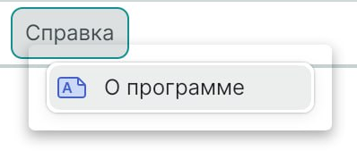

# Тени некорректно отображаются для окон и меню в ОС Astra Linux

Окна и меню Eremex по умолчанию используют прозрачные тени. Если прозрачность окон отключена в операционной системе, тени окон и меню отображаются некорректно. Пример некорректной отрисовки меню показан ниже:



Чтобы решить проблему, вы можете выполнить одно из следующих действий:

1. Включить прозрачность окон в ОС 

    Прозрачность окон отключена в среде Astra Linux Fly по умолчанию. Чтобы включить её, проверьте настройки дисплея:

    


2. Отключить прозрачность для всех окон и всплывающих окон Eremex в вашем приложении

    Класс `MxSettings` хранит глобальные настройки, специфичные для всех контролов Eremex в приложении Avalonia. Этот класс содержит свойство `MxSettings.EnableWindowTransparency`, которое управляет прозрачностью и видимостью теней для окон и всплывающих окон Eremex.

    Чтобы настроить параметр `MxSettings.EnableWindowTransparency`, добавьте вызов метода `UseEMXServices` в цепочку `AppBuilder.Configure` следующим образом:

    ``` cs
    public static AppBuilder BuildAvaloniaApp()
        => AppBuilder.Configure<App>()
            .UsePlatformDetect()
            .WithInterFont()
            .LogToTrace()
            .UseEMXServices(settings => { settings.EnableWindowTransparency = false; });
    ```


<br>
<br>

<sup>*</sup> Эта страница переведена с использованием технологий машинного перевода.
