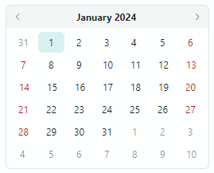
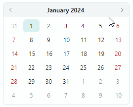
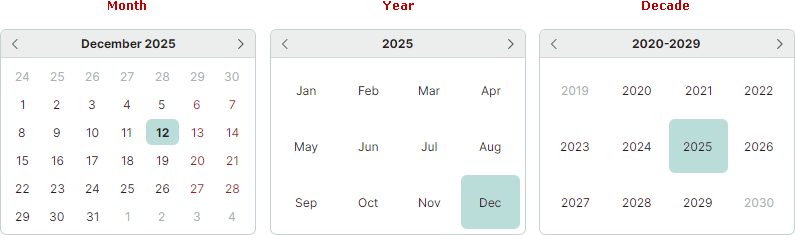

# CalendarControl

`CalendarControl` отображает календарь, позволяющий пользователю выбрать дату. Навигационный заголовок контрола отображает кнопки для перемещения по месяцам и годам.

Основные возможности контрола включают:

- Выбор даты в календаре с помощью мыши и клавиатуры.
- Панель навигации позволяет перемещаться по месяцам и годам.
- Три представления календаря: представление месяца, представление года и представление диапазона лет.
- Опция ограничения доступного диапазона дат.

## Выбор даты

Пользователь может выбрать дату в календаре с помощью мыши и клавиш со стрелками.

Навигационный заголовок календаря позволяет пользователю перемещаться по месяцам и годам. Щелчок по тексту заголовка отдаляет текущее представление:
- В представлении месяца щелчок по заголовку переключает на представление года. 
- В представлении года щелчок по заголовку переключает на представление диапазона лет.

Используйте свойство `CalendarControl.SelectedDate`, чтобы выбрать дату или прочитать текущую выбранную дату.

## Настройка календаря

Используйте следующие свойства для настройки календаря:

- `FirstDayOfWeek` — возвращает или задаёт день недели, который идёт первым в представлении месяца календаря.
- `IsTodayHighlighted` — возвращает или задаёт, выделять ли сегодняшнюю дату в календаре. 
- `DisplayDateStart` — задаёт минимальную допустимую дату. Свойства `DisplayDateStart` и `DisplayDateEnd` позволяют задать диапазон значений, отображаемых в календаре.
- `DisplayDateEnd` — задаёт максимальную допустимую дату.
- `DisplayMode` — возвращает или задаёт режим представления календаря (`Month`, `Year` или `Decade`):

    

 
 

* Эта страница переведена с использованием технологий машинного перевода.
