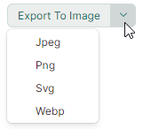

# SplitButton

`MxSplitButton` объединяет две кнопки в одном контроле. Основная кнопка выполняет главное действие, которое может быть реализовано как команда или событие. Вторичная кнопка активирует связанный выпадающий контрол (меню), в котором вы можете отображать пользовательское содержимое или команды.

Следующее изображение демонстрирует SplitButton, отображающий PopupMenu в качестве выпадающего контрола. 



Код, используемый для создания этой кнопки, показан ниже. Полный пример смотрите в [приложении DemoCenter](../../index.md#демонстрационное-приложение).

``` xml
xmlns:mx="https://schemas.eremexcontrols.net/avalonia"
xmlns:mxb="https://schemas.eremexcontrols.net/avalonia/bars"

<mx:MxSplitButton Name="splitButton1"
                  Content="Export To Image" Margin="0,8,0,0" 
                  Command="{Binding ExportImageCommand}" 
                  CommandParameter="{x:Static exports:MxImageFormat.Jpeg}" 
                  HorizontalAlignment="Left" Grid.Row="6"
                  >
    <mx:MxSplitButton.DropDownControl>
        <mxb:PopupMenu>
            <mxb:ToolbarButtonItem Header="Jpeg" Command="{Binding ExportImageCommand}" CommandParameter="{x:Static exports:MxImageFormat.Jpeg}"/>
            <mxb:ToolbarButtonItem Header="Png" Command="{Binding ExportImageCommand}" CommandParameter="{x:Static exports:MxImageFormat.Png}"/>
            <mxb:ToolbarButtonItem Header="Svg" Command="{Binding ExportImageCommand}" CommandParameter="{x:Static exports:MxImageFormat.Svg}"/>
            <mxb:ToolbarButtonItem Header="Webp" Command="{Binding ExportImageCommand}" CommandParameter="{x:Static exports:MxImageFormat.Webp}"/>
        </mxb:PopupMenu>
    </mx:MxSplitButton.DropDownControl>
</mx:MxSplitButton>
```

## Содержимое

Используйте свойство `Content`, чтобы назначить визуальное содержимое основной кнопке. 

``` xml
<mx:MxSplitButton Content="Save"/>
```


Свойство `Content` позволяет отображать изображение рядом с текстом или настраивать внешний вид основной кнопки произвольным образом. Следующий пример отображает изображение и текст:

``` xml
xmlns:mx="https://schemas.eremexcontrols.net/avalonia"
xmlns:mxi="https://schemas.eremexcontrols.net/avalonia/icons"

<mx:MxSplitButton Height="27" VerticalContentAlignment="Center" Command="{Binding SaveCommand}">
    <mx:MxSplitButton.Content>
        <StackPanel Orientation="Horizontal" Spacing="5" >
            <Image Source="{x:Static mxi:Basic.Save}" Height="20"/>
            <TextBlock Text="Save" />
        </StackPanel>
    </mx:MxSplitButton.Content>
</mx:MxSplitButton>
```


## Задание главного действия

Основная кнопка запускает главное действие `MxSplitButton`.


Вы можете использовать следующие члены API для реализации этого действия:

- Событие `MxSplitButton.Click` — событие, возникающее при щелчке по основной кнопке.
- Команда `MxSplitButton.Command` — команда, выполняемая при щелчке по основной кнопке. Вы можете использовать свойство `MxSplitButton.CommandParameter`, чтобы передать параметр команде.

``` xml
<mx:MxSplitButton Content="Save" Command="{Binding SaveCommand}">
```

``` cs
using CommunityToolkit.Mvvm.Input;

public partial class MainWindowViewModel : ViewModelBase
{
    [RelayCommand]
    void Save()
    {
        //...
    }
}
```


## Задание выпадающего контрола

Вторичная кнопка открывает выпадающий контрол/меню, которое задаётся свойством `MxSplitButton.DropDownControl`.


Вы можете установить свойство `DropDownControl` в следующие объекты:

- `Eremex.AvaloniaUI.Controls.Bars.PopupMenu` — всплывающее меню, которое может содержать различные элементы (кнопки, кнопки-флажки, подменю и так далее). Дополнительную информацию смотрите в следующем разделе: [Всплывающие и контекстные меню](../toolbars-and-menus/popup-and-context-menus.md).
  
- `Eremex.AvaloniaUI.Controls.Bars.PopupContainer` — всплывающий контрол, который может отображать пользовательское содержимое.

Следующий пример определяет `PopupMenu` с двумя командами в качестве выпадающего контрола SplitButton:

``` xml
xmlns:mx="https://schemas.eremexcontrols.net/avalonia"
xmlns:mxi="https://schemas.eremexcontrols.net/avalonia/icons"
xmlns:mxb="https://schemas.eremexcontrols.net/avalonia/bars"

<mx:MxSplitButton Height="27" VerticalContentAlignment="Center" Command="{Binding SaveCommand}">
    <mx:MxSplitButton.Content>
        ...
    </mx:MxSplitButton.Content>

    <mx:MxSplitButton.DropDownControl>
        <mxb:PopupMenu>
            <mxb:ToolbarButtonItem Header="Save" 
                    Glyph="{x:Static mxi:Basic.Save}"
                    GlyphSize="20,20"
                    Command="{Binding SaveCommand}"/>
            <mxb:ToolbarButtonItem Header="Save As" Command="{Binding SaveAsCommand}"/>
        </mxb:PopupMenu>
    </mx:MxSplitButton.DropDownControl>
</mx:MxSplitButton>
```

``` cs
using CommunityToolkit.Mvvm.Input;

public partial class MainWindowViewModel : ViewModelBase
{
    [RelayCommand]
    void Save()
    {
        //...
    }
    [RelayCommand]
    void SaveAs()
    {
        //...
    }
}
```


### Связанный API

- `MxSplitButton.IsPopupOpen` — возвращает или задаёт, открыт ли в данный момент выпадающий контрол/меню. Вы можете использовать это свойство, чтобы открыть или закрыть выпадающий контрол в коде.


<br>
<br>

<sup>*</sup> Эта страница переведена с использованием технологий машинного перевода.
