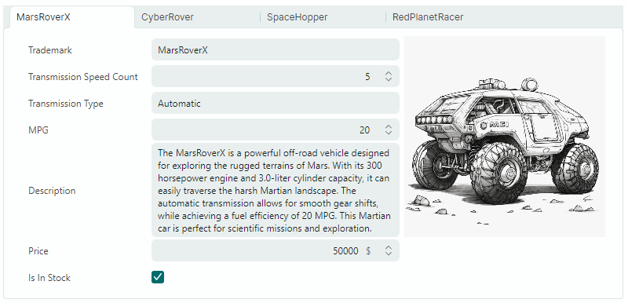
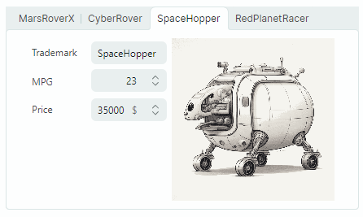
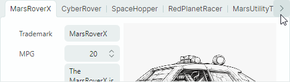
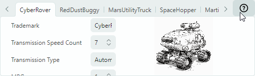

# TabControl

Контрол `MxTabControl` позволяет организовать панели в интерфейс с вкладками. Пользователи могут активировать конкретную панель щелчком по соответствующей вкладке.



`MxTabControl` является потомком стандартного контрола `Avalonia.Controls.TabControl`. Он наследует базовую функциональность `TabControl` и расширяет её дополнительными возможностями:

- Неограниченное число вкладок.
- Заполнение вкладок и их содержимого из источника объектов.
- Изменение порядка вкладок с помощью перетаскивания.
- Режимы размещения вкладок: Stretch, Scroll и Multi-line.
- Кнопки «Закрыть вкладку».
- Кнопка «Новая вкладка».
- Пользовательские контролы в области заголовков вкладок.

## Создание вкладок

`MxTabControl` наследует функциональность создания вкладок от базового класса `Avalonia.Controls.TabControl`. Контролы поддерживают два подхода к добавлению вкладок:

- Добавление элементов вкладок вручную
- Заполнение вкладок и их содержимого из источника объектов.

### Добавление элементов вкладок вручную

Элементы вкладок в контроле `MxTabControl` инкапсулируются объектами `MxTabItem`. Они предоставляют настройки для задания текста заголовка вкладки, изображения заголовка вкладки (глифа), команды «Закрыть» (команда, активируемая при щелчке по кнопке «Закрыть» вкладки) и т. д.

#### Пример

Следующий пример создаёт две вкладки с предопределённым содержимым (редакторы и надписи).


``` xml
xmlns:mx="https://schemas.eremexcontrols.net/avalonia"
xmlns:mxe="https://schemas.eremexcontrols.net/avalonia/editors"

<mx:MxTabControl Margin="5" Height="160" Name="tabControl1" Width="300">
    <mx:MxTabItem Header="Features">
        <Grid RowDefinitions="Auto Auto Auto" ColumnDefinitions="Auto *" Margin="5">
            <Label Classes="LayoutItem" Grid.Column="0" Grid.Row="0" Content="Trademark"/>
            <mxe:TextEditor EditorValue="{Binding SelectedCar.Trademark}" Margin="5" 
             Height="20" Grid.Row="0" Grid.Column="1"/>
            <Label Classes="LayoutItem" Grid.Column="0" Grid.Row="1" Content="Liters"/>
            <mxe:SpinEditor EditorValue="{Binding SelectedCar.Liter}" Margin="5" 
             Height="20" Grid.Row="1" Grid.Column="1"/>
            <Label Classes="LayoutItem" Grid.Column="0" Grid.Row="2" Content="MPG"/>
            <mxe:SpinEditor EditorValue="{Binding SelectedCar.MPG}" Margin="5" 
             Height="20" Grid.Row="2" Grid.Column="1"/>
        </Grid>
    </mx:MxTabItem>
    <mx:MxTabItem Header="More Info" >
        <mxe:TextEditor Margin="5" EditorValue="{Binding SelectedCar.Description}" 
         TextWrapping="Wrap" VerticalAlignment="Stretch"/>
    </mx:MxTabItem>
</mx:MxTabControl>
```

### Заполнение вкладок из источника объектов

Одним из предков `MxTabControl` является класс `Avalonia.Controls.ItemsControl`. Это позволяет заполнять TabControl элементами из источника объектов. Используйте для этого следующие основные свойства:

- `ItemsSource` — задаёт источник, содержащий элементы для отображения в виде вкладок.
- `ItemTemplate` — задаёт DataTemplate, используемый для отрисовки заголовков вкладок.
- `ContentTemplate` — задаёт DataTemplate, используемый для отрисовки содержимого вкладок.

#### Пример

Следующий пример привязывает контрол `MxTabControl` к источнику объектов и задаёт DataTemplate, которые отрисовывают заголовки и содержимое вкладок.



``` xml
xmlns:mx="https://schemas.eremexcontrols.net/avalonia"
xmlns:mxe="https://schemas.eremexcontrols.net/avalonia/editors"

<mx:MxTabControl ItemsSource="{Binding Cars}" SelectedItem="{Binding SelectedCar}">
    <mx:MxTabControl.ItemTemplate>
        <DataTemplate DataType="demoData:CarInfo">
            <TextBlock Text="{Binding Trademark}"></TextBlock>
        </DataTemplate>
    </mx:MxTabControl.ItemTemplate>

    <mx:MxTabControl.ContentTemplate>
        <DataTemplate DataType="demoData:CarInfo">
            <StackPanel Orientation="Horizontal" Margin="10">
                <Grid RowDefinitions="Auto Auto Auto" ColumnDefinitions="Auto *">
                    <Label Classes="LayoutItem" Grid.Column="0" Grid.Row="0" Content="Trademark"/>
                    <mxe:TextEditor Classes="LayoutItem"  Grid.Column="1" Grid.Row="0" 
                     EditorValue="{Binding Trademark}"/>

                    <Label Classes="LayoutItem" Grid.Column="0" Grid.Row="1" Content="MPG"/>
                    <mxe:SpinEditor Classes="LayoutItem" Grid.Column="1" Grid.Row="1" 
                     EditorValue="{Binding  MPG}" Minimum="0"/>

                    <Label Classes="LayoutItem" Grid.Column="0" Grid.Row="2" Content="Price"/>
                    <mxe:SpinEditor Classes="LayoutItem" Grid.Column="1" Grid.Row="2" 
                     EditorValue="{Binding  Price}" Suffix="{Binding Currency}" Minimum="0"/>
                </Grid>
                <Image Grid.Column="1" Width="200" Source="{Binding Image}" VerticalAlignment="Top"/>
            </StackPanel>
        </DataTemplate>
    </mx:MxTabControl.ContentTemplate>
</mx:MxTabControl>
```

## Выбор вкладки

Используйте следующие свойства для выбора вкладок и получения выбранных вкладок:

- `SelectedIndex` — задаёт индекс выбранной вкладки среди всех вкладок (начиная с нуля). Вы можете использовать свойство `MxTabControl.Items` для доступа к коллекции вкладок.
- `SelectedItem` — задаёт элемент выбранной вкладки. Если вкладки добавлены в TabControl вручную с помощью объектов `MxTabItem`, свойство `SelectedItem` задаёт выбранный объект `MxTabItem`. Если TabControl заполнен из источника объектов, свойство `SelectedItem` задаёт объект данных выбранной вкладки из привязанного источника объектов.

Свойство `SelectedValue` задаёт значение выбранной вкладки. Это свойство возвращает следующие значения:

- `null`, если вкладки добавлены в TabControl вручную с помощью объектов `MxTabItem`.
- Базовый объект данных вкладки, если TabControl заполнен из источника объектов.

Следующие свойства позволяют вернуть содержимое выбранной вкладки:

- `SelectedContent` — задаёт содержимое выбранной вкладки.
- `SelectedContentTemplate` — задаёт шаблон содержимого выбранной вкладки.

## Расположение вкладок

Заголовки вкладок по умолчанию отображаются вдоль верхнего края TabControl. Вы можете использовать свойство `TabStripPlacement`, чтобы задать положение заголовков вкладок.

TabControl поддерживает три режима размещения заголовков вкладок. Используйте свойство `MxTabControl.TabStripLayoutType`, чтобы задать тип расположения заголовков вкладок:

- `Scroll` — заголовки вкладок достаточно широки, чтобы отобразить их содержимое. Кнопки прокрутки появляются в области заголовков вкладок, если недостаточно места для отображения всех заголовков вкладок целиком.
  
  

- `Stretch` — все заголовки вкладок располагаются в одну линию, растягиваясь, чтобы заполнить ширину контрола. Они имеют одинаковую ширину или высоту в зависимости от положения полосы вкладок (см. свойство `TabStripPlacement`).
  
  

- `MultiLine` — заголовки вкладок располагаются в несколько строк, если недостаточно места для их отображения в одну строку.
  
  
    

## Перемещение вкладок

Пользователь может переупорядочивать вкладки с помощью перетаскивания, если свойство `MxTabControl.TabDragMode` установлено в `Reorder`.

Обработайте события `TabItemStartDragging` и `TabItemCompleteDragging`, чтобы отменить операции перетаскивания или выполнить дополнительные действия при перетаскивании вкладок.

## Кнопки «Закрыть»

TabControl поддерживает встроенные кнопки «Закрыть вкладку» («x»). Они могут отображаться на вкладках и/или в области заголовков вкладок, как задаёт свойство `MxTabControl.CloseButtonShowMode`.

Кнопки «Закрыть вкладку» по умолчанию не выполняют никаких действий. Вам нужно реализовать действия кнопки «Закрыть» одним из следующих подходов:

- Обработайте событие `MxTabControl.CloseButtonClick`.
- Задайте команды с помощью члена `MxTabItem.CloseCommand`.

## Кнопка «Новая вкладка»

Установите свойство `MxTabControl.NewButtonShowMode` в `InHeaderPanel`, чтобы отобразить кнопку «Новая вкладка» («+»). Щелчок по этой кнопке по умолчанию не выполняет действий. Вы можете задать действие с помощью следующих членов:

- Событие `MxTabControl.NewButtonClick`.
- Команда `MxTabControl.NewCommand`.

## Пользовательские контролы в области заголовков вкладок

Вы можете использовать свойства `ControlBoxContent` и `ControlBoxContentTemplate`, чтобы добавить пользовательские контролы в область заголовков вкладок. 

### Пример

Следующий пример добавляет кнопку «?» в область заголовков вкладок. Щелчок по кнопке вызывает команду _HelpCommand_. Элемент текущей выбранной вкладки передаётся как параметр команды.



``` xml
xmlns:mx="https://schemas.eremexcontrols.net/avalonia"
x:Class="SampleTabControl.TabControlPageView"
xmlns:vm="using:SampleTabControl"
x:DataType="vm:TabControlPageViewModel"

<mx:MxTabControl ItemsSource="{Binding Cars}"
                SelectedItem="{Binding SelectedCar}"
                x:Name="TabControl"
    >
    <mx:MxTabControl.ControlBoxContent>
        <Button Command="{Binding HelpCommand}" 
         CommandParameter="{Binding $parent.SelectedItem}">
            <Image Width="20" Height="20"  
             Source="{SvgImage 'avares://SampleTabControl/Images/help-icon.svg'}"/>
        </Button>
    </mx:MxTabControl.ControlBoxContent>
    ...
</mx:MxTabControl>
```
``` csharp
public partial class TabControlPageViewModel : PageViewModelBase
{
    //...
    [RelayCommand]
    private void Help(object parameter)
    {
        //...
    }
}
```


<br>
<br>

<sup>*</sup> Эта страница переведена с использованием технологий машинного перевода.
