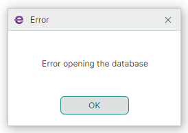

# MxMessageBox

Диалог `MxMessageBox` позволяет отображать сообщения и задавать пользователям простые вопросы.


`MxMessageBox` отрисовывается с использованием визуальных тем Eremex. Он поддерживает как светлый, так и тёмный варианты темы.

Используйте перегрузки статических методов `MxMessageBox.Show` и `MxMessageBox.ShowAsync` для отображения диалога.


## Перегрузки метода Show

Перегрузки метода `MxMessageBox.Show` возвращают результат диалога (кнопку, нажатую пользователем). Доступны две перегрузки метода `MxMessageBox.Show`:

``` cs
public static MessageBoxResult MxMessageBox.Show(Window? owner, string text, string? title = null, MessageBoxButtons buttons = MessageBoxButtons.Ok, MessageBoxIcon icon = MessageBoxIcon.None, MessageBoxResult defaultButton = MessageBoxResult.None, Action<MxMessageBox>? configure = null)
```

- owner — окно, которое будет владельцем окна сообщения. Если этот параметр равен `null`, `MxMessageBox` автоматически определяет владельца: владельцем становится последнее активное окно или главное окно приложения.
- text — текст для отображения в диалоге.
- title — заголовок диалога.
- buttons — значение перечисления `Eremex.AvaloniaUI.Controls.MessageBoxButtons`, задающее кнопки для отображения в диалоге. Доступные значения: `Ok`, `OkCancel`, `YesNoCancel`, `YesNo`, `AbortRetryIgnore`, `RetryCancel`
- icon — один из предопределённых значков для отображения перед текстом. Установите свойство в `MessageBoxIcon.None`, чтобы скрыть значок.
- defaultButton — определяет кнопку по умолчанию. Кнопка по умолчанию — это кнопка, которая изначально получает фокус при отображении диалога. Когда пользователь нажимает ENTER, срабатывает кнопка по умолчанию.
- configure — делегат для выполнения дополнительной настройки диалога (например, значка диалога в заголовке или выравнивания кнопок).


    ### Пример 

    Следующий пример отображает окно сообщения с тремя кнопками — Yes, No и Cancel.

    

    ``` cs
    MessageBoxResult result = MxMessageBox.Show(null, "The document has changed."+ Environment.NewLine+ "Do you want to save the changes?", "Save Changes", MessageBoxButtons.YesNoCancel, MessageBoxIcon.Warning, MessageBoxResult.Yes);
    if (result == MessageBoxResult.Yes)
    {
        //...
    }
    ```

Другая перегрузка метода `MxMessageBox.Show` содержит только один параметр.

``` cs
public static MessageBoxResult MxMessageBox.Show(Action<MxMessageBox> configure)
```

- configure — делегат для настройки диалога.


    ### Пример

    

    ``` cs
    var res = MxMessageBox.Show(configure: msgBox =>
    {
        msgBox.Text = "Error opening the database";
        msgBox.Title = "Error";
        msgBox.Buttons = MessageBoxButtons.Ok;
        msgBox.ButtonAlignment = Avalonia.Layout.HorizontalAlignment.Center;
        msgBox.Window.Icon = new WindowIcon(AssetLoader.Open(new Uri("avares://DemoCenter/Assets/EMXControls.ico")));
    });
    ```


## Перегрузки метода ShowAsync

Вы можете использовать перегрузки метода `MxMessageBox.ShowAsync`, чтобы вызвать окно сообщения асинхронно, не блокируя UI-поток. Методы `ShowAsync` возвращают объект `Task<MessageBoxResult>`, представляющий асинхронную операцию. Эта операция завершается, когда пользователь закрывает окно сообщения. Параметры перегрузок метода `ShowAsync` совпадают с параметрами методов `Show`.

``` cs
public static Task<MessageBoxResult> ShowAsync(Window? owner, string text, string? title = null, MessageBoxButtons buttons = MessageBoxButtons.Ok, MessageBoxIcon icon = MessageBoxIcon.None, MessageBoxResult defaultButton = MessageBoxResult.None, Action<MxMessageBox>? configure = null)
```

``` cs
public static Task<MessageBoxResult> ShowAsync(Action<MxMessageBox> configure)
```

### Пример

Следующий пример показывает окно сообщения асинхронно и ожидает, пока пользователь нажмёт кнопку. 

``` cs
async Task<MessageBoxResult> ShowMessageBoxAsync()
{
    Task<MessageBoxResult> resultTask = MxMessageBox.ShowAsync(
        owner: null,
        text: "Are you sure you want to cancel this task?",
        title: "Confirmation",
        buttons: MessageBoxButtons.YesNo,
        icon: MessageBoxIcon.Question
    );

    MessageBoxResult result = await resultTask;

    if (result == MessageBoxResult.Yes)
    {
        await CancelTaskAsync();
    }

    return result;
}

async Task CancelTaskAsync()
{
    await Task.Delay(3000);
}
```


<br>
<br>

<sup>*</sup> Эта страница переведена с использованием технологий машинного перевода.
