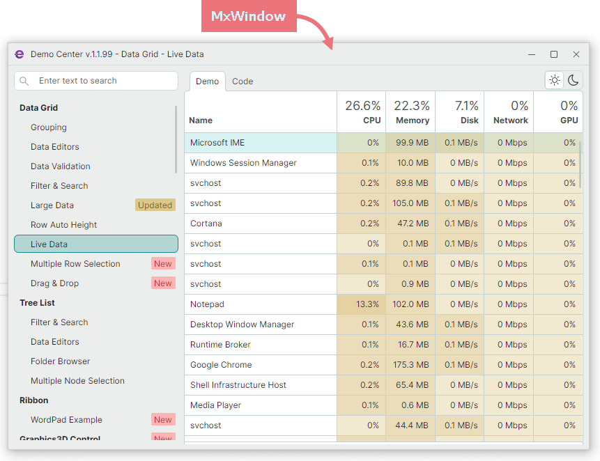

# MxWindow

Если вы используете контролы Eremex Avalonia, рассмотрите возможность применения компонента `MxWindow` как для главного, так и для дополнительных окон в вашем приложении. Это позволяет поддерживать единообразный интерфейс во всём вашем проекте Avalonia.

`MxWindow` — это окно, которое отрисовывает свои элементы (фон, рамку и заголовок) в соответствии с [визуальной темой Eremex](../themes/index.md). 



## Добавление пакета темы и регистрация визуальные темы

Чтобы использовать `MxWindow` и другие контролы Eremex Avalonia, подключите [пакет](../../whats-included/assemblies.md), содержащий визуальную тему Eremex. В следующем разделе показано, как зарегистрировать визуальную тему в вашем приложении: 

- [Регистрация визуальной темы Eremex](../themes/register-an-eremex-paint-theme.md).


## Создание MxWindow

`MxWindow` является потомком стандартного компонента Avalonia `Window`. Вы можете беспрепятственно заменить компоненты `Window` в ваших существующих приложениях на `MxWindow`, чтобы использовать визуальные темы Eremex. Следующий XAML-код демонстрирует пример объявления объекта `MxWindow`:

``` xml
<mx:MxWindow 
    xmlns:mx="https://schemas.eremexcontrols.net/avalonia"
    Title="MxWindow"
    ...
>

</mx:MxWindow>
```

[Шаблоны проектов Eremex](../../whats-included/project-templates.md) позволяют создавать новые приложения Avalonia с контролами Eremex. Эти шаблоны создают новые проекты, в которых главное окно инкапсулировано компонентом `MxWindow`.


## Настройки MxWindow

`MxWindow` расширяет настройки, предоставляемые стандартным компонентом `Window`, следующими параметрами, которые задают видимость и глифы стандартных кнопок в заголовке:

- `ShowCloseButton` — задаёт видимость кнопки «Закрыть».
- `ShowMaximizeButton` — задаёт видимость кнопки «Развернуть».
- `ShowMinimizeButton` — задаёт видимость кнопки «Свернуть».

- `CloseButtonGlyph` — глиф кнопки «Закрыть».
- `MaximizeButtonGlyph` — глиф кнопки «Развернуть».
- `MinimizeButtonGlyph` — глиф кнопки «Свернуть».
- `RestoreButtonGlyph` — глиф кнопки «Восстановить».


<br>
<br>

<sup>*</sup> Эта страница переведена с использованием технологий машинного перевода.
