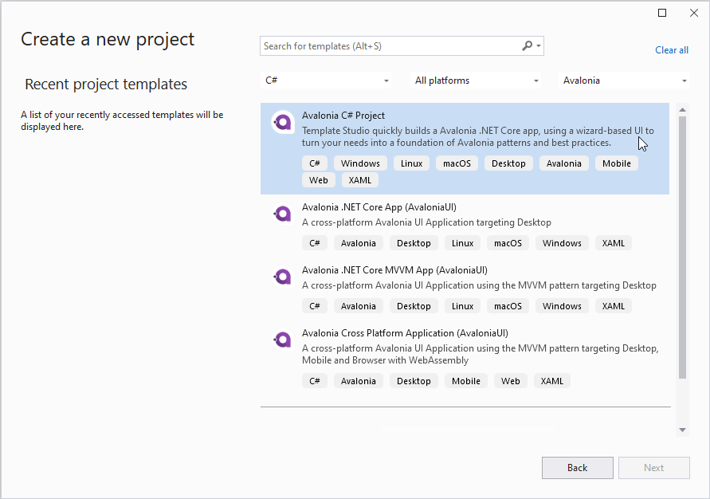
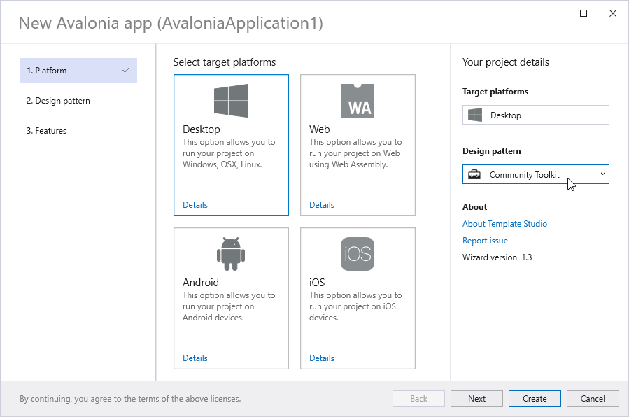
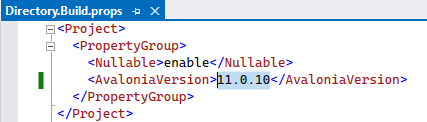

# Используйте стандартные шаблоны Avalonia UI для создания нового проекта с Eremex Controls

Самый простой способ создать новый проект Avalonia UI с контролами Eremex — использовать [шаблоны Eremex Avalonia](./index.md).
Данное руководство показывает, как использовать стандартные шаблоны Avalonia UI для создания нового проекта с нуля.

## 1. Установка инструментов разработки Avalonia UI

Убедитесь, что шаблоны Avalonia UI установлены в вашей системе. В следующей статье описано, как установить эти инструменты: [Avalonia UI - Get Started](https://avaloniaui.net/gettingstarted).

## 2. Создание нового проекта

Запустите Visual Studio и создайте новый десктопный проект Avalonia UI.



В мастере шаблона приложения Avalonia выберите библиотеку Community Toolkit, чтобы добавить в проект пакет `CommunityToolkit.Mvvm`.




## 3. Установка стартового проекта

Созданное решение содержит два проекта — _AvaloniaApplication1_ и _AvaloniaApplication1.Desktop_. Убедитесь, что в качестве стартового проекта установлен _AvaloniaApplication1.Desktop_.


## 4. Обновление NuGet-пакетов Avalonia UI

При необходимости обновите NuGet-пакеты Avalonia UI в проектах _AvaloniaApplication1_ и _AvaloniaApplication1.Desktop_ до версии, поддерживаемой Eremex Avalonia UI Controls. См. [Системные требования](../whats-included/system-requirements.md).


Если каталог решения содержит файл _Directory.Build.props_, убедитесь, что в нём указана та же версия Avalonia UI, что и в NuGet-пакетах Avalonia.



## 5. Добавление NuGet-пакетов Eremex Avalonia UI Controls

Добавьте NuGet-пакет **Eremex.Avalonia.Controls** в проект _AvaloniaApplication1_.
Также добавьте NuGet-пакет **Eremex.Avalonia.Themes.DeltaDesign**, который содержит визуальную тему `DeltaDesign` для контролов Eremex.

## 6. Регистрация визуальной темы Eremex

Вам необходимо зарегистрировать визуальную тему Eremex, чтобы обеспечить корректную отрисовку контролов Eremex. Если ни одна визуальная тема Eremex не зарегистрирована, контролы отображаются пустыми.

Убедитесь, что NuGet-пакет `Eremex.Avalonia.Themes.DeltaDesign` добавлен в проект. Он содержит визуальную тему `DeltaDesign`, которую можно зарегистрировать следующим образом:

- Откройте файл _App.axaml_ в проекте _AvaloniaApplication1_.
- Добавьте следующее пространство имён в объект Application:

  ``` xml
  xmlns:theme="clr-namespace:Eremex.AvaloniaUI.Themes.DeltaDesign;assembly=Eremex.Avalonia.Themes.DeltaDesign"
  ```
  
- Включите <code>&lt;theme:DeltaDesignTheme/&gt;</code> в коллекцию `Application.Styles`.


  ``` xml
  <Application 
    xmlns="https://github.com/avaloniaui"
    xmlns:x="http://schemas.microsoft.com/winfx/2006/xaml"
    x:Class="DemoCenter.App"
    xmlns:theme="clr-namespace:Eremex.AvaloniaUI.Themes.DeltaDesign;assembly=Eremex.Avalonia.Themes.DeltaDesign"
    RequestedThemeVariant="Light">
    <!-- "Default" - The application's theme variant is defined by the system setting. 
        "Light" - Enables the Light theme variant.
        "Dark" - Enables the Dark theme variant. 
    -->
      <!-- .... -->
      <Application.Styles>
          <theme:DeltaDesignTheme/>
          <!-- .... -->
      </Application.Styles>
  </Application>
  ```

### Выбор светлого или тёмного варианта темы

Свойство `Application.RequestedThemeVariant` в файле _App.axaml_ задаёт текущий выбранный вариант темы (светлый или тёмный). Установите это свойство в нужное значение. 

``` xml
<Application 
    RequestedThemeVariant="Default" ... >
    <!-- "Default" - The application's theme is defined by the system setting. 
         "Light" - Enables the Light theme.
         "Dark" - Enables the Dark theme. 
    -->
</Application>
```


<br>
<br>

<sup>*</sup> Эта страница переведена с использованием технологий машинного перевода.
