# Лицензирование и ознакомление с продуктом

Данный документ содержит информацию об ознакомлении с продуктом, активации лицензии и ответы на часто задаваемые вопросы по лицензированию.


## Ознакомление с продуктом

Компания Eremex предоставляет вам бесплатную 60-дневную пробную (ограниченную) версию библиотеки Eremex Controls, которая позволяет оценить данный продукт в течение указанного срока в ваших проектах и конкретной среде. Пробная версия не имеет никаких ограничений в функциональности контролов в сравнении с активированной версией. При использовании пробной версии продукта показывается триальное сообщение при отображении контролов.


<!-- The free trial version of the Eremex Controls Library allows you to evaluate the product in your projects and environment. There are no restrictions in the functionality of the controls. The trial version displays "trial" messages and has some minor restrictions -->


## Лицензирование

Условия лицензирования библиотеки элементов управления Eremex описаны в [Лицензионном соглашении с конечным пользователем (EULA)](eula.md).

В течение срока действия лицензии вы можете создавать новые проекты с использованием библиотеки Eremex Controls Library, а также обновлять существующие проекты с помощью новой версии библиотеки. На этапе предварительной сборки менеджер лицензий Eremex Controls генерирует файл `emxLicense.cs`, который содержит уникальный рантайм-ключ лицензии. Рантайм-ключ лицензии содержит информацию о следующих параметрах:

- Имя сборки проекта.
- Мажорная версия (**XX.Y**.z) библиотеки Eremex Controls, используемой в вашем проекте. 

Файл `emxLicense.cs` генерируется в директории проекта и включается в проект в качестве элемента компиляции.


Пример файла `emxLicense.cs`, определяющий лицензионный рантайм-ключ:

``` csharp
// This file is auto-generated. Please do not change it.
using System.Runtime.CompilerServices;
using Eremex.AvaloniaUI.Controls.License;

namespace DemoCenter;
public class LicenseProvider
{
#pragma warning disable CA2255 // The 'ModuleInitializer' attribute should not be used in libraries
	[ModuleInitializer]
#pragma warning restore CA2255 // The 'ModuleInitializer' attribute should not be used in libraries
    public static void RegisterLicense()
	{
        ControlsLicenseManager.SetRuntimeLicenseOwner(new LicenseProvider(),"", 
        "61 5C D0 DA 5E 85 40 27 D0 33 A1 27 5E A7 49 C0 55 B8 3F 84 29 15 30 E0 
        08 57 73 0B 33 D6 BF 34 51 3D AC 02 BD 11 BF C3");
	}
}
```

 Если сгенерированный файл `emxLicense.cs` не добавляется в проект автоматически (например, из-за настроек среды разработки), добавьте этот файл в проект вручную.


Лицензионный рантайм-ключ используется для проверки лицензии во время выполнения. Если информация о лицензии недействительна или не найдена, Контролы отобразят триальное сообщение.


### Истечение срока действия лицензии

После истечения срока действия лицензии создание новых проектов и обновление существующих проектов до новой мажорной версии библиотеки Eremex Controls становится невозможным. 

Проекты, созданные в течение срока действия лицензии, будут продолжать компилиться и работать. Единственное требование - не менять имя сборки и мажорную версию библиотеки Eremex Controls в существующих проектах. В противном случае Контролы будут отображать сообщение о пробной версии во время выполнения. Тем не менее, вы можете свободно менять номер минорного выпуска (XX.Y.**z**) библиотеки в своих проектах даже после истечения срока действия лицензии. 

## Управление лицензиями

Управление лицензиями разработчика для продукта Eremex Controls осуществляется с помощью двух утилит от [Guardant](https://guardant.com):

- 'Guardant Control Center' - Служба управления лицензиями. Установочный файл: `grdcontrol-x.xx.msi` для Windows, и `grdcontrol-x.x_amd64.deb` для Linux. 
- 'Guardant License Wizard' - Инструмент с графическим интерфейсом и командной строкой, позволяющий добавлять, обновлять и переносить лицензии. Исполняемый файл: `license_wizard.exe` для Windows и `license_wizard` для Linux.

Вы можете загрузить эти инструменты по следующим ссылкам:

- [Guardant License Management Redistributables (Windows)](../resources/Guardant_Redistributable_Windows.zip)
- [Guardant License Management Redistributables (Linux)](../resources/Guardant_Redistributable_Linux_deb.zip) 

 

### Онлайн активация лицензии Eremex Controls

1. Установите 'Guardant Control Center'.
2. Запустите 'Guardant License Wizard'

    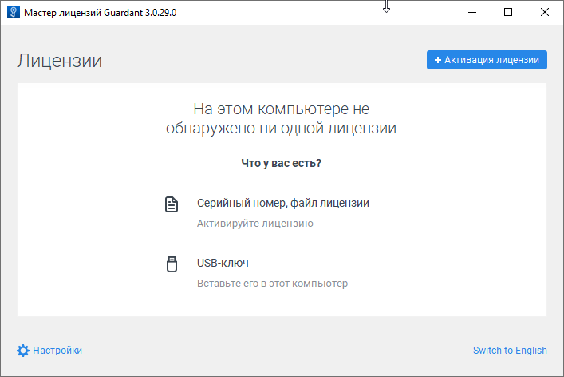
3. Нажмите **Настройки** и убедитесь, что для свойства **Адрес сервера** установлено значение _https://getlicense.guardant.ru_. 
   
     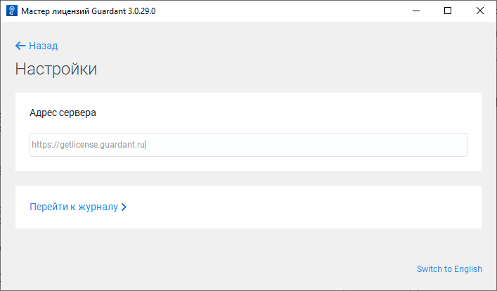

	 Затем нажмите **Назад**, чтобы вернуться на предыдущую страницу.
4. Нажмите кнопку **Активация лицензии**, чтобы добавить новый лицензионный ключ.

5. Укажите компьютер, на котором необходимо зарегистрировать лицензию.

    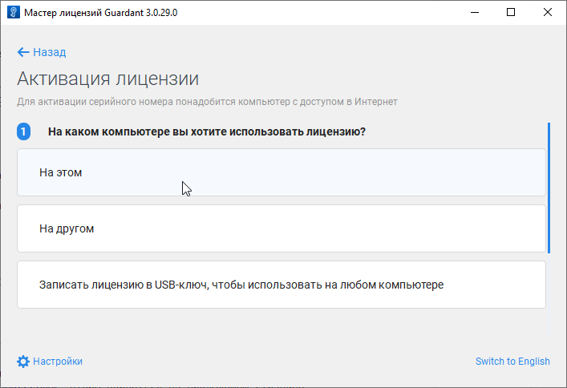
6. Введите лицензионный ключ в поле **Серийный номер**.

    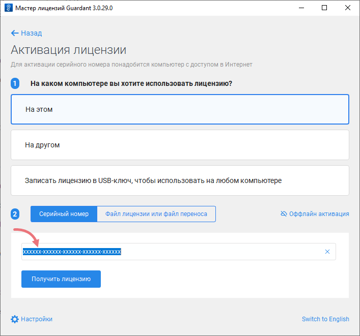
	
7. Нажмите **Получить лицензию**.

    Если активация лицензии прошла успешно, мастер отобразит информацию о лицензированных продуктах.

    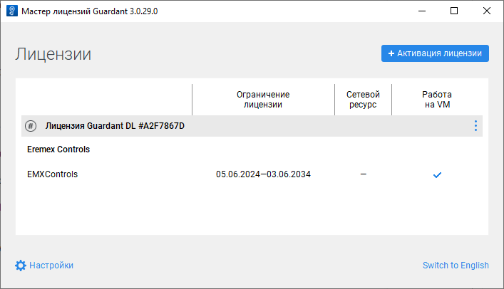


#### Регистрация лицензии из командной строки

<code>license_wizard --console --activate &lt;LICENSE-KEY&gt; --host https://getlicense.guardant.ru</code>

#### Получение информации обо всех параметрах командной строки

<code>license_wizard --help</code>


### Онлайн-обновление лицензии Eremex Controls

1. Запустите 'Guardant License Wizard'

    

2. Нажмите **Настройки** и убедитесь, что для свойства **Адрес сервера** установлено значение _https://getlicense.guardant.ru_. Затем нажмите **Назад**, чтобы вернуться на предыдущую страницу.
3. На странице 'Лицензии' нажмите кнопку с многоточием ('...') и выберите 'Проверить наличие обновлений'.

    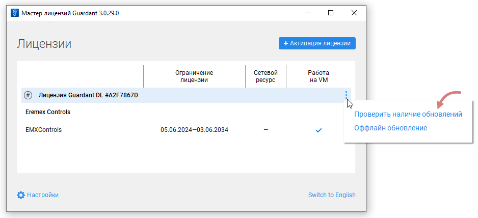

	
4. Щелкните ссылку _Установить обновления_, которая появляется, если на сервере найдено обновление лицензии. 
5. После успешного завершения операции мастер обновит зарегистрированные лицензии.
 

#### Обновление лицензии из командной строки

<code>license_wizard --console --update &lt;LICENSE-KEY&gt; --host https://getlicense.guardant.ru</code>


### Оффлайн активация лицензии Eremex Controls

1. Запустите 'Guardant License Wizard'

    
2. Нажмите на кнопку 'Активация лицензии'.

    
3. Выберите 'На этом', чтобы указать компьютер, на котором вы хотите зарегистрировать лицензию.

    
4. Нажмите кнопку 'Offline активация'.

    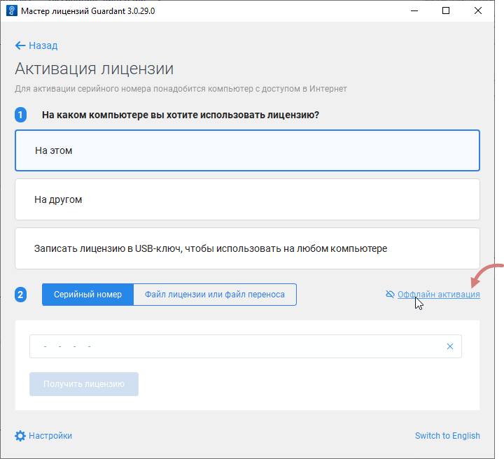

5. Нажмите 'Сохранить', чтобы сохранить запрос на новую лицензию в файл.

    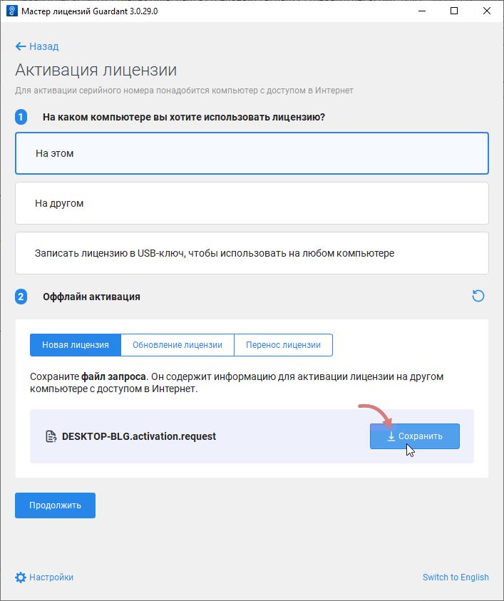

6. На другом компьютере с доступом в Интернет запустите 'Guardant License Wizard'.

7. Нажмите **Настройки** и убедитесь, что для свойства **Адрес сервера** установлено значение _https://getlicense.guardant.ru_. Затем нажмите **Назад**, чтобы вернуться на предыдущую страницу.

8. На странице Лицензии нажмите кнопку **Активация лицензии**.

    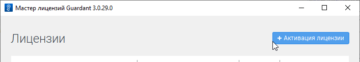

9. Выберите 'На другом', чтобы указать компьютер, для которого необходимо активировать лицензию. Затем нажмите кнопку 'Продолжить'.

    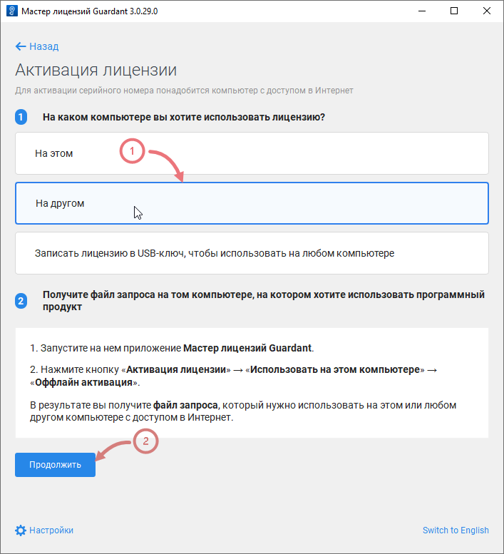

10. Загрузите запрос на лицензию, сгенерированный на целевом компьютере.

    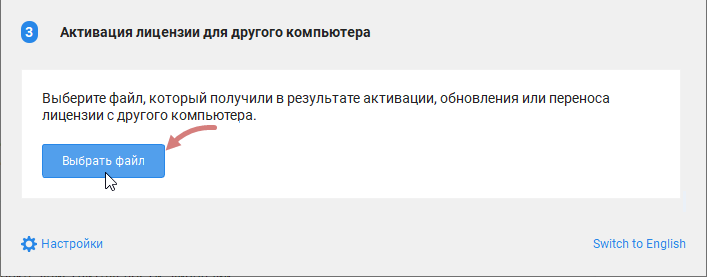

11. Введите номер лицензии и нажмите 'Активировать новую лицензию'.

    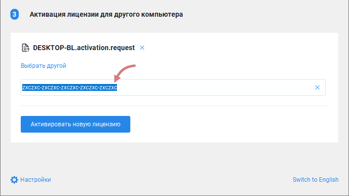

12. Сохраните файл лицензии ('_*.license_').

    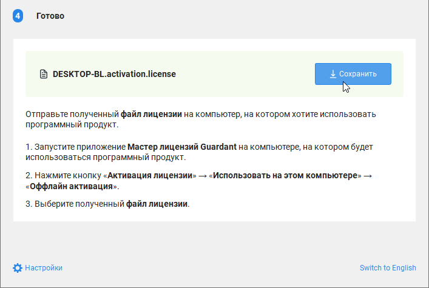

13. Вернитесь на целевой компьютер.

14. Запустите 'Guardant License Wizard' и перейдите на страницу 'Активация лицензии'.

15. Выберите 'На этом', чтобы указать компьютер для активации лицензии. Затем нажмите 'Файл лицензии или файл переноса' и загрузите сгенерированный файл лицензии ('_*.license_').

    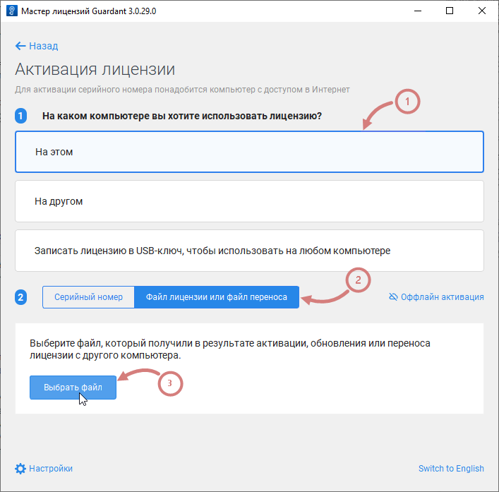

16. Активируйте лицензию.


## Часто задаваемые вопросы


&ndash; **Могу ли я собрать свой проект с Eremex Controls в CI без дополнительной лицензии?**

&ndash; Да, можете. Вам не нужна дополнительная лицензия разработчика для сборки проектов в CI. Чтобы запустить проекты без триальных сообщений, не изменяйте имя сборки и мажорную версию Eremex Controls в вашем проекте в среде CI.


<br>

&ndash; **Будет ли мой проект продолжать компилиться и работать без триальных сообщений после истечения срока действия лицензии Eremex Controls?**

&ndash; Да. Лицензия дает вам право создавать новые проекты и обновлять существующие проекты в течение срока действия лицензии. После истечения срока действия лицензии ваш проект будет продолжать собираться и работать без триальных сообщений, если вы не измените имя сборки и мажорную версию (**XX.Y**.z) используемой библиотеки Eremex Controls. Можно обновить номер минорного релиза (XX.Y.**z**) в существующих проектах, поскольку он не участвует в проверке действительности лицензии.

<br>

&ndash; **Почему в моем проекте отображается триальное сообщение?**

&ndash; Eremex Controls выводит сообщение о триальной версии в следующих случаях:
- Проект не содержит файл `emxLicense.cs` с действительным рантайм-ключом лицензии.
- Мажорная версия библиотеки Eremex Controls, используемая приложением, не совпадает с мажорной версией библиотеки, закодированной в лицензионном runtime-ключе.
- Имя текущей сборки не совпадает с именем сборки, закодированным в лицензионном runtime-ключе.
