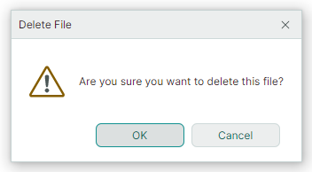

# Версия 1.1

## 1.1.144

### Докинг

- Новый параметр `DockPane.AllowAutoHide` позволяет запретить пользователю включать режим автоскрытия для конкретной панели. Этот параметр скрывает кнопку «Pin» и пункт контекстного меню «Auto Hide» для панели. 

### Ribbon и панели инструментов

- Исправлено: в определённых случаях возникает AvaloniaInternalException после перетаскивания панели инструментов.
- Исправлено: возникает NullReferenceException при навигации в Ribbon, если он содержит скрытую группу.

### Диаграммы

- Исправлено: невозможно изменить видимый диапазон в коде с помощью свойств `AxisRange.VisualMin` и `AxisRange.VisualMax`.
- Исправлено: событие `PointerPressed` контрола CartesianChart не возникает, когда операции прокрутки и масштабирования отключены.

## 1.1.142

### DataGridControl и TreeListControl 

#### Всплывающие подсказки для заголовков колонок

Новое свойство `HeaderToolTip` позволяет задавать пользовательские всплывающие подсказки для заголовков колонок в контролах DataGrid и TreeList.

#### Исправленные проблемы

- Некорректная сортировка и фильтрация для колонок, использующих встроенные редакторы, чей отображаемый текст форматируется пользовательским образом. Конкретные случаи включают:

    * Редакторы с масками — когда редактор использует маску и свойство `UseMaskAsDisplayText` установлено в `true`.
    * `PopupColorEditor` — когда редактор отображает значение выбранного цвета.
    * `ComboBoxEditor` — когда отображаемый текст элемента не совпадает со значением, возвращаемым методом `ToString` элемента (например, при использовании объекта `EnumItemsSource` в качестве источника элементов).

- DataGrid/TreeList вызывает исключение при изменении размера окна, если свойство `CellTemplate` используется для назначения колонке встроенного редактора, и для свойства `IsVisible` редактора задана привязка.

### Редакторы

Исправлено: некорректный выбор значения в `SpinEditor` при двойном и тройном щелчке.

### PropertyGrid

Исправлено: встроенный редактор возвращается к старому значению после операции редактирования, если событие `PropertyChanged` не было вызвано.

### Докинг

Значение свойства `FloatWindow.StyleKeyOverride` было изменено с `typeof(Window)` на `typeof(FloatWindow)`.

### Ribbon

Исправлено: возникает NullReferenceException при изменении размера Ribbon, если свойство `RibbonPageGroup.IsVisible` установлено в `false`.

## 1.1.130

### Graphics3DControl

- Значение экспозиции по умолчанию (`Graphics3DControl.Exposure`) было изменено на 4.5.
- Свойство `Graphics3DControl.EnableMultisampling` было заменено на `Graphics3DControl.MultisamplingMode`. Параметр `MultisamplingMode` позволяет выбрать уровень качества сглаживания (MSAA).
- Graphics3DControl теперь позволяет задавать пользовательские источники света. Используйте свойство `Lights` или `LightsSource` для создания источников света. Поддерживаемые типы света: Point, Directional, CameraPoint и CameraDirectional.
- Вы можете использовать свойство `AllowDefaultLight`, чтобы отключить свет по умолчанию.
- Добавлена поддержка пользовательских [скайбоксов](../controls/graphics3dcontrol/skybox.md).
- Скайбокс по умолчанию был обновлён для улучшения визуальной отрисовки.
- Оптимизированы расстояния по умолчанию до ближней и дальней плоскостей отсечения.

### Data Grid и Tree List 
- Исправлено: встроенный ComboBoxEditor с источником Enum работает неправильно во время горизонтальной прокрутки грида.
- Исправлено: при использовании Binding в CellTemplate немедленное подтверждение значения редактора не работает.

### Интерфейс Докинга

- Исправлено: InvalidCastException при удалении документа, если включены Compiled Bindings.

## 1.1.112

### Диаграммы

- Исправлена проблема с методом `DataAdapter.RemoveFromStart`, где производительность значительно снижалась при удалении большого числа точек.

### Интерфейс Докинга

Были добавлены следующие свойства:

- `DockManager.OwnsFloatingDockPanes` 
- `DockManager.OwnsFloatingDocuments`

Эти свойства задают, устанавливает ли `DockManager` автоматически себя владельцем плавающих dock-панелей и документов.
Если свойство `OwnsFloatingDockPanes`/`OwnsFloatingDocuments` равно `false`, плавающие dock-панели/документы появляются позади главного окна, когда главное окно получает фокус.

### Graphics3DControl

- Исправлена проблема, когда операция перетаскивания не останавливалась при вызове контекстного меню.
- Свойства `Graphics3DControl.Gamma` и `Graphics3DControl.Exposure` теперь принимают значение 0.
- `Graphics3DControl.CoordinateSystem` теперь корректно возвращает `RightHanded`, что соответствует системе координат по умолчанию, используемой в `Graphics3DControl`.
- Свойство `Graphics3DControl.ZoomFactor` было переименовано в `Graphics3DControl.ZoomRate`.
- Улучшен алгоритм, вычисляющий положения по умолчанию ближней и дальней плоскостей отсечения.
- Добавлена функция скайбокса.
- Добавлены функции выбора и подсветки объектов.
- Добавлена возможность рисовать точки без необходимости задавать индексы.
- Добавлена поддержка использования текстуры только с картой Emission.
- Скорректирована скорость вращения модели по умолчанию при использовании мыши.
- Исправлено исключение IndexOutOfRange, когда `MaterialKey` равен null.

### Ribbon

- Исправлена проблема в определённых сценариях MVVM.

## 1.1.95

### Что нового

### Ribbon и панели инструментов

Новые свойства были добавлены к объекту `ToolbarCheckItem` (кнопка-флажок). Эти свойства задают, как кнопки-флажки отрисовываются в контроле Ribbon и на панелях инструментов:

- [`ToolbarCheckItem.CheckBoxStyle`](../controls/ribbon/ribbon-items.md#кнопки-флажки-toolbarcheckitem) — задаёт, отрисовывать ли флажок как обычную кнопку-флажок, кнопку-переключатель или радиокнопку.

- `ToolbarCheckItem.CheckBoxAlignment` — задаёт, отображать ли флажок до или после текста и глифа.

<!-- The new `RibbonPageGroup.ItemLayoutDirectionInParent` attached property allows you to override the default layout mechanism for items in a Ribbon page group. -->

### Data Grid и Tree List

- Исправлено: объект `CellData.Row` не обновляется при изменении видимости колонки и ItemsSource.
- Исправлено: щелчок по флажку узла закрывает всплывающее окно, в котором отображается контрол Tree List.

### Graphics3DControl

- Если Vulkan SDK отсутствует на macOS, контрол отображает инструкции по установке необходимых библиотек.
- Исправлено: отрисовка Graphics3DControl не очищается после удаления базовой 3D-модели.
- Исправлена проблема с автоматическим позиционированием камеры в определённых случаях.
- Исправлено: задние поверхности выглядят более металлическими, чем есть на самом деле.

## 1.1.91

### Что нового

#### Ribbon

[RibbonControl](../controls/ribbon/index.md) позволяет интегрировать навигационные меню в стиле Microsoft Office в ваши приложения Avalonia UI. 

- Встроенные и выпадающие галереи
- Панель быстрого доступа — вы можете добавлять на эту панель часто используемые команды.
- Настройка положения панели быстрого доступа (над или под командной панелью Ribbon) и её видимости
- Отображение элементов в области заголовков страниц
- Раскраска заголовков страниц (позволяет выделять контекстные вкладки)
- Навигация по элементам Ribbon с клавиатуры
- Классическое и упрощённое размещение команд
- Поддержка всех типов элементов (команд), доступных в традиционных меню ([ToolbarManager](../controls/toolbars-and-menus/index.md))
- Адаптивная компоновка групп и элементов (перестраивает расположение команд при изменении ширины контрола Ribbon)

#### Cartesian Chart — Candlestick Series View

[Candlestick View](../controls/charts/cartesian-series-views/candlestick-series-view.md) позволяет создать финансовую диаграмму, описывающую движение цены актива. 

Для каждой точки данных диаграмма отображает набор из четырёх значений — цены открытия (Open), закрытия (Close), максимума (High) и минимума (Low).

#### Heatmap

Контрол [Heatmap](../controls/charts/heatmap.md) представляет собой инструмент для визуализации числовых данных в матрице с помощью цвета.

[Тепловые карты](https://en.wikipedia.org/wiki/Heat_map) полезны для визуального анализа больших наборов данных и обнаружения корреляций и аномалий по двум переменным, отображаемым вдоль горизонтальной и вертикальной осей.
Цвет каждой точки данных на тепловой карте определяется числовым значением точки. Чтобы задать пользовательское кодирование цветом в контроле Heatmap, назначьте цвета конкретным значениям (переходным значениям).
Эти цвета используются для создания цветовых градиентов между переходными значениями. Цвета всех точек в матрице определяются по этим градиентам.
Возможности контрола [Heatmap](../controls/charts/heatmap.md) включают:
  - Пользовательское кодирование цветом
  - Раскраску в оттенках серого
  - Настройку осей X и Y
  - Перекрестие (Crosshair) 
  - Полосы и постоянные линии
  - Прокрутку и масштабирование мышью
  - Экспорт результата раскраски данных в растровое изображение

#### Graphics3DControl

[Graphics3DControl](../controls/graphics3dcontrol/index.md) — контрол для визуализации 3D-моделей и взаимодействия с ними.

- API контрола позволяет задавать 3D-модели, настройки камеры и материалы (в формате PBR)
- Камера поддерживает перспективный и изометрический 3D-виды 
- Одновременное отображение нескольких 3D-моделей
- Вы можете вращать, масштабировать и панорамировать модели во время работы с помощью мыши и клавиатуры
- Для отображения 3D-графики используется Vulkan SDK
- Поддержка паттерна MVVM

#### Data Grid и Tree List/Tree View

- Data Grid — перетаскивание строк — контрол DataGridControl теперь поддерживает операции перетаскивания строк внутри контрола и во внешние контролы (например, Tree List или другой Data Grid). Операции перетаскивания поддерживаются для обычных строк (строк данных) и групповых строк. Когда вы перетаскиваете групповую строку, перетаскиваются все строки данных этой группы. Не требуется дополнительного кода для обработки операций перетаскивания строк между исходным и целевым контролами (Data Grid и/или Tree List), если бизнес-объекты в источниках данных контролов одного типа.

- Data Grid — множественное выделение строк — пользователи могут выбирать несколько строк одновременно с помощью мыши, удерживая клавиши CTRL и SHIFT. Публичный API контрола позволяет выбирать несколько строк в коде.

- Data Grid и Tree List — возможность заполнять колонки из View Model — используйте свойство `ColumnsSource`, чтобы задать коллекцию объектов, которые нужно представить в виде колонок. Свойство `ColumnTemplate` позволяет задать шаблон для создания колонок из этих объектов.

- Data Grid и Tree List/Tree View — новый механизм вертикальной прокрутки — мы значительно улучшили вертикальную прокрутку для наших контролов грида и tree list, когда строки различаются по высоте. Контролы теперь обеспечивают плавную вертикальную прокрутку и точное позиционирование ползунка прокрутки для строк переменной высоты, даже для больших наборов записей.

- Data Grid и Tree List — полная виртуализация данных — механизм виртуализации данных, реализованный в контролах Data Grid и Tree List, нацелен на улучшение производительности контролов, когда они отображают большое число строк и колонок. Контролы поддерживали вертикальную виртуализацию с версии 1.0. В новой версии (v1.1) контролы поддерживают горизонтальную виртуализацию, которая ускоряет время запуска при использовании множества колонок.  

  Механизм виртуализации создаёт и поддерживает только те визуальные элементы (ячейки, заголовки колонок и т. д.), которые видны в области просмотра. Без виртуализации данных контролу пришлось бы создавать визуальные элементы для всего объёма ячеек, включая находящиеся за пределами области просмотра.

- Data Grid и Tree List — мы оптимизировали отрисовку встроенных редакторов в наших контейнерных контролах. Это позволяет значительно улучшить время загрузки и производительность прокрутки в многоколоночных контролах Data Grid и Tree List.

#### Property Grid

- Вертикальная виртуализация — Property Grid теперь поддерживает механизм виртуализации данных. Он сокращает время загрузки контрола при отображении большого числа строк.

#### MxMessageBox

Диалог [MxMessageBox](../controls/windows-and-dialogs/messagebox.md) позволяет отображать сообщения и задавать вопросы пользователям. 

Диалог поддерживает визуальные темы Eremex и выглядит согласованно с другими EMX Controls в вашем проекте. 

#### Редакторы

- ComboBoxEditor — новое событие `FilterItem` можно обработать для пользовательской фильтрации элементов. Механизм фильтрации элементов вызывается, когда пользователь вводит текст в редакторе, при условии, что функция автозавершения отключена. См. [ComboBoxEditor — Автофильтр](../controls/editors/comboboxeditor.md#автофильтр).

 
 

* Эта страница переведена с использованием технологий машинного перевода.
