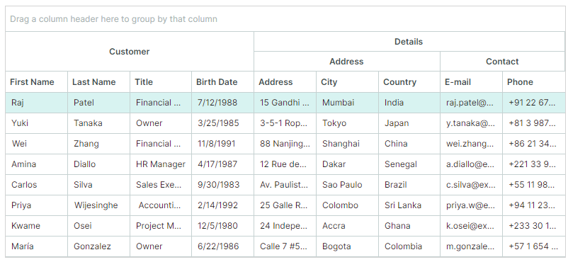
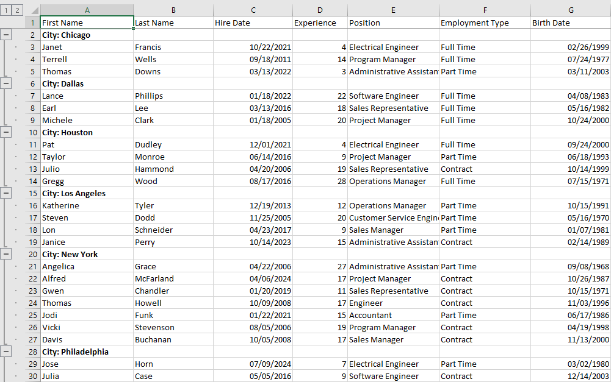
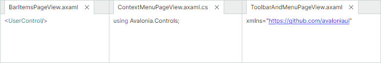

# Версия 1.2

## 1.2.102

### DataGrid и TreeList

- Исправлено: некорректные данные предоставляются для шаблонов ячеек во время вертикальной прокрутки при использовании нескольких DataTemplate в одной колонке.

### Property Grid

- Исправлено: двойной щелчок по свойству с вложенными свойствами запускает бесконечный цикл событий разворачивания/сворачивания строки.
- Исправлено: встроенный редактор PopupColorEditor не отображает HEX-значения цвета в верхнем регистре.

### Диаграммы

- Исправлено: возникает ArgumentOutOfRangeException при наведении на диаграмму, когда свойства Axis.WholeMin и Axis.WholeMax установлены в ноль.
- Исправлено: применяется некорректный визуальный диапазон, когда задано свойство MeasureUnit.

### Панели инструментов и Ribbon

- Исправлено: свойство Tag теряется для элементов, когда они помещаются в меню переполнения панели инструментов.
- Исправлено: некорректное выравнивание текста в больших кнопках.

### Интерфейс Докинга

- Исправлено: при скрытии панели в Tabbed Group заголовок вкладки остаётся видимым. 


## 1.2.96

### Graphics3DControl

- Исправлено: если модель содержит две или более сетки типа `Lines` или `Points`, Graphics3DControl не обновляется немедленно при изменении настройки `MeshGeometry3D.PrimitiveSize`.

## 1.2.95

### Системные требования

Библиотека контролов Eremex теперь требует фреймворк Avalonia версии 11.3.8 или выше. 

### DataGrid и TreeList

- Критическое изменение — обновлены аргументы событий перетаскивания

    Аргументы событий `StartDrag`, `DragOver` и `Drop` были изменены. Причина этого критического изменения — отказ от системного интерфейса `Avalonia.Input.IDataObject`. Аргумент `Data` этих событий теперь имеет тип класса `DragDropData` (в предыдущих версиях он был типа интерфейса `IDataObject`). Класс `DragDropData` предоставляет те же члены, что и устаревший интерфейс.

- Исправлено: невозможно изменить фон строк грида, применяя стиль к объектам `DataGridRowControl`.

### Property Grid

- Исправлено: возникает исключение при навигации в активном встроенном PopupColorEditor (нажатие клавиш «Вверх» и «Вниз»), если его всплывающее окно открыто.

### Ribbon

- Исправлено: возникает исключение при обновлении Ribbon, если он содержит скрытые элементы.

#### MxWindow

- Исправлено: к окну добавляется лишний отступ в развёрнутом состоянии.

## 1.2.92

### TreeList — экспорт в PDF

Теперь вы можете экспортировать контрол Tree List напрямую в PDF-документ. Процесс экспорта следует подходу WYSIWYG, гарантируя, что сгенерированный PDF соответствует размещению элементов контрола на экране.


API экспорта позволяет настраивать различные параметры экспорта, такие как видимость заголовков колонок и бэндов, параметры бумаги и другое.

Связанный раздел:

- [Экспорт](../controls/treelist/export.md)

### Data Grid и Tree List — копирование в буфер обмена

Контролы Data Grid и Tree List теперь поддерживают сочетание клавиш CTRL+C, используемое для копирования выделенных строк в буфер обмена.
Новый метод `CopyToClipboardAsync` позволяет копировать строки в коде.

Дополнительную информацию смотрите в следующем разделе:

- [Буфер обмена](../controls/datagrid/clipboard.md)

### Data Grid и TreeList — прочее

- Методы `OnKeyDown` и `OnKeyUp` теперь виртуальные.
- Исправлено: зависание контрола, когда у колонок с шириной Auto задана настройка MinWidth.
- Исправлено: меню фильтров в колонках не работают с nullable-свойствами.

## Property Grid

- Исправлено: проблема при привязке свойства строки IsVisible к свойству с последующим редактированием этого свойства.


## Ribbon

- Исправлено: Ribbon вызывает исключение при размещении внутри ToolbarManager.
- Исправлено: Ribbon выделяет место под скрытые элементы.

### ComboBoxEditor — немедленное обновление значения редактора

В режиме множественного выбора ComboBoxEditor содержит кнопки OK и Cancel во всплывающем окне, используемые для подтверждения выбора пользователя. Если эти кнопки скрыты, ComboBoxEditor немедленно обновляет своё значение по мере того, как пользователь отмечает или снимает отметки с элементов в выпадающем списке. Если эти кнопки видимы, значение редактора обновляется после нажатия кнопки OK.

Установите свойство редактора `PopupFooterButtons` в `None`, чтобы скрыть кнопки OK и Cancel.

## 1.2.77


### Data Grid и Tree List — фильтры колонок

Меню фильтров колонок теперь доступны для контролов Data Grid и Tree List.

Наведите курсор на любой заголовок колонки, чтобы отобразить кнопку фильтра. Щелчок по этой кнопке открывает меню фильтра со списком уникальных значений колонки. Выберите любое значение, чтобы мгновенно отфильтровать колонку.


- Фильтрация по нескольким колонкам — вы можете применять фильтры к нескольким колонкам одновременно.
- Панель фильтра — когда фильтр применён, в нижней части контрола появляется специальная панель фильтра. Она отображает текущие критерии фильтрации и предоставляет возможность временно отключить или очистить фильтр.
- Фильтрация в коде — используйте новое свойство `DataControlBase.FilterString`, чтобы [создавать пользовательские критерии фильтрации в коде](../controls/datagrid/filter-and-search.md#фильтрация-в-коде). Это свойство поддерживается для контролов Data Grid, Tree List и Tree View.

Связанные разделы:

- [Data Grid — Фильтрация и поиск](../controls/datagrid/filter-and-search.md)
- [Tree List — Фильтрация и поиск](../controls/treelist/filter-and-search.md)

### Data Grid — экспорт в PDF

Data Grid теперь позволяет экспортировать данные в виде PDF-документа. Функция экспорта в PDF следует концепции WYSIWYG, которая сохраняет размещение элементов грида в выходном документе.


При экспорте в PDF вы можете настраивать различные параметры, включая тип бумаги, поля страницы, ориентацию и так далее.

Связанный раздел:

- [Экспорт](../controls/datagrid/export.md)

### MxMessageBox — асинхронный режим

`MxMessageBox` теперь включает [перегрузки метода ShowAsync](../controls/windows-and-dialogs/messagebox.md#перегрузки-метода-showasync). Они позволяют отображать окна сообщений асинхронно, не блокируя UI-поток.

### Сериализация контролов в JSON

Для сериализации/десериализации контролов Eremex вы обычно используете их методы `SaveLayout` и `RestoreLayout`, которые применяют для сериализации формат XML. В настоящее время эти методы не позволяют выбирать выходной формат.

Для более полного контроля над параметрами сериализации и использования формата JSON применяйте методы `SerializationManager.Serialize` и `SerializationManager.Deserialize` с параметром `SerializationSettings`. Установите свойство `SerializationSettings.SerializationMode` в `Json`, чтобы сериализовать/десериализовать контролы в этом формате.

### Интерфейс Докинга

- Новое событие `DockManager.DockItemContextMenuOpening` позволяет настраивать встроенные контекстные меню для Dock-панелей и Document-панелей, а также предотвращать отображение контекстных меню.

- Свойство `DockManager.Commands` предоставляет доступ ко всем встроенным командам (объектам `ICommand`) для Dock-панелей и Document-панелей (например, `AutoHide`, `ToggleAutoHide`, `Maximize`, `Minimize`, `NewHorizontalDocumentGroup` и так далее). Эти команды вызываются из встроенных контекстных меню.

### Ribbon

- Исправлено: кнопки исчезают в группах Ribbon при определённых размещениях кнопок.

### Отключение прозрачности и теней для окон и всплывающих окон

Новый класс `MxSettings` хранит глобальные настройки, специфичные для всех контролов Eremex в приложении Avalonia. Этот класс содержит свойство `MxSettings.EnableWindowTransparency`, которое управляет прозрачностью и видимостью теней для окон и всплывающих окон Eremex.

Чтобы настроить параметр `MxSettings.EnableWindowTransparency`, добавьте вызов метода `UseEMXServices` в цепочку `AppBuilder.Configure` следующим образом:

``` cs
public static AppBuilder BuildAvaloniaApp()
    => AppBuilder.Configure<App>()
        .UsePlatformDetect()
        .WithInterFont()
        .LogToTrace()
        .UseEMXServices(settings => { settings.EnableWindowTransparency = false; });
```


## 1.2.63 (Beta)


### DataGrid и TreeList

#### Бэнды колонок

Контролы DataGrid и TreeList теперь поддерживают функцию бэндов колонок. Бэнды позволяют визуально группировать колонки вместе и отображать над ними дополнительные заголовки. Контролы поддерживают иерархические бэнды с неограниченным числом уровней вложенности.



Дополнительную информацию смотрите в следующих разделах:

- [Data Grid — Бэнды](../controls/datagrid/bands.md)
- [Tree List — Бэнды](../controls/treelist/bands.md)


#### Экспорт в формат Excel

Теперь вы можете экспортировать данные из контролов DataGrid и TreeList в формат XLSX. Движок экспорта позволяет сохранить параметры форматирования данных контрола в выходном документе XLSX:

- Группировку строк
- Форматирование значений
- Сортировку данных



Чтобы узнать больше, смотрите следующие разделы:

- [Data Grid — Экспорт](../controls/datagrid/export.md)
- [Tree List — Экспорт](../controls/treelist/export.md)

#### Обновления шаблонов

Следующие шаблоны для DataGridControl и TreeListControl были обновлены:
  
``` xml
<ControlTheme x:Key="{x:Type mxdg:DataGridControl}" TargetType="mxdg:DataGridControl">
<ControlTheme x:Key="{x:Type mxtl:TreeListControl}" TargetType="mxtl:TreeListControl">
```

Ключевые изменения включают:

- Объект ColumnHeaderPanel в этих шаблонах был заменён на ColumnHeadersControl. Объект ColumnHeaderPanel теперь вложен внутрь шаблона ColumnHeadersControl.
- Все члены класса DataGridGroupPanelControl были перенесены в новый класс DataGridGroupPanelItemsControl (потомок ItemsControl). Класс DataGridGroupPanelControl теперь наследуется от TemplatedControl. Его шаблон включает экземпляр класса DataGridGroupPanelItemsControl.


### TreeView

Новое свойство `TreeViewControl.CellWidth` позволяет управлять шириной ячеек в контроле TreeView. Значение свойства `CellWidth` по умолчанию — `"*"`, что растягивает ячейки, чтобы заполнить ширину контрола. 
Если текст ячейки слишком длинный, он обрезается у правого края, и горизонтальная полоса прокрутки не появляется.

Установите свойство `CellWidth` в `"Auto"`, чтобы автоматически подстраивать ширину колонки данных под содержимое ячеек. Горизонтальная полоса прокрутки появляется, если максимальная ширина содержимого ячеек превышает ширину контрола.

### Cartesian Chart

Новое представление Lollipop Series View (`CartesianLollipopSeriesView`) позволяет визуализировать данные с помощью тонких линий с маркерами на концах. Маркеры обозначают отдельные точки данных, а линии соединяют маркеры с базовой линией.


Основные возможности включают:

- Продление линий (стеблей) до горизонтальной или вертикальной оси.
- Пользовательские маркеры в формате SVG.

#### Критические изменения

- Point Series Views и потомки — теперь при задании свойства `MarkerImageCss` необходимо использовать синтаксис `{0}` вместо синтаксиса `#{0}`. Это изменение нацелено на повышение удобства использования контрола.

    Свойство `MarkerImageCss` в Point Series Views (и потомках) поддерживает [стилизацию SVG-элементов на основе CSS](https://developer.mozilla.org/en-US/docs/Web/SVG/Reference/Element/style). Плейсхолдер `{0}` позволяет вставить значение свойства `CartesianLollipopSeriesView.Color` в CSS-код.

    В предыдущих версиях требовалось предварять плейсхолдер `{0}` символом `#`:

    ``` xml
    <!-- version 1.1 -->
    <mxc:CartesianPointSeriesView Color="orange" MarkerImageCss="circle {{fill:#{0}}}">
    ```

    В версии 1.2 и выше используйте синтаксис `{0}` без символа `#`.

    ``` xml
    <!-- version 1.2 -->
    <mxc:CartesianPointSeriesView Color="orange" MarkerImageCss="circle {{fill:{0}}}">
    ```

    Дополнительную информацию смотрите в следующих разделах:
    
    - [Настройки Point Series View](../controls/charts/cartesian-series-views/point-series-view.md#параметры-point-series-view)
    - [Пример — создание Lollipop Series View и использование пользовательских SVG-маркеров точек данных](../controls/charts/cartesian-series-views/lollipop-series-view.md#пример---создание-lollipop-series-view-и-использование-пользовательских-svg-маркеров-точек-данных)

- Area Series View и Step Area Series View — начиная с версии 1.2, трактовка свойства `Transparency` была изменена на противоположную для соответствия стандартным графическим соглашениям. Свойство теперь напрямую управляет прозрачностью (а не непрозрачностью) заполненных областей.

    Версия 1.2+:
    - `Transparency`, равное `0`, означает полную непрозрачность
    - `Transparency`, равное `1`, означает полную прозрачность

    Версия 1.1:
    - `Transparency`, равное `0`, означает полную прозрачность
    - `Transparency`, равное `1`, означает полную непрозрачность


### Докинг

#### Переключатель документов

Переключатель документов (Document Switcher) — это инструментальное окно, которое показывает доступные dock-панели и документы и позволяет пользователям переключаться на конкретную панель с помощью клавиатуры. Пользователи могут нажать CTRL+TAB или CTRL+SHIFT+TAB, чтобы показать переключатель документов.


Подробнее смотрите [Переключатель документов](../controls/docking/document-switcher.md).

#### Смешанное размещение документов

Новое свойство `DockManager.AllowFreeDocumentLayout` позволяет закреплять DocumentGroup рядом друг с другом одновременно горизонтально и вертикально. 


Если этот параметр установлен в `false` (по умолчанию), DocumentGroup можно закреплять рядом только вертикально или горизонтально.



#### Задание содержимого заголовков FloatGroup

Новые свойства `FloatGroup.WindowTitle` и `FloatGroup.WindowIcon` позволяют задавать заголовок и значок для плавающих групп (плавающих окон). 
Подробнее смотрите в следующем разделе: [Задание заголовка и изображения плавающего окна](../controls/docking/dock-panes-and-containers.md#задание-заголовка-и-изображения-плавающего-окна).


### Редакторы

#### ComboBoxEditor

Вы можете использовать новые свойства `SelectAllItemText` и `ClearValueItemText`, чтобы задать пользовательские подписи для предопределённых элементов `(Select All)` и `(None)` во всплывающем окне редактора:

- Элемент `(Select All)` — выбирает/снимает выбор со всех элементов. Применяется в [режиме множественного выбора](../controls/editors/comboboxeditor.md#элемент-select-all-в-режиме-множественного-выбора).
- Элемент `(None)` — очищает текущий выбор, устанавливая значение редактора в null. Применяется в [режиме одиночного выбора](../controls/editors/comboboxeditor.md#элемент-none-в-режиме-одиночного-выбора).

#### PopupEditor и его потомки 

Всплывающие редакторы теперь имеют свойство `ShowPopupIfReadOnly`, которое позволяет отключать всплывающие окна для редакторов, доступных только для чтения.

#### ColorEditor и PopupColorEditor

- Диалог выбора цвета был переработан. Теперь он отображает сокращённые названия компонентов цвета:

    

<!-- TODO
Describe in the main topic + change? the example
articles\controls\datagrid\examples\how-to-prevent-opening-popups-for-read-only-popup-editors.md
 -->

- Поля цвета в контролах `ColorEditor` и `PopupColorEditor` теперь отображают дополнительные секции с серыми квадратами, указывающими на наличие альфа-канала (прозрачности) в цвете.

    


<!-- ### Built-in Icons

The **Eremex.Avalonia.Controls** assembly includes a set of SVG icons that you can use in your applications. In the new version, the following built-in icons have been renamed:

| Old Name | New Name |
| --- | --- |
| SimOne/Chip Add.svg | Simtera/Chip Add.svg |
| SimOne/Chip Cloud Add Copy.svg | Simtera/Chip Cloud Add Copy.svg |
| SimOne/Chip Cloud Add.svg | Simtera/Chip Cloud Add.svg |
| SimOne/Chip Cloud Change.svg | Simtera/Chip Cloud Change.svg |
| SimOne/Chip Cloud Copy.svg | Simtera/Chip Cloud Copy.svg |
| SimOne/Chip Cloud Import.svg | Simtera/Chip Cloud Import.svg |
| SimOne/Chip Cloud.svg | Simtera/Chip Cloud.svg |
| SimOne/Chip Curve.svg | Simtera/Chip Curve.svg |
| SimOne/Chip Import.svg | Simtera/Chip Import.svg |
| SimOne/Chip.svg | Simtera/Chip.svg |
| SimOne/Oscilloscope.svg | Simtera/Oscilloscope.svg |

``` xml
xmlns:mxi="https://schemas.eremexcontrols.net/avalonia/icons"

<Image Source="{x:Static mxi:Simtera.Chip_Cloud_Add_Copy}" />
```

The 'SVG Icons Browser' module in the Demo Center showcases the available icons and demonstrates XAML code for embedding the icons in your projects. -->


<br>
<br>

<sup>*</sup> Эта страница переведена с использованием технологий машинного перевода.
