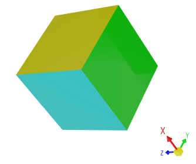

# Версия 1.3


## 1.3.62

### DataGrid, TreeList и TreeView

- DataGrid — добавлены методы `GetSourceItem` и `GetSourceItemValue`. Они позволяют получать элементы источника данных и их значения по индексам элементов источника.

- DataGrid, TreeList и TreeView — добавлена возможность предотвращать смену фокуса при щелчке правой кнопкой мыши.

    Когда пользователь щёлкает правой кнопкой мыши по строке или ячейке, фокус перемещается на эту строку/ячейку. В этой версии добавлены виртуальные методы `DataControlBase.ProcessPointerPressedOnCell` и `DataControlBase.ProcessPointerPressedOnRow`, которые можно переопределить, чтобы предотвратить смену фокуса строки при щелчке правой кнопкой мыши. Используйте следующий код для решения этой задачи:

    ``` cs
    public class CustomTreeViewControl : TreeViewControl
    {
        protected override Type StyleKeyOverride => typeof(TreeViewControl);
        protected override void ProcessPointerPressedOnCell(PointerPressedEventArgs e, int visibleRowIndex, ColumnBase? column)
        {
            var pointerProperties = e.GetCurrentPoint(this).Properties;
            if (pointerProperties.IsRightButtonPressed)
                return;
            base.ProcessPointerPressedOnCell(e, visibleRowIndex, column);
        }

        protected override void ProcessPointerPressedOnRow(PointerPressedEventArgs e, int visibleRowIndex)
        {
            var pointerProperties = e.GetCurrentPoint(this).Properties;
            if (pointerProperties.IsRightButtonPressed)
                return;
            base.ProcessPointerPressedOnRow(e, visibleRowIndex);
        }
    }
    ```

- Исправлено: DataGrid — событие `CustomColumnDisplayText` возникает для значений, показываемых на панели фильтра, когда свойство колонки `ColumnFilterMode` установлено в `DisplayText`. В этом случае событие не должно возникать.

- Исправлено: DataGrid и TreeList — событие `CustomUnboundColumnData` не возникает, когда пользователь изменяет другие ячейки строки.

- Исправлено: DataGrid и TreeList — ошибка «Layout cycle detected», когда у фиксированной колонки одновременно заданы ширина 'Auto' и настройка `MinWidth`.

- Исправлено: DataGrid и TreeList — утечка памяти при прокрутке контрола.

- Исправлено: DataGrid и TreeList — всплывающее окно с операторами фильтра может открыться в строке автофильтра, если редактор содержит недопустимое значение. 

- Исправлено: DataGrid и TreeList — некорректная ширина ячейки после обновления данных и вертикальной прокрутки.

- Исправлено: DataGrid и TreeList — фильтрация через меню фильтров колонок не работает, если контрол содержит колонку без заданного свойства `FieldName`.

- Исправлено: TreeList — если `ExpandNodesOnFiltering` установлено в `true`, контрол разворачивает узлы, когда источник инициирует изменение, не влияющее на фильтр.

### Диаграммы

- Исправлено: Stacked Area Series Views — когда метка перекрестия объединяет все серии (режим `OneForAllSeries`), визуальный порядок имён серий в метке инвертирован — он не соответствует визуальному порядку заполненных областей.

### PropertyGrid

- Исправлено: возникает исключение при выборе значения во встроенном `PopupColorEditor`.


### Интерфейс Докинга

- Исправлено: в определённых случаях возникает исключение при десериализации `DockManager` с панелью автоскрытия.

### Контрол Graphics3D

- Исправлено: выбранный элемент скрывается при отключении выбора с помощью свойства `SelectionMode`.


## 1.3.49

### DataGrid и TreeList

#### Фиксированные колонки

С помощью функции фиксированных колонок вы можете закрепить колонки в контролах DataGrid и TreeList у левого или правого края, чтобы эти колонки всегда оставались в поле зрения. Такие колонки остаются неподвижными во время горизонтальной прокрутки, тогда как остальные колонки перемещаются обычным образом.


Чтобы позволить пользователям закреплять или откреплять колонки во время работы, включите встроенное подменю _Fixed_ в меню заголовков колонок:


Связанный API:

- `ColumnBase.FixedMode`
- `DataGridControl.ShowColumnMenuFixedItem` и `TreeListControl.ShowColumnMenuFixedItem`
- `DataGridControl.ExtendScrollbarToFixedColumns` и `TreeListControl.ExtendScrollbarToFixedColumns`
- `DataGridControl.FixedColumnSeparatorWidth` и `TreeListControl.FixedColumnSeparatorWidth`

Подробнее: 

- [Data Grid — Фиксированные колонки](#фиксированные-колонки)
- [Tree List — Фиксированные колонки](#фиксированные-колонки)


#### Показ операторов условий в строке автофильтра

Строка автофильтра была улучшена для поддержки выбора операторов фильтра в отдельных ячейках во время работы. Когда эта функция активна, в каждой ячейке строки автофильтра появляется значок оператора фильтра. Пользователи могут щёлкнуть этот значок, чтобы открыть выпадающее меню и выбрать нужный оператор.


Связанный API:

- `DataGridControl.ShowConditionInAutoFilterRow`
- `TreeListControl.ShowConditionInAutoFilterRow` 
- `ColumnBase.ShowConditionInAutoFilterRow`

Подробнее:

- [Data Grid — Включение выбора операторов фильтра во время работы](../controls/datagrid/filter-and-search.md#включение-селекторов-оператора-фильтра-во-время-выполнения)
- [Tree List — Включение выбора операторов фильтра во время работы](../controls/datagrid/filter-and-search.md#включение-селекторов-оператора-фильтра-во-время-выполнения)

#### Меню фильтров колонок — режим списка с флажками

Меню фильтров колонок теперь позволяют представлять свои элементы в виде списка с флажками. В режиме списка с флажками используйте встроенные флажки для одновременного выбора нескольких значений фильтра. 


Вы можете включить режим отображения списка с флажками для всех колонок или отдельных колонок, используя следующие свойства:

- `DataGridControl.ColumnFilterPopupMode` и `TreeListControl.ColumnFilterPopupMode`
- `GridColumn.FilterPopupMode` и `TreeListColumn.FilterPopupMode`

Подробнее: 

- [Data Grid — Режим списка с флажками для фильтра](../controls/datagrid/filter-and-search.md#режимы-отображения-list-и-checked-list)
- [Tree List — Режим списка с флажками для фильтра](../controls/datagrid/filter-and-search.md#режимы-отображения-list-и-checked-list)


#### Экспорт в изображение

Контролы DataGrid и TreeList теперь включают возможность экспорта данных в форматы изображений (PNG, JPEG, SVG и WebP) с разбивкой на страницы. 


Задайте размер страницы и вызовите новый метод `ExportToImages`. Движок экспорта автоматически разбивает исходный контрол на страницы и сохраняет каждую как отдельное изображение. Метод `ExportToImages` использует тот же механизм разбивки на страницы, что и метод `ExportToPdf`.

Подробнее:

- [Data Grid — Экспорт в форматы изображений](../controls/datagrid/export.md#экспорт-в-форматы-изображений)
- [Tree List — Экспорт в форматы изображений](../controls/datagrid/export.md#экспорт-в-форматы-изображений)

#### Экспорт в CSV

Контролы DataGrid, TreeList и TreeView поддерживают экспорт данных в формат CSV. CSV — это текстовый формат, в котором значения строк разделены определённым разделителем (по умолчанию запятой). Используйте метод `ExportToCsv` для экспорта данных контрола. Параметры этого метода позволяют настраивать режим экспорта значений, символ-разделитель и другое.

- [Data Grid — Экспорт в CSV](../controls/datagrid/export.md#экспорт-в-формат-csv)
- [Tree List — Экспорт в CSV](../controls/datagrid/export.md#экспорт-в-формат-csv)

#### Буквенно-числовая сортировка

Контролы DataGrid, TreeList и TreeView теперь поддерживают буквенно-числовую сортировку в дополнение к стандартной алфавитной сортировке. Этот алгоритм полезен, когда колонки содержат смесь текста и чисел. Он упорядочивает строки в удобном для человека логическом порядке, сравнивая числа по их числовому значению.


Используйте свойство `DataControlBase.TextSortMode`, предоставляемое контролами DataGrid, TreeList и TreeView, чтобы включить буквенно-числовую сортировку. Это свойство влияет на сортировку всех колонок, отображающих текстовые значения.

Подробнее:

- [DataGrid — Сортировка](../controls/datagrid/sorting.md#буквенно-цифровая-сортировка)
- [TreeList — Сортировка](../controls/datagrid/sorting.md#буквенно-цифровая-сортировка)


### Диаграммы

#### Представления Stacked Area

Этот выпуск добавляет два новых представления в контрол CartesianChart:

- **Stacked Area View** представляет серию данных в виде окрашенного слоя. Эти слои складываются вертикально, чтобы показать абсолютные соотношения между сериями данных. В любой заданной точке высота слоя соответствует его индивидуальному значению, тогда как общая высота всего стека представляет суммарную величину всех серий.


- **Full-Stacked Area View (или 100% Stacked Area View)** также отображает серию данных в виде окрашенного слоя. Однако эти представления используются для визуализации пропорциональных соотношений. Вместо абсолютных значений высота каждого слоя представляет его процентную долю от общей суммы в данной точке. Верхняя линия всегда обозначает `100%`.


Подробнее:

- [Stacked Area Series View](../controls/charts/cartesian-series-views/stacked-area-series-view.md)
- [Full-Stacked Area Series View](../controls/charts/cartesian-series-views/full-stacked-area-series-view.md)


#### Обмен осей X и Y

Новое свойство `CartesianChart.SwapAxes` позволяет транспонировать оси _X_ и _Y_. Установите его в `true`, чтобы отображать оси _X_ вертикально, а оси _Y_ — горизонтально.


Подробнее:

- [Обмен осей X и Y](../controls/charts/cartesian-chart.md#взаимная-замена-осей-x-и-y)

#### Инвертирование направления оси

Контрол CartesianChart теперь включает свойство `Axis.Reverse` для изменения направления любой оси. Когда оно установлено в `true`, порядок значений оси инвертируется:

- Ось _X_ будет отображать значения справа налево вместо стандартного направления слева направо.
- Ось _Y_ будет отображать значения сверху вниз вместо стандартного направления снизу вверх.


Подробнее:

- [Инвертирование направления оси](../controls/charts/cartesian-chart.md#инвертирование-направления-оси)


#### Пустые точки

CartesianChart и PolarChart теперь поддерживают пустые точки (точки данных с неопределёнными значениями). Контролы диаграмм оставляют видимые разрывы в сериях, когда встречают пустые точки.


Чтобы задать пустую точку, установите значение точки данных в _double.NaN_, _double.PositiveInfinity_ или _double.NegativeInfinity_. 

Подробнее:

- [Пустые точки (разрывы)](../controls/charts/cartesian-chart.md#пустые-точки-разрывы)

### Graphics3DControl

#### Новый API

Новый метод `LookCameraAtScene` позволяет позиционировать и ориентировать камеру так, чтобы она смотрела на центр 3D-сцены с заданного направления.

<code>LookCameraAtScene(Vector3 cameraViewDirection, Vector3 upDirection)</code>


<!-- TODO
check:
from a specific angle???

добавил метод Graphics3DControl.LookCameraAtScene(Vector3 cameraPosition, Vector3 upDirection) - вектора это просто направления, тоесть 1,0,0 тоесть тоже самое что 100,0,0

cameraPosition - это точка?
 -->

#### Отображение имён осей в гизмо

Гизмо контрола Graphics3DControl теперь отображает имена осей _X_, _Y_ и _Z_.



Для отрисовки имён осей в `Gizmo` добавляются три модели, представляющие буквы «X», «Y» и «Z».
Новые свойства `Gizmo.Models` и `Gizmo.ModelsSource` позволяют задавать 3D-модели для отрисовки гизмо произвольным образом. Эти свойства заменяют старое свойство `Gizmo.Model`, которое теперь устарело. 

#### Критическое изменение — для отрисовки Graphics3DControl теперь требуется визуальная тема

Начиная с версии 1.3, классы `Graphics3DControl` и `Gizmo` наследуются от `Graphics3DControlBase`, который является потомком класса `TemplatedControl`. 
Общие настройки внешнего вида этих контролов теперь задаются визуальной темой `Controls3D`. Чтобы обеспечить корректную отрисовку `Graphics3DControl`, вы должны зарегистрировать эту тему в файле _App.xaml_:

``` xml
<!-- App.xaml file -->
<Application ...
    xmlns:theme3D="clr-namespace:Eremex.AvaloniaUI.Themes.Controls3D;assembly=Eremex.Avalonia.Controls3D"
             >
    <Application.Styles>
        ...
        <theme3D:Controls3DTheme />
    </Application.Styles>
</Application>
```

Если визуальная тема `Controls3D` не зарегистрирована, `Graphics3DControl` будет отображаться пустым.

### Докинг

Теперь вы можете применять ограничения на изменение размера к элементам докинга, используя их свойства `MinWidth`, `MinHeight`, `MaxWidth` и `MaxHeight`.

### SplitContainerControl — ограничения размера панелей

Новые свойства `Panel1MinLength`, `Panel1MaxLength`, `Panel2MinLength` и `Panel2MaxLength` позволяют задавать ограничения на изменение размера панелей в `SplitContainerControl`. Пользователи не могут изменять размер панелей за пределами этих лимитов. 

### MxWindow

Новые свойства `Header` и `HeaderTemplate` позволяют отображать пользовательское содержимое в заголовке окна.

### Исправленные проблемы

- Панели инструментов и меню — связанный с элементом панели выпадающий список не может быть отображён, если он ранее был открыт из меню переполнения панели.
- Докинг — заголовок элемента автоскрытия остаётся видимым, когда элемент скрыт.
- Докинг — высота области заголовков панели вкладок вычисляется неправильно при большом количестве вкладок.

### Критические изменения

- Graphics3DControl — свойство `Gizmo.Model` объявлено устаревшим. Используйте вместо него новые свойства `Gizmo.Models` и `Gizmo.ModelsSource`.
- Редакторы — свойство `IsClearTextButtonVisible` переименовано в `IsNullValueButtonVisible`.
- Редакторы — команда `ClearTextCommand` переименована в `SetNullValueCommand` и перенесена из класса `PopupEditor` в класс `ButtonEditor`.


<br>
<br>

<sup>*</sup> Эта страница переведена с использованием технологий машинного перевода.
