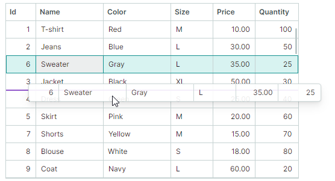
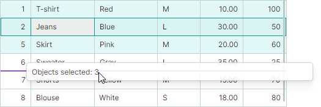
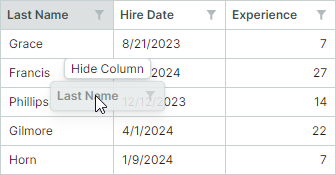
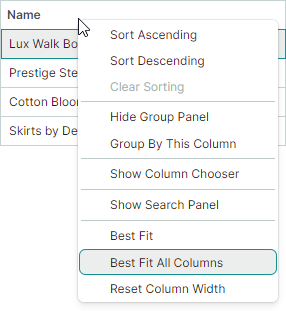

# Версия 1.4

## 1.4.34

### Поддержка Avalonia 12

Этот выпуск обеспечивает полную поддержку Avalonia 12 в библиотеке Eremex Controls. Avalonia 12 приносит существенные улучшения в производительности, стабильности и надёжности платформы. Это обновление гарантирует, что набор контролов Eremex плавно интегрируется с изменениями, внесёнными в новой версии фреймворка Avalonia.

Подробности о критических изменениях в Avalonia 12 смотрите здесь:
[https://docs.avaloniaui.net/docs/avalonia12-breaking-changes](https://docs.avaloniaui.net/docs/avalonia12-breaking-changes).

### DataGrid и TreeList

#### Улучшения перетаскивания строк

##### Превью строк

DataGrid и TreeList теперь показывают превью строк во время [операций перетаскивания](../controls/datagrid/row-drag-and-drop.md), давая визуальную обратную связь при переупорядочивании или перемещении данных.

При перетаскивании нескольких строк превью показывает число перетаскиваемых объектов.

##### Маркеры перетаскивания строк

В этой версии добавлен новый режим перетаскивания, в котором для перетаскивания строк используются специальные маркеры (Drag Handles). Маркеры перетаскивания отображаются в области индикатора строки слева от строк.

Маркеры перетаскивания упрощают активацию редактора ячейки при включённой функции перетаскивания. Ранее пользователи инициировали перетаскивание строк, щёлкая и перетаскивая любую ячейку строки. Однако такое поведение противоречит требованию (высказанному многими) активировать редактор ячейки при нажатии мышью внутри ячейки. Новый режим на основе маркеров перетаскивания решает эту проблему:

- Одиночный щелчок по ячейке по умолчанию активирует редактор ячейки.
- Для перетаскивания строк используйте специальные маркеры перетаскивания.

###### Связанный API

- `DataGridControl.RowDragMode`
- `DataGridControl.RowIndicatorWidth`
- `TreeListControl.RowDragMode`
- `TreeListControl.RowIndicatorWidth`

##### Критическое изменение — перетаскивание строк между приложениями

Начиная с версии 1.4, чтобы разрешить перетаскивание строк между приложениями, включите новое свойство `UsePlatformRowDragDrop` для контрола, в котором начинаются операции перетаскивания. Обратите внимание, что превью строк не отображаются во время перетаскивания строк на уровне платформы.

Версии до v1.4 не требуют никаких дополнительных параметров для включения перетаскивания строк между приложениями.

##### Документация

- [Data Grid — Перетаскивание строк](../controls/datagrid/row-drag-and-drop.md)
- [Tree List — Перетаскивание узлов](../controls/treelist/node-drag-and-drop.md)

#### Визуальные улучшения перетаскивания заголовков колонок

Чтобы скрыть колонку, пользователь может перетащить её заголовок на небольшое расстояние от панели заголовков и отпустить там. Чтобы дать чёткую визуальную подсказку об этом действии, над перетаскиваемым заголовком колонки теперь отображается подсказка «Hide Column».

Кроме того, во время операции перетаскивания превью заголовка колонки теперь выглядит полупрозрачным с эффектом тени.

#### Best-Fit 

Контролы DataGrid и TreeList теперь поддерживают функцию Best Fit. Эта функция позволяет пользователям автоматически изменять ширину колонок до их идеальной минимальной ширины, чтобы полностью показать содержимое ячеек.

Чтобы применить Best Fit, пользователи могут дважды щёлкнуть правый край заголовка колонки или выбрать команду «Best Fit» в контекстном меню колонки. Пользователи также могут применить Best Fit сразу ко всем колонкам, чтобы всё содержимое оставалось полностью видимым.

Контролы включают свойства `BestFitMode`, которые задают, какие значения строк измеряются во время операций Best Fit:

- Режим `Fast` — измеряет ширину уникальных значений строк. Это улучшает производительность Best Fit в большинстве стандартных сценариев.

- Режим `Full` — измеряет ширину всех значений строк, включая дубликаты. Этот режим медленнее, чем Fast, но правильно вычисляет ширину колонок, когда используются шаблоны ячеек или ошибки валидации.

##### Связанный API

- `DataGridControl.AllowBestFit`
- `DataGridControl.BestFitMode`
- `DataGridControl.BestFitMode`
- `DataGridControl.BestFit`
- `DataGridControl.BestFitAllColumns`
- `GridColumn.AllowBestFit`
- `GridColumn.BestFitMode`
- `GridColumn.BestFitMode`
- `TreeListControl.AllowBestFit`
- `TreeListControl.BestFitMode`
- `TreeListControl.BestFitMode`
- `TreeListControl.BestFit`
- `TreeListControl.BestFitAllColumns`
- `TreeListColumn.AllowBestFit`
- `TreeListColumn.BestFitMode`
- `TreeListColumn.BestFitMode`

##### Документация

- [Data Grid — Best Fit](#best-fit)
- [Tree List — Best Fit](#best-fit)

#### Сброс пользовательских изменений ширины колонки

После того как пользователь изменит ширину колонок (перетаскиванием или с помощью Best Fit), в контекстных меню колонок появляется команда _Reset Column Width_. Эта команда сбрасывает сделанные пользователями изменения ширины колонок, восстанавливая исходную ширину, применённую к колонкам в XAML или code-behind до пользовательских изменений.

##### Связанный API

- `DataGridControl.AllowResetColumnWidth`
- `DataGridControl.ResetColumnWidth`
- `TreeListControl.AllowResetColumnWidth`
- `TreeListControl.ResetColumnWidth`

#### Исправленные проблемы

- TreeList — возникает `StackOverflowException` при фильтрации данных, если `ExpandNodesOnFiltering` равно `true`.
- TreeList — активный редактор в строке автофильтра закрывается при изменении коллекции узлов.
- DataGrid и TreeList — сочетание клавиш `Cmd+A` не работает на Mac.

### Cartesian Chart — улучшения перекрестия (Crosshair)

Контрол Cartesian Chart расширяет свой публичный API, чтобы дать вам более точный контроль над поведением и внешним видом меток перекрестия. 

#### Новый режим отображения меток перекрестия

Свойство `CrosshairOptions.SeriesLabelMode` задаёт, объединяются ли несколько меток перекрестия и как именно. Значение этого свойства по умолчанию теперь `Smart`:

- Режим `Smart` — каждая серия отображает собственную метку перекрестия. Когда метки перекрываются, они объединяются в одну метку.
  
  

#### Сортировка серий в перекрестии

Когда несколько серий объединены в одну метку перекрестия, вы можете использовать новое свойство `CrosshairOptions.SeriesLabelItemSortMode`, чтобы задать порядок отображения серий в метке:

- Порядок `By Series` — сортирует серии по порядку, в котором эти серии добавлены в коллекцию `CartesianChart.Series`.

    

- Порядок `By Value` — сортирует серии по их значениям _Y_.

    

#### Включать только серии рядом с курсором

Следующее свойство позволяет показывать метки перекрестия только для точек данных вблизи курсора.

- `CrosshairOptions.MaxPickDistance` — задаёт диапазон, в пределах которого выполняется поиск точек данных для включения в метки перекрестия.

    

#### Задержка показа перекрестия

- `CrosshairOptions.SeriesLabelShowDelay` — задаёт задержку (в миллисекундах) перед отображением метки серии перекрестия.

#### API показа и скрытия перекрестия

- `ShowCrosshair(Point position)`
- `HideCrosshair()`

#### Обновлённый шаблон перекрестия

Шаблон перекрестия контрола диаграммы был переработан для оптимизации структуры, поддержки новой функции сортировки серий и достижения единообразного внешнего вида в различных сценариях.

Изменения шаблона включают:

- Класс `CrosshairAllSeriesLabelControlData` теперь содержит коллекцию `ObservableCollection<CrosshairSeriesLabelItem> SeriesItems` вместо коллекции `CrosshairAllSeriesLabelGroup`.
- Класс `CrosshairAllSeriesLabelGroup` был удалён.
- Класс `CrosshairAllSeriesLabelSeriesItem` был переименован в `CrosshairSeriesLabelItem`. Этот класс содержит информацию об аргументе серии и префиксе аргумента.
- Класс `CrosshairAllSeriesLabelSeriesValueItem` был переименован в `CrosshairSeriesLabelSeriesValueItem`.
- Класс `CrosshairSingleSeriesLabelControlData` больше не наследуется от `CrosshairAllSeriesLabelSeriesValueItem`. `CrosshairSingleSeriesLabelControlData` теперь предоставляет свойство `SeriesItem` типа `CrosshairSeriesLabelItem`.

#### Документация

- [Перекрестие (Crosshair)](../controls/charts/crosshair.md)

### Интерфейс Докинга

#### Исправленные проблемы

- В некоторых случаях возникает исключение при закреплении плавающей панели.
- Элемент докинга не активируется, когда отображается меню с включённым свойством `OverlayDismissEventPassThrough`.

### Критические изменения

- Зависимость от пакета `CommunityToolkit.Mvvm` была удалена. Если вашему проекту требуется этот пакет, добавьте ссылку на `CommunityToolkit.Mvvm` явно.
- `DataControlCommands`, `DataGridControlCommands`, `TreeListCommands` и команды редакторов теперь содержат `ICommand` вместо `IRelayCommand` из CommunityToolkit.

 
 

* Эта страница переведена с использованием технологий машинного перевода.
