# Cartesian Chart


`CartesianChart` 控件允许您使用笛卡尔坐标系创建图表。 

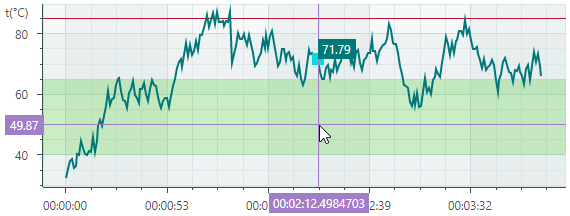

该控件的主要功能特性包括：
 
- 数据系列数量不受限制
- 支持的图表类型（视图）：Line、Scatter Line、Point（支持 SVG 标记）、Area、Step Line、Bar、Candlestick 等。
- 支持多坐标轴
- 交换 X 轴和 Y 轴
- 反转坐标轴
- 多种坐标轴类型：数值（Numeric）、日期时间（Date-Time）、时间跨度（Time Span）、定性（Qualitative）和对数（Logarithmic）
- 同时滚动和缩放所有坐标轴
- 滚动和缩放单个坐标轴
- [十字准线（Crosshair）](crosshair.md)
- 显示大量数据时的高性能表现
- 实时数据可视化
- 条带（Strips）和常量线（constant lines）
- 空点（间隙）
- 使用 MVVM 设计模式来提供数据并自定义图表选项
- 显示快速变化的实时数据。使用专用的数据适配器实现可移动的视口（moving viewport）


## 入门指南

- [图表入门](get-started-with-charts.md)
- [图表入门 — MVVM 模式](get-started-with-charts-mvvm.md)

## 图表控件的元素

图表控件的主要元素是系列（series）和坐标轴（axes）。 

**系列（Series）** — 提供数据并指定如何可视化这些数据。您可以在同一个图表控件中绘制任意数量的系列。有关更多信息，请参阅 [系列](#系列)。

**坐标轴（Axes）** — 典型的笛卡尔图表会显示两条坐标轴：X 轴和 Y 轴。当图表绘制两个或更多系列时，您还可以为其添加额外的坐标轴。每个系列都可以关联自己的坐标轴。请参阅 [坐标轴](#坐标轴)。


## 系列 

系列为图表控件提供要绘制的数据，并指定系列视图（这些数据的可视化呈现方式）。

`CartesianSeries` 类封装了 `CartesianChart` 控件的一个系列。要将系列添加到图表中，请使用 `CartesianChart.Series` 集合。您也可以使用 MVVM 设计模式为图表填充系列，为此请使用 `CartesianChart.SeriesSource` 和 `CartesianChart.SeriesTemplate` 属性。有关更多信息，请参阅以下链接：[图表入门 — MVVM 模式](get-started-with-charts-mvvm.md)。


以下代码在 `CartesianChart.Series` 集合中定义了一个系列。

``` xml
<mxc:CartesianChart>
    <mxc:CartesianChart.Series>
        <mxc:CartesianSeries DataAdapter="{Binding Series.DataAdapter}">
            <mxc:CartesianLineSeriesView Color="{Binding Series.Color}" Thickness="2" />
        </mxc:CartesianSeries>
    </mxc:CartesianChart.Series>
    <!-- ... -->
</mxc:CartesianChart>
```


### 系列数据

您可以使用 _数据适配器（Data Adapters）_ 为图表控件的系列提供数据。 

``` xml
<mxc:CartesianSeries DataAdapter="{Binding Series.DataAdapter}">
    <!-- ... -->
</mxc:CartesianSeries>
```

数据适配器是一个实现了 `ISeriesDataAdapter` 接口的对象。通常您不需要手动实现该接口。Eremex Charts 附带多种针对不同数据类型（数值、日期时间和定性）的数据适配器。请根据您的需求选择数据适配器。 

下面按照 _X_ 值的类型对数据适配器进行了分组：

数值型 _X_ 值：

- `SortedNumericDataAdapter`
- `FormulaDataAdapter`
- `ScatterDataAdapter`
- `NumericRangeDataAdapter`

日期和时间型 _X_ 值：

- `SortedDateTimeDataAdapter`
- `DateTimeRangeDataAdapter`
- `SortedTimeSpanDataAdapter`
- `TimeSpanRangeDataAdapter`
- `CandlestickDataAdapter`（用于 [Candlestick Series View](cartesian-series-views/candlestick-series-view.md)）
- `SummaryCandlestickDataAdapter`（用于 [Candlestick Series View](cartesian-series-views/candlestick-series-view.md)）

定性型 _X_ 值：

- `QualitativeDataAdapter`
- `QualitativeRangeDataAdapter` 


#### 空点（间隙）

CartesianChart 支持空点。这些是值未定义的数据点。当图表控件遇到空点时，会在系列中留下可见的间隙。

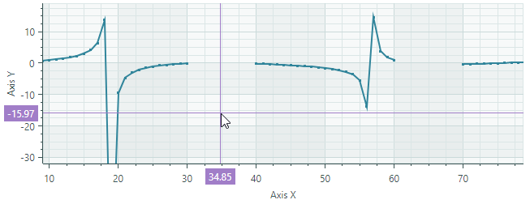

要指定一个空数据点，请将该数据点的值设置为 _double.NaN_、_double.PositiveInfinity_ 或 _double.NegativeInfinity_。

<!-- TODO

Example - simple data adapter with empty points
-->


<!-- TODO

Describe these Data Adapters in more detail
 -->

<!-- TODO
The following example implements a Data Adapter 


The following example implements a Data Adapter 
(numeric data adapter)


``` cs
public partial class CartesianStripsAndConstantLinesViewModel : ChartsPageViewModel
{
    [ObservableProperty] SeriesViewModel series = new() { Color = Color.FromArgb(255, 0, 120, 122), DataAdapter = CreateAdapter() };
    [ObservableProperty] ObservableCollection<ConstantLineViewModel> constantLines = new();
    
    static ISeriesDataAdapter CreateAdapter()
    {
        const int pointsCount = 250;
        
        var random = new Random(0);
        var arguments = new List<TimeSpan>(pointsCount);
        var values = new List<double>(pointsCount);
        double startTemperature = 30;
        for (int i = 0; i < pointsCount; i++) {
            arguments.Add(TimeSpan.FromSeconds(i));
            double temperature = startTemperature + (random.NextDouble() - 0.5) * 10;
            if (temperature > 90)
                temperature -= 20;
            if (temperature < 20)
                temperature += 10;
            values.Add(temperature);
            startTemperature = temperature;
        }
        
        return new SortedTimeSpanDataAdapter(arguments, values);
    }
}
```

 -->

### 系列可见性

使用 `Series.Visible` 属性来隐藏系列。

``` cs
chart1.Series[0].Visible = !chart1.Series[0].Visible;
```

### 系列视图 
`CartesianChart` 支持多种系列视图（图表类型）：

<style>

th {
    visibility: collapse;
}
td, th, tr {
   border: none!important;
   vertical-align: top;
}
</style>

| <div style="width:400px"></div> | <div style="width:400px"></div> | 
| --- | --- |
| [Line Series View](cartesian-series-views/line-series-vew.md)（`CartesianLineSeriesView` 对象）<br>绘制以线段连接的点。<br>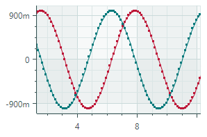 | [Scatter Line Series View](cartesian-series-views/scatter-line-series-view.md)（`CartesianScatterLineSeriesView` 对象）<br>按照数据系列中出现的顺序连接点。<br> |
| [Point Series View](cartesian-series-views/point-series-view.md)（`CartesianPointSeriesView` 对象）<br>绘制单独的点。<br> | [Area Series View](cartesian-series-views/area-series-view.md)（`CartesianAreaSeriesView` 对象）<br>以线段连接点并绘制填充区域。<br> | 
| [Step Line Series View](cartesian-series-views/step-line-series-view.md)（`CartesianStepLineSeriesView` 对象）<br>使用水平和垂直线段连接点。<br>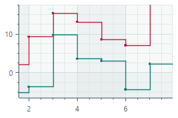 | [Step Area Series View](cartesian-series-views/step-area-series-view.md)（`CartesianStepAreaSeriesView` 对象）<br>使用水平和垂直线段连接点，并绘制填充区域。<br>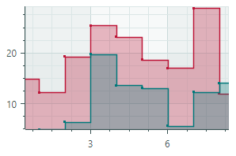 |
| [Range Area Series View](cartesian-series-views/range-area-series-view.md)（`CartesianRangeAreaSeriesView` 对象）<br>填充数据系列两个 Y 值之间的区域。<br>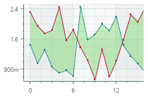 | [Stacked Area Series View](cartesian-series-views/stacked-area-series-view.md)（`CartesianStackedAreaSeriesView` 对象）<br>这些视图将填充区域相互堆叠绘制，以展示数据系列之间的绝对关系。 <br>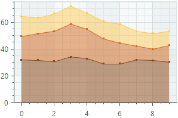 |
| [Full-Stacked Area Series View](cartesian-series-views/full-stacked-area-series-view.md)（`CartesianFullStackedAreaSeriesView` 对象）<br>这些视图将填充区域相互堆叠绘制，以展示数据系列之间的比例关系。<br>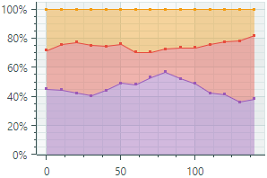 | [Bar Series View](cartesian-series-views/side-by-side-bar-series-view.md)（`CartesianSideBySideBarSeriesView` 对象）<br>以一组矩形柱形来可视化数据。<br> |
| [Range Bar Series View](cartesian-series-views/side-by-side-range-bar-series-view.md)（`CartesianSideBySideRangeBarSeriesView` 对象）<br>在数据系列的两个 Y 值之间绘制矩形柱形。<br> | [Candlestick Series View](cartesian-series-views/candlestick-series-view.md)<br>（`CartesianCandlestickSeriesView` 对象）<br>一种描述资产价格波动的金融图表。对于每个数据点，图表会显示四个数值：开盘价（Open）、收盘价（Close）、最高价（High）和最低价（Low）。 <br>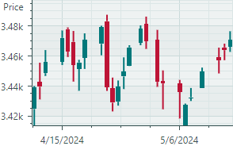 |
| [Lollipop Series View](cartesian-series-views/lollipop-series-view.md)（`CartesianLollipopSeriesView` 对象）<br>以点（标记）的形式呈现数据，并通过细线将其与水平或垂直坐标轴相连。<br> |  |

要为某个系列指定视图，请将相应的 **...SeriesView** 对象定义为 `CartesianSeries` 对象的内容。在代码隐藏文件中，使用 `CartesianSeries.View` 属性来指定系列视图。 

以下示例为一个系列分配了 “Line Series View”。
``` xml
<mxc:CartesianSeries DataAdapter="{Binding Series.DataAdapter}">
    <mxc:CartesianLineSeriesView Color="{Binding Series.Color}" Thickness="2" />
</mxc:CartesianSeries>
```


## 坐标轴

如果您没有手动定义坐标轴，`CartesianChart` 控件会自动创建笛卡尔坐标轴（X 轴和 Y 轴）。如果您需要在 XAML 中自定义坐标轴，请在 `CartesianChart.AxesX`/`CartesianChart.AxesY` 集合中定义 `AxisX` 和/或 `AxisY` 对象，然后修改这些坐标轴的设置。

``` xml
<mxc:CartesianChart>
    <!-- ... -->

    <mxc:CartesianChart.AxesX>
        <mxc:AxisX ShowTitle="False">
        </mxc:AxisX>
    </mxc:CartesianChart.AxesX>

    <mxc:CartesianChart.AxesY>
        <mxc:AxisY Title="t(°C)" TitlePosition="WithLabels">
            <mxc:AxisYRange AlwaysShowZeroLevel="False" />
        </mxc:AxisY>
    </mxc:CartesianChart.AxesY>
</mxc:CartesianChart>
```

### 交换 X 轴和 Y 轴

在 Cartesian Chart 控件中，坐标轴的默认方向为：_X_ 轴水平放置，_Y_ 轴垂直放置。使用 `CartesianChart.SwapAxes` 属性可以转置坐标轴。该属性对所有系列视图类型均受支持。

下图展示了 `SwapAxes` 属性如何改变线形图和柱状图中坐标轴的布局。


### 反转坐标轴方向

使用 `Axis.Reverse` 属性来反转 _X_ 轴和 _Y_ 轴的方向。

- `false`（默认）— 对于 _X_ 轴，值从左到右递增；对于 _Y_ 轴，值从下到上递增。
- `true` — 对于 _X_ 轴，值从右到左递增；对于 _Y_ 轴，值从上到下递增。


``` xml
<mxc:CartesianChart.AxesY>
    <mxc:AxisY Title="Axis Y" Reverse="True"/>
</mxc:CartesianChart.AxesY>
```

### 坐标轴取值范围

将 `AxisXRange`/`AxisYRange` 对象作为 `AxisX`/`AxisY` 对象的内容放置，以指定坐标轴的范围设置。`AxisXRange`/`AxisYRange` 对象允许您自定义总体取值范围、可见取值范围、零刻度线的可见性等。

``` xml
<mxc:CartesianChart.AxesX>
    <mxc:AxisX ShowTitle="False" >
        <mxc:AxisXRange MinSideMargin="0.15" MaxSideMargin="0.15"/>
    </mxc:AxisX>
</mxc:CartesianChart.AxesX>
<mxc:CartesianChart.AxesY>
    <mxc:AxisY Title="Amplitude (dB SPL)">
        <mxc:AxisYRange AlwaysShowZeroLevel="False" />
    </mxc:AxisY>
</mxc:CartesianChart.AxesY>
```

- `AutoCorrectWholeRange`（默认值为 `true`）— 获取或设置是否根据系列数据自动计算坐标轴的总体范围。

  要设置自定义的坐标轴总体范围，请禁用 `AutoCorrectWholeRange` 选项，然后使用 `WholeMin` 和 `WholeMax` 属性。

- `SynchronizeVisualRange` — 获取或设置当坐标轴总体范围发生变化时，是否将可见范围设置为该总体范围。
- `AlwaysShowZeroLevel`（仅适用于 `AxisYRange` 对象）（默认值为 `true`）— 获取或设置是否自动调整坐标轴的总体范围以包含零刻度线。请参阅 `WholeMax`。

- `WholeMax` — 获取或设置坐标轴总体范围的最大值。`WholeMin` 属性指定最小值。
    
    禁用 `AutoCorrectWholeRange` 属性以使用 `WholeMin` 和 `WholeMax` 属性。 
    
    如果启用了 `AlwaysShowZeroLevel` 选项（默认行为），零刻度线将被强制包含在坐标轴的总体范围内。

    #### 示例 — 显示和隐藏零刻度线

    考虑以下示例，其中 `WholeMin` 和 `WholeMax` 属性为坐标轴的总体范围定义了自定义边界。由于 `AlwaysShowZeroLevel` 属性已启用，该范围会自动包含零刻度线。

    ``` xml
    <mxc:CartesianChart.AxesY>
        <mxc:AxisY ShowTitle="False">
            <mxc:AxisYRange WholeMin="100" WholeMax="350" AutoCorrectWholeRange="False" AlwaysShowZeroLevel="True" />
        </mxc:AxisY>
    </mxc:CartesianChart.AxesY>
    ```
    


    禁用 `AlwaysShowZeroLevel` 属性，可将坐标轴总体范围限制为 `WholeMin` 和 `WholeMax` 属性指定的值，而忽略零刻度线。

    ``` xml
    <mxc:AxisYRange WholeMin="100" WholeMax="350" AutoCorrectWholeRange="False" AlwaysShowZeroLevel="False" />
    ```

    
    

- `WholeMin` — 获取或设置坐标轴总体范围的最小值。更多信息请参阅 `WholeMax`。
- `VisualMax` — 获取或设置当前可见坐标轴范围的最大值。`VisualMin` 属性指定最小值。
- `VisualMin` — 获取或设置当前可见坐标轴范围的最小值。

- `MaxSideMargin` — 获取或设置最右侧（或最上方）数据点与图表区域边缘之间的空白空间量，以总体数据范围的比例表示。例如，值为 0.1 表示添加相当于范围 10% 的边距。
    
    对于 _Y_ 轴，当 `AlwaysShowZeroLevel` 属性为 `true` 且零刻度线显示在最上方边缘时，`MaxSideMargin` 属性不生效。将 `AlwaysShowZeroLevel` 属性设置为 `false` 可解决该问题。

- `MinSideMargin` — 获取或设置最左侧（或最下方）数据点与图表区域边缘之间的空白空间量，以总体数据范围的比例表示。例如，值为 0.1 表示添加相当于范围 10% 的边距。

    对于 _Y_ 轴，当 `AlwaysShowZeroLevel` 属性为 `true` 且零刻度线显示在最下方边缘时，`MinSideMargin` 属性不生效。将 `AlwaysShowZeroLevel` 属性设置为 `false` 可解决该问题。

  

<!-- TODO
AlwaysShowZeroLevel - when to always show
SideMargin - wrong names
SideMargin - percentage, where 0 means no margin, 0.1 means 10% of the total range?

 -->

### 坐标轴比例尺

坐标轴比例尺定义了刻度单位的类型以及各种坐标轴显示选项。下图展示了几种比例尺类型：


要为坐标轴指定比例尺设置，请使用 `AxisX.ScaleOptions` 和 `AxisY.ScaleOptions` 属性。

#### 自定义 _X_ 轴的比例尺设置

使用 `AxisX.ScaleOptions` 属性更改 _X_ 轴的比例尺设置。 
该属性的基类型为 `ScaleOptions`。 

要修改比例尺设置，请根据系列 _X_ 值的类型，将 `AxisX.ScaleOptions` 属性设置为以下对象之一： 

- `NumericScaleOptions` — 数值型数据比例尺。如果系列提供的 _X_ 值是数值，请使用此比例尺类型。
    ``` xml
    <mxc:AxisX Title="Frequency">
        <mxc:AxisX.ScaleOptions>
            <mxc:NumericScaleOptions 
                LogarithmicBase="{Binding AxisX.LogarithmicBase}"
                LabelFormatter="{Binding FrequencyFormatter}" />
        </mxc:AxisX.ScaleOptions>
    </mxc:AxisX>
    ```

<!-- TODO
Describe members of the NumericScaleOptions and other classes, such as 
GridSpacing, LabelFormatter
etc
  -->

- `DateTimeScaleOptions` — DateTime 数据比例尺。如果系列提供的 _X_ 值是 `DateTime` 值，请使用此比例尺类型。`DateTimeScaleOptions.MeasureUnit` 属性允许您为坐标轴比例尺指定时间单位（轴单位）：`Millisecond`、`Second`、`Minute`、`Hour`、`Day`、`Week`、`Month`、`Quarter` 或 `Year`

    ``` xml
    <mxc:AxisX ShowTitle="False">
        <mxc:AxisX.ScaleOptions>
            <mxc:DateTimeScaleOptions MeasureUnit="Day" />
        </mxc:AxisX.ScaleOptions>
    </mxc:AxisX>
    ```

- `TimeSpanScaleOptions` — TimeSpan 数据比例尺。如果系列提供的 _X_ 值是 `TimeSpan` 值，请使用此比例尺类型。`TimeSpanScaleOptions.MeasureUnit` 属性允许您为坐标轴比例尺指定时间单位：`Millisecond`、`Second`、`Minute`、`Hour` 或 `Day`。

    ``` xml
    <mxc:AxisX>
        <mxc:AxisX.ScaleOptions>
            <mxc:TimeSpanScaleOptions MeasureUnit="Minute" />
        </mxc:AxisX.ScaleOptions>
    </mxc:AxisX>
    ```

- `QualitativeScaleOptions` — 定性数据比例尺。如果系列提供的 _X_ 值是定性值（文本字符串），请使用此比例尺类型。

    ``` xml
    <mxc:AxisX >
        <mxc:AxisX.ScaleOptions>
            <mxc:QualitativeScaleOptions GridSpacing="1" />
        </mxc:AxisX.ScaleOptions>
    </mxc:AxisX>
    ```

#### 自定义 _Y_ 轴的比例尺设置

使用 `AxisY.ScaleOptions` 属性修改 _Y_ 轴的比例尺设置。该属性的类型为 `NumericScaleOptions`。

``` xml
<mxc:AxisY Title="Amplitude (dB SPL)">
    <mxc:AxisY.ScaleOptions>
        <mxc:NumericScaleOptions LabelFormatter="{Binding MyCustomLabelFormatter}"/>
    </mxc:AxisY.ScaleOptions>
</mxc:AxisY>
```

#### 格式化坐标轴标签

`ScaleOptions.LabelFormatter` 属性允许您指定一个对象，以自定义方式格式化坐标轴的显示值。您可以使用 `Eremex.AvaloniaUI.Charts.FuncLabelFormatter` 对象，基于函数/表达式实现自定义的标签格式化器。

以下示例为 `DateTime` 值实现了一个自定义标签格式化器。


``` xml
<mxc:AxisX Name="salesAxis" Title="Sales">
    <mxc:AxisX.ScaleOptions>
        <mxc:DateTimeScaleOptions MeasureUnit="Month" LabelFormatter="{Binding MonthFormatter}" />
    </mxc:AxisX.ScaleOptions>
</mxc:AxisX>
```

``` cs
public partial class MainWindowViewModel : ViewModelBase
{
    // ...
    [ObservableProperty] FuncLabelFormatter monthFormatter = new(o => String.Format("{0:MMM} {0:yy}", o));
}
```

另请参阅：[格式化 Crosshair 系列标签中的值](crosshair.md#格式化-crosshair-系列标签中的值)

### 多坐标轴

典型的笛卡尔图表拥有一条 _X_ 轴和一条 _Y_ 轴。您可以根据需要添加任意数量的额外 _X_ 轴和 _Y_ 轴。当您显示多个系列，并希望为每个系列显示各自的 _X_ 轴和/或 _Y_ 轴时，这一功能非常有用。


请执行以下操作，将系列与坐标轴关联起来：

- 将坐标轴的 `Axis.Key` 属性设置为一个唯一 ID（字符串）。
- 将系列的 `AxisXKey`/`AxisYKey` 属性设置为 `Axis.Key` 属性的值。

 以下示例添加了一条 _X_ 轴，并将其绑定到 _lineSeries_ 系列。


``` xml
<mxc:CartesianSeries Name="lineSeries" DataAdapter="{Binding LineSeries.DataAdapter}"  
  AxisXKey="lineSeriesAxis">
    <mxc:CartesianLineSeriesView Color="{Binding LineSeries.Color}" />
</mxc:CartesianSeries>

<mxc:CartesianChart.AxesX>
    <!-- ... -->
    <mxc:AxisX Position="Far" Title="Expenses"
       Key="lineSeriesAxis">
        <mxc:AxisX.ScaleOptions>
            <mxc:NumericScaleOptions />
        </mxc:AxisX.ScaleOptions>
    </mxc:AxisX>
</mxc:CartesianChart.AxesX>
```

### 滚动和缩放

用户可以使用鼠标缩放和滚动整个视图以及单个坐标轴。他们也可以缩放到特定的矩形区域或取值范围。

#### 同时滚动和缩放所有坐标轴 

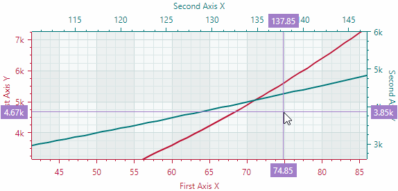

#### 滚动和缩放单个坐标轴


#### 缩放到特定区域和坐标轴取值范围


有关更多信息，请参阅以下主题：[在图表控件中滚动和缩放](scroll-and-zoom-in-a-chart-control.md)


### 坐标轴设置

以下列表汇总了笛卡尔坐标轴的显示和行为设置：

- `ConstantLines` 和 `ConstantLinesSource` — 允许您为特定值绘制常量线。请参阅 [常量线和条带](#常量线和条带)。
- `EnableScrolling` — 允许用户通过鼠标拖动操作滚动坐标轴。
- `EnableZooming` — 允许用户缩放坐标轴。
- `InterlacingColor` — 用于绘制交错条带线的颜色（当启用 `ShowInterlacing` 选项时）。
- `MinorCount` — 指定次要刻度线和网格线的数量。
- `Position` — 指定坐标轴的位置。可用选项包括：`Near`（X 轴显示在底部，Y 轴显示在图表左边缘）和 `Far`（X 轴显示在顶部，Y 轴显示在图表右边缘）。
- `ShowAxisLine` — 指定坐标轴线的可见性。
- `ShowInterlacing` — 指定是否在主要网格线之间绘制交错条带线。
- `ShowLabels` — 指定与主要刻度线对应的标签的可见性。
- `ShowMajorGridlines` — 指定与主要刻度线对应的网格线的可见性。
- `ShowMajorTickmarks` — 指定主要刻度线的可见性。
- `ShowMinorGridlines` — 指定与次要刻度线对应的网格线的可见性。
- `ShowMinorTickmarks` — 指定次要刻度线的可见性。
- `ShowTitle` — 指定坐标轴标题（`Title` 属性）的可见性。
- `Strips` 和 `StripsSource` — 允许您填充特定值之间的范围。请参阅 [常量线和条带](#常量线和条带)。
- `Thickness` — 坐标轴线的粗细。
- `Title` — 获取或设置坐标轴的标题。
- `TitlePosition` — 指定坐标轴标题的位置。


### 常量线和条带

`CartesianChart` 控件包含对常量线和条带的支持。它们允许您沿坐标轴突出显示特定的值和取值范围。

#### 常量线

常量线是垂直或水平于坐标轴绘制的直线。它们作为视觉标记，用于突出显示沿坐标轴的特定值。使用 `Axis.ConstantLines` 或 `Axis.ConstantLinesSource` 属性来指定常量线。每条常量线由一个 `ConstantLine` 对象封装。

以下代码创建了一条水平常量线，表示沿 Y 轴的值 85。


``` xml
<mxc:CartesianChart.AxesY>
    <mxc:AxisY Title="t(°C)" TitlePosition="WithLabels">
        <mxc:AxisY.ConstantLines>
            <mxc:ConstantLine Title="Overheat 85°C" AxisValue="85" Color="#BD1436"/>
        </mxc:AxisY.ConstantLines>
    </mxc:AxisY>
</mxc:CartesianChart.AxesY>
```

`Axis.ConstantLinesSource` 属性允许您从视图模型中定义的对象集合初始化常量线。要根据底层数据对象创建 `ConstantLine` 对象，请使用 `Axis.ConstantLineTemplate` 属性来指定模板。示例请参阅 `Strips and Constant Lines` 演示。


##### 常量线设置

- `ConstantLine.AxisValue` — 与常量线关联的坐标轴值。
- `ConstantLine.Color` — 用于绘制常量线的颜色。
- `ConstantLine.ShowBehind` — 指定常量线绘制在系列下方（默认）还是上方。
- `ConstantLine.ShowTitle` — 指定是显示（默认）还是隐藏标题（参见 `Title` 选项）。
- `ConstantLine.Thickness` — 常量线的粗细。
- `ConstantLine.Title` — 在常量线旁边绘制的标题。`TitlePosition` 选项指定标题的位置。
- `ConstantLine.TitleIndent` — 标题与线之间的水平和垂直距离。
- `ConstantLine.TitlePosition` — 标题相对于线的放置位置。可用选项包括：`NearAboveLine`、`NearBelowLine`、`FarAboveLine` 和 `FarBelowLine`。


#### 常量条带

常量条带允许您沿坐标轴突出显示特定的取值范围。与常量线类似，条带也垂直于坐标轴绘制。您可以使用 `Axis.Strips` 和 `Axis.StripsSource` 属性来指定条带。每个条带由一个 `Strip` 对象封装。

以下代码创建了一个条带，用于突出显示 _Y_ 值在 40 到 65 之间的范围。该条带以半透明的浅绿色填充。请注意，如果您为条带使用不透明颜色，它将遮挡图表控件的网格线。

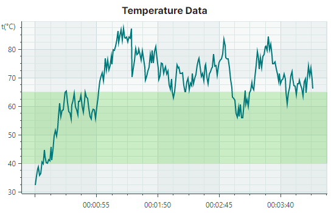

``` xml
<mxc:CartesianChart.AxesY>
    <mxc:AxisY Title="t(°C)" TitlePosition="WithLabels">
        <mxc:AxisY.Strips>
            <mxc:Strip AxisValue1="40" AxisValue2="65" Color="#4043C927" />
        </mxc:AxisY.Strips>
    </mxc:AxisY>
</mxc:CartesianChart.AxesY>
```

`Axis.StripsSource` 属性允许您从视图模型中定义的对象集合初始化条带。要根据底层数据对象创建 `Strip` 对象，请使用 `Axis.StripTemplate` 属性来指定模板。

##### 条带设置

- `ConstantLine.AxisValue1` — 指定沿坐标轴范围的第一个（起始或结束）值
- `ConstantLine.AxisValue2` — 指定沿坐标轴范围的第二个（结束或起始）值。
- `ConstantLine.Color` — 用于填充条带的颜色。

    !!! tip
    
        使用半透明颜色可以让网格线在条带下方仍然可见。


## 在图表坐标和屏幕坐标之间转换

有时您可能需要将图表坐标转换为屏幕坐标，反之亦然。以下方法可帮助您完成这项任务：

- `CartesianChart.DiagramPointToScreenPoint` — 将图表点的坐标转换为屏幕坐标。图表点由 _X_ 轴和 _Y_ 轴以及这些轴上的值来确定。
- `CartesianChart.ScreenPointToDiagramPoint` — 将屏幕坐标转换为图表控件内某一点的坐标。该方法返回的对象允许您获取图表坐标，或判断屏幕坐标是否位于控件的视口范围内。

<br>
<br>

<sup>*</sup> 本页面使用机器翻译技术翻译。
</content>
</invoke>
