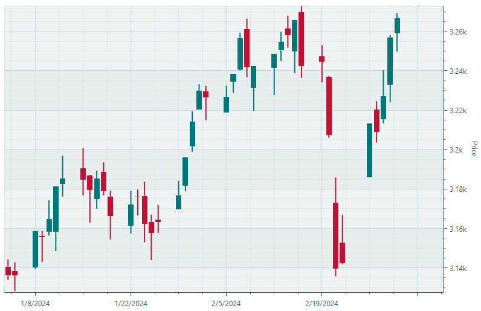
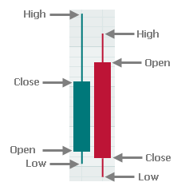

# Candlestick Series View

在 `CartesianChart` 控件中使用 Candlestick Series View（`CartesianCandlestickSeriesView`）可以创建显示资产价格走势的金融图表。数据点显示特定时期内证券的最高价、最低价、开盘价和收盘价。



每个数据点都以蜡烛（candle）的形式呈现，由一根实心柱体和两条可能延伸到实心柱体之外的须线组成。实心柱体的顶部和底部数值决定开盘价和收盘价，而须线则表示最高价和最低价。



绘制蜡烛使用两种颜色。如果收盘价高于开盘价，蜡烛用一种颜色绘制；否则，用另一种颜色绘制。例如，在上图中，上涨蜡烛以绿色绘制，下跌蜡烛以红色绘制。使用 Candlestick Series View，您可以为上涨和下跌蜡烛指定自定义颜色。

以下代码片段取自“Candlestick”图表演示，创建了一个显示 Candlestick Series View 的笛卡尔图表。

``` xml
<mxc:CartesianChart>
    <mxc:CartesianSeries AxisYKey="Price" DataAdapter="{Binding StockData}" SeriesName="Price">
        <mxc:CartesianCandlestickSeriesView Color="#00787A" ReductionColor="#BD1436" />
    </mxc:CartesianSeries>
</mxc:CartesianChart>
```

``` cs
public partial class CartesianCandlestickSeriesViewViewModel : ChartsPageViewModel
{
    [ObservableProperty] CandlestickDataAdapter stockData;
    //...
}
```
<!-- TODO
Необязательны в примере выше?
AxisYKey="Price"
SeriesName="Price"
 -->

## Candlestick Series View 的数据

任何 Cartesian Series View 的数据都是通过分配给 `CartesianSeries.DataAdapter` 属性的[数据适配器](../cartesian-chart.md#series-data)提供的。数据适配器为图表提供 _X_ 和 _Y_ 值。

Candlestick Series View 有两种可用的数据适配器：

- `CandlestickDataAdapter`
- `SummaryCandlestickDataAdapter`

在这两种数据适配器中，_X_ 值均为 DateTime 类型。请根据您所拥有的 _Y_ 值类型选择其中一种数据适配器。

### CandlestickDataAdapter

使用 `CandlestickDataAdapter` 对象时，您需要提供四个 Double 类型的 _Y_ 值，分别指定每个 _X_ 参数对应的开盘价、收盘价、最高价和最低价。您可以使用 `CandlestickDataAdapter` 构造函数为适配器填充数据。

以下代码取自“Candlestick”图表演示，演示了 `CandlestickDataAdapter` 对象的初始化。

``` cs
[ObservableProperty] CandlestickDataAdapter stockData;

public CartesianCandlestickSeriesViewViewModel()
{
    var data = CsvSources.Stock;
    var arguments = new List<DateTime>(data.Count);
    var open = new List<double>(data.Count);
    var high = new List<double>(data.Count);
    var low = new List<double>(data.Count);
    var close = new List<double>(data.Count);
    for (var i = data.Count - 1; i >= 0; i--)
    {
        arguments.Add(data[i].Date);
        open.Add(data[i].Open);
        high.Add(data[i].High);
        low.Add(data[i].Low);
        close.Add(data[i].Close);
    }
    StockData = new CandlestickDataAdapter(arguments, open, high, low, close);
}
```

`CandlestickDataAdapter` 对象要求您使用 `DateTimeScaleOptions.MeasureUnit` 属性为 _X_ 轴设置时间单位（轴单位）。

在下面的代码片段中，轴单位设置为 `Day`。

``` xml
<mxc:CartesianChart.AxesX>
    <mxc:AxisX ShowTitle="False">
        <mxc:AxisXRange MinSideMargin="0.01" MaxSideMargin="0.01" VisualMax="" />
        <mxc:AxisX.ScaleOptions>
            <mxc:DateTimeScaleOptions MeasureUnit="Day" />
        </mxc:AxisX.ScaleOptions>
    </mxc:AxisX>
</mxc:CartesianChart.AxesX>
```

提供给 `CandlestickDataAdapter` 数据适配器的 _X_ 参数应与该轴单位相对应。例如，当轴单位设置为 `Day` 时，_X_ 值应表示各个独立的日期。

### SummaryCandlestickDataAdapter

`SummaryCandlestickDataAdapter` 适配器会汇总您提供的数据，并按指定的时间范围（时间单位）（例如按秒、分钟、小时、天、周等，或时间范围的倍数）自动计算开盘价、收盘价、最高价和最低价。例如，您可以提供以一秒为间隔的数据，并让 `SummaryCandlestickDataAdapter` 自动将这些数据按 5 秒、分钟或小时等间隔进行汇总。

_X_ 值指定各个独立的日期时间值。对于每个 _X_ 值，提供一个 Double 类型的 _Y_ 值。

要指定聚合时间范围，请使用以下两个属性：

- `SummaryCandlestickDataAdapter.MeasureUnit` — 指定数据适配器用于计算开盘价、收盘价、最高价和最低价的基本聚合时间范围（Millisecond、Second、Minute、Hour、Day、Week、Month、Quarter 或 Year）。

- `SummaryCandlestickDataAdapter.MeasureUnitFactor`（整数值，默认值为 `1`）— 指定用于计算实际时间范围的基本时间范围乘数。时间范围的实际长度按以下表达式计算：`MeasureUnit x MeasureUnitFactor`。

以下示例将时间范围设置为“2 秒”：

``` cs
[ObservableProperty]
SummaryFinancialDataAdapter dataAdapter;

public CartesianSummaryCandlestickViewModel()
{
    int dataCount = 100;
    var xArgs = new List<DateTime>(dataCount);
    var yArgs = new List<double>(dataCount);
    //Populate the xArgs and yArgs lists
    //...
    dataAdapter = new SummaryFinancialDataAdapter(xArgs, yArgs);
    dataAdapter.MeasureUnit = DateTimeUnit.Second;
    dataAdapter.MeasureUnitFactor = 2;
}
```


`CandlestickDataAdapter` 和 `SummaryCandlestickDataAdapter` 类提供了用于删除和添加数据点的方法。当图表数据需要实时更新时，这些方法非常有用。

- `Add` — 在数据数组末尾添加一个新数据点。
- `UpdateValue` — 修改指定位置的数据点。
- `RemoveFromStart` — 从数据起始处删除指定数量的数据点。
- `Clear` — 清除所有数据。

## 蜡烛的颜色和粗细

使用 `CartesianCandlestickSeriesView` 的 `Color` 和 `ReductionColor` 属性指定蜡烛颜色：

- `CartesianCandlestickSeriesView.Color` — 指定用于绘制收盘价高于或等于开盘价的蜡烛的颜色。
- `CartesianCandlestickSeriesView.ReductionColor` — 指定用于绘制收盘价低于开盘价的蜡烛的颜色。


以下属性可用于自定义蜡烛的粗细：

- `CandleWidth` — 一个 Double 值，指定蜡烛实心柱体的粗细。`CandleWidth` 属性值以轴单位度量。Candlestick Series View 使用日期时间轴，其轴单位由 `DateTimeScaleOptions.MeasureUnit` 属性决定。例如，如果 `MeasureUnit` 属性设置为 `Day`，则轴单位就是日期时间轴上相邻两天之间的距离。当 `CandleWidth` 属性设置为 `0.5` 时，蜡烛宽度即为相邻两天之间距离的一半。

- `Thickness` — 一个 Double 值，指定蜡烛须线的粗细。该属性值以像素为单位度量。


## 轴

与其他系列视图一样，您可以使用 `CartesianChart.AxesX` 和 `CartesianChart.AxesY` 属性自定义 Candlestick 图表类型的轴。Candlestick 图表的 _X_ 轴显示日期时间值。要自定义 _X_ 轴的刻度设置，请将 `AxisX.ScaleOptions` 属性设置为一个 `DateTimeScaleOptions` 对象。

以下代码片段创建了一个带有 Candlestick Series View 的 `CartesianChart` 控件，并自定义了图表的轴。完整示例请参阅“Candlestick”图表演示。

``` xml
<mxc:CartesianChart Grid.Row="1" Classes="DemoChart" x:Name="DemoControl">
    <mxc:CartesianSeries DataAdapter="{Binding StockData}">
        <mxc:CartesianCandlestickSeriesView Color="#00787A" ReductionColor="#BD1436" />
    </mxc:CartesianSeries>

    <mxc:CartesianChart.AxesX>
        <mxc:AxisX ShowTitle="False">
            <mxc:AxisXRange MinSideMargin="0.01" MaxSideMargin="0.01" VisualMax="" />
            <mxc:AxisX.ScaleOptions>
                <mxc:DateTimeScaleOptions MeasureUnit="Day" />
            </mxc:AxisX.ScaleOptions>
        </mxc:AxisX>
    </mxc:CartesianChart.AxesX>
            
    <mxc:CartesianChart.AxesY>
        <mxc:AxisY Title="Price" Position="Far" Key="Price">
            <mxc:AxisYRange AlwaysShowZeroLevel="False" />
        </mxc:AxisY>
    </mxc:CartesianChart.AxesY>
</mxc:CartesianChart>
```

有关自定义轴范围、刻度设置和标签的更多信息，请参阅以下主题：[Cartesian Chart - Axes](../cartesian-chart.md#axes)。

<br>
<br>

<sup>*</sup> 本页面使用机器翻译技术翻译。
