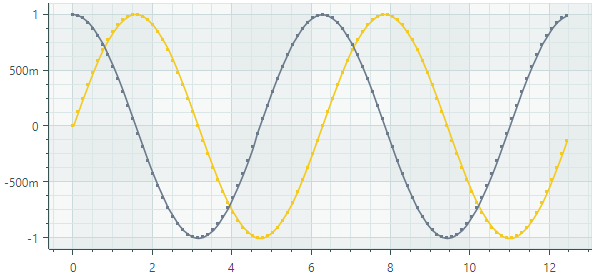

# Line Series View

Line Series View（`CartesianLineSeriesView`）用线条连接各个数据点。该系列允许您显示或隐藏点标记，并调整线条和点标记的粗细。下图展示了一个包含两个折线系列的图表控件，每个系列都以各自的颜色绘制。




## 创建 Line Series View

要创建 Line Series View，请将一个 `CartesianSeries` 对象添加到 `CartesianChart.Series` 集合中，并使用一个 `CartesianLineSeriesView` 实例初始化 `CartesianSeries.View` 属性。

使用 `CartesianSeries.DataAdapter` 属性为该系列提供数据。

以下代码展示了如何在 XAML 和 code-behind 中创建 Line Series View。

``` xml
xmlns:mxc="https://schemas.eremexcontrols.net/avalonia/charts"

<mxc:CartesianChart x:Name="chartControl">
    <mxc:CartesianChart.Series>
        <mxc:CartesianSeries Name="lineSeries1" DataAdapter="{Binding DataAdapter}" >
            <mxc:CartesianLineSeriesView Color="Red" MarkerSize="4" ShowMarkers="True" Thickness="2"/>
        </mxc:CartesianSeries>
    </mxc:CartesianChart.Series>
</mxc:CartesianChart>
```

``` cs
using Eremex.AvaloniaUI.Charts;

CartesianSeries series = new CartesianSeries();
chartControl.Series.Add(series);
double[] args = new double[] { 1, 2, 3, 4, 5, 6, 7 };
double[] values = new double[] { 0, 0.4, 1.5, 1.3, 0.4, 0, 0.1 };
series.DataAdapter = new SortedNumericDataAdapter(args, values);
series.View = new CartesianLineSeriesView()
{
    Color = Avalonia.Media.Colors.Green,
    ShowMarkers = true,
    MarkerSize = 4,
    Thickness = 2
};
```

### 示例 - 创建两个 Line Series View

以下示例创建了一个包含两个 Line Series View 的 `CartesianChart` 控件。系列视图的数据由 `FormulaDataAdapter` 对象提供，这些对象根据指定公式计算数值。此处假定窗口的数据上下文已设置为 _MainWindowViewModel_ 对象。


该示例演示了如何为系列视图自定义线条粗细和点标记。

_X_ 轴和 _Y_ 轴在 XAML 中创建，以便对其设置进行自定义。请注意使用 `NumericScaleOptions.LabelFormatter` 属性以自定义方式格式化轴标签。

``` xml
<mx:MxWindow xmlns="https://github.com/avaloniaui"
        xmlns:x="http://schemas.microsoft.com/winfx/2006/xaml"
        xmlns:vm="using:ChartLinearSeriesView.ViewModels"
        xmlns:d="http://schemas.microsoft.com/expression/blend/2008"
        xmlns:mc="http://schemas.openxmlformats.org/markup-compatibility/2006"
        xmlns:mx="https://schemas.eremexcontrols.net/avalonia"
        xmlns:mxc="https://schemas.eremexcontrols.net/avalonia/charts"
        mc:Ignorable="d" d:DesignWidth="800" d:DesignHeight="450"
        x:Class="ChartLinearSeriesView.Views.MainWindow"
        x:DataType="vm:MainWindowViewModel"
        Icon="/Assets/EMXControls.ico"
        Title="ChartLinearSeriesView"
        Width="600" Height="350"
        >
    <Design.DataContext>
        <vm:MainWindowViewModel/>
    </Design.DataContext>

    <mxc:CartesianChart x:Name="chartControl">
        <mxc:CartesianChart.Series>
            <mxc:CartesianSeries Name="lineSeries1" DataAdapter="{Binding LineSeries1.DataAdapter}" >
                <mxc:CartesianLineSeriesView Color="{Binding LineSeries1.Color}" MarkerSize="4" ShowMarkers="True" Thickness="2"/>
            </mxc:CartesianSeries>
            <mxc:CartesianSeries Name="lineSeries2" DataAdapter="{Binding LineSeries2.DataAdapter}" >
                <mxc:CartesianLineSeriesView Color="{Binding LineSeries2.Color}" MarkerSize="4" ShowMarkers="True" Thickness="2"/>
            </mxc:CartesianSeries>
        </mxc:CartesianChart.Series>

        <mxc:CartesianChart.AxesX>
            <mxc:AxisX Name="xAxis" Title="Arguments" >
                <mxc:AxisX.ScaleOptions>
                    <mxc:NumericScaleOptions LabelFormatter="{Binding ArgsLabelFormatter}"/>
                </mxc:AxisX.ScaleOptions>
            </mxc:AxisX>
        </mxc:CartesianChart.AxesX>
        <mxc:CartesianChart.AxesY>
            <mxc:AxisY Title="Values">
                <mxc:AxisY.ScaleOptions>
                    <mxc:NumericScaleOptions LabelFormatter="{Binding ArgsLabelFormatter}"/>
                </mxc:AxisY.ScaleOptions>
            </mxc:AxisY>
        </mxc:CartesianChart.AxesY>
    </mxc:CartesianChart>
</mx:MxWindow>
```

``` cs
using Avalonia.Media;
using CommunityToolkit.Mvvm.ComponentModel;
using Eremex.AvaloniaUI.Charts;
using System;

namespace ChartLinearSeriesView.ViewModels;

public partial class MainWindowViewModel : ViewModelBase
{
    static double Sin(double argument) => 0.5* Math.Sin(argument)+0.5;
    static double Cos(double argument) => 0.6*Math.Cos(argument);

    [ObservableProperty] SeriesViewModel lineSeries1;
    [ObservableProperty] SeriesViewModel lineSeries2;
    [ObservableProperty] FuncLabelFormatter argsLabelFormatter = new(o => String.Format("{0:n1}", o));

    const int ItemCount = 37;
    const double Step = 0.1;

    public MainWindowViewModel()
    {
        LineSeries1 = new() 
        { 
            Color = Color.FromUInt32(0xfffeb640), 
            DataAdapter = new FormulaDataAdapter(-3, Step, ItemCount, Sin) 
        };
        LineSeries2 = new() 
        { 
            Color = Color.FromUInt32(0xff9389bd), 
            DataAdapter = new FormulaDataAdapter(-2, Step, ItemCount, Cos) 
        };
    }
}

public partial class SeriesViewModel : ObservableObject
{
    [ObservableProperty] Color color;
    [ObservableProperty] ISeriesDataAdapter dataAdapter;
}
```

## Line Series View 的数据

您可以使用以下数据适配器为 Line Series View 提供数据：

数值型 _X_ 值：

- `SortedNumericDataAdapter`
- `FormulaDataAdapter`

日期时间型 _X_ 值：

- `SortedDateTimeDataAdapter`
- `SortedTimeSpanDataAdapter`


定性 _X_ 值：

- `QualitativeDataAdapter`


## Line Series View 设置


- `Color` — 指定用于绘制该系列的颜色。
- `CrosshairMode` — 指定十字线的图表标签是捕捉到最近的数据点，还是显示插值结果。参见 [在十字线图表标签中显示精确值或插值](../crosshair.md#show-an-exact-or-interpolated-value-in-crosshair-series-labels)。
- `MarkerImage` — 获取或设置用作自定义点标记的图像。如果未指定图像，则显示默认的方形标记。您可以使用 `SvgImage` 类实例来指定 SVG 图像。

    `MarkerImage` 属性使用 `[Content]` 特性声明，这使您可以直接在 &lt;CartesianLineSeriesView&gt; 标签之间定义图像。

    ``` xml
    <mxc:CartesianLineSeriesView>
        <SvgImage Source="avares://Demo/Assets/circle.svg" />
    </mxc:CartesianLineSeriesView>
    ```

    SVG 文件包含 SVG 元素的预定义颜色。要使这些颜色与您的数据系列颜色相匹配，您可以：
    
    - 提前手动编辑源 SVG 图像文件
    - 使用 `MarkerImageCss` 属性动态自定义 SVG 元素的[样式](https://developer.mozilla.org/en-US/docs/Web/SVG/Reference/Element/style)。这些样式会在渲染点标记时应用。

- `MarkerImageCss` — 指定用于在运行时自定义由 `MarkerImage` 属性定义的 SVG 图像的 [CSS 样式](https://developer.mozilla.org/en-US/docs/Web/SVG/Reference/Element/style)。主要用途是将 SVG 元素的颜色替换为系列颜色（`Color`）。在 CSS 代码中包含 `{0}` 占位符，以插入 `Color` 属性的值。

    例如，当 `MarkerImage` 属性包含带有 circle 元素的 SVG 图像时，以下 CSS 代码会将 `circle` 样式设置为橙色填充（使用系列颜色）和深红色边框：

    ``` xml
    <mxc:CartesianLineSeriesView Color="orange" MarkerImageCss="circle {{fill:{0};stroke:darkred;}}">
        <SvgImage Source="avares://Demo/Assets/circle.svg" />
    </mxc:CartesianLineSeriesView>
    ```
    
    另请参阅：[示例 - 创建 Lollipop Series View 并使用自定义 SVG 标记](lollipop-series-view.md#example-create-a-lollipop-series-view-and-use-custom-svg-data-point-markers)。

- `MarkerSize` — 指定点标记的大小。
- `ShowInCrosshair` — 指定当前系列的十字线图表标签的可见性。参见 [自定义十字线的图表标签](../crosshair.md#hide-a-series-in-the-crosshair)。
- `ShowMarkers` — 启用或禁用点标记。
- `Thickness` — 指定线条的粗细。

<br>
<br>

<sup>*</sup> 本页面使用机器翻译技术翻译。
