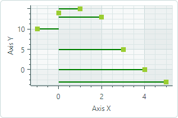
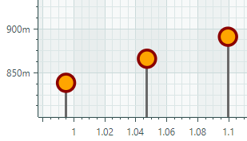

# 棒棒糖系列视图

Lollipop 系列视图 (`CartesianLollipopSeriesView`) 使用末端带有标记的细线可视化数据。标记指示各个数据点，而线条将标记连接到基线（水平轴或垂直轴）。 Lollipop 图表使用方形标记 by default，但也支持 SVG 格式的自定义标记。以下 image 演示了带有从 SVG 文件加载的圆形标记的 Lollipop 系列视图。


## 创建棒棒糖系列视图

要创建 Lollipop 系列视图，请将 `CartesianSeries` 对象添加到 `CartesianChart.Series` 集合中，并使用 `CartesianLollipopSeriesView` 实例初始化 `CartesianSeries.View` 属性。

将 `CartesianSeries.DataAdapter` 属性用于该系列的 supply 数据。

以下代码演示如何在 XAML 和代码隐藏中创建 Lollipop 系列视图。


``` xml
xmlns:mxc="https://schemas.eremexcontrols.net/avalonia/charts"

<mxc:CartesianChart x:Name="chartControl">
    <mxc:CartesianSeries DataAdapter="{Binding DataAdapter}">
        <mxc:CartesianLollipopSeriesView Color="YellowGreen"
                                            LineColor="Green"
                                            Thickness="2"
                                            MarkerSize="8"
                                            Orientation="Vertical">
        </mxc:CartesianLollipopSeriesView>
    </mxc:CartesianSeries>
</mxc:CartesianChart>
```

``` cs
using Eremex.AvaloniaUI.Charts;

CartesianSeries series = new CartesianSeries();
chartControl.Series.Add(series);
double[] args = new double[] { -1, 0, 1, 2, 3, 4, 5 };
double[] values = new double[] { 10, 14, 15, 13, 5, 0, -3 };
series.DataAdapter = new SortedNumericDataAdapter(args, values);
series.View = new CartesianLollipopSeriesView()
{
    LineColor = Avalonia.Media.Colors.Green,
    Color = Avalonia.Media.Colors.YellowGreen,
    MarkerSize = 8,
    Thickness = 2,
    Orientation = CartesianLollipopOrientation.Horizontal
};
```

## 示例 - 创建 Lollipop 系列视图并使用自定义 SVG 数据点标记

以下示例创建一个 Lollipop 系列视图来可视化 `FormulaDataAdapter` 对象提供的示例数据。该示例演示如何使用 SVG image 作为自定义数据点标记并动态调整 SVG 元素的颜色，使其与数据系列颜色相匹配。


1. 指定 SVG 图像作为点标记

使用 `MarkerImage` 属性将 SVG image 指定为数据点标记。 `MarkerImage` 属性与 `[Content]` 属性一起定义，允许您将 SVG image 指定为 &lt;CartesianLollipopSeriesView&gt; 标记的内容：

    ``` xml
    <mxc:CartesianLollipopSeriesView ...>
        <SvgImage Source="avares://ChartLollipopSeriesView/Assets/circle.svg" />
    </mxc:CartesianLollipopSeriesView>    
    ```

“circle.svg”文件呈现一个带有绿色边框和黄色填充的圆形：


    ``` xml
    <!-- part of 'circle.svg' file -->
    <svg ...>
        <circle fill="yellow" stroke="green" stroke-width="10" cx="40" cy="40" r="30"/>
    </svg>
    ```

下一步展示如何动态覆盖这些颜色而不修改源 SVG 文件。

2. 将系列颜色应用于 SVG 元素

Lollipop 系列视图（以及任何 [Point Series View](point-series-view.md) 后代） 
    支持 `MarkerImageCss` 属性，该属性启用 [CSS-based SVG styling](https://developer.mozilla.org/en-US/docs/Web/SVG/Reference/Element/style)。此属性允许您在运行时自定义特定 SVG 元素的样式。例如，CSS 代码可以将系列颜色应用于各个 SVG 元素。

    ``` xml
    <mxc:CartesianLollipopSeriesView 
        Color="Orange"
        MarkerImageCss="circle {{fill:{0};stroke:darkred;}}"
    >
    ```

上面的 CSS 代码自定义了 `circle` SVG 对象的样式。新样式用深红色绘制边框，并使用数据系列颜色填充圆圈。
     
- `{0}` 占位符 — 插入 `CartesianLollipopSeriesView.Color` 属性的值。

结果如下所示：


    
3. 设置点标记的大小

使用 `MarkerSize` 属性调整点标记的大小。

完整代码：

``` xml
<!-- MainWindow.axaml -->
<mx:MxWindow xmlns="https://github.com/avaloniaui"
        xmlns:x="http://schemas.microsoft.com/winfx/2006/xaml"
        xmlns:vm="using:ChartLollipopSeriesView.ViewModels"
        xmlns:d="http://schemas.microsoft.com/expression/blend/2008"
        xmlns:mc="http://schemas.openxmlformats.org/markup-compatibility/2006"
        xmlns:mx="https://schemas.eremexcontrols.net/avalonia"
        xmlns:mxc="https://schemas.eremexcontrols.net/avalonia/charts"
        mc:Ignorable="d" d:DesignWidth="800" d:DesignHeight="450"
        x:Class="ChartLollipopSeriesView.Views.MainWindow"
        x:DataType="vm:MainWindowViewModel"
        Icon="/Assets/EMXControls.ico"
        Title="ChartLollipopSeriesView">

    <Design.DataContext>
        <!-- This only sets the DataContext for the previewer in an IDE,
             to set the actual DataContext for runtime, set the DataContext property in code (look at App.axaml.cs) -->
        <vm:MainWindowViewModel/>
    </Design.DataContext>

    <mxc:CartesianChart x:Name="chartControl">
        <mxc:CartesianChart.Series>
            <mxc:CartesianSeries Name="lollipopSeries1" 
                                 DataAdapter="{Binding PointSeriesVM1.DataAdapter}" 
                                 SeriesName="Income"
                                 >
                <mxc:CartesianLollipopSeriesView Color="Orange"
                                                 LineColor="Dimgray"
                                                 LineThickness="3"
                                                 MarkerSize="10"
                                                 MarkerImageCss="circle {{fill:{0};stroke:darkred;}}"
                                                 >
                    <SvgImage Source="avares://ChartLollipopSeriesView/Assets/circle.svg" />
                </mxc:CartesianLollipopSeriesView>
            </mxc:CartesianSeries>
        </mxc:CartesianChart.Series>
        <mxc:CartesianChart.AxesX>
            <mxc:AxisX Title="Weeks" MinorCount="0" ShowMinorGridlines="False">
                <mxc:AxisX.ScaleOptions>
                    <mxc:NumericScaleOptions GridSpacing="1" />
                </mxc:AxisX.ScaleOptions>
            </mxc:AxisX>
        </mxc:CartesianChart.AxesX>
        <mxc:CartesianChart.AxesY>
            <mxc:AxisY Title="Million yuan"/>
        </mxc:CartesianChart.AxesY>
    </mxc:CartesianChart>
</mx:MxWindow>
```

``` cs
// MainWindowViewModel.cs
using CommunityToolkit.Mvvm.ComponentModel;
using Eremex.AvaloniaUI.Charts;
using System;
using System.Collections.Generic;

namespace ChartLollipopSeriesView.ViewModels
{
    public partial class MainWindowViewModel : ViewModelBase
    {
        static double[] values = new double[] { 1, 2, 2.6, 2.5, 2, 1.3, 0.7, -0.3, 0, 1, 1.6, 2.4, 2.8, 3.2, 2.95, 3 };
        static double MyFunc(double argument) => values[(int)argument % values.Length];

        [ObservableProperty] SeriesViewModel pointSeriesVM1;

        public MainWindowViewModel()
        {
            PointSeriesVM1 = new()
            {
                DataAdapter = new FormulaDataAdapter(0, 1, values.Length, MyFunc)
            };
        }
    }

    public partial class SeriesViewModel : ObservableObject
    {
        [ObservableProperty] ISeriesDataAdapter dataAdapter;
    }
}
```

``` xml
<!-- circle.svg image -->
<svg viewBox="0 0 80 80" width="80" height="80" xmlns="http://www.w3.org/2000/svg">
<g>
<title>Layer 1</title>
<circle fill="yellow" stroke="green" stroke-opacity="1" stroke-width="10" cx="40" cy="40" id="svg_1" r="30"/>
</g>
</svg>
```


## Lollipop 系列视图的数据

您可以使用以下数据适配器为 Lollipop 系列视图提供数据：

数字 _X_ 值：

- `FormulaDataAdapter`
- `ScatterDataAdapter`
- `SortedNumericDataAdapter`

日期和时间 _X_ 值：

- `SortedDateTimeDataAdapter`
- `SortedTimeSpanDataAdapter`


定性 _X_ 值：

- `QualitativeDataAdapter`

## 棒棒糖系列视图设置


- `Color` — 指定用于 paint 点标记的颜色。
- `LineColor` — 指定用于 paint 线条的颜色。
- `LineThickness` — 指定 line 厚度。
- `LineOrientation` — 指定线的方向。

- `Vertical` — 线条从点标记垂直延伸到 _X_ 轴。


- `Horizontal` — 线条从点标记水平延伸到 _Y_ 轴。




- `MarkerImage` — 获取或设置用作自定义点标记的 image。如果未指定 image，则显示默认的方形标记。您可以使用 `SvgImage` 类实例来指定 SVG 图像。

`MarkerImage` 属性使用 `[Content]` 属性进行声明，这允许您直接在 &lt;CartesianLollipopSeriesView&gt; 标记之间定义 image。

    ``` xml
    <mxc:CartesianLollipopSeriesView>
        <SvgImage Source="avares://ChartLollipopSeriesView/Assets/circle.svg" />
    </mxc:CartesianLollipopSeriesView>
    ```

SVG 文件包含 SVG 元素的预定义颜色。要使这些颜色与您的数据系列颜色相匹配，您可以：
    
- 预先手动编辑源 SVG image 文件
    - 使用 `MarkerImageCss` 属性为 SVG 元素动态自定义 [styles](https://developer.mozilla.org/en-US/docs/Web/SVG/Reference/Element/style)。渲染点标记时将应用这些样式。

- `MarkerImageCss` — 指定 [CSS styles](https://developer.mozilla.org/en-US/docs/Web/SVG/Reference/Element/style)，用于由 `CartesianLollipopSeriesView.MarkerImage` 属性定义的 SVG image 的运行时自定义。主要用例是将 SVG 元素颜色替换为系列颜色 (`CartesianLollipopSeriesView.Color`)。包含 `{0}` 占位符以在 CSS 代码中插入 `CartesianLollipopSeriesView.Color` 属性的值。

例如，当 `MarkerImage` 属性包含带有圆形元素的 SVG image 时，以下 CSS 代码将使用橙色填充（使用系列颜色）和深红色边框设置 `circle` 的样式：

    ``` xml
    <mxc:CartesianLollipopSeriesView Color="orange" MarkerImageCss="circle {{fill:{0};stroke:darkred;}}">
        <SvgImage Source="avares://ChartLollipopSeriesView/Assets/circle.svg" />
    </mxc:CartesianLollipopSeriesView>
    ```



**完整代码**：[Example - Create a Lollipop Series View and Use Custom SVG Markers](#example-create-a-lollipop-series-view-and-use-custom-svg-data-point-markers)。

- `MarkerSize` — 指定点标记的大小（以像素为单位）。
- `ShowInCrosshair` — 指定当前系列的十字线图表 label 的可见性。参见 [Customize Chart Labels of the Crosshair](../crosshair.md#hide-a-series-in-the-crosshair)。

<br>
<br>

<sup>*</sup> 本页面使用机器翻译技术翻译。
