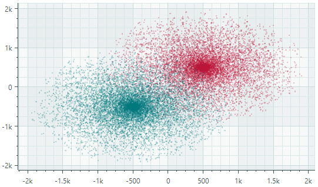

# Point Series View

Point Series View（`CartesianPointSeriesView`）用于绘制各个独立的点。每个点由 X 和 Y 值确定位置。下图展示了一个 `CartesianPointSeriesView` 示例，其中显示了两个散点系列，每个系列都以各自的颜色绘制。



## 创建 Point Series View

要创建 Point Series View，请将一个 `CartesianSeries` 对象添加到 `CartesianChart.Series` 集合中，并使用一个 `CartesianPointSeriesView` 实例初始化 `CartesianSeries.View`。

以下代码展示了如何在 XAML 和 code-behind 中创建 Point Series View。

``` xml
<mxc:CartesianChart x:Name="chartControl">
    <mxc:CartesianChart.Series>
        <mxc:CartesianSeries Name="pointSeries1" DataAdapter="{Binding DataAdapter}" >
            <mxc:CartesianPointSeriesView Color="Red" MarkerSize="2"/>
        </mxc:CartesianSeries>
    </mxc:CartesianChart.Series>
</mxc:CartesianChart>
```

``` cs
CartesianSeries series = new CartesianSeries();
chartControl.Series.Add(series);
double[] args = new double[] {3,2,1,2,3,4,5,4 };
double[] values = new double[] { -1,0,1,2,3,2,1,0 };
// Use ScatterDataAdapter since points are not sorted by the X coordinate
series.DataAdapter = new ScatterDataAdapter(args, values);
series.View = new CartesianPointSeriesView()
{
    Color = Avalonia.Media.Colors.Blue,
    MarkerSize = 4,
};
```

## 示例 - 使用 Point Series View 显示点簇

在此示例中，Point Series View 用于显示沿数值型 X 轴和 Y 轴随机分散的点。源数据系列中的点未按 _X_ 坐标排序。为了向系列视图提供未排序的点，此处使用了 `ScatterDataAdapter` 适配器。


``` xml
<mx:MxWindow xmlns="https://github.com/avaloniaui"
        xmlns:x="http://schemas.microsoft.com/winfx/2006/xaml"
        xmlns:vm="using:ChartPointSeriesView.ViewModels"
        xmlns:d="http://schemas.microsoft.com/expression/blend/2008"
        xmlns:mc="http://schemas.openxmlformats.org/markup-compatibility/2006"
        xmlns:mx="https://schemas.eremexcontrols.net/avalonia"
        xmlns:mxc="https://schemas.eremexcontrols.net/avalonia/charts"
        mc:Ignorable="d" d:DesignWidth="800" d:DesignHeight="450"
        x:Class="ChartPointSeriesView.Views.MainWindow"
        x:DataType="vm:MainWindowViewModel"
        Icon="/Assets/EMXControls.ico"
        Title="ChartPointSeriesView"
        Width="600" Height="400">

    <Design.DataContext>
        <vm:MainWindowViewModel/>
    </Design.DataContext>

    <mxc:CartesianChart x:Name="chartControl">
        <mxc:CartesianChart.Series>
            <mxc:CartesianSeries Name="pointSeries1" DataAdapter="{Binding PointSeriesVM1.DataAdapter}" >
                <mxc:CartesianPointSeriesView Color="{Binding PointSeriesVM1.Color}" MarkerSize="2"/>
            </mxc:CartesianSeries>
        </mxc:CartesianChart.Series>
        <mxc:CartesianChart.AxesX>
            <mxc:AxisX Name="xAxis" Title="V1" />
        </mxc:CartesianChart.AxesX>
        <mxc:CartesianChart.AxesY>
            <mxc:AxisY Title="V2"/>
        </mxc:CartesianChart.AxesY>
    </mxc:CartesianChart>
</mx:MxWindow>
```

``` cs
using CommunityToolkit.Mvvm.ComponentModel;
using Eremex.AvaloniaUI.Charts;
using System.Collections.Generic;
using System;
using Avalonia.Media;
using Avalonia;

namespace ChartPointSeriesView.ViewModels;

public partial class MainWindowViewModel : ViewModelBase
{
    [ObservableProperty] SeriesViewModel pointSeriesVM1;

    public MainWindowViewModel()
    {
        PointSeriesVM1 = new()
        {
            Color = Color.FromUInt32(0xffa24f46),
            DataAdapter = GenerateRandomData()
        };
    }

    private static Random random = new Random();
    private static double GenerateNormalValue(double mean, double stdDev)
    {
        double u1 = 1.0 - random.NextDouble(); 
        double u2 = 1.0 - random.NextDouble();
        double randStdNormal = Math.Sqrt(-2.0 * Math.Log(u1)) * Math.Sin(2.0 * Math.PI * u2);
        return mean + stdDev * randStdNormal;
    }

    public static ScatterDataAdapter GenerateRandomData()
    {
        int count = 7000;
        double xMean= 50, xStdDev= 10, yMean = 20, yStdDev = 5;
        List<double> args = new List<double>();
        List<double> values = new List<double>();
        for(int i = 0; i < count; i++)
        {
            double x = GenerateNormalValue(xMean, xStdDev);
            double y = GenerateNormalValue(yMean, yStdDev);
            args.Add(x);
            values.Add(y);
        }
        return new ScatterDataAdapter(args, values);
    }
}

public partial class SeriesViewModel : ObservableObject
{
    [ObservableProperty] Color color;
    [ObservableProperty] ScatterDataAdapter dataAdapter;
}
```

## Point Series View 的数据

您可以使用以下数据适配器为 Point Series View 提供数据：

数值型 _X_ 值：

- `FormulaDataAdapter`
- `ScatterDataAdapter`
- `SortedNumericDataAdapter`

日期时间型 _X_ 值：

- `SortedDateTimeDataAdapter`
- `SortedTimeSpanDataAdapter`


定性 _X_ 值：

- `QualitativeDataAdapter`


## Point Series View 设置

- `Color` — 指定用于绘制该系列的颜色。
- `MarkerImage` — 获取或设置用作自定义点标记的图像。如果未指定图像，则显示默认的方形标记。您可以使用 `SvgImage` 类实例来指定 SVG 图像。

    `MarkerImage` 属性使用 `[Content]` 特性声明，这使您可以直接在 &lt;CartesianPointSeriesView&gt; 标签之间定义图像。

    ``` xml
    <mxc:CartesianPointSeriesView>
        <SvgImage Source="avares://Demo/Assets/circle.svg" />
    </mxc:CartesianPointSeriesView>
    ```

    SVG 文件包含 SVG 元素的预定义颜色。要使这些颜色与您的数据系列颜色相匹配，您可以：
    
    - 提前手动编辑源 SVG 图像文件
    - 使用 `MarkerImageCss` 属性动态自定义 SVG 元素的[样式](https://developer.mozilla.org/en-US/docs/Web/SVG/Reference/Element/style)。这些样式会在渲染点标记时应用。

- `MarkerImageCss` — 指定用于在运行时自定义由 `MarkerImage` 属性定义的 SVG 图像的 [CSS 样式](https://developer.mozilla.org/en-US/docs/Web/SVG/Reference/Element/style)。主要用途是将 SVG 元素的颜色替换为系列颜色（`Color`）。在 CSS 代码中包含 `{0}` 占位符，以插入 `Color` 属性的值。

    例如，当 `MarkerImage` 属性包含带有 circle 元素的 SVG 图像时，以下 CSS 代码会将 `circle` 样式设置为橙色填充（使用系列颜色）和深红色边框：

    ``` xml
    <mxc:CartesianPointSeriesView Color="orange" MarkerImageCss="circle {{fill:{0};stroke:darkred;}}">
        <SvgImage Source="avares://Demo/Assets/circle.svg" />
    </mxc:CartesianPointSeriesView>
    ```
    
    另请参阅：[示例 - 创建 Lollipop Series View 并使用自定义 SVG 标记](lollipop-series-view.md#example-create-a-lollipop-series-view-and-use-custom-svg-data-point-markers)。

- `MarkerSize` — 指定点标记的大小。
- `ShowInCrosshair` — 指定当前系列的十字线图表标签的可见性。参见 [自定义十字线的图表标签](../crosshair.md#hide-a-series-in-the-crosshair)。

<br>
<br>

<sup>*</sup> 本页面使用机器翻译技术翻译。
