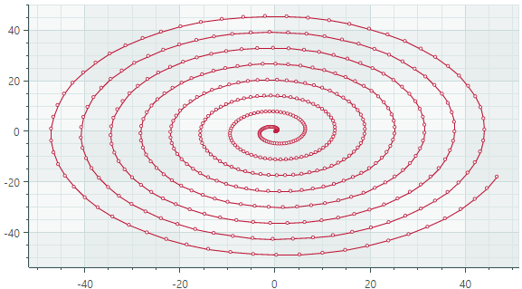

# 散点线系列视图

散点线系列视图 (`CartesianScatterLineSeriesView`) 将点与线连接起来。与 [Line Series View](line-series-vew.md) 不同，散点线系列视图的点不需要按其 X 值排序。相反，这些点按照它们在数据系列中出现的确切顺序连接。

<!-- TODO
Check whether points for the Line Series View must be sorted by X-values.
 -->



## 创建散点线系列视图

要创建散点线系列视图，请将 `CartesianSeries` 对象添加到 `CartesianChart.Series` 集合中，并使用 `CartesianScatterLineSeriesView` 实例初始化 `CartesianSeries.View`。

以下代码演示如何在 XAML 和代码隐藏中创建散点线系列视图。

``` xml
<mxc:CartesianChart x:Name="chartControl">
    <mxc:CartesianChart.Series>
        <mxc:CartesianSeries Name="scatterLineSeries1" DataAdapter="{Binding DataAdapter}" >
            <mxc:CartesianScatterLineSeriesView Color="Red" 
                                                ShowMarkers="True"
                                                MarkerSize="4" Thickness="2"/>
        </mxc:CartesianSeries>
    </mxc:CartesianChart.Series>
</mxc:CartesianChart>
```

``` cs
CartesianSeries series = new CartesianSeries();
chartControl.Series.Add(series);
List<(double, double)> points = new List<(double, double)>() { (0, 2), (-1, 3), (-2, 0), (2,1), (-2,5) };
// The ScatterDataAdapter allows unsorted points
series.DataAdapter = new ScatterDataAdapter(points);
series.View = new CartesianScatterLineSeriesView()
{
    Color = Avalonia.Media.Colors.Green,
    MarkerSize = 4,
};
```

## 示例 - 使用散点线系列视图连接数据系列中的点

在此示例中，散点线系列视图连接形成方形螺旋的点。 `ScatterDataAdapter` 适配器用于图表的 supply 数据。这些点按照它们在数据系列中出现的顺序连接。


``` xml
<mx:MxWindow xmlns="https://github.com/avaloniaui"
        xmlns:x="http://schemas.microsoft.com/winfx/2006/xaml"
        xmlns:vm="using:ChartScatterLineSeriesView.ViewModels"
        xmlns:d="http://schemas.microsoft.com/expression/blend/2008"
        xmlns:mc="http://schemas.openxmlformats.org/markup-compatibility/2006"
        xmlns:mx="https://schemas.eremexcontrols.net/avalonia"
        xmlns:mxc="https://schemas.eremexcontrols.net/avalonia/charts"
        mc:Ignorable="d" d:DesignWidth="800" d:DesignHeight="450"
        x:Class="ChartScatterLineSeriesView.Views.MainWindow"
        x:DataType="vm:MainWindowViewModel"
        Icon="/Assets/EMXControls.ico"
        Title="ChartScatterLineSeriesView"
        Width="500" Height="500">
    <Design.DataContext>
        <vm:MainWindowViewModel/>
    </Design.DataContext>

    <mxc:CartesianChart x:Name="chartControl">
        <mxc:CartesianChart.Series>
            <mxc:CartesianSeries Name="scatterLineSeries1" DataAdapter="{Binding ScatterLineSeriesVM1.DataAdapter}" >
                <mxc:CartesianScatterLineSeriesView Color="{Binding ScatterLineSeriesVM1.Color}" 
                                                    ShowMarkers="True"
                                                    MarkerSize="4" Thickness="2"/>
            </mxc:CartesianSeries>
        </mxc:CartesianChart.Series>
        <mxc:CartesianChart.AxesX>
            <mxc:AxisX Name="xAxis" Title="Parameter 1" />
        </mxc:CartesianChart.AxesX>
        <mxc:CartesianChart.AxesY>
            <mxc:AxisY Title="Parameter 2"/>
        </mxc:CartesianChart.AxesY>
    </mxc:CartesianChart>
</mx:MxWindow>
```

``` cs
using Avalonia;
using Avalonia.Media;
using CommunityToolkit.Mvvm.ComponentModel;
using Eremex.AvaloniaUI.Charts;
using System;
using System.Collections.Generic;

namespace ChartScatterLineSeriesView.ViewModels;

public partial class MainWindowViewModel : ViewModelBase
{
    [ObservableProperty] SeriesViewModel scatterLineSeriesVM1;

    public MainWindowViewModel()
    {
        ScatterLineSeriesVM1 = new()
        {
            Color = Color.FromUInt32(0xff0d628d),
            DataAdapter = new ScatterDataAdapter(GenerateSquareSpiralData())
        };
    }

    private List<(double, double)> GenerateSquareSpiralData()
    {
        List<(double, double)> points = new List<(double, double)> ();
        double x = 2, y = 2;
        int stepsPerSide = 1; // Steps before changing direction
        int direction = 3; // 0=right, 1=up, 2=left, 3=down
        int turns = 4;
        double stepSize = 1.0;

        points.Add((x, y));
        
        for (int i = 0; i < turns * 4; i++) // 4 sides per turn
        {
            for (int step = 0; step < stepsPerSide; step++)
            {
                switch (direction)
                {
                    case 0: x += stepSize; break; // Right
                    case 1: y += stepSize; break; // Up
                    case 2: x -= stepSize; break; // Left
                    case 3: y -= stepSize; break; // Down
                }
                points.Add((x, y));
            }
            direction = (direction + 1) % 4; // Change direction
            if (i % 2 == 1) stepsPerSide++; // Increase steps every 2 turns
        }
        return points;
    }
}

public partial class SeriesViewModel : ObservableObject
{
    [ObservableProperty] Color color;
    [ObservableProperty] ScatterDataAdapter dataAdapter;
}
```

## 散点线系列视图的数据

您可以使用以下数据适配器为散点线系列视图提供数据：

- `ScatterDataAdapter`


## 散点线系列视图设置

- `Color` — 指定用于 paint 系列的颜色。
- `MarkerImage` — 获取或设置用作自定义点标记的 image。如果未指定 image，则显示默认的方形标记。您可以使用 `SvgImage` 类实例来指定 SVG 图像。

`MarkerImage` 属性是使用 `[Content]` 属性来声明的，这允许您直接在 &lt;CartesianScatterLineSeriesView&gt; 标记之间定义 image。

    ``` xml
    <mxc:CartesianScatterLineSeriesView>
        <SvgImage Source="avares://Demo/Assets/circle.svg" />
    </mxc:CartesianScatterLineSeriesView>
    ```

SVG 文件包含 SVG 元素的预定义颜色。要使这些颜色与您的数据系列颜色相匹配，您可以：
    
- 预先手动编辑源SVG image 文件
    - 使用 `MarkerImageCss` 属性为 SVG 元素动态自定义 [styles](https://developer.mozilla.org/en-US/docs/Web/SVG/Reference/Element/style)。渲染点标记时将应用这些样式。
- `MarkerImageCss` — 指定 [CSS styles](https://developer.mozilla.org/en-US/docs/Web/SVG/Reference/Element/style)，用于由 `MarkerImage` 属性定义的 SVG image 的运行时自定义。主要用例是将 SVG 元素颜色替换为系列颜色 (`Color`)。包含 `{0}` 占位符以在 CSS 代码中插入 `Color` 属性的值。

例如，当 `MarkerImage` 属性包含带有圆形元素的 SVG image 时，以下 CSS 代码将使用橙色填充（使用系列颜色）和深红色边框设置 `circle` 的样式：

    ``` xml
    <mxc:CartesianScatterLineSeriesView Color="orange" MarkerImageCss="circle {{fill:{0};stroke:darkred;}}">
        <SvgImage Source="avares://Demo/Assets/circle.svg" />
    </mxc:CartesianScatterLineSeriesView>
    ```
    
另请参阅：[Example - Create a Lollipop Series View and Use Custom SVG Markers](lollipop-series-view.md#example-create-a-lollipop-series-view-and-use-custom-svg-data-point-markers)。

- `MarkerSize` — 指定点标记的大小。
- `ShowInCrosshair` — 指定当前系列的十字线图表 label 的可见性。参见 [Customize Chart Labels of the Crosshair](../crosshair.md#hide-a-series-in-the-crosshair)。
- `ShowMarkers` — 启用或禁用点标记。
- `Thickness` — 指定 line 厚度。

<br>
<br>

<sup>*</sup> 本页面使用机器翻译技术翻译。
