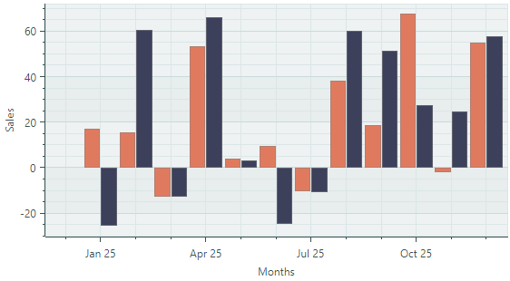

# Side-by-side Bar Series View

Side-by-side Bar Series View（`CartesianSideBySideBarSeriesView`）允许您将数据可视化为一组矩形柱状图。如果您提供多个系列，数据将沿水平轴以并排排列的柱状图形式呈现。


## 创建 Side-by-side Bar Series View

要创建 Side-by-side Bar Series View，请将一个 `CartesianSeries` 对象添加到 `CartesianChart.Series` 集合中，并使用一个 `CartesianSideBySideBarSeriesView` 对象初始化 `CartesianSeries.View` 属性。

使用 `CartesianSeries.DataAdapter` 属性为该系列提供数据。

以下代码展示了如何在 XAML 和 code-behind 中创建 Bar Series View。

``` xml
xmlns:mxc="https://schemas.eremexcontrols.net/avalonia/charts"

<mxc:CartesianChart x:Name="chartControl">
    <mxc:CartesianChart.Series>
        <mxc:CartesianSeries Name="barSeries1" DataAdapter="{Binding DataAdapter}" >
            <mxc:CartesianSideBySideBarSeriesView Color="Red" />
        </mxc:CartesianSeries>
</mxc:CartesianChart>
```

``` cs
using Eremex.AvaloniaUI.Charts;

CartesianSeries series = new CartesianSeries();
chartControl.Series.Add(series);
DateTime[] args = new DateTime[] {DateTime.Today, DateTime.Today.AddMonths(1)};
double[] values = new double[] {10, 20};
series.DataAdapter = new SortedDateTimeDataAdapter(args, values );
series.View = new CartesianSideBySideBarSeriesView()
{
    Color = Avalonia.Media.Colors.Red
};
```

!!! tip

    如果您使用日期时间类型的参数，可能还需要初始化 _X_ 轴，并自定义轴的刻度选项。详情请参阅：[轴刻度](../cartesian-chart.md#axis-scale)。

<!-- TODO
No bars are displayed without axis X
 -->

### 示例 - 创建两个 Side-by-side Bar Series View

以下示例创建了一个包含两个 Side-by-side Bar Series View 的 `CartesianChart` 控件。柱状图系列视图的数据由在主视图模型中初始化的 `SortedDateTimeDataAdapter` 对象提供。此处假定窗口的数据上下文已设置为 _MainWindowViewModel_ 对象。

该示例展示了如何为 `CartesianSideBySideBarSeriesView` 对象初始化颜色、柱宽以及柱与柱之间的间距。

_X_ 轴和 _Y_ 轴在 XAML 中创建，以便对其设置（包括标题和刻度选项）进行自定义。

使用 `SortedDateTimeDataAdapter` 对象时，您需要指定 `MeasureUnit` 属性以定义轴的刻度方式。在此示例中，数据使用月度间隔，因此 `MeasureUnit` 属性设置为 `Month`。




``` xml
<mx:MxWindow xmlns="https://github.com/avaloniaui"
        xmlns:x="http://schemas.microsoft.com/winfx/2006/xaml"
        xmlns:vm="using:ChartBarSeriesView.ViewModels"
        xmlns:d="http://schemas.microsoft.com/expression/blend/2008"
        xmlns:mc="http://schemas.openxmlformats.org/markup-compatibility/2006"
        xmlns:mx="https://schemas.eremexcontrols.net/avalonia"
        xmlns:mxc="https://schemas.eremexcontrols.net/avalonia/charts"
        mc:Ignorable="d" d:DesignWidth="800" d:DesignHeight="450"
        x:Class="ChartBarSeriesView.Views.MainWindow"
        x:DataType="vm:MainWindowViewModel"
        Icon="/Assets/EMXControls.ico"
        Title="ChartBarSeriesView">

    <Design.DataContext>
        <vm:MainWindowViewModel/>
    </Design.DataContext>

    <mxc:CartesianChart x:Name="chartControl">
        <mxc:CartesianChart.Series>
            <mxc:CartesianSeries Name="barSeries1" DataAdapter="{Binding BarSeries1.DataAdapter}" >
                <mxc:CartesianSideBySideBarSeriesView Color="{Binding BarSeries1.Color}" BarWidth="0.9" BarDistanceFixed="1" />
            </mxc:CartesianSeries>
            <mxc:CartesianSeries Name="barSeries2" DataAdapter="{Binding BarSeries2.DataAdapter}" >
                <mxc:CartesianSideBySideBarSeriesView Color="{Binding BarSeries2.Color}" BarWidth="0.9" />
            </mxc:CartesianSeries>
        </mxc:CartesianChart.Series>

        <mxc:CartesianChart.AxesX>
            <mxc:AxisX Name="salesAxis" Title="Months">
                <mxc:AxisX.ScaleOptions>
                    <mxc:DateTimeScaleOptions MeasureUnit="Month"  LabelFormatter="{Binding MonthFormatter}"/>
                </mxc:AxisX.ScaleOptions>
            </mxc:AxisX>
        </mxc:CartesianChart.AxesX>
        <mxc:CartesianChart.AxesY>
            <mxc:AxisY Title="Sales"/>
        </mxc:CartesianChart.AxesY>
    </mxc:CartesianChart>
</mx:MxWindow>
```

``` cs
using Avalonia.Media;
using CommunityToolkit.Mvvm.ComponentModel;
using Eremex.AvaloniaUI.Charts;
using System;

namespace ChartBarSeriesView.ViewModels;

public partial class MainWindowViewModel : ViewModelBase
{
    [ObservableProperty] SeriesViewModel barSeries1;
    [ObservableProperty] SeriesViewModel barSeries2;
    [ObservableProperty] FuncLabelFormatter monthFormatter = new(o => String.Format("{0:MMM} {0:yy}", o));

    public MainWindowViewModel()
    {
        var random = new Random(11);
        var startDate = new DateTime(DateTime.Now.Year, 1, 1);
        SortedDateTimeDataAdapter barSeries1DataAdapter = new();
        SortedDateTimeDataAdapter barSeries2DataAdapter = new();
        for (int i = 0; i < 12; i++)
        {
            var argument = startDate.AddMonths(i);
            barSeries1DataAdapter.Add(argument, random.NextDouble() * 100 - 30);
            barSeries2DataAdapter.Add(argument, random.NextDouble() * 100 - 30);
        }
        // Create data series
        BarSeries1 = new() { Color = Color.FromUInt32(0xffe07a5f), DataAdapter = barSeries1DataAdapter };
        BarSeries2 = new() { Color = Color.FromUInt32(0xff3D405B), DataAdapter = barSeries2DataAdapter };
    }
}

public partial class SeriesViewModel : ObservableObject
{
    [ObservableProperty] Color color;
    [ObservableProperty] ISeriesDataAdapter dataAdapter;
}
```


## Bar Series View 的数据

您可以使用以下数据适配器为 Side-by-side Bar Series View 提供数据：


数值型 _X_ 值：

- `SortedNumericDataAdapter`
- `FormulaDataAdapter`

日期时间型 _X_ 值：

- `SortedDateTimeDataAdapter`
- `SortedTimeSpanDataAdapter`

定性 _X_ 值：

- `QualitativeDataAdapter`


## Bar Series View 设置

- `CartesianSideBySideBarSeriesView.BarDistanceFixed` — 当前 Bar Series View 所属柱状图右侧空白区域的宽度。`BarDistanceFixed` 属性允许您调整不同系列的柱状图之间的间距。
- `CartesianSideBySideBarSeriesView.BarWidth` — 当前 Bar Series View 中柱状图的宽度。
- `CartesianSideBySideBarSeriesView.BorderColor` — 柱状图的边框颜色。
- `CartesianSideBySideBarSeriesView.BorderThickness` — 柱状图边框的粗细。
- `CartesianSideBySideBarSeriesView.Color` — 柱状图的填充颜色。

<br>
<br>

<sup>*</sup> 本页面使用机器翻译技术翻译。
