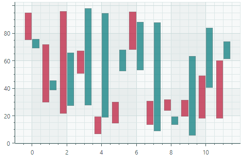

# 并排范围栏系列视图

并排范围条系列视图 (`CartesianSideBySideRangeBarSeriesView`) 在数据系列的两个 Y 值之间绘制矩形条。

## 并排范围栏系列视图的数据

您可以使用以下数据适配器为并排范围栏系列视图提供数据：

数字 _X_ 值：

- `NumericRangeDataAdapter`

日期和时间 _X_ 值：

- `DateTimeRangeDataAdapter`
- `TimeSpanRangeDataAdapter`

定性 _X_ 值：

- `QualitativeRangeDataAdapter`

 
 

* 本页面使用机器翻译技术翻译。
