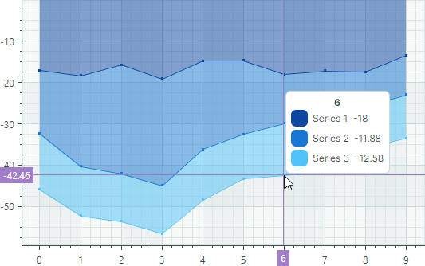

# Stacked Area Series View

Stacked Area Series View（`CartesianStackedAreaSeriesView`）用于显示两个或多个数据系列之间的绝对关系。每个 Stacked Area 系列都渲染为堆叠在前一个 Stacked Area 系列之上的填充区域。系列的厚度由数据点的绝对值决定。顶部线条显示图表控件中所有 Stacked Area 系列的累计总和。


如果图表控件中的所有 Stacked Area 系列都只有负值，则这些系列会沿 _Y_ 轴负方向排列。在这种情况下，底部线条显示累计总和：




- 使用 Stacked Area Series View 可以在同一个图表控件中仅显示正值数据或仅显示负值数据。
- 如果某个 Stacked Area 系列同时包含正值和负值，则所有负值都会被视为零。


## 创建 Stacked Area Series View

通常使用 Stacked Area 视图来显示两个或多个数据系列之间的绝对关系。创建 Stacked Area 图表的步骤包括：

1. 为每个数据系列创建一个 `CartesianSeries` 对象，并将其添加到 `CartesianChart.Series` 集合中。
2. 将 `CartesianSeries.View` 属性设置为一个 `CartesianStackedAreaSeriesView` 对象。
3. 使用 `CartesianSeries.DataAdapter` 属性为该系列提供数据。

以下代码片段展示了如何用 XAML 和 code-behind 创建由两个数据系列组成的 Stacked Area 图表。

``` xml
xmlns:mxc="https://schemas.eremexcontrols.net/avalonia/charts"

<mxc:CartesianChart x:Name="chartControl">
    <mxc:CartesianChart.Series>
        <mxc:CartesianSeries Name="stackedAreaSeries1" DataAdapter="{Binding DataAdapter1}" >
            <mxc:CartesianStackedAreaSeriesView Color="#ffDF3C5F" Transparency="0.6" 
                MarkerSize="3" ShowMarkers="True"/>
        </mxc:CartesianSeries>
        <mxc:CartesianSeries Name="stackedAreaSeries2" DataAdapter="{Binding DataAdapter2}" >
            <mxc:CartesianStackedAreaSeriesView Color="#ff6F9BD1" Transparency="0.6" 
                MarkerSize="3" ShowMarkers="True"/>
        </mxc:CartesianSeries>
    </mxc:CartesianChart.Series>
</mxc:CartesianChart>
```

``` cs
double[] args = new double[] { 1, 2, 3, 4, 5};
double[] values1 = new double[] { 3, 2, 1, 2, 4 };
double[] values2 = new double[] { 1, 2, 1, 2, 2 };

CartesianSeries series1 = new CartesianSeries();
series1.DataAdapter = new SortedNumericDataAdapter(args, values1);
series1.View = new CartesianStackedAreaSeriesView()
{
    Color = Color.FromUInt32(0xffDF3C5F),
    Transparency = 0.6,
    ShowMarkers = true,
    MarkerSize = 5
};
CartesianSeries series2 = new CartesianSeries();
series2.DataAdapter = new SortedNumericDataAdapter(args, values2);
series2.View = new CartesianStackedAreaSeriesView()
{
    Color = Color.FromUInt32(0xff6F9BD1),
    Transparency = 0.6,
    ShowMarkers = true,
    MarkerSize = 5
};

chartControl.Series.Add(series1);
chartControl.Series.Add(series2);
```

结果如下图所示：


### 示例 - 使用 MVVM 设计模式创建 Stacked Area 图表

以下示例通过视图模型创建了三个 Stacked Area 类型的系列。

- `CartesianChart.SeriesSource` 属性绑定到视图模型中的 _SeriesCollection_ 属性。该集合是 _SeriesViewModel_ 对象的数据源，用于初始化图表控件中的各个系列。

- `CartesianChart.SeriesTemplate` 属性被设置为一个模板，该模板根据每个 _SeriesViewModel_ 对象创建一个 Stacked Area 类型的系列（`CartesianSeries` 对象）。系列数据、标题和颜色分别由 _SeriesViewModel.DataAdapter_、_SeriesViewModel.Title_ 和 _SeriesViewModel.Color_ 属性确定。


``` xml
<!-- MainWindow.axaml -->
<mx:MxWindow xmlns="https://github.com/avaloniaui"
        xmlns:x="http://schemas.microsoft.com/winfx/2006/xaml"
        xmlns:vm="using:ChartStackedAreaSeriesViewExample.ViewModels"
        xmlns:d="http://schemas.microsoft.com/expression/blend/2008"
        xmlns:mc="http://schemas.openxmlformats.org/markup-compatibility/2006"
        xmlns:mx="https://schemas.eremexcontrols.net/avalonia"
        xmlns:mxc="https://schemas.eremexcontrols.net/avalonia/charts"
        mc:Ignorable="d" d:DesignWidth="800" d:DesignHeight="450"
        x:Class="ChartStackedAreaSeriesViewExample.Views.MainWindow"
        x:DataType="vm:MainWindowViewModel"
        Icon="/Assets/EMXControls.ico"
        Title="ChartStackedAreaSeriesViewExample">
    <Design.DataContext>
        <vm:MainWindowViewModel/>
    </Design.DataContext>
    <Grid ColumnDefinitions="*" Margin="10">
        <mxc:CartesianChart x:Name="chartControl" BorderThickness="0" SeriesSource="{Binding SeriesCollection}" >
            <mxc:CartesianChart.SeriesTemplate>
                <DataTemplate x:DataType="vm:SeriesViewModel">
                    <mxc:CartesianSeries DataAdapter="{Binding DataAdapter}" SeriesName="{Binding Title}">
                        <mxc:CartesianStackedAreaSeriesView 
                            Color="{Binding Color}"
                            Transparency="0.6"
                            ShowMarkers="True"
                            MarkerSize="3"
                            Thickness="1" />
                    </mxc:CartesianSeries>
                </DataTemplate>
            </mxc:CartesianChart.SeriesTemplate>

            <mxc:CartesianChart.AxesX>
                <mxc:AxisX Name="xAxis" Title="Months" ShowMinorTickmarks="False">
                    <mxc:AxisX.ScaleOptions>
                        <mxc:NumericScaleOptions GridSpacing="1" LabelFormatter="{Binding ArgsLabelFormatter}"/>
                    </mxc:AxisX.ScaleOptions>
                </mxc:AxisX>
            </mxc:CartesianChart.AxesX>
            <mxc:CartesianChart.AxesY>
                <mxc:AxisY Title="Income Distribution">
                </mxc:AxisY>
            </mxc:CartesianChart.AxesY>
        </mxc:CartesianChart>
    </Grid>
</mx:MxWindow>
```

``` cs 
// MainWindow.axaml.cs
using ChartStackedAreaSeriesViewExample.ViewModels;
using Eremex.AvaloniaUI.Controls.Common;

namespace ChartStackedAreaSeriesViewExample.Views;

public partial class MainWindow : MxWindow
{
    public MainWindow()
    {
        InitializeComponent();
        this.DataContext = new MainWindowViewModel();
    }
}
```

``` cs 
// MainWindowViewModel.cs
using Avalonia.Media;
using CommunityToolkit.Mvvm.ComponentModel;
using Eremex.AvaloniaUI.Charts;
using System;
using System.Collections.ObjectModel;

namespace ChartStackedAreaSeriesViewExample.ViewModels;

public partial class MainWindowViewModel : ObservableObject
{
    [ObservableProperty]
    ObservableCollection<SeriesViewModel> seriesCollection = new();

    [ObservableProperty] FuncLabelFormatter argsLabelFormatter = new(o => String.Format("{0:n0}", o));
    public MainWindowViewModel()
    {
        double[] args = new double[] { 1, 2, 3, 4, 5, 6, 7, 8, 9, 10, 11, 12 };
        double[] values1 = new double[] { 10, 15, 20, 18, 10, 8, 12, 14, 15, 20, 17, 20 };
        double[] values2 = new double[] { 10, 5, 5, 10, 20, 18, 17, 15, 20, 25, 27, 30 };
        double[] values3 = new double[] { 15, 10, 15, 25, 22, 20, 15, 17, 20, 20, 15, 20 };

        SeriesCollection.Add(new SeriesViewModel { Title = "Europe", Color = Color.FromUInt32(0xFF9B59B6), DataAdapter = new SortedNumericDataAdapter(args, values1) });
        SeriesCollection.Add(new SeriesViewModel { Title = "Africa", Color = Color.FromUInt32(0xFFE74C3C), DataAdapter = new SortedNumericDataAdapter(args, values2) });
        SeriesCollection.Add(new SeriesViewModel { Title = "Asia", Color = Color.FromUInt32(0xFFF39C12), DataAdapter = new SortedNumericDataAdapter(args, values3) });
    }
}

public partial class SeriesViewModel : ObservableObject
{
    [ObservableProperty] string title;
    [ObservableProperty] Color color;
    [ObservableProperty] ISeriesDataAdapter dataAdapter;
}
```


## Stacked Area Series View 的数据

您可以使用以下数据适配器为 Stacked Area Series View 提供数据：

数值型 _X_ 值：

- `SortedNumericDataAdapter`
- `FormulaDataAdapter`


日期时间型 _X_ 值：

- `SortedDateTimeDataAdapter`
- `SortedTimeSpanDataAdapter`

定性 _X_ 值：

- `QualitativeDataAdapter`


## Stacked Area Series View 设置


- `Color` — 指定用于绘制该系列的颜色。
- `CrosshairMode` — 指定十字线的图表标签是捕捉到最近的数据点，还是显示插值结果。参见 [在十字线图表标签中显示精确值或插值](../crosshair.md#show-an-exact-or-interpolated-value-in-crosshair-series-labels)。
- `MarkerImage` — 获取或设置用作自定义点标记的图像。如果未指定图像，则显示默认的方形标记。您可以使用 `SvgImage` 类实例来指定 SVG 图像。

    `MarkerImage` 属性使用 `[Content]` 特性声明，这使您可以直接在 &lt;CartesianStackedAreaSeriesView&gt; 标签之间定义图像。

    ``` xml
    <mxc:CartesianStackedAreaSeriesView>
        <SvgImage Source="avares://Demo/Assets/circle.svg" />
    </mxc:CartesianStackedAreaSeriesView>
    ```

    SVG 文件包含 SVG 元素的预定义颜色。要使这些颜色与您的数据系列颜色相匹配，您可以：
    
    - 提前手动编辑源 SVG 图像文件
    - 使用 `MarkerImageCss` 属性动态自定义 SVG 元素的[样式](https://developer.mozilla.org/en-US/docs/Web/SVG/Reference/Element/style)。这些样式会在渲染点标记时应用。


- `MarkerImageCss` — 指定用于在运行时自定义由 `MarkerImage` 属性定义的 SVG 图像的 [CSS 样式](https://developer.mozilla.org/en-US/docs/Web/SVG/Reference/Element/style)。主要用途是将 SVG 元素的颜色替换为系列颜色（`Color`）。在 CSS 代码中包含 `{0}` 占位符，以插入 `Color` 属性的值。

    例如，当 `MarkerImage` 属性包含带有 circle 元素的 SVG 图像时，以下 CSS 代码会将 `circle` 样式设置为橙色填充（使用系列颜色）和深红色边框：

    ``` xml
    <mxc:CartesianStackedAreaSeriesView Color="orange" MarkerImageCss="circle {{fill:{0};stroke:darkred;}}">
        <SvgImage Source="avares://Demo/Assets/circle.svg" />
    </mxc:CartesianStackedAreaSeriesView>
    ```
    
    另请参阅：[示例 - 创建 Lollipop Series View 并使用自定义 SVG 标记](lollipop-series-view.md#example-create-a-lollipop-series-view-and-use-custom-svg-data-point-markers)。


- `MarkerSize` — 指定点标记的大小。
- `ShowInCrosshair` — 指定当前系列的十字线图表标签的可见性。参见 [自定义十字线的图表标签](../crosshair.md#hide-a-series-in-the-crosshair)。
- `ShowMarkers` — 启用或禁用点标记。
- `Thickness` — 指定线条的粗细。
- `Transparency` — 一个介于 `0` 和 `1` 之间的值，指定填充区域的透明度级别：
    - `0` 表示完全不透明
    - `1` 表示完全透明

<br>
<br>

<sup>*</sup> 本页面使用机器翻译技术翻译。
