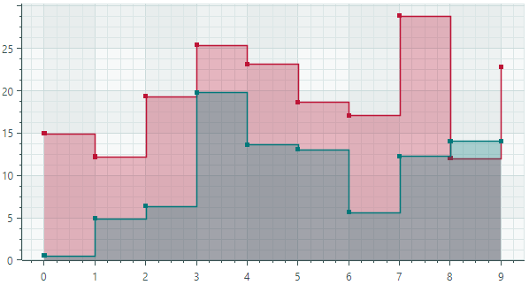

# 台阶区域系列视图

阶梯区域系列视图 (`CartesianStepAreaSeriesView`) 将点与水平和垂直 line 线段连接起来，并绘制填充区域。



## 台阶区域系列视图的数据

您可以使用以下数据适配器为步骤区域系列视图提供数据：

数字 _X_ 值：

- `SortedNumericDataAdapter`
- `FormulaDataAdapter`

日期和时间 _X_ 值：

- `SortedDateTimeDataAdapter`
- `SortedTimeSpanDataAdapter`

定性 _X_ 值：

- `QualitativeDataAdapter`

## 步骤区域系列视图设置

- `Color` — 指定用于 paint 系列的颜色。
- `CrosshairMode` — 指定十字准线的图表 label 是捕捉到最近的数据点，还是显示插值。参见 [Show an Exact or Interpolated Value in Crosshair Chart Labels](../crosshair.md#show-an-exact-or-interpolated-value-in-crosshair-series-labels)。
- `InvertedStep` — 指定相邻数据点之间步骤段的绘制顺序。如果 `InvertedStep` 是 `false`（默认），则步骤由水平段和垂直段组成。如果 `InvertedStep` 是 `true`，则台阶由垂直段和水平段组成。


- `MarkerImage` — 获取或设置用作自定义点标记的 image。如果未指定 image，则显示默认的方形标记。您可以使用 `SvgImage` 类实例来指定 SVG 图像。

`MarkerImage` 属性是使用 `[Content]` 属性来声明的，这允许您直接在 &lt;CartesianStepAreaSeriesView&gt; 标记之间定义 image。

    ``` xml
    <mxc:CartesianStepAreaSeriesView>
        <SvgImage Source="avares://Demo/Assets/circle.svg" />
    </mxc:CartesianStepAreaSeriesView>
    ```

SVG 文件包含 SVG 元素的预定义颜色。要使这些颜色与您的数据系列颜色相匹配，您可以：
    
- 预先手动编辑源 SVG image 文件
    - 使用 `MarkerImageCss` 属性为 SVG 元素动态自定义 [styles](https://developer.mozilla.org/en-US/docs/Web/SVG/Reference/Element/style)。渲染点标记时将应用这些样式。

- `MarkerImageCss` — 指定 [CSS styles](https://developer.mozilla.org/en-US/docs/Web/SVG/Reference/Element/style)，用于由 `MarkerImage` 属性定义的 SVG image 的运行时自定义。主要用例是将 SVG 元素颜色替换为系列颜色 (`Color`)。包含 `{0}` 占位符以在 CSS 代码中插入 `Color` 属性的值。

例如，当 `MarkerImage` 属性包含带有圆形元素的 SVG image 时，以下 CSS 代码将使用橙色填充（使用系列颜色）和深红色边框设置 `circle` 的样式：

    ``` xml
    <mxc:___222___ Color="orange" MarkerImageCss="circle {{fill:{0};stroke:darkred;}}">
        <SvgImage Source="avares://Demo/Assets/circle.svg" />
    </mxc:___222___>
    ```
    
另请参阅：[Example - Create a Lollipop Series View and Use Custom SVG Markers](lollipop-series-view.md#example-create-a-lollipop-series-view-and-use-custom-svg-data-point-markers)。

- `MarkerSize` — 指定点标记的大小。
- `ShowInCrosshair` — 指定当前系列的十字线图表 label 的可见性。参见 [Customize Chart Labels of the Crosshair](../crosshair.md#hide-a-series-in-the-crosshair)。
- `ShowMarkers` — 启用或禁用点标记。
- `Thickness` — 指定 line 厚度。
- `Transparency` — `0` 和 `1` 之间的值，指定填充区域的透明度级别：
    - `0` 表示完全不透明
    - `1`表示完全透明

<br>
<br>

<sup>*</sup> 本页面使用机器翻译技术翻译。
