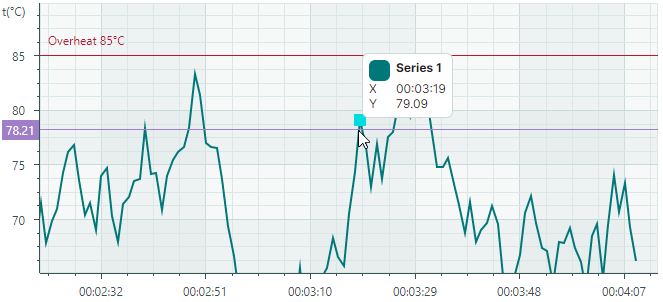
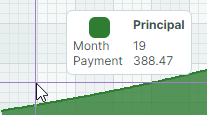
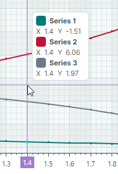

# 十字线


Cartesian Chart control 包括一个十字准线，可让您在当前光标位置查看精确的系列值。十字线呈现为一对水平线和垂直线，当鼠标指针悬停在图表区域上时，十字准线会跟随鼠标指针。它显示一个系列标签（或多个系列的多个标签），该系列显示系列值，并突出显示轴上当前的 _X_ 和 _Y_ 坐标。


要自定义十字线的显示设置或禁用此功能，请使用 `Eremex.AvaloniaUI.Charts.CrosshairOptions` 类的实例初始化 `CartesianChart.CrosshairOptions` 属性。然后使用 `CrosshairOptions` 类公开的属性根据需要调整十字线设置。


## 禁用十字线

`CrosshairOptions.ShowCrosshair` 属性允许您禁用十字准线。

``` xml
<mxc:CartesianChart x:Name="chartControl1" >
    <mxc:CartesianChart.CrosshairOptions>
        <mxc:CrosshairOptions ShowCrosshair="False"/>
    </mxc:CartesianChart.CrosshairOptions>
    <!-- ... -->
</mxc:CartesianChart>
```

## 禁用十字准线的单独线条和轴标签

`CrosshairOptions.ShowArgumentLine` 和 `CrosshairOptions.ShowValueLine` 属性可分别用于隐藏十字线的垂直和水平线。要防止为 _X_ 和 _Y_ 轴显示十字准线标签，请使用 `CrosshairOptions.ShowArgumentLabel` 和 `CrosshairOptions.ShowValueLabel` 属性。

以下示例隐藏 _X_ 轴的十字准线的垂直线和标签：



``` xml
<mxc:CartesianChart x:Name="chartControl1" >
    <mxc:CartesianChart.CrosshairOptions>
        <mxc:CrosshairOptions ShowArgumentLabel="False" ShowValueLabel="False"/>
    </mxc:CartesianChart.CrosshairOptions>
    <!-- ... -->
</mxc:CartesianChart>
```

## 自定义十字线系列标签

十字线系列标签显示系列的名称和当前值。


### 设置十字准线系列标签中值的格式

十字线标签中显示的值最初使用默认格式：



要以自定义方式格式化这些值，请创建一个格式化程序对象并将其分配给 `Axis.ScaleOptions.CrosshairLabelFormatter` 属性。类似地，轴值可以被[格式化](cartesian-chart.md#format-axis-labels)（请参阅 `Axis.ScaleOptions.LabelFormatter` 属性）。

您可以使用 `Eremex.AvaloniaUI.Charts.FuncLabelFormatter` 对象基于函数/表达式来实现自定义标签格式化程序。

以下示例创建一个将数值格式化为货币的格式化程序对象。此格式化程序用于格式化 _Y_ 轴值和十字线系列标签中的值。


``` xml
<mxc:CartesianChart.AxesY>
    <mxc:AxisY Title="Payment">
        <mxc:AxisY.ScaleOptions>
            <mxc:NumericScaleOptions
                CrosshairLabelFormatter="{Binding CurrencyFormatter}"
                LabelFormatter="{Binding CurrencyFormatter}"/>
        </mxc:AxisY.ScaleOptions>
    </mxc:AxisY>
</mxc:CartesianChart.AxesY>
```

``` cs
public partial class MainViewModel : ViewModelBase 
{
[ObservableProperty] 
FuncLabelFormatter currencyFormatter = new(o => String.Format("{0:c}", o));
}
```


<!-- 
TODO
### Change the Template of Crosshair Series Labels 

-->


### 在十字准线中隐藏系列

系列视图的 `CrosshairSeriesViewBase.ShowInCrosshair` 属性指定该系列在十字线标签中的可见性。

<!-- TODO
Add an image of the crosshair chart label, as many other topics refer to this section
 -->

以下代码定义了两个系列（_Interest_ 和 _Principal_）。对于第一个系列，`ShowInCrosshair` 属性设置为 `false` 以将其隐藏在十字准线中：


``` xml
<mxc:CartesianChart.Series>
    <mxc:CartesianSeries DataAdapter="{Binding InterestSeriesDataAdapter}" SeriesName="Interest">
        <mxc:CartesianAreaSeriesView Color="#F9A825" Transparency="0.2" 
          MarkerSize="2" ShowMarkers="True"
          ShowInCrosshair="False" />
    </mxc:CartesianSeries>

    <mxc:CartesianSeries DataAdapter="{Binding PrincipalSeriesDataAdapter}" SeriesName="Principal">
        <mxc:CartesianAreaSeriesView Color="#2E7D32" Transparency="0.2" MarkerSize="2" ShowMarkers="True" />
    </mxc:CartesianSeries>
</mxc:CartesianChart.Series>
```


### 十字线系列标签的水平缩进

`CrosshairOptions.SeriesLabelIndent` 属性允许您调整十字准线系列标签和十字准线垂直线之间的水平距离。该属性的默认值为 2。


``` xml
<mxc:CartesianChart.CrosshairOptions>
    <mxc:CrosshairOptions SeriesLabelIndent="30"/>
</mxc:CartesianChart.CrosshairOptions>
```


### 在十字线系列标签中显示精确值或插值

Cartesian Chart 支持由排序的离散数据点组成的系列。对于这些系列，十字准线并不总是与数据点相交，但最常显示在数据点之间。 
您可以使用 `CartesianSortedLineSeriesView.CrosshairMode` 属性指定十字准线标签是否捕捉到最近的数据点，或显示插值。可以使用以下选项：

- `CrosshairSeriesMode.Point` — 十字线标签捕捉到最近的数据点并显示其值。
  


- `CrosshairSeriesMode.Interpolate` — 十字线系列标签显示垂直十字线与图表相交处的点的插值。


以下代码展示了如何自定义 `CrosshairMode` 选项：

``` xml
<mxc:CartesianChart.Series>
    <mxc:CartesianSeries DataAdapter="{Binding Series.DataAdapter}">
        <mxc:CartesianLineSeriesView Color="{Binding Series.Color}" Thickness="2" CrosshairMode="Interpolate"/>
    </mxc:CartesianSeries>
</mxc:CartesianChart.Series>

```

### 为多个系列自定义十字线标签

#### 标签显示模式

当 Cartesian Chart 包含多个系列时，十字准线显示每个系列的标签：


`CrosshairOptions.SeriesLabelMode` 属性指定是否以及如何组合多个系列标签。可以使用以下选项：

- `CrosshairSeriesLabelMode.Smart`（默认）— 每个系列显示自己的十字准线标签。当标签重叠时，它们会合并为一个标签。
  


- `CrosshairSeriesLabelMode.ForEachSeries` — 每个系列都显示自己的十字准线标签。在此模式下标签可能会重叠。
  


- `CrosshairSeriesLabelMode.ForNearestSeries` — 仅针对距离光标最近的系列显示十字准线标签。
  


- `CrosshairSeriesLabelMode.OneForAllSeries` — 十字准线显示单个标签，其中组合了所有系列的信息。



以下示例在存在多个系列时启用单个十字线标签。

``` xml
<mxc:CartesianChart.CrosshairOptions>
    <mxc:CrosshairOptions SeriesLabelMode="OneForAllSeries"/>
</mxc:CartesianChart.CrosshairOptions>
```

#### 系列排序

当多个系列组合在单个十字线 label 中时，您可以使用 `CrosshairOptions.SeriesLabelItemSortMode` 属性指定系列在标签中的显示顺序。该属性可以设置为以下值：

- `CrosshairSeriesLabelItemSortMode.BySeries`（默认）— 按系列添加到 `CartesianChart.Series` 集合的顺序对系列进行排序。


- `CrosshairSeriesLabelItemSortMode.ByValue` — 按 _Y_ 值对系列进行排序。


## 显示延迟

使用 `CrosshairOptions.SeriesLabelShowDelay` 属性指定显示十字线系列标签之前的延迟（以毫秒为单位）。

## 仅包含光标附近的系列

默认情况下，线性图表显示所有在当前参数值处具有数据点的系列的十字准线标签。


图表控件允许您将十字准线标签限制为光标附近的系列。使用 `CrosshairOptions.MaxPickDistance` 属性指定搜索要包含在十字准线标签中的数据点的范围。对于常规线性图表，`MaxPickDistance` 属性指定向上或向下的最大垂直距离（以像素为单位）。


在上面的图像中，只有_系列 1_ 和_系列 3_ 的数据点位于自定义 `MaxPickDistance` 值限制的范围内。 _Series 2_（红色线条）的数据点超出此范围，因此未显示。


对于 [Scatter Line views](cartesian-series-views/scatter-line-series-view.md)，`MaxPickDistance` 属性指定光标周围的圆形区域的半径，在该区域内搜索数据点。

!!!提示

要显示距离光标最近的单个系列的十字线标签，请将 `CrosshairOptions.SeriesLabelMode` 属性设置为 `ForNearestSeries`。参见 [Label Display Mode](#label-display-mode)。


## 自定义 _X_ 和 _Y_ 轴上的十字准线和标签

图表控件的 `CrosshairOptions` 对象包含一组属性，允许您更改十字线、_X_ 轴标签和 _Y_ 轴标签的视觉设置。

- `ArgumentColor` — 十字线 _X_ 轴标签的背景颜色。
- `ArgumentLineThickness` — 十字线参数线的粗细。
- `ArgumentTextColor` — 十字线 _X_ 轴标签的前景色（文本）颜色。
- `ValueColor` — 十字线 _Y_ 轴标签的背景颜色。
- `ValueLineThickness` — 十字准线值线的粗细。
- `ValueTextColor` — 十字线 _Y_ 轴标签的前景色（文本）颜色。

以下 XAML 代码演示了如何为示例图表控件自定义这些设置。十字线线条厚度设置为 3。十字线标签具有灰色背景，但文本颜色不同：_X_ 轴标签为黄色，_Y_ 轴标签为青色。


``` xml
<mxc:CartesianChart ...>
    <mxc:CartesianChart.CrosshairOptions>
        <mxc:CrosshairOptions 
            ArgumentColor="Gray" ArgumentTextColor="Yellow" ArgumentLineThickness="3"
            ValueColor="Gray" ValueTextColor="Cyan" ValueLineThickness="3" />
    </mxc:CartesianChart.CrosshairOptions>
</mxc:CartesianChart>
```

<br>
<br>

<sup>*</sup> 本页面使用机器翻译技术翻译。
