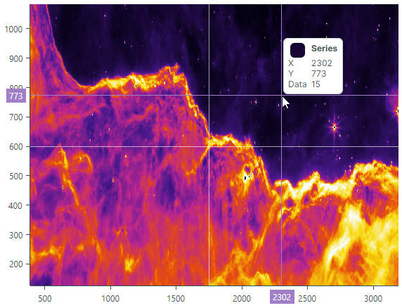
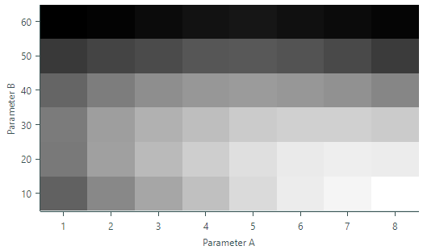
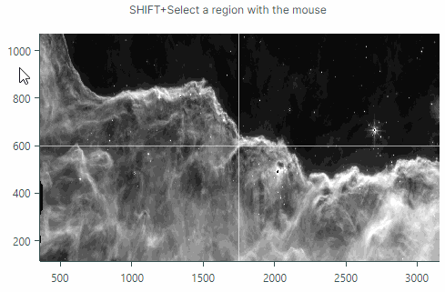

# 热图

热图控件 (`Eremex.AvaloniaUI.Charts.Heatmap`) 允许您创建二维 [heat map](https://en.wikipedia.org/wiki/Heat_map)，这是一种使用颜色可视化数据的图表。 
控件使用与该点的值相对应的颜色绘制 2D“地图”内的每个数据点。

热图控件是 `Eremex.AvaloniaUI.Charts.ChartControl` 的后代，它是所有图表控件的基类，包括 `CartersianChart` 和 `PolarChart`。因此，它继承了所有图表控件共有的特定功能。热图控件的功能包括：

- 自定义颜色编码
- 灰度着色
- X和Y轴的定制
- 十字线 
- 条带和恒定线
- 使用鼠标和键盘滚动和缩放
- 将数据着色结果导出为位图





## 演示应用程序

请参阅 Eremex Controls 演示应用程序，了解演示热图控件功能的示例。

## 开始使用热图控制

设置热图控件，[提供数据](#provide-data)给控件，并[指定颜色提供程序](#data-point-value-colorization)，根据特定逻辑为数据点的值着色。您还可以自定义轴以显示轴值，例如常量线。

请注意，热图控件中的 _X_ 和 _Y_ 轴是定性的。这些轴的参数是字符串类型。
“地图”内的数据点的值是Double类型。


## 提供数据

将 `Heatmap.DataAdapter` 属性设置为 `Eremex.AvaloniaUI.Charts.HeatmapDataAdapter` 对象，为热图控件提供数据。 
`HeatmapDataAdapter`类包含以下需要初始化的主要属性：

``` cs
public class HeatmapDataAdapter : ISeriesDataAdapter
{
    public IList<string> XArguments;
    public IList<string> YArguments;
    public double[,] Values;
    //...
}
```

- `XArguments` — 指定 _X_ 轴参数的字符串列表。 _X_ 参数必须是唯一的。
- `YArguments` — 指定 _Y_ 轴参数的字符串列表。 _Y_ 参数必须是唯一的。
- `Values` — Double 类型值的二维数组。
    
`Values` 数组的宽度和高度必须分别与 `XArguments` 和 `YArguments` 列表中的项目数匹配。
    
`Values` 数组可能包含特定点的 `Double.NaN` 值。这些点不是由热图控件渲染的，用户可以通过这些点看到控件的背景。

`Values` 数组的行由热图控件从下到上呈现。
    `Values` 数组的第一行呈现在底部，最后一行呈现在顶部。有关详细信息，请参阅下面的示例。

使用以下方法在运行时更新热图控件的数据：

- `HeatmapDataAdapter.UpdateValues(double[,] newValues)` — 使用该方法的 `newValues` 参数指定的值更新当前值 (`HeatmapDataAdapter.Values`)。 `newValues` 数组中的列数和行数必须与 `HeatmapDataAdapter.Values` 数组中的列数和行数匹配。
- `HeatmapDataAdapter.UpdateXArguments(IList<string> newArguments)` — 使用新参数更新当前 _X_ 参数 (`HeatmapDataAdapter.XArguments`)。 `newArguments` 列表中的元素数量必须与 `HeatmapDataAdapter.XArguments` 列表中的元素数量匹配。 _X_ 参数必须是唯一的。
- `HeatmapDataAdapter.UpdateYArguments(IList<string> newArguments)` — 使用新参数更新当前 _Y_ 参数 (`HeatmapDataAdapter.YArguments`)。 `newArguments` 列表中的元素数量必须与 `HeatmapDataAdapter.YArguments` 列表中的元素数量匹配。 _Y_ 参数必须是唯一的。

### 示例 - 提供数据并使用默认渲染

以下示例向热图控件提供示例数据。 
数据表示一个由三行五列组成的二维数组。

控件的默认颜色提供程序 (`HeatmapGrayscaleColorProvider`) 表示最小值为黑色，最大值为白色。其他值以成比例的灰色阴影着色。


``` cs
//Create an array that contains 3 rows with 5 values in each row
double[,] values = new double[,] 
{
    {1, 2, 3, 4, 5}, // values rendered at the bottom
    {6, 7, 8, 9, 10},
    {11, 12, 13, 14, 15}, // values rendered at the top
};
List<string> xArgs = new List<string>() { "A", "B", "C", "D", "E" };
List<string> yArgs = new List<string>() { "I", "II", "III" };

HeatmapDataAdapter dataAdapter = new HeatmapDataAdapter(xArgs, yArgs, values);
heatMap1.DataAdapter = dataAdapter;
```


## 数据点值着色

颜色提供程序用于为热图控件中的数据点着色。对于每个数据点，控件从颜色提供程序（`Heatmap.ColorProvider` 属性）请求特定值的颜色。

可以使用以下颜色提供程序：

- `HeatmapGrayscaleColorProvider`（默认）— 允许您以灰度颜色值。
- `HeatmapRangeColorProvider` — 允许您通过将自定义颜色与特定值关联，以自定义方式为数据点着色。


需要时，您可以通过实现 `IHeatmapColorProvider` 接口来创建自己的颜色提供程序。

## 灰度着色

热图控件默认使用数据点的灰度着色。灰度着色由`HeatmapGrayscaleColorProvider`实现。要使用此颜色提供程序，您可以保留 `Heatmap.ColorProvider` 属性未分配，或将 `Heatmap.ColorProvider` 属性显式设置为 `HeatmapGrayscaleColorProvider` 对象。

`HeatmapGrayscaleColorProvider` 对象将所有数据点的最小值呈现为黑色，最大值呈现为白色。位于最小值和最大值之间的其他值以成比例的灰色阴影呈现。

### 示例 - 灰度着色

以下示例将热图控件绑定到样本数据并使用默认颜色提供程序 (`HeatmapGrayscaleColorProvider`) 渲染数据点。该代码还展示了如何更改轴标题。



```xml
xmlns:mxc="https://schemas.eremexcontrols.net/avalonia/charts"

<mxc:Heatmap DataAdapter="{Binding DataAdapter}">
    <mxc:Heatmap.AxisX>
        <mxc:HeatmapAxisX Title="Parameter A">
        </mxc:HeatmapAxisX>
    </mxc:Heatmap.AxisX>
    <mxc:Heatmap.AxisY>
        <mxc:HeatmapAxisY Title="Parameter B">
        </mxc:HeatmapAxisY>
    </mxc:Heatmap.AxisY>
</mxc:Heatmap>
```

```cs
public partial class MainWindowViewModel : ViewModelBase
{
    [ObservableProperty]
    HeatmapDataAdapter dataAdapter;

    public MainWindowViewModel()
    {
        double[,] values = new double[,]
        {
            {148, 169, 185, 199, 213, 223, 228, 233}, // values rendered at the bottom
            {161, 182, 196, 207, 216, 222, 224, 223},
            {162, 181, 191, 198, 205, 208, 208, 205},
            {150, 163, 172, 177, 179, 177, 174, 168},
            {126, 132, 136, 142, 143, 140, 135, 127},
            {95, 97, 101, 105, 107, 104, 101, 98} // values rendered at the top
        };

        List<string> xArgs = new List<string>() { "1", "2", "3", "4", "5", "6", "7", "8" };
        List<string> yArgs = new List<string>() { "10", "20", "30", "40", "50", "60"};

        dataAdapter = new HeatmapDataAdapter(xArgs, yArgs, values);
    }
}
```


## 自定义着色

要以自定义方式为热图控件中的数据点着色，请将 `HeatmapRangeColorProvider` 对象分配给 `Heatmap.ColorProvider` 属性。 `HeatmapRangeColorProvider` 允许您将自定义颜色与特定值（过渡值）关联。为了计算两个过渡值之间的值的颜色，`HeatmapRangeColorProvider` 使用分配给这些过渡值的颜色之间的渐变。

指定过渡值时，您可以指定绝对或标准化幅度。

以下图像显示 `HeatmapRangeColorProvider` 如何在样本绝对过渡值之间构建颜色渐变。在此示例中定义了三个转换值：

- 值 1 与青色关联
- 值 6 与黄色关联
- 值 10 与紫色关联


### 示例 - 自定义着色

以下示例使用 `HeatmapRangeColorProvider` 根据自定义颜色规则对热图控件的数据点进行着色。该代码指定颜色来表示绝对过渡值：95、110、150、210 和 233。
其他值的颜色是根据分配给相邻过渡值的颜色之间的梯度计算的。


``` xml
xmlns:mxc="https://schemas.eremexcontrols.net/avalonia/charts"

<mxc:Heatmap DataAdapter="{Binding DataAdapter}" ColorProvider="{Binding ColorProvider}">
    <mxc:Heatmap.AxisX>
        <mxc:HeatmapAxisX Title="Parameter A">
        </mxc:HeatmapAxisX>
    </mxc:Heatmap.AxisX>
    <mxc:Heatmap.AxisY>
        <mxc:HeatmapAxisY Title="Parameter B">
        </mxc:HeatmapAxisY>
    </mxc:Heatmap.AxisY>
</mxc:Heatmap>
```

``` cs
public partial class MainWindowViewModel : ViewModelBase
{
    [ObservableProperty]
    HeatmapDataAdapter dataAdapter;

    [ObservableProperty]
    HeatmapRangeColorProvider colorProvider = new HeatmapRangeColorProvider();

    public MainWindowViewModel()
    {
        HeatmapRangeStop[] colorRanges = new HeatmapRangeStop[]
        {
            new() { Value = 95, Color = Color.FromRgb(0,102,101) },
            new() { Value = 110, Color = Color.FromRgb(1,210,207) },
            new() { Value = 150, Color = Color.FromRgb(0,155,105)},
            new() { Value = 210, Color = Color.FromRgb(81,206,68)},
            new() { Value = 233, Color = Color.FromRgb(213,248,0) }
        };
        colorProvider.AddRange(colorRanges);

        double[,] values = new double[,]
        {
            {148, 169, 185, 199, 213, 223, 228, 233}, // values rendered at the bottom
            {161, 182, 196, 207, 216, 222, 224, 223},
            {162, 181, 191, 198, 205, 208, 208, 205},
            {150, 163, 172, 177, 179, 177, 174, 168},
            {126, 132, 136, 142, 143, 140, 135, 127},
            {95, 97, 101, 105, 107, 104, 101, 98}    // values rendered at the top
        };

        List<string> xArgs = new List<string>() { "1", "2", "3", "4", "5", "6", "7", "8" };
        List<string> yArgs = new List<string>() { "10", "20", "30", "40", "50", "60"};

        dataAdapter = new HeatmapDataAdapter(xArgs, yArgs, values);
    }
}
```

### 超出边界过渡值的颜色

通常，`HeatmapRangeColorProvider` 对象应包括整个值范围的最小值和最大值的颜色。这可确保 `HeatmapRangeColorProvider` 对象构建的颜色渐变覆盖提供给热图控件的所有值。
否则，超出边界过渡值的值将使用与边界过渡值相同的颜色进行着色。

以下图像演示了当特定值超出最小和最大过渡值时 `HeatmapRangeColorProvider` 如何计算颜色。


### 标准化转换值

如果您不知道整个数据范围的最小和最大绝对值，可以使用归一化幅度指定过渡值。将 `HeatmapRangeColorProvider.IsNormalizedValues` 属性设置为 `true` 以启用 `HeatmapRangeColorProvider` 对象的值标准化。在此模式下，指定 `0` 和 `1` 之间的转换值，其中 `0` 和 `1` 分别表示最小值和最大值。归一化值 `0.5` 表示数据范围中间的绝对值 (`minimum + (maximum-minimum)/2`)。


#### 示例 - 如果事先不知道最小值和最大值，则对数据点进行着色

以下示例使用 `HeatmapRangeColorProvider` 对象通过标准化过渡值对数据点进行着色。 `HeatmapRangeColorProvider.IsNormalizedValues` 属性设置为 `true` 以启用值标准化。转变值以标准化量值指定：0、0.3、0.7 和 1，其中值 0 和 1 表示数据范围的最小值和最大值。


``` cs
double[,] values = new double[,]
{
    {-5, -4, -3, -2, -1, 0}, // values rendered at the bottom
    {1, 2, 3, 4, 5, 6}       // values rendered at the top
};

List<string> xArgs = new List<string>();

for (int i=1; i <= values.GetLength(1); i++)
{
    xArgs.Add((i*10).ToString());
}

List<string> yArgs = new List<string>() { "p1", "p2" };


HeatmapRangeColorProvider colorProvider = new HeatmapRangeColorProvider();
colorProvider.IsNormalizedValues = true;
HeatmapRangeStop[] colorRanges = new HeatmapRangeStop[]
{
    new() { Value = 0, Color = Colors.Pink },
    new() { Value = 0.3, Color = Colors.Purple},
    new() { Value = 0.7, Color = Colors.Orange },
    new() { Value = 1, Color = Colors.Green},
};
colorProvider.AddRange(colorRanges);

heatmap.ColorProvider = colorProvider;
heatmap.DataAdapter = new HeatmapDataAdapter(xArgs, yArgs, values);
```

## 轴

热图控件包含两个轴：_X_ 和 _Y_。这些轴的参数通过 `xArguments` 和 `yArguments` 参数调用 `HeatmapDataAdapter` 构造函数来提供。

``` cs
double[,] values = new double[,] 
{
    {1, 2, 3, 4, 5}, // values rendered at the bottom
    {6, 7, 8, 9, 10},
    {11, 12, 13, 14, 15}, // values rendered at the top
};
List<string> xArgs = new List<string>() { "A", "B", "C", "D", "E" };
List<string> yArgs = new List<string>() { "I", "II", "III" };
//...
HeatmapDataAdapter dataAdapter = new HeatmapDataAdapter(xArgs, yArgs, values);
heatmap.DataAdapter = dataAdapter;
```

- control 的轴是定性的，这意味着它们的值是字符串类型。
- `yArguments` 列表中的元素数量必须与二维数据数组 (`HeatmapDataAdapter.Values`) 中的行数匹配。
- `xArguments` 列表中的元素数量必须与二维数据数组 (`HeatmapDataAdapter.Values`) 中的列数匹配。

您可以通过指定 `Heatmap.AxisX` 和 `Heatmap.AxisY` 对象来自定义轴设置。

以下代码设置轴的标题。

``` xml
xmlns:mxc="https://schemas.eremexcontrols.net/avalonia/charts"

<mxc:Heatmap ...>
    <mxc:Heatmap.AxisX>
        <mxc:HeatmapAxisX Title="Axis X">
        </mxc:HeatmapAxisX>
    </mxc:Heatmap.AxisX>
    <mxc:Heatmap.AxisY>
        <mxc:HeatmapAxisY Title="Axis Y">
        </mxc:HeatmapAxisY>
    </mxc:Heatmap.AxisY>
</mxc:Heatmap>
```


### 轴刻度

您可以使用 `AxisX.ScaleOptions` 和 `AxisY.ScaleOptions` 属性来自定义轴显示选项。这些属性属于 `QualitativeScaleOptions` 类型。

以下示例将 `GridSpacing` 比例 option 设置为 2，以显示每秒 label 和主要刻度线，并跳过其间的标签和刻度线。


``` xml
<mxc:HeatmapAxisX >
    <mxc:HeatmapAxisX.ScaleOptions>
        <mxc:QualitativeScaleOptions GridSpacing="2" />
    </mxc:HeatmapAxisX.ScaleOptions>
</mxc:HeatmapAxisX>
```


#### 设置轴标签格式

`ScaleOptions.LabelFormatter` 属性允许您指定以自定义方式格式化轴显示值的对象。您可以使用 `Eremex.AvaloniaUI.Charts.FuncLabelFormatter` 对象基于函数/表达式实现自定义 label 格式化程序。

以下示例为轴值实现自定义 label 格式化程序。


``` xml
<mxc:Heatmap Grid.Row="1" Name="heatmap">
    <mxc:Heatmap.AxisX>
        <mxc:HeatmapAxisX Title="Parameter A">
            <mxc:HeatmapAxisX.ScaleOptions>
                <mxc:QualitativeScaleOptions LabelFormatter="{Binding CustomLabelFormatter}" />
            </mxc:HeatmapAxisX.ScaleOptions>
        </mxc:HeatmapAxisX>
    </mxc:Heatmap.AxisX>
</mxc:Heatmap>
```

``` cs
public partial class MainWindowViewModel : ViewModelBase
{
    // ...
    [ObservableProperty] FuncLabelFormatter customLabelFormatter = new(o => String.Format("val: {0}", o));
}
```


### 轴设置

以下列表总结了热图 control 轴的显示和行为设置：

- `ConstantLines` 和 `ConstantLinesSource` — 允许您使用 paint 常数行获取特定值。参见 [Constant Lines and Strips](#constant-lines-and-strips)。
- `EnableZooming` — 允许用户使用鼠标滚轮和键盘缩放轴。
- `EnableScrolling` — 允许用户通过鼠标拖动操作和键盘快捷键滚动轴。
- `InterlacingColor` - 用于 paint 交错带状线的颜色（当启用 `ShowInterlacing` option 时）。
- `MinorCount` — 指定次刻度线和网格线的数量。
- `Position` — 指定轴的 position。可用选项包括：`Near`（X 轴显示在底部，Y 轴显示在图表左边缘）和 `Far`（X 轴显示在顶部，Y 轴显示在图表右边缘）。
- `ShowAxisLine` — 指定轴线的可见性。
- `ShowInterlacing` — 指定 paint 是否在主网格线之间交错带状线。请参阅 `ShowMajorGridlines` 了解更多信息。
- `ShowLabels` — 指定与主要刻度线对应的标签的可见性。
- `ShowMajorGridlines` — 指定与主要刻度线对应的网格线的可见性。主要和次要网格线显示在彩色数据点后面。网格线在以下情况下可见：
    
- 在使用半透明颜色渲染数据点的位置。
    - 在未渲染数据点的位置（例如，当数据点的值为 `Double.NaN` 时）。
    
- `ShowMajorTickmarks` — 指定主要刻度线的可见性。
- `ShowMinorGridlines` — 指定与小刻度线对应的网格线的可见性。请参阅 `ShowMajorGridlines` 了解更多信息。
- `ShowMinorTickmarks` — 指定小刻度线的可见性。
- `ShowTitle` — 指定轴标题的可见性（`Title` 属性）。
- `Strips` 和 `StripsSource` — 允许您填充特定值之间的范围。参见 [Constant Lines and Strips](#constant-lines-and-strips)。
- `Thickness` — 轴线的粗细。
- `Title` — 获取或设置轴的标题。
- `TitlePosition` — 获取或设置轴标题的 position。


## 十字线

十字准线是一对细垂直线和水平线（参数线和值线），允许用户查看当前光标位置处的轴和数据点的精确值。将鼠标悬停在数据区域上时会出现十字准线，并跟随鼠标指针。


使用 `Heatmap.CrosshairOptions` 属性自定义十字准线的显示设置，或禁用此功能。

### 禁用十字线

`CrosshairOptions.ShowCrosshair` 属性允许您禁用十字准线。

``` xml
<mxc:Heatmap x:Name="heatmap1" >
    <mxc:Heatmap.CrosshairOptions>
        <mxc:CrosshairOptions ShowCrosshair="False" />
    </mxc:Heatmap.CrosshairOptions>
    <!-- ... -->
</mxc:Heatmap>
```

## 恒定线和条

热图 control 允许您使用恒定线和条来标记水平轴和垂直轴的特定值和值范围。

### 恒定线

常量 line 是垂直于标记特定轴值的轴绘制的 line。要创建常量线，请使用 `ConstantLines` 集合或 `HeatmapAxisX` 和 `HeatmapAxisY` 对象的 `ConstantLinesSource` 源。

以下示例为 _X_ 和 _Y_ 轴创建常量线，以分别标记轴值“H”和“V”。


``` xml
<mxc:Heatmap Name="heatmap">
    <mxc:Heatmap.AxisX>
        <mxc:HeatmapAxisX Title="Parameter A">
            <mxc:HeatmapAxisX.ConstantLines>
                <mxc:ConstantLine AxisValue="H" ShowTitle="True" Title="Level H" Color="DimGray" ShowBehind="False" />
            </mxc:HeatmapAxisX.ConstantLines>
        </mxc:HeatmapAxisX>
    </mxc:Heatmap.AxisX>
    <mxc:Heatmap.AxisY>
        <mxc:HeatmapAxisY Title="Parameter X">
            <mxc:HeatmapAxisY.ConstantLines>
                <mxc:ConstantLine AxisValue="V" ShowTitle="True" Title="Level V" Color="DimGray" ShowBehind="False" />
            </mxc:HeatmapAxisY.ConstantLines>
        </mxc:HeatmapAxisY>
    </mxc:Heatmap.AxisY>            
</mxc:Heatmap>
```

将 `ConstantLine.ShowBehind` option 设置为 `false` 以在彩色数据点上方绘制恒定线。否则，它们将绘制在数据点后面，并且在以下情况下可见：
    
- 在使用半透明颜色渲染数据点的位置。
- 在未渲染数据点的位置（例如，当数据点的值为 `Double.NaN` 时）。

### 条带

条带是恒定线的延伸。条带用于突出显示轴值的范围。它们始终显示在彩色数据点后面。

要创建条带，请使用 `Strips` 集合或 `HeatmapAxisX` 和 `HeatmapAxisY` 对象的 `StripsSource` 源。

``` xml
<mxc:Heatmap.AxisY>
    <mxc:HeatmapAxisY Title="Parameter">
        <mxc:HeatmapAxisY.Strips>
            <mxc:Strip AxisValue1="W" AxisValue2="V" Color="Gray" />
        </mxc:HeatmapAxisY.Strips>
    </mxc:HeatmapAxisY>
</mxc:Heatmap.AxisY>
```

在以下情况下，条带可见：
    
- 在使用半透明颜色渲染数据点的位置。
- 在未渲染数据点的位置（例如，当数据点的值为 `Double.NaN` 时）。


## 滚动和缩放

### 允许滚动和缩放操作

默认情况下启用滚动和缩放操作。以下选项允许您禁用 _X_ 和/或 _Y_ 轴的这些操作：

- `Axis.EnableZooming`
- `Axis.EnableScrolling`

``` xml
<!-- Disable scroll and zoom operations for the X axis -->
<mxc:Heatmap.AxisX>
    <mxc:HeatmapAxisX EnableZooming="False" EnableScrolling="False"/>
</mxc:Heatmap.AxisX>
<!-- Disable scroll and zoom operations for the Y axis -->
<mxc:Heatmap.AxisY>
    <mxc:HeatmapAxisY EnableZooming="False" EnableScrolling="False"/>
</mxc:Heatmap.AxisY>
```


### 按用户滚动和缩放

#### 滚动热图（_X_ 和 _Y_ 轴同时滚动）

- 用鼠标拖动数据区域

或者

- 按 Ctrl+箭头键使用键盘滚动。

<!-- TODO
Make animations for scrolling and zooming features, like in Charts
 -->


#### 缩放热图

- 在数据区域上滚动鼠标滚轮

或者

- 按 Ctrl+'+' 放大，按 Ctrl+'-' 缩小。


#### 滚动 _X_ 或 _Y_ 轴

- 用鼠标在相应的轴区域内拖动。

#### 缩放 _X_ 或 _Y_ 轴

- 在相应的轴区域内滚动鼠标滚轮。


#### 放大特定区域

- 在数据区域中按住 SHIFT，然后拖动以选择所需的矩形。

#### 放大轴上的值范围

- 在轴区域按住 SHIFT，然后拖动以选择所需的范围。



### 导出

您可以使用 `Heatmap.Export` method 将 control 的渲染导出到 `WriteableBitmap` 对象。生成的位图包含彩色数据点。位图的大小与 `Heatmap.DataAdapter.Values` 数组指定的热图 control 数据的大小相匹配。

以下示例将热图 control 的渲染保存到 image 文件。

``` cs
WriteableBitmap bitmap = heatmap.Export();
bitmap.Save("exported-heatmap.png");
```

<br>
<br>

<sup>*</sup> 本页面使用机器翻译技术翻译。
