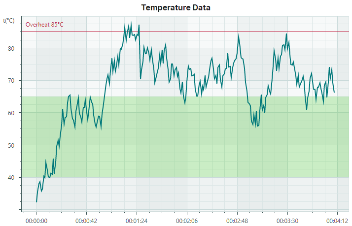
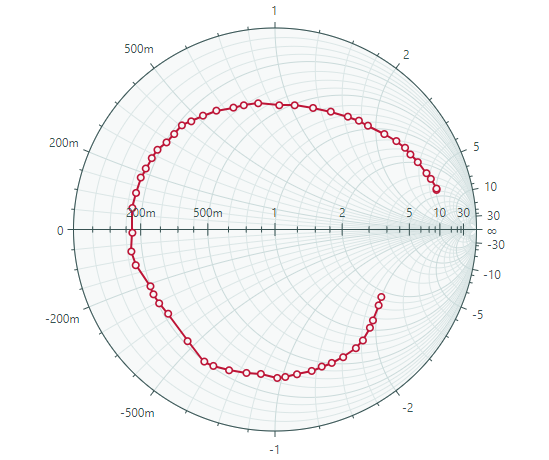

# Charts

面向 Avalonia UI 的 Eremex Controls 库包含功能强大的图表控件，可帮助您将数据可视化为 2D 图表。这些图表控件的图形渲染经过优化，可显示大量数据。即使系列包含数百万个点，控件仍能保持高性能。

## CartesianChart

[CartesianChart](cartesian-chart.md) 允许您在笛卡尔坐标系中绘制图表。

### 功能特性

- 每个图表中数据系列数量不受限制
- 支持多坐标轴
- 交换 X 轴和 Y 轴
- 反转坐标轴
- 多种坐标轴类型：数值（Numeric）、日期时间（Date-Time）、时间跨度（Time Span）、定性（Qualitative）和对数（Logarithmic）
- 同时滚动和缩放所有坐标轴
- 滚动和缩放单个坐标轴
- 显示大量数据时的高性能表现
- 实时数据可视化
- 十字准线（Crosshair）
- 条带（Strips）和常量线（constant lines）
- 使用 MVVM 设计模式来提供数据并自定义图表选项
- 显示快速变化的实时数据。使用专用的数据适配器实现可移动的视口（moving viewport）

### 系列类型

* Line Series View
* Scatter Line Series View
* Point Series View（支持 SVG 标记）
* Area Series View
* Step Line Series View
* Step Area Series View
* Range Area Series View
* Stacked Area Series View *
* Full-Stacked Area Series View *
* Bar Series View
* Range Bar Series View 
* Candlestick Series View
* Lollipop Series View

有关更多信息，请参阅以下主题：

- [Cartesian Chart](cartesian-chart.md)
- [图表入门](get-started-with-charts.md)
- [图表入门 — MVVM 模式](get-started-with-charts-mvvm.md)

## Heatmap

允许您创建一个二维[热力图](https://en.wikipedia.org/wiki/Heat_map)，即使用彩色方块来可视化数据的图表。

### 功能特性

- 自定义颜色编码
- 灰度着色
- 自定义 X 轴和 Y 轴
- 十字准线（Crosshair） 
- 条带（Strips）和常量线（constant lines）
- 使用鼠标和键盘进行滚动和缩放
- 将数据着色结果导出为位图

有关更多信息，请参阅以下主题：

- [Heatmap](heatmap.md)

## PolarChart

在极坐标系中绘制图表。

### 功能特性

- 十字准线（Crosshair）
- 条带（Strips）和常量线（constant lines）
- 使用 MVVM 设计模式来提供数据并自定义图表选项
- 扫描方向和起始角度（用于 X 轴）

### 系列类型

- Point Series View
- Line Series View
- Scatter Line Series View
- Area Series View
- Range Area Series View

## SmithChart

允许您创建史密斯图（Smith chart）。

### 功能特性

- 十字准线（Crosshair）
- 使用 MVVM 设计模式来提供数据并自定义图表选项

### 系列类型

- Point Series View
- Scatter Line Series View

 
 

* 本页面使用机器翻译技术翻译。
</content>
</invoke>
