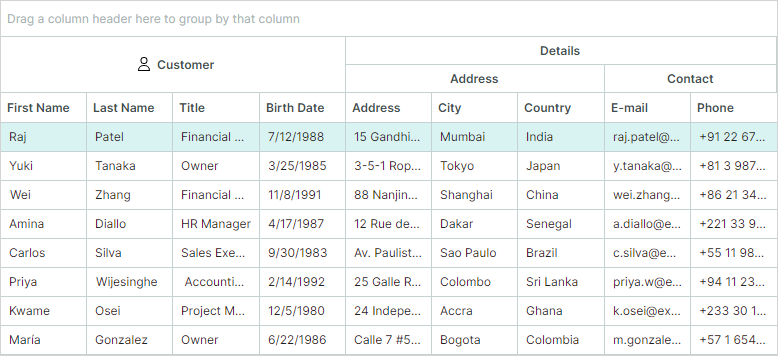
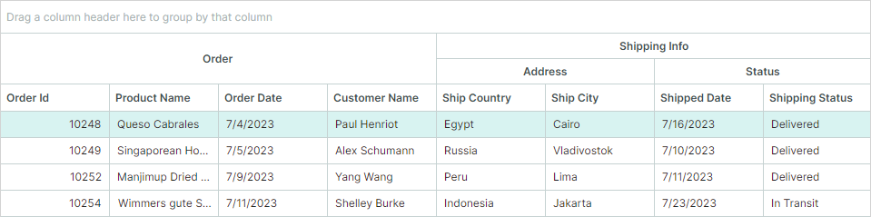
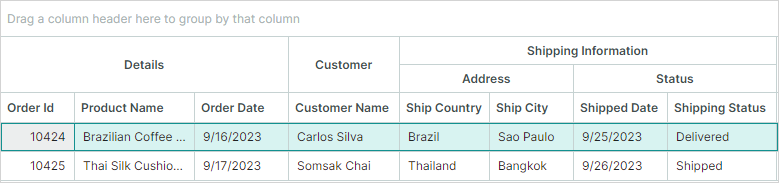
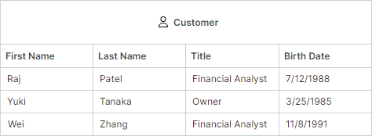
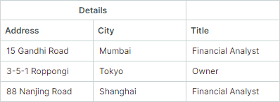
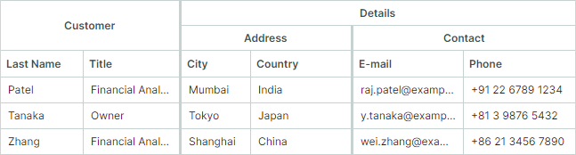
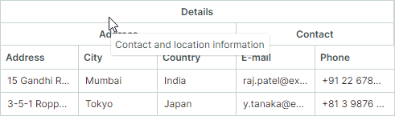

# Bands

您可以使用列组（Column Band）在视觉上将多个列组合在一起。DataGrid 控件会将列组显示为位于列标题上方的附加标题。列组标题和列标题都可以包含文本、图像或自定义内容。您还可以创建具有无限嵌套层级的分层列组结构。

下图展示了一个包含四个列组的 DataGrid 控件:“Customer”、“Details”、“Address” 和 “Contact”:


您可以通过以下方法生成列组:

- [手动创建列组](#create-bands-manually)
- [基于列组源创建列组](#generate-bands-from-a-band-source)
- [基于 DataAnnotation 特性创建列组(适用于自动生成的列)](#generate-bands-based-on-dataannotation-attributes-for-auto-generated-columns)


## Create Bands Manually

请按以下步骤手动创建列组:

1. 创建列组对象(`GridBand` 类的实例),并将其添加到 `DataGridControl.Bands` 集合中。

    使用 `GridBand.BandName` 属性为创建的列组指定唯一名称。

    ``` xml
    <mxdg:DataGridControl.Bands>
        <mxdg:GridBand BandName="Customer" HeaderHorizontalAlignment="Center"/>
        <mxdg:GridBand BandName="Details" HeaderHorizontalAlignment="Center"/>
    </mxdg:DataGridControl.Bands>
    ```

    您可以创建分层的列组结构。要创建嵌套列组:

    - 在 code-behind 中:将列组添加到 `GridBand.Bands` 集合。
    - 在 XAML 中:直接在 `GridBand` 的开始标签和结束标签之间定义嵌套列组。

    ``` xml
    <mxdg:GridBand BandName="Details" HeaderHorizontalAlignment="Center">
        <mxdg:GridBand BandName="DetailsAddress" Header="Address" HeaderHorizontalAlignment="Center"/>
        <mxdg:GridBand BandName="DetailsContact" Header="Contact" HeaderHorizontalAlignment="Center"/>
    </mxdg:GridBand>
    ```

    `GridBand.Header` 属性允许您为列组指定自定义内容(例如自定义文本)。如果未设置此属性,列组标题将显示 `GridBand.BandName` 属性的值。

2. 通过将每个列的 `GridColumn.BandName` 属性设置为对应的列组名称(`GridBand.BandName`),将列与特定的列组相关联。

    ``` xml
    <mxdg:DataGridControl.Columns>
        <mxdg:GridColumn FieldName="FirstName" BandName="Customer" Width="*"/>
        <mxdg:GridColumn FieldName="City" BandName="DetailsAddress" Width="*"/>
        <mxdg:GridColumn FieldName="Phone" BandName="DetailsContact" Width="*"/>
        <!-- ... -->
    </mxdg:DataGridControl.Columns>
    ```

DataGrid 控件中的列会根据其 `GridColumn.VisibleIndex` 属性进行排列。
控件不会自动重新排列列,使其按照列组进行分组。


参见[列与列组的顺序](#order-of-columns-and-bands)


### 相关 API

- `GridBand` 类 — 封装一个列组。
- `GridBand.BandName` — 用于标识列组并将其与列关联的唯一名称。
- `GridColumn.BandName` — 与该列关联的列组名称。此值与 `GridBand.BandName` 属性的值相匹配。
- `DataGridControl.Bands` — 根列组集合。
- `GridBand.Bands` — 此列组的子列组集合。


### 示例 - 在 DataGrid 控件中手动创建列组

以下示例创建列组并将其分配给列,如下图所示:



- “Customer”、“Address” 和 “Contact” 列组与网格列相关联。
- “Details” 列组拥有两个嵌套列组(“Address” 和 “Contact”)。此列组本身不直接与任何列关联。

系统会使用 `GridBand.BandName` 属性为每个列组分配一个唯一名称。要将列关联到特定列组,请将该列的 `GridColumn.BandName` 属性设置为目标列组的 `BandName` 值。

`DataGridControl.Bands` 属性定义了列组的结构。要创建嵌套列组,请将它们定义为父列组的子元素。

``` xml
<!-- MainWindow.axaml file -->
<mx:MxWindow xmlns="https://github.com/avaloniaui"
        xmlns:x="http://schemas.microsoft.com/winfx/2006/xaml"
        xmlns:vm="using:DataGridColumnBands.ViewModels"
        xmlns:d="http://schemas.microsoft.com/expression/blend/2008"
        xmlns:mc="http://schemas.openxmlformats.org/markup-compatibility/2006"
        xmlns:mx="https://schemas.eremexcontrols.net/avalonia"
        xmlns:mxdg="https://schemas.eremexcontrols.net/avalonia/datagrid"
        xmlns:svg="using:Avalonia.Svg.Skia"
        mc:Ignorable="d" d:DesignWidth="800" d:DesignHeight="450"
        x:Class="DataGridColumnBands.Views.MainWindow"
        x:DataType="vm:MainWindowViewModel"
        Icon="/Assets/EMXControls.ico"
        Title="DataGridColumnBands">

    <Design.DataContext>
        <vm:MainWindowViewModel/>
    </Design.DataContext>

    <Grid RowDefinitions="Auto *" Margin="10">
        <mxdg:DataGridControl BorderBrush="LightGray" BorderThickness="1" Name="gridControl1"
                              ItemsSource="{Binding Employees}"
                              AllowColumnMoving="False"
                          >
            <mxdg:DataGridControl.Bands>
                <mxdg:GridBand BandName="Customer" HeaderHorizontalAlignment="Center">
                    <mxdg:GridBand.HeaderTemplate>
                        <DataTemplate>
                            <StackPanel Orientation="Horizontal">
                                <svg:Svg Path="/Assets/customer.svg" Width="16" Height="16" Margin="5" />
                                <TextBlock Text="{Binding}" VerticalAlignment="Center"/>
                            </StackPanel>
                        </DataTemplate>
                    </mxdg:GridBand.HeaderTemplate>

                </mxdg:GridBand>
                <mxdg:GridBand BandName="Details" HeaderHorizontalAlignment="Center">
                    <mxdg:GridBand BandName="DetailsAddress" Header="Address" HeaderHorizontalAlignment="Center"/>
                    <mxdg:GridBand BandName="DetailsContact" Header="Contact" HeaderHorizontalAlignment="Center"/>
                </mxdg:GridBand>
            </mxdg:DataGridControl.Bands>

            <mxdg:DataGridControl.Columns>
                <mxdg:GridColumn Width="*" FieldName="FirstName" BandName="Customer"/>
                <mxdg:GridColumn Width="*" FieldName="LastName" BandName="Customer"/>
                <mxdg:GridColumn Width="*" FieldName="Title" BandName="Customer"/>
                <mxdg:GridColumn Width="*" FieldName="BirthDate" BandName="Customer"/>
                <mxdg:GridColumn Width="*" FieldName="Address" BandName="DetailsAddress"/>
                <mxdg:GridColumn Width="*" FieldName="City" BandName="DetailsAddress"/>
                <mxdg:GridColumn Width="*" FieldName="Country" BandName="DetailsAddress"/>
                <mxdg:GridColumn Width="*" FieldName="EMail" BandName="DetailsContact" Header="E-mail"/>
                <mxdg:GridColumn Width="*" FieldName="Phone" BandName="DetailsContact"/>
            </mxdg:DataGridControl.Columns>
        </mxdg:DataGridControl>
    </Grid>
</mx:MxWindow>
```

``` cs
//MainWindow.axaml.cs file
using Avalonia.Controls;
using Eremex.AvaloniaUI.Controls.Common;
using DataGridColumnBands.ViewModels;

namespace DataGridColumnBands.Views
{
    public partial class MainWindow : MxWindow
    {
        public MainWindow()
        {
            InitializeComponent();
            this.DataContext = new MainWindowViewModel();
        }
    }
}
```

``` cs
//MainWindowViewModel.cs file
using System.ComponentModel;
using CommunityToolkit.Mvvm.ComponentModel;
using System.Collections.Generic;
using System;

namespace DataGridColumnBands.ViewModels
{
    public partial class MainWindowViewModel : ViewModelBase
    {
        [ObservableProperty]
        IList<CustomerInfo> employees;

        public MainWindowViewModel()
        {
            Employees = GetSampleCustomers();
        }

        public static List<CustomerInfo> GetSampleCustomers() => new()
        {
            new("Raj", "Patel", "Financial Analyst", new DateTime(1988, 7, 12),
                "15 Gandhi Road", "Mumbai", "India", "raj.patel@example.in", "+91 22 6789 1234"),
            new("Yuki", "Tanaka", "Owner", new DateTime(1985, 3, 25),
                "3-5-1 Roppongi", "Tokyo", "Japan", "y.tanaka@example.jp", "+81 3 9876 5432"),
            new("Wei", "Zhang", "Financial Analyst", new DateTime(1991, 11, 8),
                "88 Nanjing Road", "Shanghai", "China", "wei.zhang@example.cn", "+86 21 3456 7890"),
            new("Amina", "Diallo", "HR Manager", new DateTime(1987, 4, 17),
                "12 Rue des Almadies", "Dakar", "Senegal", "a.diallo@example.sn", "+221 33 987 6543"),
            new("Carlos", "Silva", "Sales Executive", new DateTime(1983, 9, 30),
                "Av. Paulista 1000", "Sao Paulo", "Brazil", "c.silva@example.br", "+55 11 98765 4321"),
            new("Priya", "Wijesinghe", " Accounting Manager", new DateTime(1992, 2, 14),
                "25 Galle Road", "Colombo", "Sri Lanka", "priya.w@example.lk", "+94 11 234 5678"),
            new("Kwame", "Osei", "Project Manager", new DateTime(1980, 12, 5),
                "24 Independence Ave", "Accra", "Ghana", "k.osei@example.gh", "+233 30 123 4567"),
            new("María", "Gonzalez", "Owner", new DateTime(1986, 6, 22),
                "Calle 7 #5-20", "Bogota", "Colombia", "m.gonzalez@example.co", "+57 1 654 3210")
        };
    }

    public partial class CustomerInfo : ObservableObject
    {
        [ObservableProperty]
        public string firstName;

        [ObservableProperty]
        public string lastName;

        [ObservableProperty]
        public string title;

        [ObservableProperty]
        public DateTime birthDate;

        [ObservableProperty]
        public string address;

        [ObservableProperty]
        public string city;

        [ObservableProperty]
        public string country;

        [ObservableProperty]
        public string eMail;

        [ObservableProperty]
        public string phone;

        public CustomerInfo(string firstName, string lastName, string title,
                      DateTime birthDate, string address, string city,
                      string country, string eMail, string phone)
        {
            FirstName = firstName;
            LastName = lastName;
            Title = title;
            BirthDate = birthDate;
            Address = address;
            City = city;
            Country = country;
            EMail = eMail;
            Phone = phone;
        }
    }
}
```

``` cs
// customer.svg file is placed in the project's `Assets` folder, and its `Build Action` property is set to `AvaloniaResource`.
```

## Generate Bands from a Band Source

您可以使用在 View Model 中定义的列组源来填充列组。使用 `DataGridControl.BandsSource` 和 `DataGridControl.BandTemplate` 属性,可以基于一组业务对象生成列组。

除了指定 `BandTemplate` 属性之外,您还可以使用 `Styles` 属性,从业务对象初始化 `GridBand` 对象。相关示例请参见[使用样式初始化列组](#initialize-bands-using-a-style)。

要将列与列组关联,请将每个列的 `GridColumn.BandName` 设置为对应的列组名称(`GridBand.BandName`)。

### 相关 API

- `DataGridControl.BandsSource` — 用于生成根列组的业务对象集合。
- `DataGridControl.BandTemplate` — 用于根据业务对象创建 `GridBand` 实例的模板。
- `GridBand.BandsSource` — 用于生成子列组的业务对象集合。
- `GridBand.BandName` — 用于标识列组并将其与列关联的唯一名称。
- `GridColumn.BandName` — 与该列关联的列组名称。此值与 `GridBand.BandName` 属性的值相匹配。

### 示例 - 基于列组源生成列组

以下示例基于 View Model 中定义的 _BandInfo_ 对象集合创建列组。

DataGrid 控件显示一组 _Order_ 业务对象。网格列会根据 _Order_ 类公开的公共属性自动生成。数据网格的 `AutoGeneratingColumn` 事件处理程序会将自动生成的列与相应的列组关联起来。



``` xml
<!-- MainWindow.axaml -->
<mx:MxWindow xmlns="https://github.com/avaloniaui"
        xmlns:x="http://schemas.microsoft.com/winfx/2006/xaml"
        xmlns:vm="using:DataGridBandSource.ViewModels"
        xmlns:d="http://schemas.microsoft.com/expression/blend/2008"
        xmlns:mc="http://schemas.openxmlformats.org/markup-compatibility/2006"
        xmlns:mx="https://schemas.eremexcontrols.net/avalonia"
        xmlns:mxdg="https://schemas.eremexcontrols.net/avalonia/datagrid"
        xmlns:local="using:DataGridBandSource.Views"
        mc:Ignorable="d" d:DesignWidth="800" d:DesignHeight="450"
        x:Class="DataGridBandSource.Views.MainWindow"
        x:DataType="vm:MainWindowViewModel"
        Icon="/Assets/EMXControls.ico"
        Title="DataGridBandSource">

    <Design.DataContext>
        <!-- This only sets the DataContext for the previewer in an IDE,
             to set the actual DataContext for runtime, set the DataContext property in code (look at App.axaml.cs) -->
        <vm:MainWindowViewModel/>
    </Design.DataContext>

    <Border BorderThickness="1" BorderBrush="LightGray" Margin="5">
    <mxdg:DataGridControl Name="dataGrid1" 
                          ItemsSource="{Binding Orders}" 
                          AutoGenerateColumns="True"
                          BandsSource="{Binding BandInfos}"
                          AutoGeneratingColumn="DataGrid1_AutoGeneratingColumn"
                          >
        <mxdg:DataGridControl.BandTemplate>
            <local:DataGridBandTemplate/>
        </mxdg:DataGridControl.BandTemplate>
    </mxdg:DataGridControl>
    </Border>
</mx:MxWindow>

```

``` cs
// MainWindow.axaml.cs
using Avalonia.Controls.Templates;
using DataGridBandSource.ViewModels;
using Eremex.AvaloniaUI.Controls.Common;
using Eremex.AvaloniaUI.Controls.DataGrid;

namespace DataGridBandSource.Views;

public partial class MainWindow : MxWindow
{
    public MainWindow()
    {
        this.DataContext = new MainWindowViewModel();
        InitializeComponent();
    }

    private void DataGrid1_AutoGeneratingColumn(object? sender, Eremex.AvaloniaUI.Controls.DataGrid.DataGridControlAutoGeneratingColumnEventArgs e)
    {
        string columnFieldName = e.Column.FieldName.ToLower();
        if (columnFieldName.StartsWith("ship"))
        {
            if (columnFieldName.Contains("country") || columnFieldName.Contains("city"))
                e.Column.BandName = MainWindowViewModel.ShippingAddressBandName;
            else 
                e.Column.BandName = MainWindowViewModel.ShippingStatusBandName;
        }
        else
            e.Column.BandName= MainWindowViewModel.OrderBandName;
    }
}

public class DataGridBandTemplate : ITemplate<object, GridBand>
{
    public GridBand Build(object param)
    {
        var bandInfo = (BandInfo)param;
        var gridBand = new GridBand()
        {
            BandName = bandInfo.Name,
            Header = bandInfo.DisplayName,
            BandsSource = bandInfo.ChildBands,
            HeaderHorizontalAlignment = Avalonia.Layout.HorizontalAlignment.Center
        };
        return gridBand;
    }
}
```

``` cs
// MainWindowViewModel.cs
using CommunityToolkit.Mvvm.ComponentModel;
using System;
using System.Collections.Generic;
using System.Collections.ObjectModel;
using System.ComponentModel.DataAnnotations;

namespace DataGridBandSource.ViewModels;

public partial class MainWindowViewModel : ViewModelBase
{
    public static string OrderBandName => "Orders";
    public static string ShippingAddressBandName => "ShipAddress";
    public static string ShippingStatusBandName => "ShipStatus";

    [ObservableProperty]
    private ObservableCollection<Order> orders;

    [ObservableProperty]
    private ObservableCollection<BandInfo> bandInfos;

    public MainWindowViewModel()
    {
        Orders = new ObservableCollection<Order>
        {
            new Order(10248, "Queso Cabrales", "Egypt", "Cairo",
                    new DateTime(2023, 7, 4), new DateTime(2023, 7, 16),
                    "Paul Henriot", "Delivered"),
            new Order(10249, "Singaporean Hokkien Fried Mee", "Russia", "Vladivostok",
                    new DateTime(2023, 7, 5), new DateTime(2023, 7, 10),
                    "Robert Schumann", "Delivered"),
            new Order(10252, "Manjimup Dried Apples", "Peru", "Lima",
                    new DateTime(2023, 7, 9), new DateTime(2023, 7, 11),
                    "Yang Wang", "Delivered"),
            new Order(10254, "Wimmers gute Semmelknodel", "Indonesia", "Jakarta",
                    new DateTime(2023, 7, 11), new DateTime(2023, 7, 23),
                    "Shelley Burke", "In Transit")
        };

        BandInfo childBandInfoAddress = new BandInfo(ShippingAddressBandName, "Address", null);
        BandInfo childBandInfoStatus = new BandInfo(ShippingStatusBandName, "Status", null);

        BandInfos = new ObservableCollection<BandInfo>
        {
            new BandInfo(OrderBandName, "Order", null),
            new BandInfo("ShippingInfo", "Shipping Info", new List<BandInfo>{ childBandInfoAddress, childBandInfoStatus })
        };
    }
}

public class BandInfo
{
    public BandInfo(string name, string displayName, IList<BandInfo> childBands)
    {
        this.Name = name;
        this.DisplayName = displayName;
        this.ChildBands = childBands;
    }
    public string Name { get; set; }
    public string DisplayName { get; set; }
    public IList<BandInfo> ChildBands { get; set; }
}

public partial class Order : ObservableObject
{
    [ObservableProperty][property: Display(Order = 0)]
    private int orderId;

    [ObservableProperty][property: Display(Order = 1)]
    private string productName = string.Empty;

    [ObservableProperty][property: Display(Order = 4)]
    private DateTime orderDate;

    [ObservableProperty][property: Display(Order = 5)]
    private string customerName = string.Empty;

    [ObservableProperty][property: Display(Order = 23)]
    private DateTime shippedDate;

    [ObservableProperty][property: Display(Order = 20)]
    private string shipCountry = string.Empty;

    [ObservableProperty][property: Display(Order = 21)]
    private string shipCity = string.Empty;

    [ObservableProperty][property: Display(Order = 24)]
    private string shippingStatus = string.Empty;

    public Order(int orderId, string productName, 
                string shipCountry, string shipCity, DateTime orderDate, DateTime shippedDate,
                string customerName, string shipStatus)
    {
        OrderId = orderId; ProductName = productName;
        ShipCountry = shipCountry; ShipCity = shipCity;
        OrderDate = orderDate; ShippedDate = shippedDate;
        CustomerName = customerName; ShippingStatus = shipStatus;
    }
}
```

### Initialize Bands Using a Style

除了指定 `BandTemplate` 属性之外,您还可以使用 `Styles` 属性,从业务对象初始化 `GridBand` 对象。

``` xml
<mxdg:DataGridControl.Styles>
    <Style Selector="mxdg|GridBand">
        <Setter Property="BandName" Value="{Binding Name}"/>
        <Setter Property="Header" Value="{Binding DisplayName}"/>
        <Setter Property="HeaderHorizontalAlignment" Value="Left"/>
    </Style>
</mxdg:DataGridControl.Styles>
```

有关如何使用 `BandsSource` 和 `Styles` 属性的示例,请参见 "Column Bands" 演示程序。

## Generate Bands Based on DataAnnotation Attributes (for Auto-Generated Columns)

这种方法允许您使用特性,将[自动生成的列](columns.md#automatic-column-generation)与列组关联起来。

启用列自动生成功能后(参见 [DataGridControl.AutoGenerateColumns](columns.md#automatic-column-generation)),DataGrid 控件可以根据应用于业务对象属性的[专用特性](columns.md#use-attributes-to-customize-settings-of-auto-generated-columns)来初始化列设置。
`System.ComponentModel.DataAnnotations.DisplayAttribute` 特性允许您将自动生成的列与列组关联起来。指定 `DisplayAttribute.GroupName` 参数,可以为对应的列定义列组名称。

``` cs
public partial class Order : ObservableObject
{
    [ObservableProperty]
    [property: Display(Order = 0, GroupName = "Order")]
    private int orderId;
    //...
}
```

当 DataGrid 控件遇到 `DisplayAttribute.GroupName` 时,会检查是否已存在名称匹配的列组(`GridBand.BandName`)。如果未找到这样的列组,则会创建该列组并按以下方式初始化:

- 控件会自动创建列组,并将其 `GridBand.BandName` 属性设置为 `DisplayAttribute.GroupName` 的值。
- 该列组会被添加到控件的 `DataGridControl.Bands` 集合中。嵌套列组会被添加到相应的 `GridBand.Bands` 集合中。
- 创建的列组会通过 `GridColumn.BandName` 属性与自动生成的列关联起来。

`DisplayAttribute.GroupName` 参数支持嵌套列组。使用 '/' 字符分隔父列组和子列组(例如 "ParentBandName/ChildBandName")。如果要将 '/' 作为普通字符使用,请使用双斜杠("//")表示法。

!!! note

    在整个 DataGrid 控件范围内,各个子列组的名称必须是唯一的。

``` cs
public partial class Order : ObservableObject
{
    [ObservableProperty]
    [property: Display(Order = 20, GroupName = "Shipping Info/Address")]
    private string shipCountry = string.Empty;
    //...
}
```

### 相关 API

- `DataGridControl.AutoGenerateBands`(默认值为 `true`)— 获取或设置是否根据应用于底层业务对象属性的 `DisplayAttribute.GroupName` 特性自动生成列组。生成的这些列组随后会自动链接到对应的自动生成列。

    如果 `DataGridControl.AutoGenerateColumns` 为 `false`,则自动列组生成功能(以及将列组链接到自动生成列的功能)会被强制禁用。

- `DataGridControl.Bands` 和 `GridBand.Bands` — 您可以使用这些集合来访问自动生成的列组。

### 示例 - 基于 DisplayAttribute.GroupName 参数生成列组

在此示例中,DataGrid 控件显示 _Order_ 对象的列表。`AutoGenerateColumns` 选项会根据 _Order_ 类的公共属性自动生成列。列组则是根据应用于 _Order_ 类属性的 `System.ComponentModel.DataAnnotations.DisplayAttribute` 特性生成的。



`DisplayAttribute.GroupName` 参数为自动生成的列定义列组名称。

``` xml
<!-- MainWindow.axaml -->
<mx:MxWindow xmlns="https://github.com/avaloniaui"
        xmlns:x="http://schemas.microsoft.com/winfx/2006/xaml"
        xmlns:vm="using:DataGridBandsFromAttributes.ViewModels"
        xmlns:d="http://schemas.microsoft.com/expression/blend/2008"
        xmlns:mc="http://schemas.openxmlformats.org/markup-compatibility/2006"
        xmlns:mx="https://schemas.eremexcontrols.net/avalonia"
        xmlns:mxdg="https://schemas.eremexcontrols.net/avalonia/datagrid"
        mc:Ignorable="d" d:DesignWidth="800" d:DesignHeight="450"
        x:Class="DataGridBandsFromAttributes.Views.MainWindow"
        x:DataType="vm:MainWindowViewModel"
        Icon="/Assets/EMXControls.ico"
        Title="DataGridBandsFromAttributes">

    <Design.DataContext>
        <!-- This only sets the DataContext for the previewer in an IDE,
             to set the actual DataContext for runtime, set the DataContext property in code (look at App.axaml.cs) -->
        <vm:MainWindowViewModel/>
    </Design.DataContext>

    <Grid RowDefinitions="Auto" ColumnDefinitions="Auto" >
        <Border BorderThickness="1" BorderBrush="LightGray" Margin="10">
            <mxdg:DataGridControl Name="dataGrid1"
                                  ItemsSource="{Binding Orders}"
                                  AutoGenerateColumns="True"
                          >
                <mxdg:DataGridControl.Styles>
                    <Style Selector="mxdg|GridBand">
                        <Setter Property="HeaderHorizontalAlignment" Value="Center"/>
                    </Style>
                </mxdg:DataGridControl.Styles>
            </mxdg:DataGridControl>
        </Border>
    </Grid>
</mx:MxWindow>
```

``` cs
// MainWindowViewModel.cs
using CommunityToolkit.Mvvm.ComponentModel;
using System;
using System.Collections.Generic;
using System.Collections.ObjectModel;
using System.ComponentModel.DataAnnotations;

namespace DataGridBandsFromAttributes.ViewModels;

public partial class MainWindowViewModel : ViewModelBase
{
    [ObservableProperty]
    private ObservableCollection<Order> orders;

    public MainWindowViewModel()
    {
        Orders = new ObservableCollection<Order>
        {
            new(10424, "Brazilian Coffee Beans", "Brazil", "Sao Paulo",
                new DateTime(2023, 9, 16), new DateTime(2023, 9, 25),
                "Carlos Silva", "Delivered"),

            new(10425, "Thai Silk Cushions", "Thailand", "Bangkok",
                new DateTime(2023, 9, 17), new DateTime(2023, 9, 26),
                "Somsak Chai", "Shipped")
        };
    }
}


public partial class Order : ObservableObject
{
    [ObservableProperty][property: Display(Order = 0, GroupName = "Details")]
    private int orderId;

    [ObservableProperty][property: Display(Order = 1, GroupName = "Details")]
    private string productName = string.Empty;

    [ObservableProperty][property: Display(Order = 4, GroupName = "Details")]
    private DateTime orderDate;

    [ObservableProperty][property: Display(Order = 5, GroupName = "Customer")]
    private string customerName = string.Empty;

    [ObservableProperty][property: Display(Order = 23, GroupName ="Shipping Information/Status")]
    private DateTime shippedDate;

    [ObservableProperty][property: Display(Order = 20, GroupName = "Shipping Information/Address")]
    private string shipCountry = string.Empty;

    [ObservableProperty][property: Display(Order = 21, GroupName = "Shipping Information/Address")]
    private string shipCity = string.Empty;

    [ObservableProperty][property: Display(Order = 24, GroupName = "Shipping Information/Status")]
    private string shippingStatus = string.Empty;

    public Order(int orderId, string productName, 
                string shipCountry, string shipCity, DateTime orderDate, DateTime shippedDate,
                string customerName, string shipStatus)
    {
        OrderId = orderId; ProductName = productName;
        ShipCountry = shipCountry; ShipCity = shipCity;
        OrderDate = orderDate; ShippedDate = shippedDate;
        CustomerName = customerName; ShippingStatus = shipStatus;
    }
}
```

### Order of Columns and Bands

DataGrid 控件会根据 `GridColumn.VisibleIndex` 属性的值排列各列。

列组标题的顺序由列的可视顺序决定。
如果与同一列组关联的列彼此相邻放置,则它们的列组标题会合并显示。

``` xml
<mxdg:DataGridControl.Columns>
    <mxdg:GridColumn Width="*" FieldName="FirstName" BandName="Customer"/>
    <mxdg:GridColumn Width="*" FieldName="LastName" BandName="Customer"/>
    <mxdg:GridColumn Width="*" FieldName="Address" BandName="Details"/>
</mxdg:DataGridControl.Columns>
```


控件不会自动重新排列列,使其按照列组进行分组。
如果与同一列组关联的列所处的位置不相邻(被关联到其他列组的列所分隔),DataGrid 控件会在列标题上方生成多个同名的列组标题。

在下面的代码片段中,与 _Customer_ 列组关联的列被链接到 _Details_ 列组的 _Address_ 列分隔开。控件不会自动重新排列这些列,以便将它们合并为一个 _Customer_ 列组:

``` xml
<mxdg:DataGridControl.Columns>
    <mxdg:GridColumn Width="*" FieldName="FirstName" BandName="Customer"/>
    <mxdg:GridColumn Width="*" FieldName="LastName" BandName="Customer"/>
    <mxdg:GridColumn Width="*" FieldName="Address" BandName="Details"/>
    <mxdg:GridColumn Width="*" FieldName="Title" BandName="Customer"/>
</mxdg:DataGridControl.Columns>
```


## Drag-and-Drop Operations

### Column Drag-and-Drop

如果 `DataGridControl.AllowColumnMoving` 为 `true`(默认值),用户可以在控件内自由拖放列。如果用户将某一列拖动到不同的列组中,控件会在该列的新位置上方绘制相应的列组标题(`GridColumn.BandHeader`)。参见[列与列组的顺序](#order-of-columns-and-bands)。

#### 相关 API

- `DataGridControl.AllowColumnMoving` — 获取或设置是否启用列的拖放操作。

### Band Drag-and-Drop

DataGrid 不支持对列组执行拖放操作。

## Show and Hide the Band Panel

列组面板用于显示列组标题。当有任意一列关联了现有列组时,该面板即会显示。如有需要,可以使用以下属性强制隐藏列组面板:

- `DataGridControl.ShowBands` — 获取或设置列组面板是否可见。

## Specify Band Header Content

- `Header` — 获取或设置列组标题的内容。如果未设置此属性,列组将显示 `GridBand.BandName` 属性的值。
- `HeaderTemplate` — 获取或设置用于呈现 `Header` 对象的模板。该模板允许您显示图像和自定义控件,并以自定义方式呈现文本。

### 示例 - 在列组标题中显示图像

以下示例在列组标题中显示一张 SVG 图像,后面跟着一段文本说明。SVG 图像(`customer.svg` 文件)位于项目的 `Assets` 文件夹中,其 `Build Action` 属性被设置为 `AvaloniaResource`。



``` xml
xmlns:svg="using:Avalonia.Svg.Skia"

<mxdg:DataGridControl.Bands>
    <mxdg:GridBand BandName="Customer" HeaderHorizontalAlignment="Center">
        <mxdg:GridBand.HeaderTemplate>
            <DataTemplate>
                <StackPanel Orientation="Horizontal">
                    <svg:Svg Path="/Assets/customer.svg" Width="16" Height="16" Margin="5" />
                    <TextBlock Text="{Binding}" VerticalAlignment="Center"/>
                </StackPanel>
            </DataTemplate>
        </mxdg:GridBand.HeaderTemplate>
</mxdg:DataGridControl.Bands>
```

## Blank Band Header

未关联现有列组的列会显示在一个空白的列组标题下。

``` xml
<mxdg:DataGridControl.Columns>
    <mxdg:GridColumn Width="*" FieldName="Address" BandName="Details"/>
    <mxdg:GridColumn Width="*" FieldName="City" BandName="Details"/>
    <mxdg:GridColumn Width="*" FieldName="Title"/>
</mxdg:DataGridControl.Columns>    
```




## Band Separators

- `DataGridControl.ShowBandSeparators` — 在相邻列组之间启用粗分隔线。使用此属性可以突出显示列组之间的分界。如果禁用 `ShowBandSeparators`,网格会在列组之间绘制普通的列分隔线(细线)。

    下图展示了列组分隔线的效果。

    

## Hide Bands

列组对象没有 "Visible" 属性。要隐藏某个列组,您应该隐藏与该列组关联的列。

没有关联任何列的列组永远不会显示。


## Band Header Tooltips

使用 `HeaderToolTip` 属性可以为列组标题指定自定义工具提示。无论列组标题文本是否被截断,鼠标悬停在列组标题上时都会显示自定义工具提示。

``` xml
<mxdg:GridBand BandName="Details" HeaderHorizontalAlignment="Center" HeaderToolTip="Contact and location information">
```



如果未为某个列组指定自定义工具提示,则当标题文本被截断时,会为该列组标题显示默认工具提示。默认工具提示会显示完整、未截断的标题文本。

<br>
<br>

<sup>*</sup> 本页面使用机器翻译技术翻译。
