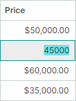
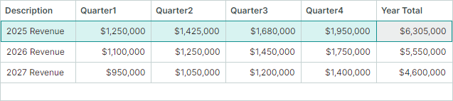
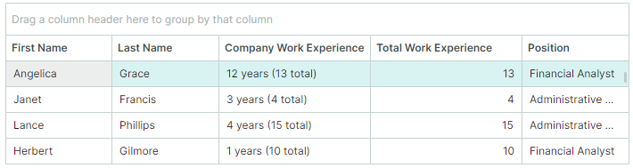
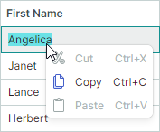
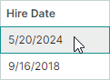

# Cells

网格单元格用于显示和编辑行的值。单元格由[行](rows.md)和[列](columns.md)相交而成。虽然单元格用于呈现数据,但其行为和外观(例如内嵌编辑器和格式化设置)通常由其父列的属性定义。本主题概括介绍了如何管理和获取单元格内容,以及如何自定义单元格外观。

## Format Cell Values

DataGrid 控件允许您使用常见格式和自定义格式来呈现单元格值。例如,您可以将数值格式化为货币、百分比、整数或浮点数等。DateTime 值可以按短日期格式、长日期格式、仅时间格式等方式呈现。

以下方法可用于格式化单元格值:

- [使用掩码输入](#use-masked-input)
- [设置显示格式](#set-a-display-format)

- [通过事件自定义单元格的显示文本](#customize-display-text-of-cells)


### Use Masked Input

Eremex 编辑器允许您使用[掩码](../../controls/editors/masks/index.md)来限制数据输入,并格式化数值和日期时间值。独立编辑器以及嵌入到容器控件(DataGrid、TreeList、PropertyGrid 等)中的编辑器都支持掩码功能。


*适用对象*:处于显示模式和编辑模式的单元格。要防止在显示模式下应用掩码(即单元格未处于编辑状态时),请禁用编辑器的 `MaskUseAsDisplayFormat` 属性。

*步骤*:

1. 为列指定一个 Eremex [内嵌编辑器](data-editing/index.md)。
2. 将编辑器的 `MaskType` 属性设置为 `MaskType.Numeric` 或 `MaskType.DateTime`,以分别对数值或日期时间值应用掩码。
3. 将编辑器的 `Mask` 属性设置为所需的掩码。有关掩码说明符的信息,请参见以下主题:

    - [数值掩码](../../controls/editors/masks/numeric-masks.md)
    - [日期时间掩码](../../controls/editors/masks/date-time-masks.md)


#### Example - Custom Format Date-time Values Using Masks

以下示例为列指定了一个 DateEditor,并应用了自定义日期时间掩码("MMMM dd, yyyy")。此掩码会在编辑模式和显示模式下格式化单元格值,如下图所示:


``` xml
<mxdg:GridColumn FieldName="BirthDate" Width="*" MinWidth="80">
	<mxdg:GridColumn.EditorProperties>
		<mxe:DateEditorProperties MaskType="DateTime" Mask="MMMM dd, yyyy"/>
	</mxdg:GridColumn.EditorProperties>
</mxdg:GridColumn>
```


### Set a Display Format

您可以使用标准和自定义格式说明符,在显示模式下格式化单元格值。

*适用对象*:处于显示模式的单元格。

*局限性*:显示格式不会应用于编辑模式,也不会限制用户输入。例如,在使用文本编辑器的数值列中,用户仍然可以输入字母。要在显示模式和编辑模式下都格式化数值并限制数据输入,请使用专用编辑器(数值使用 SpinEditor,日期时间值使用 DateEditor),或对文本编辑器应用掩码。

*步骤*:

1. 为列指定一个 Eremex [内嵌编辑器](data-editing/index.md)。
2. 使用编辑器的 `DisplayFormatString` 属性设置显示格式。
3. 对于使用掩码来格式化显示值的编辑器,请禁用编辑器的 `MaskUseAsDisplayFormat` 属性。例如,DateEditor 和 SpinEditor 默认在显示模式下使用掩码来格式化数值。因此,要让这些编辑器应用 `DisplayFormatString` 属性指定的显示格式,必须禁用 `MaskUseAsDisplayFormat` 属性。

    您可以在 .NET 文档中找到所有显示格式的说明:

    - [标准数值格式字符串](https://learn.microsoft.com/en-us/dotnet/standard/base-types/standard-numeric-format-strings)
    - [自定义数值格式字符串](https://learn.microsoft.com/en-us/dotnet/standard/base-types/custom-numeric-format-strings)
    - [标准日期和时间格式字符串](https://learn.microsoft.com/en-us/dotnet/standard/base-types/standard-date-and-time-format-strings)
    - [自定义日期和时间格式字符串](https://learn.microsoft.com/en-us/dotnet/standard/base-types/custom-date-and-time-format-strings)

#### Example - Format Date-Time Values Differently in Display and Edit Modes

以下示例为列指定了一个 DateEditor 内嵌编辑器,并利用其设置在显示模式和编辑模式下分别应用不同的格式化方式:

- `DisplayFormatString` 属性设置为 'd'。此设置会在显示模式下对值应用短日期格式。要使 `DisplayFormatString` 属性生效,需要禁用 `MaskUseAsDisplayFormat` 属性。
- `Mask` 属性设置为 'g'。此格式会在编辑模式下启用带长时间的完整日期时间格式。


``` xml
<mxdg:GridColumn FieldName="OrderDate" Width="3*" BandName="AdditionalInformation" >
	<mxdg:GridColumn.EditorProperties>
		<mxe:DateEditorProperties DisplayFormatString="d" Mask="g" MaskUseAsDisplayFormat="False" />
	</mxdg:GridColumn.EditorProperties>
</mxdg:GridColumn>
```

#### Example - Format Values as Currency

以下示例为列指定了一个 TextEditor 内嵌编辑器,并将该编辑器的 `DisplayFormatString` 属性设置为字符串 "c"。当单元格处于显示模式时,此格式会将单元格值显示为货币:



``` xml
<mxdg:GridColumn FieldName="Price" Width="2*">
    <mxdg:GridColumn.EditorProperties>
        <mxe:TextEditorProperties DisplayFormatString="c" />
    </mxdg:GridColumn.EditorProperties>
</mxdg:GridColumn>
```

#### Example - Custom Format Float Values 

以下代码为列指定了一个 TextEditor 内嵌编辑器,并将 `DisplayFormatString` 属性设置为字符串 "{}{0:F1} kW"。此格式会以保留一位小数的方式显示浮点值,并在输出结果后添加 "kW" 后缀。当单元格处于编辑模式时,不会应用该显示格式。"{}" 字符串是一个转义标记,它使 XAML 解析器将以左花括号("{")开头的字符串当作普通文本处理,而不是当作标记扩展处理。


``` xml
<mxdg:GridColumn FieldName="PowerConsumption" Width="1.2*" >
    <mxdg:GridColumn.EditorProperties>
        <mxe:TextEditorProperties DisplayFormatString="{}{0:F1} kW" />
    </mxdg:GridColumn.EditorProperties>
</mxdg:GridColumn>
```


### Format Display Values Using an Event

*适用对象*:处于显示模式的单元格

如果现有的显示格式或掩码都无法满足您的需求,您可以处理 `CustomColumnDisplayText` 事件,以自定义方式格式化单元格值。此事件允许您替换单元格和[列过滤器](filter-and-search.md#column-filters)中值的默认文本表示形式。要为分组行提供自定义的显示文本,请处理 `DataGridControl.CustomGroupValueDisplayText` 事件。

更改单元格的显示文本时,不会修改底层的单元格值。

#### Example - Custom Format Cell Values Using the CustomColumnDisplayText Event

以下 `CustomColumnDisplayText` 事件处理程序会在 "Stock" 列的单元格值后面显示字符串 "pcs"。当单元格正在被编辑时,通过该事件提供的自定义显示值会被忽略。


``` cs
using Eremex.AvaloniaUI.Controls.DataGrid;

private void DataGrid_CustomColumnDisplayText(object sender, DataGridCustomColumnDisplayTextEventArgs e)
{
    if (e.Column.FieldName == "Stock")
        e.DisplayText = string.Format("{0} pcs", e.Value);
}
```

## Value Alignment

单元格内容的默认水平对齐方式因单元格数据类型而异:

- 数值靠右对齐。
- 布尔值(复选框)居中对齐。
- 其他值靠左对齐。

默认情况下,单元格值在垂直方向上居中对齐。

要自定义单元格中值的水平或垂直对齐方式,请执行以下操作:

1. 为列指定一个 Eremex [内嵌编辑器](data-editing/index.md)。
2. 使用编辑器的 `HorizontalContentAlignment` 属性设置水平对齐方式。
2. 使用编辑器的 `VerticalContentAlignment` 属性设置垂直对齐方式。

### Example - Center Column Values and Header

以下代码将 _Hire Date_ 列中的值和标题居中对齐。为了对齐单元格值,代码为该列指定了一个 `DateEditor` 内嵌编辑器,并将该编辑器的 `HorizontalContentAlignment` 属性设置为 `Center`。
要对齐列标题的内容,则使用该列的 `HorizontalContentAlignment` 属性。


``` xml
<mxdg:GridColumn FieldName="HireDate" Width="*" MinWidth="80" HeaderHorizontalAlignment="Center">
	<mxdg:GridColumn.EditorProperties>
		<mxe:DateEditorProperties HorizontalContentAlignment="Center"/>
	</mxdg:GridColumn.EditorProperties>
</mxdg:GridColumn>
```

## Multi-line Text and Text Wrapping in Cells

要在单元格中显示多行文本,请执行以下操作:

1. 为列指定一个 TextEditor [内嵌编辑器](data-editing/index.md)(或其派生类)。
2. 使用编辑器的 `TextWrapping` 属性启用文本换行。

启用文本换行后,行高会自动调整,以完整显示单元格内容。

### Example - Enable Text Wrapping in Cells

以下代码为列指定了一个文本编辑器,并为该编辑器启用了文本换行。


``` xml
<mxdg:GridColumn FieldName="Notes" Width="*" MinWidth="80">
    <mxdg:GridColumn.EditorProperties>
        <mxe:TextEditorProperties TextWrapping="Wrap"/>
    </mxdg:GridColumn.EditorProperties>
</mxdg:GridColumn>
``` 

 

## Provide Data for Cells

DataGrid 控件中的单元格属于绑定列或非绑定列。

[绑定列](data-binding/index.md)与控件底层数据源中的字段(属性)相关联。这些列的 `GridColumn.FieldName` 属性会被设置为数据源中存在的字段名称。
绑定列的单元格从相应的数据源字段获取其值。

[非绑定列](data-binding/unbound-columns.md)(也称为计算列)允许您显示(并可选择性地编辑)数据源中不存在的值。例如,您可以创建一个只读的非绑定列,用于显示根据多个其他字段计算得出的值。非绑定列的值通过 `CustomUnboundColumnData` 事件提供。您也可以创建可编辑的非绑定列,此时,您的 `CustomUnboundColumnData` 事件处理程序还必须保存用户输入的数据(例如,您可以将其保存到缓存或数据源中)。

非绑定列可用于自定义单元格的显示文本。有关显示文本自定义的其他方法,请参见[自定义单元格的显示文本](#customize-display-text-of-cells)。


### Example — Create a Calculated Column 

以下示例创建了一个名为 _Year Total_ 的非绑定列。`CustomUnboundColumnData` 事件处理程序将该列的值计算为 Quarter1、Quarter2、Quarter3 和 Quarter4 字段之和。



``` xml
<!-- MainWindow.axaml -->
xmlns:mxdg="https://schemas.eremexcontrols.net/avalonia/datagrid"
xmlns:mxe="https://schemas.eremexcontrols.net/avalonia/editors"
xmlns:sys="clr-namespace:System;assembly=System.Runtime"

<mxdg:DataGridControl Name="dataGrid1" Margin="10" BorderThickness="1"
                        ItemsSource="{Binding Revenues}"
                        CustomUnboundColumnData="dataGrid1_CustomUnboundColumnData" >
    <mxdg:DataGridControl.Columns>
        <mxdg:GridColumn FieldName="Description" Width="*" />
        <mxdg:GridColumn FieldName="Quarter1" Width="*">
            <mxdg:GridColumn.EditorProperties>
                <mxe:TextEditorProperties MaskType="Numeric" Mask="c0"/>
            </mxdg:GridColumn.EditorProperties>
        </mxdg:GridColumn>
        <mxdg:GridColumn FieldName="Quarter2" Width="*">
            <mxdg:GridColumn.EditorProperties>
                <mxe:TextEditorProperties MaskType="Numeric" Mask="c0"/>
            </mxdg:GridColumn.EditorProperties>
        </mxdg:GridColumn>
        <mxdg:GridColumn FieldName="Quarter3" Width="*">
            <mxdg:GridColumn.EditorProperties>
                <mxe:TextEditorProperties MaskType="Numeric" Mask="c0"/>
            </mxdg:GridColumn.EditorProperties>
        </mxdg:GridColumn>
        <mxdg:GridColumn FieldName="Quarter4" Width="*">
            <mxdg:GridColumn.EditorProperties>
                <mxe:TextEditorProperties MaskType="Numeric" Mask="c0"/>
            </mxdg:GridColumn.EditorProperties>
        </mxdg:GridColumn>
        <mxdg:GridColumn Name="colYearTotal" FieldName="YearTotal"
                            Width="*" ReadOnly="True" UnboundDataType="{x:Type sys:Decimal}" >
            <mxdg:GridColumn.EditorProperties>
                    <mxe:TextEditorProperties DisplayFormatString="c0"/>
                </mxdg:GridColumn.EditorProperties>
            </mxdg:GridColumn>
    </mxdg:DataGridControl.Columns>
</mxdg:DataGridControl>
```

``` cs
// MainWindow.axaml.cs
private void dataGrid1_CustomUnboundColumnData(object? sender, DataGridUnboundColumnDataEventArgs e)
{
    if (e.IsGettingData && e.Column.FieldName == "YearTotal")
    {
        RevenueViewModel rec = e.Item as RevenueViewModel;
        if (rec != null)
        {
            e.Value = rec.Quarter1 + rec.Quarter2 + rec.Quarter3 + rec.Quarter4;
        }
    }
}
```

``` cs
// MainWindowViewModel.cs
public partial class MainWindowViewModel : ObservableObject
{
    [ObservableProperty]
    List<RevenueViewModel> revenues;

    public MainWindowViewModel()
    {
        revenues = new List<RevenueViewModel>
            {
                new() { Description = "2025 Revenue", Quarter1 = 1250000m, Quarter2 = 1425000m, Quarter3 = 1680000m, Quarter4 = 1950000m },
                new() { Description = "2026 Revenue", Quarter1 = 1100000m, Quarter2 = 1250000m, Quarter3 = 1450000m, Quarter4 = 1750000m },
                new() { Description = "2027 Revenue", Quarter1 = 950000m, Quarter2 = 1050000m, Quarter3 = 1200000m, Quarter4 = 1400000m },
            };
    }
}

public partial class RevenueViewModel : ObservableObject
{
    [ObservableProperty]
    private string description;

    [ObservableProperty]
    private decimal quarter1;

    [ObservableProperty]
    private decimal quarter2;

    [ObservableProperty]
    private decimal quarter3;

    [ObservableProperty]
    private decimal quarter4;
}
```

有关详细信息,请参见以下主题: [非绑定列](data-binding/unbound-columns.md)。


## Customize Display Text of Cells

您可以处理 `CustomColumnDisplayText` 事件,自定义特定单元格的显示文本。此事件只影响显示文本,不影响单元格的编辑值。

`CustomColumnDisplayText` 事件还允许您修改列过滤器和过滤面板中单元格值的文本表示形式。当 `CustomColumnDisplayText` 事件针对过滤面板中的值触发时,该事件的 `SourceItemIndex` 参数会返回 `-1`。要为分组行提供自定义的显示文本,请处理 `DataGridControl.CustomGroupValueDisplayText` 事件。

如果单元格的显示文本依赖于数据源中其他字段/属性的值,您可以使用 DataGridControl 的方法(`DataGridControl.GetSourceItem` 和 `DataGridControl.GetSourceItemValue`)以及数据源自身的方法来获取这些字段值。

### Example - Modify Cell Display Text Using an Event

以下示例处理 `CustomColumnDisplayText` 事件,修改 _HireDate_ 列值的显示文本。

本示例中的网格显示了一组 _EmployeeInfo_ 对象。_EmployeeInfo.HireDate_ 字段表示某人的入职日期。_EmployeeInfo.Experience_ 字段表示该员工的总工作年限。初始布局如下所示:


`CustomColumnDisplayText` 事件处理程序为 _HireDate_ 值提供了自定义显示文本。_HireDate_ 列将不再显示日期时间值,而是显示从入职日期到今天的工作年数,并在其后附加员工的总工作年限(即 _Experience_ 列的值)。_HireDate_ 和 _Experience_ 列的标题分别被替换为 "Company Work Experience" 和 "Total Work Experience"。




``` xml
<!-- MainWindow.axaml -->
xmlns:data="clr-n4amespace:AppEmployees.ViewModels"
xmlns:mxdg="https://schemas.eremexcontrols.net/avalonia/datagrid"
xmlns:mxe="https://schemas.eremexcontrols.net/avalonia/editors"

<mxdg:DataGridControl x:Name="dataGrid" ItemsSource="{Binding Employees}" BorderThickness="1" Margin="10">
    <mxdg:GridColumn FieldName="FirstName" Width="*" MinWidth="80"/>
    <mxdg:GridColumn FieldName="LastName" Width="*" MinWidth="80"/>

    <mxdg:GridColumn FieldName="HireDate" Width="*" MinWidth="170" AllowEditing="False"/>
    <mxdg:GridColumn FieldName="Experience" Width="*" MinWidth="170" />

    <mxdg:GridColumn FieldName="Position" Width="*" MinWidth="100">
        <mxdg:GridColumn.EditorProperties>
            <mxe:ComboBoxEditorProperties ItemsSource="{Binding Source={x:Static data:MainWindowViewModel.Positions}}" IsTextEditable="False"/>
        </mxdg:GridColumn.EditorProperties>
    </mxdg:GridColumn>
</mxdg:DataGridControl>
```

```cs
// MainWindow.axaml.cs

public partial class MainWindow : MxWindow
{
    public MainWindow()
    {
        InitializeComponent();
        GridColumn colHireDate = dataGrid.Columns["HireDate"];
        GridColumn colExperience = dataGrid.Columns["Experience"];
        colExperience.Header = "Total Work Experience";
        colHireDate.Header = "Company Work Experience";
        colHireDate.ColumnFilterMode = Eremex.AvaloniaUI.Controls.DataControl.ColumnFilterMode.DisplayText;
        colHireDate.SortMode = Eremex.AvaloniaUI.Controls.DataControl.SortMode.DisplayText;
        dataGrid.CustomColumnDisplayText += DataGrid_CustomColumnDisplayText;
    }

    private void DataGrid_CustomColumnDisplayText(object sender, Eremex.AvaloniaUI.Controls.DataGrid.DataGridCustomColumnDisplayTextEventArgs e)
    {
        if (e.Column.FieldName != "HireDate")
            return;
        // Get the currently processed value of the HireDate column.
        DateTime hireDate = (DateTime)e.Value;
        // Calculate the number of days from the hire date till today.
        int workingDays = (int)(DateTime.Now - hireDate).TotalDays;
        // Calculate the number of years from the hire date till today.
        int workingYears = (int)workingDays / 365;

        // Supply custom display text for HireDate values shown in the filter panel.
        if (e.SourceItemIndex < 0)
        {
            e.DisplayText = String.Format($"{workingYears} years");
            return;
        }
        // Get the value of the Experience field.
        int totalWorkExperience = (int)dataGrid.GetSourceItemValue(e.SourceItemIndex, "Experience");
        // Supply custom display text for HireDate values.
        e.DisplayText = String.Format($"{workingYears} years ({totalWorkExperience} total)");
    }
}
```

``` cs
using CommunityToolkit.Mvvm.ComponentModel;

public partial class MainWindowViewModel : ObservableObject
{
    [ObservableProperty]
    IList<EmployeeInfo> employees;

    public MainWindowViewModel() {
        Employees = GenerateEmployeeInfo();
    }
    //...
}
public partial class EmployeeInfo : ObservableObject
{
    [ObservableProperty]
    public string firstName;
    [ObservableProperty]
    public string lastName;
    [ObservableProperty]
    public DateTime hireDate;
    [ObservableProperty]
    public int experience;
    [ObservableProperty]
    public string position;
    [ObservableProperty]
}
```

## Get and Set Row Values in Code


DataGrid 控件提供了一些方法,用于获取和设置单个单元格的值,以及处理底层数据对象。

### Work with Cell Values

以下方法可对通过行和列(或字段名称)寻址的单元格进行操作。
这些方法使用行索引来标识行。行索引反映了行在控件中的排列顺序,
既包括可见行,也包括(处于折叠分组内的)隐藏行。
有关行标识的更多详细信息,请参见:[标识和获取行](rows.md#identify-and-get-rows)。

| 方法 | 说明 |
|--------|-------------|
| `GetCellValue` | 返回存储在特定单元格中的编辑(原始)值。 |
| `SetCellValue` | 在特定单元格中设置新值。 |
| `GetCellDisplayText` | 返回单元格格式化后的显示文本,该文本可能因列的格式化设置或自定义的 `CustomColumnDisplayText` 事件处理程序而与编辑值不同。 |

**示例:**

```csharp
// Get the 'Price' field value from the first visible row
decimal price = (decimal)dataGrid.GetCellValue(0, "Price");

// Set a new value for the 'Status' column in the focused row 
dataGrid.SetCellValue(dataGrid.FocusedRowIndex, "Status", "Approved");

// Get the formatted display text (e.g., "$100.00" instead of 100)
string displayPrice = dataGrid.GetCellDisplayText(0, "Price");
```

### Work with Underlying Data Objects

DataGrid 控件包含一些方法,可用于获取某一行的源对象(业务对象)并修改其属性。使用以下成员获取源项:

| 成员 | 说明 |
|--------|-------------|
| `DataControlBase.FocusedItem` | 获取当前获得焦点的行对应的源对象。 |
| `GetSourceItem` | 根据数据源中的索引返回源对象。 |
| `GetSourceItemValue` | 返回数据源中指定索引处某个字段的值。 |
| `GetSourceItemByRowIndex` | 根据行索引返回源对象。 |
| `GetSourceItemByVisibleRowIndex` | 根据行的可见索引返回源对象。 |

有关不同行索引类型的说明,请参见[标识和获取行](rows.md#identify-and-get-rows)。

#### Examples

```csharp
// Example 1: Update the focused item's property
EmployeeInfo emp = dataGrid.FocusedItem as EmployeeInfo;
if (emp != null)
{
    emp.HiredDate = DateTime.Today;
}

// Example 2: Retrieve and modify an item by a row's visible index
var item = dataGrid.GetSourceItemByVisibleRowIndex(2) as Product;
if (item != null)
{
    item.UnitsInStock--;
}
```


## Cell In-place Editors

单元格内嵌编辑器有两个用途:

- 控制未处于编辑状态时的值显示,包括[格式化设置](#format-cell-values)和[值对齐方式](#value-alignment)。
- 提供在编辑模式下修改值的手段。


默认情况下,DataGrid 使用 EMX 编辑器来呈现和编辑常见数据类型的值。例如,double 类型的值默认使用 `SpinEditor` 内嵌编辑器呈现,布尔值默认使用 `CheckEditor` 控件呈现,等等。

您可以使用以下方法,显式地为列/单元格指定编辑器:

1. 通过 `GridColumn.EditorProperties` 属性指定 EMX 编辑器。
2. 通过 `GridColumn.CellTemplate` 属性指定 EMX 编辑器。
3. 通过 `GridColumn.CellTemplate` 属性指定自定义编辑器。

第一种方法(`GridColumn.EditorProperties`)是首选方法,因为它具有以下优势:

- 内嵌 EMX 编辑器与 DataGrid 使用相同的绘制主题,可确保外观设置保持同步。
- DataGrid 能够正确地从单元格获取显示文本,并将其导出为多种格式(XLSX、PDF、图像等)。如果使用单元格模板,导出时单元格将为空白。
- 在初始化、显示和滚动过程中具有较高的性能。控件会在显示模式下模拟编辑器的外观;实际的编辑器仅在开始编辑时创建,编辑结束后即被销毁。


要通过 `GridColumn.EditorProperties` 属性指定内嵌 EMX 编辑器,请执行以下操作:

1. 将 `GridColumn.EditorProperties` 属性设置为下列 `BaseEditorProperties` 派生类之一,以对应所需的编辑器类型:

    - `ButtonEditorProperties` — 对应 `ButtonEditor` 控件,并包含该控件特有的设置。
    - `CheckEditorProperties` — 对应 `CheckEditor` 控件,并包含该控件特有的设置。
    - `ComboBoxEditorProperties` — 对应 `ComboBoxEditor` 控件,并包含该控件特有的设置。
    - `DateEditorProperties` — 对应 `DateEditor` 控件,并包含该控件特有的设置。
    - `HyperlinkEditorProperties` — 对应 `HyperlinkEditor` 控件,并包含该控件特有的设置。
    - `MemoEditorProperties` — 对应 `MemoEditor` 控件,并包含该控件特有的设置。
    - `PopupColorEditorProperties` — 对应 `PopupColorEditor` 控件,并包含该控件特有的设置。
    - `SegmentedEditorProperties` — 对应 `SegmentedEditor` 控件,并包含该控件特有的设置。
    - `SpinEditorProperties` — 对应 `SpinEditor` 控件,并包含该控件特有的设置。
    - `TextEditorProperties` — 对应 `TextEditor` 控件,并包含该控件特有的设置。

2. 修改指定的 `BaseEditorProperties` 派生对象的设置。

### Example - Assign a ComboBoxEditor Control to a Column

以下示例通过将 `GridColumn.EditorProperties` 属性设置为一个 `ComboBoxEditorProperties` 对象,为列指定了一个 `ComboBoxEditor` 编辑器。`ComboBoxEditorProperties.ItemsSource` 属性用于指定要在 combobox 编辑器下拉列表中显示的项的来源。


``` xml
<mxdg:GridColumn FieldName="Position" Width="*" MinWidth="150">
	<mxdg:GridColumn.EditorProperties>
		<mxe:ComboBoxEditorProperties ItemsSource="{Binding Source={x:Static data:EmployeesData.Positions}}" IsTextEditable="False"/>
	</mxdg:GridColumn.EditorProperties>
</mxdg:GridColumn>
```

有关详细信息,请参见以下主题: [数据编辑](data-editing/index.md)。


## Make Cells Read-Only (Copyable)

您可以将列的单元格设置为只读,同时仍允许用户复制单元格值。为此:

- 将列的 `ReadOnly` 属性设置为 `true`。
- 保持列的 `AllowEditing` 属性为 `true`(默认值)。

``` xml
<mxdg:GridColumn FieldName="FirstName" ReadOnly="True"/>
```




## Make Cells Non-Editable (Prevent Copying)


### Entire Grid

要将整个网格设置为不可编辑,请将控件的 `AllowEditing` 属性设置为 `false`。

``` xml
<mxdg:DataGridControl x:Name="dataGrid" AllowEditing="False">
```

### Specific Columns

要将特定列中的所有单元格设置为不可编辑,请使用以下方法之一:

- 将该列的 `AllowEditing` 属性设置为 `false`。

    ``` xml
    <mxdg:GridColumn FieldName="HireDate" AllowEditing="False"/>
    ```

    

- 将该列的 `AllowFocus` 属性设置为 `false`。此设置会阻止该列获得焦点。

### Specific Cells

要将单个单元格设置为不可编辑,请处理 `ShowingEditor` 事件。该事件会在单元格编辑器即将被激活时触发。将事件的 `Cancel` 参数设置为 `true`,即可阻止单元格编辑器被激活。

``` cs
private void DataGrid_ShowingEditor(object sender, DataGridShowingEditorEventArgs e)
{
    DataGridControl grid = sender as DataGridControl;
    // Your condition to prevent cell editor activation
    if(grid.FocusedRowIndex == 0) 
        e.Cancel = true;
}
```


<!-- 

## Display Images in Cells 

## Customize Appearance of Cells

-->

<br>
<br>

<sup>*</sup> 本页面使用机器翻译技术翻译。
