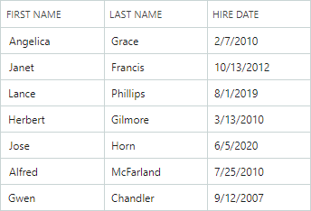

# 列

DataGrid 支持绑定和非绑定列。绑定列显示来自绑定数据源字段的值。 [Unbound 列](data-binding/unbound-columns.md) 允许您显示自定义数据。



DataGrid 列提供用于自定义 列 标题、单元格编辑器、排序/分组设置和其他选项的属性。

## 创建列

`GridColumn` 类代表 `DataGridControl` 中的 列。 `GridColumn` 和 `TreeListColumn`（`TreeListControl` 中的 列）、are derived from 和 `ColumnBase` 类。因此，DataGrid 和 TreeList 控件 中的列共享许多 API 成员。

要访问网格 列 集合，请使用 `DataGridControl.Columns` 属性。

当您将 控件 绑定到数据源时，DataGrid 控件 不会自动创建列。四种方法允许您创建列：

- **手动创建列**

您可以在 `DataGridControl.Columns` 集合中手动定义所有 DataGrid 列（在 XAML 或代码隐藏中）。通过这种方法，您可以通过代码中的名称访问创建的 列 对象。

以下示例创建两个 DataGrid 列并自定义第二个 列 值的显示格式：

    ``` xml
    xmlns:mxdg="https://schemas.eremexcontrols.net/avalonia/datagrid"

    <mxdg:DataGridControl Name="dataGrid1" >                
        <mxdg:DataGridControl.Columns>
            <mxdg:GridColumn Name="colName" FieldName="Name" />
            <mxdg:GridColumn Name="colBirthdate" FieldName="Birthdate" >
                <mxdg:GridColumn.EditorProperties>
                    <mxe:TextEditorProperties DisplayFormatString="yyyy-MM-dd"/>
                </mxdg:GridColumn.EditorProperties>
            </mxdg:GridColumn>
        </mxdg:DataGridControl.Columns>
    </mxdg:DataGridControl>
    ```


- **自动列生成**

当您将 控件 绑定到数据源时，启用 `DataGridControl.AutoGenerateColumns` 选项 自动生成缺失列。您可以将特定属性（来自 `System.ComponentModel` 和 `System.ComponentModel.DataAnnotations` 命名空间）应用于业务对象的属性，以管理列的自动生成，并自定义自动生成列的设置（例如，列 显示名称和顺序）。

- **结合手动列创建和自动生成**

您可以结合上述两种方法：在 `DataGridControl.Columns` 集合中手动创建所需的列，然后启用 `DataGridControl.AutoGenerateColumns` 选项 将其他列的生成委托给 DataGrid。

- **从视图模型生成列**

DataGrid 可以从视图模型中定义的 列 源创建列。在此场景中使用 `ColumnsSource` 和 `ColumnTemplate` 属性。参见 [Generate Columns from a View Model](#generate-columns-from-a-view-model)。


有关自动生成列的信息，请参阅 [Column Automatic Generation](#automatic-column-generation)。

## 将列绑定到数据

`GridColumn.FieldName` 属性允许您将 列 绑定到 底层 数据表中的字段，或绑定到业务对象的 公共 属性。绑定后，列 将从数据源检索值。

DataGrid 还允许您创建未绑定列，其值 should 可以使用 `DataGridControl.CustomUnboundColumnData` 事件手动提供。请参阅 [Unbound Columns](data-binding/unbound-columns.md) 了解更多信息。

不建议将多个 DataGrid 列绑定到同一数据字段/属性。

以下示例创建 DataGrid 列并将它们绑定到数据。

``` xml
xmlns:mxdg="https://schemas.eremexcontrols.net/avalonia/datagrid"

<mxdg:DataGridControl Grid.Column="3" Width="200" Name="dataGrid1" HorizontalAlignment="Stretch">
    <mxdg:DataGridControl.Columns>
        <mxdg:GridColumn Name="colFirstName" FieldName="FirstName" Header="First Name" 
         Width="*" AllowSorting="False"  />
        <mxdg:GridColumn Name="colLastName" FieldName="LastName" Header="Last Name" Width="*"/>
        <mxdg:GridColumn Name="colCity" FieldName="City" Header="City" Width="*" ReadOnly="True" />
        <mxdg:GridColumn Name="colPhone" FieldName="Phone" Header="Phone" Width="*"/>
    </mxdg:DataGridControl.Columns>
</mxdg:DataGridControl>
```

``` csharp
using Eremex.AvaloniaUI.Controls.DataGrid;

GridColumn colFirstName = new GridColumn() 
 { FieldName = "FirstName", Header = "First Name", AllowSorting = false, 
   Width= new GridLength(1, GridUnitType.Star) };
dataGrid1.Columns.Add(colFirstName);
```

## 自动列生成

将 `AutoGenerateColumns` 属性设置为 `true`（默认值为 `false`），以启用数据源中属性的自动生成 列。当 `AutoGenerateColumns` 设置为 `true` 时，DataGrid 控件 从数据源获取 公共 属性，生成列并将它们绑定到属性。如果 控件 的 `Columns` 集合已包含绑定到特定属性/字段的 列，则不会自动生成绑定到同一属性/字段的额外 列。

`AutoGeneratingColumn` 和 `AutoGeneratedColumns` 事件允许您自定义自动生成的列。当自动生成的 列 将添加到 `Columns` 集合中时，将触发 `AutoGeneratingColumn` 事件。将事件的 `e.Cancel` 参数设置为 `true` 以防止将 列 添加到集合中。

自动生成所有列后，将触发 `AutoGeneratedColumns` 事件。

当您将另一个数据源分配给 控件 时，DataGrid 首先删除之前自动生成的列，然后为新数据源自动生成列。

### 使用属性自定义自动生成列的设置

您可以将特定属性（来自 `System.ComponentModel` 和 `System.ComponentModel.DataAnnotations` 命名空间）应用到业务对象（数据源记录）的属性，以自定义相应自动生成的 DataGrid 列的可见性状态、视图和行为设置。  支持的属性描述如下：

#### `Browsable` 属性

`System.ComponentModel.BrowsableAttribute` 属性 控件 列 自动生成。将 **Browsable(false)** 属性应用于特定属性以防止自动生成相应的列。

``` csharp
using CommunityToolkit.Mvvm.ComponentModel;
using System.ComponentModel;

public partial class MyBusinessObject : ObservableObject
{
    [ObservableProperty]
    [property: Browsable(false)]
    public int serviceId = "";
}
```

`System.ComponentModel.BrowsableAttribute` 属性相当于将 `System.ComponentModel.DataAnnotations.DisplayAttribute` 属性与 `AutoGenerateField` 参数一起使用。

#### `Display` 属性 
`System.ComponentModel.DataAnnotations.DisplayAttribute` 是 控件 列 自动生成和显示自动生成列的设置的通用属性。该属性具有 DataGrid 控件 支持的以下参数：

- `AutoGenerateField` — 指定是否自动生成相应的列。

- `Order` — 指定自动生成的 列 的可见 位置 (`ColumnBase.VisibleIndex`)。

- `Name` — 指定自动生成的 列 的标题 (`ColumnBase.Header`)。

- `ShortName` — 相当于 `Name` 参数。

- `GroupName` — 使用自动生成的列将频段名称指定为 associate。 
如果 `DataGridControl.AutoGenerateBands` 选项 是 `true`（默认），则该属性值用于初始化 `GridColumn.BandName` 属性。

当 Data Grid 遇到 `DisplayAttribute.GroupName` 时，它会检查是否存在具有匹配名称 (`GridBand.BandName`) 的现有频段。如果不存在，控件 会自动创建频段并使用 `DisplayAttribute.GroupName` 值初始化其 `GridBand.BandName` 属性。

`DisplayAttribute.GroupName` 参数还支持嵌套频段。使用“/”字符分隔父 Band 和子 Band（例如“ParentBandName/ChildBandName”）。 
    要将“/”作为文字包含在内，请使用“//”。

 
``` csharp
using CommunityToolkit.Mvvm.ComponentModel;
using System.ComponentModel.DataAnnotations;

public partial class MyBusinessObject : ObservableObject
{
    [ObservableProperty]
    [property: Display(Name = "Birth date", Order=2, GroupName="General")]
    public DateTime? birthdate = null;

    [ObservableProperty]
    [property: Display(GroupName = "Details/Address")]
    public string country { get; set; }

    [ObservableProperty]
    [property: Display(GroupName = "Details/Contact")]
    public string phone { get; set; }
}
```

#### `DisplayName` 属性

`System.ComponentModel.DisplayNameAttribute` 属性允许您初始化自动生成的 列 的标题 (`ColumnBase.Header`)。

``` csharp
using CommunityToolkit.Mvvm.ComponentModel;
using System.ComponentModel;

public partial class MyBusinessObject : ObservableObject
{
    [ObservableProperty]
    [property: DisplayName("Birth date")]
    public DateTime? birthdate = null;
}
```

`System.ComponentModel.DisplayNameAttribute` 属性相当于将 `System.ComponentModel.DataAnnotations.DisplayAttribute` 属性与 `Name` 或 `ShortName` 参数一起使用。

#### `Editable` 属性

应用于属性的 `System.ComponentModel.EditableAttribute` 属性会创建不可编辑的列。用户无法打开 in-place 编辑器，从而选择和复制文本。

``` csharp
using CommunityToolkit.Mvvm.ComponentModel;
using System.ComponentModel;

public partial class MyBusinessObject : ObservableObject
{
    [ObservableProperty]
    [property: Editable(false)]
    public int parentId = -1;
}
```

#### `Readonly` 属性

应用于特性的 `System.ComponentModel.ReadonlyAttribute` 属性会创建只读列。用户可以选择和复制只读列中的文本，但不能编辑值。

``` csharp
using CommunityToolkit.Mvvm.ComponentModel;
using System.ComponentModel;

public partial class MyBusinessObject : ObservableObject
{
    [ObservableProperty]
    [property: ReadOnly(true)]
    public int id = -1;
}
```

## 从视图模型生成列


您可以使用视图模型中定义的 列 源中的列填充 DataGrid 控件。 列 源是业务对象的集合，根据指定模板从中生成 `GridColumn` 对象。以下 API 成员维护视图模型中的 列 生成：

- `DataGridControl.ColumnsSource` — 用于根据 `ColumnTemplate` 模板生成网格列的业务对象的集合。

- `DataGridControl.ColumnTemplate` — 从存储在 列 源中的业务对象初始化 `GridColumn` 对象的模板。

### 示例 - 从列源生成列

“大数据”演示中的以下代码片段显示了如何从 列 源 (`DataGridControl.ColumnsSource`) 创建和初始化 Data Grid 列。

``` xml
<mxdg:DataGridControl ItemsSource="{Binding Items}" ColumnsSource="{Binding Columns}" AutoGenerateColumns="True" BorderThickness="0,0,1,0"
                      CustomUnboundColumnData="DataGridControl_CustomUnboundColumnData" PropertyChanged="DataGridControl_PropertyChanged">
    <mxdg:DataGridControl.ColumnTemplate>
        <views:DataGridLargeDataViewColumnTemplate/>
    </mxdg:DataGridControl.ColumnTemplate>
</mxdg:DataGridControl>
```

``` cs
public class DataGridLargeDataViewColumnTemplate : ITemplate<object, GridColumn>
{
    public GridColumn Build(object param)
    {
        var largeDataColumn = (LargeDataColumn)param;
        var gridColumn = new GridColumn() 
        { 
            FieldName = largeDataColumn.FieldName,
            Header = largeDataColumn.Header
        };
        if (!largeDataColumn.FieldName.Contains("Id"))
        {
            gridColumn.UnboundDataType = largeDataColumn.DataType;

            if (largeDataColumn.FieldName.Contains("ComboBox"))
                gridColumn.EditorProperties = new ComboBoxEditorProperties() { ItemsSource = EmployeesData.EmployeeNames };
            else if (largeDataColumn.FieldName.Contains("Numeric"))
                gridColumn.EditorProperties = new SpinEditorProperties() { MaskType = MaskType.Numeric, Mask = "c" };
        }
        return gridColumn;
    }
}
```

有关完整示例，请参阅 Data Grid 控件的大数据演示。

## 移动列

使用 `GridColumn.VisibleIndex` 属性指定 列 的视觉位置。要隐藏 列，请将其 `GridColumn.VisibleIndex` 属性设置为 **-1**，或将 `IsVisible` 属性设置为 `false`。

控件 的 default behavior 允许用户重新排列列。使用以下属性禁止 列 移动：

- `DataGridControl.AllowColumnMoving` — 指定用户是否可以移动任何列。
- `GridColumn.AllowMoving` — 指定用户是否可以移动特定列。

## 调整列大小

您可以对 DataGrid 中的 控件 列 宽度使用以下属性：

- `GridColumn.Width` — 列 宽度指定为 `GridLength` 值。 
- `GridColumn.MinWidth` — 列 的最小宽度。
- `GridColumn.MaxWidth` — 列 的最大宽度。


`Width` 属性属于 `GridLength` 类型。它允许您将 列 宽度设置为：

- 固定宽度（像素数）。
- 可用空间的加权比例（星号表示法）。
- “自动”值 — 激活自动 列 宽度计算 to fit 列 的标题和可见值。当用户垂直滚动control时，control可以放大column的宽度，to fit在滚动操作期间出现新的单元格值。

``` xml
xmlns:mxdg="https://schemas.eremexcontrols.net/avalonia/datagrid"

<mxdg:DataGridControl Name="dataGrid1">
    <mxdg:DataGridControl.Columns>
        <mxdg:GridColumn Name="colFirstName" FieldName="FirstName" Header="First Name" Width="*"/>
        <mxdg:GridColumn Name="colLastName" FieldName="LastName" Header="Last Name" Width="2*"/>
        <mxdg:GridColumn Name="colPhone" FieldName="Phone" Header="Phone" Width="*"/>
    </mxdg:DataGridControl.Columns>
</mxdg:DataGridControl>
```

以下属性 控件 列 调整用户执行的操作的大小。

- `DataGridControl.AllowColumnResizing` — 指定用户是否可以调整任何列的大小。
- `GridColumn.AllowResizing` — 指定用户是否可以调整特定列的大小。

## 最适合

“最佳适合”功能将列大小调整为最佳宽度 - 完全显示 列 内容（值和标题）而不被截断所需的最小宽度。


最佳拟合计算列的最佳宽度**以像素为单位**并将这些值分配给 `TreeListColumn.Width` 属性，替换任何先前设置的宽度。

!!!笔记

最佳拟合用计算出的绝对像素值替换原始 列 宽度。如果 列 之前将其宽度设置为 `Auto` 或星号值 (`*`)，则它也会替换为绝对像素宽度。可以使用 [Reset Column Width command](#reset-column-width-user-modifications) 恢复原始宽度。

用户可以通过以下方式调用Best Fit功能：

- 双击 列 标题的右边缘。


- 右键单击​​ 列 标题，然后从上下文菜单中选择“最适合”或“最适合所有列”命令。


- _Best Fit_ 命令 — 将所选 列 的大小调整为其最佳宽度。
    - _最适合所有列_命令 — 将所有列的大小调整为其最佳宽度。


### 启用和禁用最佳拟合操作

默认情况下启用“最适合”功能。 You can use the following properties to 控件 Best Fit operations for all 列 and individual 列.

- `DataGridControl.AllowBestFit` (default is `true`) — Specifies whether Best Fit operations are enabled for all grid 列.您可以使用 `GridColumn.AllowBestFit` 属性覆盖各个列的全局 设置。
- `GridColumn.AllowBestFit`（默认为 `null`）— 指定是否为特定列启用最佳拟合操作。如果 `GridColumn.AllowBestFit` 属性设置为 `null`，则实际的 设置 由全局 `DataGridControl.AllowBestFit` 属性指定。

### 最适合模式

您可以使用 `DataGridControl.BestFitMode` 和 `GridColumn.BestFitMode` 属性来确定 控件 最佳拟合操作的已处理行值的范围。

``` xaml
<mxdg:DataGridControl BestFitMode="Full" >
```

#### 可用的最佳拟合计算模式

- `BestFitMode.Fast` 模式 — 测量唯一行值的宽度，这可在大多数情况下显着提高最佳拟合性能。

!!!笔记

- 如果目标小区的 display text 依赖于其他小区，则 `Fast` 模式不适用。在这种情况下，您需要切换到 `Full` 模式。

- 如果使用单元格模板 (`GridColumn.CellTemplate`) 分配自定义编辑器，或者单元格显示由数据源触发的 验证 错误（请参阅 `ShowItemsSourceErrors`），则 `Fast` 模式可能会错误地计算 列 宽度。

- `BestFitMode.Full` 模式 — 测量所有行值的宽度，包括重复值。尽管此模式比 `Fast` 慢，但如果使用单元模板或 验证 错误，它会正确计算 列 宽度。

#### 自动（默认）最佳拟合计算模式

- 大多数情况下，`Fast` 是默认模式。
- 在以下情况下，`Full` 默认自动激活：
    - 单元格模板 (`GridColumn.CellTemplate`) 用于将编辑器分配给列。
    - 控件 的 `DataControlBase.ShowItemsSourceErrors` 属性设置为 `true`，并且 验证 错误应用于数据源级别的列（使用 验证 属性、`IDataErrorInfo` 接口或 `INotifyDataErrorInfo` 接口）。

#### 选择最佳拟合计算模式

使用以下属性为所有或单个列指定最佳拟合计算模式：

- `DataGridControl.BestFitMode` — 指定所有网格列的全局最佳拟合计算模式。
当`DataGridControl.BestFitMode`设置为`null`（初始值）时，最佳拟合计算模式确定为[automatically](#automatic-default-best-fit-calculation-mode)。使用 `GridColumn.BestFitMode` 属性可以覆盖特定列的全局 设置。

- `GridColumn.BestFitMode` — 允许您为各个列设置最佳拟合计算模式，覆盖 `DataGridControl.BestFitMode` 属性。如果 `GridColumn.BestFitMode` 属性为 `null`（初始值），则实际的 设置 由 控件 的 `DataGridControl.BestFitMode` 属性指定。

### 在代码中调用最适合的操作

使用以下方法将网格列的大小调整为最佳宽度：

- `DataGridControl.BestFit(GridColumn column)` — 将指定的 列 的大小调整为完全显示其内容所需的宽度。
- `DataGridControl.BestFitAllColumns()` — 将所有列的大小调整为完全显示其内容所需的宽度。

要在初始化 DataGrid 控件 时执行最佳拟合操作，请在 `DataGridControl.AttachedToVisualTree` 事件处理程序中调用 `BestFit` 或 `BestFitAllColumns` 方法。

## 重置列宽用户修改

用户更改 列 宽度（通过拖动或使用“最佳拟合”）后，_重置列宽_命令将出现在 列 上下文菜单中。此命令重置用户对 列 宽度所做的更改，恢复用户修改之前应用于 XAML 或代码隐藏中的列的原始宽度。


### 相关API

- `DataGridControl.AllowResetColumnWidth`（默认为 `true`）— 指定_重置列宽_命令在 列 上下文菜单中是否可用。如果禁用此属性，用户无法通过 UI 撤消其 列 调整大小操作。 `DataGridControl.AllowResetColumnWidth` 不影响使用 `DataGridControl.ResetColumnWidth` 方法重置 列 宽度。
- `DataGridControl.ResetColumnWidth` 方法 — 将列大小调整为其原始宽度，如 XAML 或任何用户修改之前的代码隐藏中所定义。

## 列标题

DataGrid 列 标题显示在标题面板中。您可以使用 `DataGridControl.ShowColumnHeaders` 属性隐藏此面板。

面板的高度会根据 列 标头的 to fit 内容自动调整。使用 `HeaderPanelMinHeight` 属性来限制面板的最小高度。

列 标头最初显示标题（文本 标签），它是 `ColumnBase.Header` 属性的文本表示形式。如果未设置 `ColumnBase.Header` 属性，则从 列 的字段名称 (`ColumnBase.FieldName`) 生成 列 标题。

使用 `ColumnBase.HeaderTemplate` 属性指定用于呈现 列 标头的模板。该模板允许您显示图像和自定义 控件，并以自定义方式呈现文本。

以下代码在 列 的标题之前显示 图像。 `<TextBlock Text="{Binding}">` 表达式显示 列 的 `Header` 属性的内容：

``` xml
xmlns:mxdg="https://schemas.eremexcontrols.net/avalonia/datagrid"

<mxdg:DataGridControl Name="DataGrid" HeaderPanelMinHeight="50">
    <mxdg:GridColumn FieldName="Number" Header="Position" HeaderVerticalAlignment="Bottom">
        <mxdg:GridColumn.HeaderTemplate>
            <DataTemplate>
                <StackPanel Orientation="Horizontal">
                    <Image Source="/info24x24.png" Width="24" Height="24" Margin="0,0,5,0"></Image>
                    <TextBlock Text="{Binding}" VerticalAlignment="Center"/>
                </StackPanel>
            </DataTemplate>
        </mxdg:GridColumn.HeaderTemplate>
    </mxdg:GridColumn>
</mxdg:DataGridControl>
```

使用 `ColumnBase.HeaderHorizontalAlignment` 和 `ColumnBase.HeaderVerticalAlignment` 属性可水平和垂直对齐 列 标头的内容。

## 列排序

用户可以单击 列 标题或使用 列 标题的上下文菜单来根据列对 DataGrid 进行排序。请参阅 [Data Sorting](sorting.md) 了解更多信息。

## 列分组

用户可以按任意数量的列对数据进行分组。要按 列 进行分组，用户可以将 列 拖放到组面板，或使用 列 标题的上下文菜单中的相应命令。有关详细信息，请参阅以下主题：[Data Grouping](grouping.md)。

## 列值

要了解如何检索特定行的单元格值，请参阅 [Rows](rows.md)。

## 列标题工具提示

使用 `HeaderToolTip` 属性可为 列 标题指定自定义工具提示。无论 列 标题文本是否被修剪，当鼠标悬停在 列 标题上时，都会显示自定义工具提示。

``` xml
<mxdg:GridColumn FieldName="Position" HeaderToolTip="The job title or role of the employee"/>
```


当没有为 列 分配自定义工具提示时，如果修剪了标题文本，则会显示 列 标题的默认工具提示。默认工具提示显示完整的、未修剪的标题文本。


## 固定列

如果 列 的总宽度超过 控件 的视口，则会出现滚动条以执行水平滚动。 DataGrid 允许您将各个列固定（固定）到左侧或右侧边缘。这些列在水平滚动期间保持冻结状态，而非固定列则正常滚动。


!!!提示

列 总宽度计算为各个 列 宽度的总和（请参阅 `GridColumn.Width`）。要激活水平滚动条，请设置各个列的宽度，使其总和超过视口宽度。使用固定列时，请勿对 列 宽度使用星号表示法（“*”）。

要修复 列 或将其恢复到正常状态，请将 `GridColumn.FixedMode` 属性设置为以下值之一：

- `Left` — 将 列 固定到左边缘。 
- `Right` — 将 列 固定到右边缘。 
- `None` — 取消固定柱的固定。

``` xml
<mxdg:GridColumn FieldName="FirstName" FixedMode="Left"/>
<mxdg:GridColumn FieldName="Phone" FixedMode="Right"/>
```

###_固定_菜单

用户可以使用 列 上下文菜单中的内置_Fixed_ 子菜单来修复 列 在运行时。将 控件 的 `ShowColumnMenuFixedItem` 属性设置为 `true` 以启用此 _Fixed_ 子菜单：


### 固定列位置

当 列 被固定（固定）或恢复到正常状态时，其可见的 位置（与 `GridColumn.VisibleIndex` 属性同步）会自动更新。

- 左侧固定：列 放置在现有左侧固定列之后。
- 固定到右侧：列 放置在现有右侧固定柱之前。
- 从左侧取消固定：列 成为第一个可滚动列。 
- 从右侧取消固定：列 成为最后一个可滚动列。

### 固定列宽

要更改固定 列 的宽度，请将 `GridColumn.Width` 属性设置为绝对像素值，或设置为 `Auto` 以根据单元格内容自动计算。固定列不支持星号符号（按比例调整大小）来设置 列 宽度。

当 列 和 `star` 宽度固定时，其宽度会自动重置为 120 像素。

### 水平滚动条显示模式

默认情况下，水平滚动条跨可滚动列显示。启用 `ExtendScrollbarToFixedColumns` 属性以显示所有列（包括固定列）的水平滚动条。


### 相关API

- `DataGridControl.FixedColumnSeparatorWidth` — 指定分隔固定列和可滚动列的分隔符的宽度。

## 另请参阅

- [Unbound Columns](data-binding/unbound-columns.md)

<br>
<br>

<sup>*</sup> 本页面使用机器翻译技术翻译。
