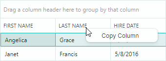
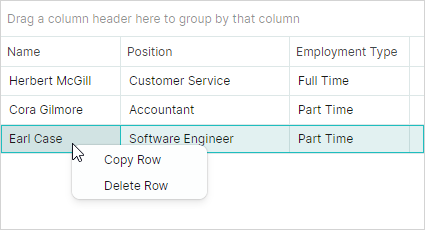

## 上下文菜单

Data Grid 支持特定元素的内置上下文菜单。本主题介绍如何替换和修改这些菜单，以及如何为没有内置上下文菜单的 Data Grid 元素显示自定义弹出菜单。

## 内置列标题上下文菜单

右键单击 column 标头可显示内置 column 标头菜单。该菜单包含对数据进行排序和分组、显示搜索面板以及显示 column 选择器的命令。


`DataGridControl.ColumnMenu` 属性允许您访问和自定义此菜单。

要替换默认菜单，请将 `Eremex.AvaloniaUI.Controls.Bars.PopupMenu` 对象分配给 `DataGridControl.ColumnMenu` 属性。

要自定义现有的 column 标题菜单（添加新项目或删除默认项目），请在初始化后访问该菜单（例如，在 DataGrid 的 `Initialized` 事件处理程序中），然后修改该菜单。

### 数据上下文

column 标题菜单及其项（`ToolbarButtonItem` 对象）的 `DataContext` 属性指定已为其调用菜单的 `GridColumn` 对象。

### 示例 - 如何更换 default column header menu

以下代码创建一个自定义 column 标题菜单，其中包含_复制列_菜单项。该代码将 menu item 绑定到 ViewModel 中定义的 _CopyColumnDataCommand_ 命令。



请注意以下代码中 menu item 的 `Command` 和 `CommandParameter` 属性的初始化。表达式 `CommandParameter="{Binding FieldName}"` 指定绑定到 menu item 的 `DataContext` (`GridColumn.FieldName`) 的 `FieldName` 属性。

`GridColumn` 的 `DataContext` 与 Data Grid 的 `DataContext`（本示例中的 _ViewModel_ 对象）匹配。这允许您使用表达式 `Command="{Binding DataContext.CopyColumnCommand}"` 访问视图模型及其 _CopyColumnCommand_ 命令。

``` xml
xmlns:mxdg="https://schemas.eremexcontrols.net/avalonia/datagrid"
xmlns:mxe="https://schemas.eremexcontrols.net/avalonia/editors"
xmlns:mxb="https://schemas.eremexcontrols.net/avalonia/bars"

<mxdg:DataGridControl Name="dataGrid1">
    <mxdg:DataGridControl.ColumnMenu>
        <mxb:PopupMenu>
            <mxb:ToolbarButtonItem
                Header="Copy Column"
                Command="{Binding DataContext.CopyColumnCommand}"
                CommandParameter="{Binding FieldName}">
            </mxb:ToolbarButtonItem>
        </mxb:PopupMenu>
    </mxdg:DataGridControl.ColumnMenu>
</mxdg:DataGridControl>
```
``` csharp
public MainView()
{
    DataContext = new ViewModel();
}

public partial class ViewModel : ObservableObject
{
    [RelayCommand]
    void CopyColumn(string fieldName)
    {
        //...
    }
}
```

### 示例 - 如何修改现有的 column 标题菜单

以下示例将自定义命令添加到默认 column 标题菜单。

该示例在初始化后处理 `DataGridControl.Initialized` 事件以访问 default column header menu，并向菜单添加 _Refresh Data_ 命令。


``` xml
xmlns:mxdg="https://schemas.eremexcontrols.net/avalonia/datagrid"
xmlns:mxe="https://schemas.eremexcontrols.net/avalonia/editors"
xmlns:mxb="https://schemas.eremexcontrols.net/avalonia/bars"

<mxdg:DataGridControl Name="dataGrid1" Initialized="OnInitialized">
    ...
</mxdg:DataGridControl>
```
``` csharp
using Eremex.AvaloniaUI.Controls.Bars;

private void OnInitialized(object sender, System.EventArgs e)
{
    ToolbarButtonItem btn1 = new ToolbarButtonItem();
    btn1.Header = "Refresh Data";
    btn1.ShowSeparator = true;
    btn1.Command = new RelayCommand<DataGridControl>(UpdateDataGrid);
    btn1.CommandParameter = dataGrid1;
    dataGrid1.ColumnMenu.Items.Add(btn1);
}

[RelayCommand]
void UpdateDataGrid(DataGridControl dataGrid)
{
    //...
}
```


## 行单元格菜单

Data Grid 支持行单元格的内置上下文菜单（请参阅 `DataGridControlBase.RowCellMenu` 属性）。该菜单最初是空的，因此是隐藏的。要显示行单元格菜单，请使用 XAML 或代码隐藏中的项目填充它。

### 数据上下文

行单元菜单的 `DataContext` 及其项目包含 `Eremex.AvaloniaUI.Controls.DataControl.Visuals.CellData` 对象，该对象允许您访问上下文特定信息：

- `CellData.DataControl` — 返回为其调用菜单的 container control (`DataGridControl`)。 
- `CellData.Row` — 返回单击的行的 underlying 数据对象。

### 示例 - 如何为所有行显示相同的上下文菜单命令

以下示例将“_复制行_”命令添加到所有行的行单元格菜单 (`DataGridControlBase.RowCellMenu`)。


下面的 XAML 代码将弹出菜单分配给 `DataGridControl.RowCellMenu` 属性。弹出菜单包含一个绑定到视图模型中定义的 _CopyRowCommand_ 命令的 item (`ToolbarButtonItem`)（Data Grid 的 `DataContext`）。

``` xml
xmlns:mxdg="https://schemas.eremexcontrols.net/avalonia/datagrid"
xmlns:mxe="https://schemas.eremexcontrols.net/avalonia/editors"
xmlns:mxb="https://schemas.eremexcontrols.net/avalonia/bars"

<mxdg:DataGridControl Name="dataGrid1">
    <mxdg:DataGridControl.RowCellMenu>
        <mxb:PopupMenu>
            <mxb:PopupMenu.Items>
                <mxb:ToolbarButtonItem Header="Copy Row"
                 Command="{Binding DataControl.DataContext.CopyRowCommand}"
                 CommandParameter="{Binding Row}"/>
            </mxb:PopupMenu.Items>
        </mxb:PopupMenu>
    </mxdg:DataGridControl.RowCellMenu>
</mxdg:DataGridControl>
```
``` csharp
public partial class MainView : UserControl
{
    ViewModel viewModel = new ViewModel();
    public MainView()
    {
        DataContext = viewModel;
        InitializeComponent();
    }
}

public partial class ViewModel : ObservableObject
{
    public ViewModel() { }
    [RelayCommand]
    void CopyRow(object row)
    {
        //...
    }
}
```

### 示例 - 如何为不同行显示不同的上下文菜单命令

本示例中的数据 Grid control 显示 _Employee_ 对象的列表。该示例初始化行 (`DataGridControlBase.RowCellMenu`) 的上下文菜单，并为不同的数据行显示不同的菜单项。


上下文菜单显示引用兼职员工的行的_显示工作时间_ menu item（_Employee.IsPartTime_ 属性返回_true_）。

上下文菜单显示引用承包商的行的_打开合同详细信息_ menu item（_Employee.IsContract_ 属性返回_true_）。

下面的 XAML 代码将两个项目（“_显示工作时间_”和“_打开合同详细信息_”）添加到上下文菜单中。这些项目的可见性由业务对象的 _IsPartTime_ 和 _IsContract_ 属性动态管理。

``` xml
xmlns:mxdg="https://schemas.eremexcontrols.net/avalonia/datagrid"
xmlns:mxb="https://schemas.eremexcontrols.net/avalonia/bars"

<mxdg:DataGridControl Name="dataGrid1" AutoGenerateColumns="True" ItemsSource="{Binding Employees}">
    <mxdg:DataGridControl.RowCellMenu>
        <mxb:PopupMenu>
            <mxb:PopupMenu.Items>
                <mxb:ToolbarButtonItem
                    Header="Show Working Hours"
                    Command="{Binding DataControl.DataContext.ShowWorkingHoursCommand}"
                    CommandParameter="{Binding Row}"
                    Glyph="{SvgImage 'avares://AvaloniaApplication3/Assets/time.svg'}"
                    GlyphSize="20,20"
                    IsVisible="{Binding Row.IsPartTime}">
                </mxb:ToolbarButtonItem>
                <mxb:ToolbarButtonItem
                    Header="Open Contract Details"
                    Command="{Binding DataControl.DataContext.OpenContractDetailsCommand}"
                    CommandParameter="{Binding Row}"
                    Glyph="{SvgImage 'avares://AvaloniaApplication3/Assets/details.svg'}"
                    GlyphSize="20,20"
                    IsVisible="{Binding Row.IsContract}"
                    >
                </mxb:ToolbarButtonItem>
            </mxb:PopupMenu.Items>
        </mxb:PopupMenu>
    </mxdg:DataGridControl.RowCellMenu>
</mxdg:DataGridControl>
```
``` csharp
public partial class MainView : UserControl
{
    MainViewModel viewModel = new MainViewModel();

    public MainView()
    {
        DataContext = viewModel;

        viewModel.Employees.Add(new Employee() { 
            Name = "Herbert McGill", EmploymentType=EmploymentType.FullTime, 
            Position= "Customer Service" 
        });
        viewModel.Employees.Add(new Employee() { 
            Name = "Cora Gilmore", EmploymentType = EmploymentType.PartTime, 
            Position = "Accountant" 
        });
        viewModel.Employees.Add(new Employee() { 
            Name = "Earl Case", EmploymentType = EmploymentType.PartTime, 
            Position = "Software Engineer" 
        });
        viewModel.Employees.Add(new Employee() { 
            Name = "Julius Howell", EmploymentType = EmploymentType.Contract, 
            Position = "Financial Analyst" 
        });
        viewModel.Employees.Add(new Employee() { 
            Name = "Trevor Cameron", EmploymentType = EmploymentType.Contract, 
            Position = "Accountant" 
        });
        viewModel.Employees.Add(new Employee() { 
            Name = "Lon Monroe", EmploymentType = EmploymentType.FullTime, 
            Position = "Management" 
        });

        InitializeComponent();
    }
}

public partial class MainViewModel : ViewModelBase
{
    public MainViewModel() { }

    public ObservableCollection<Employee> Employees { get; } = new();

    [RelayCommand]
    void OpenContractDetails(Employee emp)
    {
        if(emp.EmploymentType == EmploymentType.Contract)
        {
            //...
        }
    }

    [RelayCommand]
    void ShowWorkingHours(Employee emp)
    {
        if(emp.EmploymentType == EmploymentType.PartTime)
        {
            //...
        }
    }
}

public partial class Employee : ObservableObject
{
    [ObservableProperty]
    public string name = "";

    [ObservableProperty]
    public string position = "";

    [ObservableProperty]
    public EmploymentType employmentType;

    [Browsable(false)]
    public bool IsContract => EmploymentType == EmploymentType.Contract;

    [Browsable(false)]
    public bool IsPartTime => EmploymentType == EmploymentType.PartTime;
}

public enum EmploymentType
{
    [Display(Name = "Full Time")]
    FullTime,
    [Display(Name = "Part Time")]
    PartTime,
    Contract
}
```


### 示例 - 如何从 ViewModel 生成上下文菜单命令

此示例演示如何使用 ViewModel 中定义的项目填充 DataGrid control 的行单元格菜单。



行单元格菜单 (`DataGridControl.RowCellMenu`) 填充有来自 `PopupMenu.ItemsSource` 集合指定的 item source 的项目（`ToolbarButtonItem` 对象）。在此示例中，使用以下绑定表达式将 `PopupMenu.ItemsSource` 属性绑定到主视图模型中定义的 _MenuItems_ 集合：

``` xml
<mxb:PopupMenu ItemsSource="{Binding DataControl.DataContext.MenuItems}">
```

当 DataGrid 单元显示 `PopupMenu` 时，菜单的 `DataContext` 包含 `Eremex.AvaloniaUI.Controls.DataControl.Visuals.CellData` 对象。 `CellData` 对象公开 `DataControl` 属性，该属性允许您访问显示菜单的 control。 
主视图模型分配给 control 的 `DataContext`。因此，`DataControl.DataContext.MenuItems` 语法引用主视图模型中定义的 _MenuItems_ 集合。

`CellData` 对象还包含其他属性，允许您访问单元格相关信息（column、行对象等）。

菜单项使用样式进行初始化。菜单项 `DataContext` 是 `PopupMenu.ItemsSource` 集合的元素。在此示例中，`PopupMenu.ItemsSource` 属性存储 _MenuItemViewModel_ 对象的集合。以下代码片段将 `ToolbarButtonItem.Header` 和 `ToolbarButtonItem.Command` 属性分别绑定到 _MenuItemViewModel.Header_ 和 _MenuItemViewModel.Command_ 属性。

``` xml
<mxb:PopupMenu.Styles>
    <Style Selector="mxb|ToolbarButtonItem">
        <Setter Property="Header" Value="{Binding Header}"/>
        <Setter Property="Command" Value="{Binding Command}"  />
    </Style>
</mxb:PopupMenu.Styles>
```

`ToolbarButtonItem` 的命令需要有关已右键单击的行的信息。要将数据行传递给命令，XAML 代码设置 `ToolbarButtonItem.CommandParameter` 属性，如下所示：

``` xml
xmlns:mxvis="clr-namespace:Eremex.AvaloniaUI.Controls.DataControl.Visuals;
 assembly=Eremex.Avalonia.Controls"

<mxb:PopupMenu.Styles>
    <Style Selector="mxb|ToolbarButtonItem">
        ...
        <Setter Property="CommandParameter" 
         Value="{Binding $parent[mxvis:CellControl].DataContext.Row}"  />
    </Style>
</mxb:PopupMenu.Styles>
```

这里，`$parent[mxvis:CellControl]` 表达式遍历逻辑树到 locate 和 `CellControl` 对象（它是 `ToolbarButtonItem` 的 `DataContext` 的父对象）。 `CellControl.DataContext` 对象包含 `Eremex.AvaloniaUI.Controls.DataControl.Visuals.CellData` 对象，该对象允许您从 `CellData.Row` 属性访问数据行。

完整代码如下所示。

``` xml
xmlns:mxdg="https://schemas.eremexcontrols.net/avalonia/datagrid"
xmlns:mxb="https://schemas.eremexcontrols.net/avalonia/bars"
xmlns:mxvis="clr-namespace:Eremex.AvaloniaUI.Controls.DataControl.Visuals;
 assembly=Eremex.Avalonia.Controls"

<mxdg:DataGridControl Name="dataGrid1" AutoGenerateColumns="True" ItemsSource="{Binding Employees}">
    <mxdg:DataGridControl.RowCellMenu>
        <mxb:PopupMenu ItemsSource="{Binding DataControl.DataContext.MenuItems}">
            <mxb:PopupMenu.Styles>
                <Style Selector="mxb|ToolbarButtonItem">
                    <Setter Property="Header" Value="{Binding Header}"/>
                    <Setter Property="Command" Value="{Binding Command }"  />
                    <Setter Property="CommandParameter" 
                     Value="{Binding $parent[mxvis:CellControl].DataContext.Row}"  />
                </Style>
            </mxb:PopupMenu.Styles>
        </mxb:PopupMenu>
    </mxdg:DataGridControl.RowCellMenu>
</mxdg:DataGridControl>
```
``` csharp
public partial class MainView : UserControl
{
    MainViewModel viewModel = new MainViewModel();

    public MainView()
    {
        DataContext = viewModel;

        viewModel.Employees.Add(new Employee() { 
            Name = "Herbert McGill", EmploymentType=EmploymentType.FullTime, 
            Position= "Customer Service" 
        });
        viewModel.Employees.Add(new Employee() { 
            Name = "Cora Gilmore", EmploymentType = EmploymentType.PartTime, 
            Position = "Accountant" 
        });
        viewModel.Employees.Add(new Employee() { 
            Name = "Earl Case", EmploymentType = EmploymentType.PartTime, 
            Position = "Software Engineer" 
        });

        InitializeComponent();
    }
}

public partial class MainViewModel : ViewModelBase
{
    public ObservableCollection<Employee> Employees { get; } = new();

    public MainViewModel()
    {
        MenuItemViewModel menuItem1 = new MenuItemViewModel();
        menuItem1.Header = "Copy Row";
        menuItem1.Command = new RelayCommand<object>(CopyRow);
        MenuItems.Add(menuItem1);

        MenuItemViewModel menuItem2 = new MenuItemViewModel();
        menuItem2.Header = "Delete Row";
        menuItem2.Command = new RelayCommand<object>(DeleteRow);
        MenuItems.Add(menuItem2);

    }

    public ObservableCollection<MenuItemViewModel> MenuItems { get; } = new();

    [RelayCommand]
    void CopyRow(object row)
    {
        //...
    }
    [RelayCommand]
    void DeleteRow(object row)
    {
        //...
    }
}

public partial class MenuItemViewModel : ObservableObject
{
    [ObservableProperty]
    string? header;

    [ObservableProperty]
    ICommand? command;
}

public partial class Employee : ObservableObject
{
    [ObservableProperty]
    public string name = "";

    [ObservableProperty]
    public string position = "";

    [ObservableProperty]
    public EmploymentType employmentType;

    [Browsable(false)]
    public bool IsContract => EmploymentType == EmploymentType.Contract;

    [Browsable(false)]
    public bool IsPartTime => EmploymentType == EmploymentType.PartTime;
}

public enum EmploymentType
{
    [Display(Name = "Full Time")]
    FullTime,
    [Display(Name = "Part Time")]
    PartTime,
    Contract
}
```

## 自定义显示菜单

您可以处理 `PopupMenu.Opening` 事件来动态自定义 DataGrid 的上下文菜单。该事件在即将显示 `PopupMenu` 时发生。

## 示例 - 如何显示第一个 column 的上下文菜单

以下示例将空 `PopupMenu` 分配给 `DataGridControlBase.RowCellMenu` 属性，然后处理 `PopupMenu.Opening` 事件，以便在用户右键单击第一个可见 DataGrid 列中的单元格时用项目填充菜单。当用户在其他列中右键单击时，菜单保持为空（因此不会显示）。

创建的菜单包含“_显示/隐藏组面板_”check button，用于切换 DataGrid 组面板的可见性（`DataGridControlBase.ShowGroupPanel` 属性）。


``` xml
<mxdg:DataGridControl Name="dataGrid1" ...>
    <mxdg:DataGridControl.RowCellMenu>
        <mxb:PopupMenu Opening="RowCellMenuOpening"/>
    </mxdg:DataGridControl.RowCellMenu>
</mxdg:DataGridControl>
```
``` csharp
using Eremex.AvaloniaUI.Controls.DataControl.Visuals;

void RowCellMenuOpening(object sender, CancelEventArgs e)
{
    if (sender == null) return;
    PopupMenu menu = sender as PopupMenu;
    menu.Items.Clear();

    CellData cellData = menu.DataContext as CellData;
    DataGridControl control = cellData.DataControl as DataGridControl;
    GridColumn column = cellData.Column as GridColumn;
    //// Access the underlying data row, when required.
    //object dataRow = cellData.Row;

    if(column.VisibleIndex == 0)
    {
        ToolbarCheckItem btn1 = new ToolbarCheckItem();
        btn1.IsChecked = control.ShowGroupPanel;
        btn1.Header = (control.ShowGroupPanel) ? "Hide Group Panel" : "Show Group Panel";
        btn1.Command = new RelayCommand<DataGridControl>(ShowGroupPanelCommand);
        btn1.CommandParameter = control;
        menu.Items.Add(btn1);
    }
}

[RelayCommand]
void ShowGroupPanelCommand(DataGridControl dataGrid)
{
    dataGrid.ShowGroupPanel = !dataGrid.ShowGroupPanel;
}
```

## 使用 ToolbarManager 的附加属性显示控件的上下文菜单

`Eremex.AvaloniaUI.Controls.Bars.ToolbarManager` 组件提供 `ContextPopup` attached property，允许您将上下文菜单分配给任何 control，包括 DataGrid。对于没有默认上下文菜单的 DataGrid 区域以及具有空默认菜单的区域，会显示此上下文菜单。

### 示例 - 如何使用 _ToolbarManager.ContextPopup_ attached property 分配上下文菜单

以下代码使用 `ToolbarManager.ContextPopup` attached property 指定 DataGrid 控件的上下文菜单。该菜单包含_显示列标题面板_/_隐藏列标题面板_菜单 check item，用于切换 `DataGridControl.ShowColumnHeaders` 选项的可见性。


``` xml
<mxdg:DataGridControl Name="dataGrid1">
    <mxdg:DataGridControl.Styles>
        <Style Selector="mxdg|DataGridControl">
            <Setter Property="mxb:ToolbarManager.ContextPopup" >
                <Template>
                    <mxb:PopupMenu Tag="dataGrid1">
                        <mxb:ToolbarCheckItem Header="Show Column Header Panel" 
                         IsChecked="{Binding $parent[mxdg:DataGridControl].ShowColumnHeaders, Mode=TwoWay}" 
                         IsVisible="{Binding !$parent[mxdg:DataGridControl].ShowColumnHeaders}"/>
                        <mxb:ToolbarCheckItem Header="Hide Column Header Panel" 
                         IsChecked="{Binding $parent[mxdg:DataGridControl].ShowColumnHeaders, Mode=TwoWay}" 
                         IsVisible="{Binding $parent[mxdg:DataGridControl].ShowColumnHeaders}"/>
                    </mxb:PopupMenu>
                </Template>
            </Setter>
        </Style>
    </mxdg:DataGridControl.Styles>
</mxdg:DataGridControl>
```

<br>
<br>

<sup>*</sup> 本页面使用机器翻译技术翻译。
