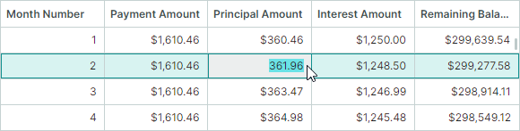
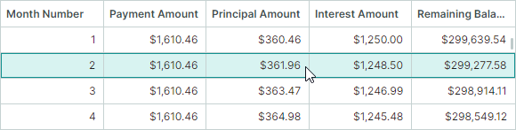

# 焦点和导航


## 单元格和行导航模式

DataGrid 的默认行为允许用户使用键盘在单元格之间导航,或使用鼠标为单元格设置焦点。
使用 `DataGridControl.NavigationMode` 属性在单元格导航（Cell Navigation）模式和行导航（Row Navigation）模式之间切换。

**单元格导航**(默认)

用户可以使用键盘或鼠标为任意单元格设置焦点。



**行导航**

用户无法为单个单元格设置焦点,单元格编辑操作也会被禁用。点击单元格会高亮整行。

``` xml
<mxdg:DataGridControl x:Name="dataGrid" NavigationMode="Row">
```




## 焦点列

使用 `DataGridControl.FocusedColumn` 属性获取当前处于焦点的列。要将焦点移动到指定列,请将相应的 `GridColumn` 对象赋值给 `FocusedColumn` 属性。

!!! note

    只有在[单元格导航模式](#单元格和行导航模式)下才能为列设置焦点。

## 焦点行

使用 `DataGridControl.FocusedRowIndex` 属性获取焦点行的[索引](rows.md#identify-and-get-rows)。`DataGridControl.FocusedItem` 属性允许您获取焦点行对应的底层数据对象。

要将焦点移动到指定行,您可以将该行的索引赋值给 `DataGridControl.FocusedRowIndex` 属性。

## 焦点单元格

焦点单元格由焦点行与焦点列的交叉位置确定。要将焦点移动到指定单元格,请为目标[行](#焦点行)和[列](#焦点列)设置焦点。

<!-- TODO
Example - focus a specific cell
 -->

<br>
<br>

<sup>*</sup> 本页面使用机器翻译技术翻译。
