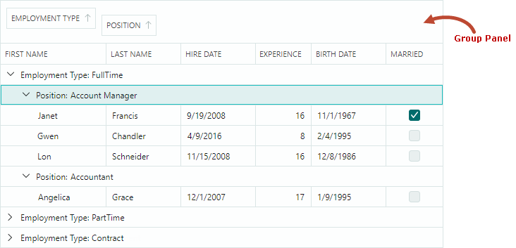

# 分组

Data Grid 可以根据一列或多列对数据进行分组。数据分组将具有相同 column 值的行合并到相同的数据组中。



用户可以按如下方式对数据进行分组：

- 将 column 标题拖至组面板。 
- 右键单击​​ column 标题并选择“按此列分组”命令。


要取消数据分组，用户可以执行以下操作之一：

- 从组面板中拖动组 column 标题。
- 右键单击​​组 column 标题并选择“取消分组”命令。


当您按 column 应用分组时，该 column 的数据为 [sorted](sorting.md)。用户可以单击组 column 标题来切换排序顺序。


## 小组面板

grid control 的组面板显示组列的标题。用户可以将 column 标题拖到组面板上以按此列进行分组。


使用 DataGrid 的 `ShowGroupPanel` 属性指定组面板的可见性。用户可以使用 column 标头的上下文菜单隐藏然后恢复组面板：


## 分组列

当您按 column 进行分组时，该 column 将从网格移动到组面板。将 `ShowGroupedColumns` 属性设置为 `true` 可同时在组面板和网格中显示组列。以下 image 说明了 `ShowGroupedColumns` setting：


## 防止分组

您可以禁用 column 的 `AllowSorting` 属性以阻止用户对此列执行排序和分组操作。

`DataGridControl.AllowSorting` 属性允许您禁止用户对任何列进行 [sort](sorting.md) 和组操作。

如果column不支持排序（例如，当column显示image数据或绑定到未实现`IComparable`接口的对象时），则无法按此列对数据进行分组。您可以更改此 default behavior，如以下部分所述：[Customize Grouping Logic](#customize-grouping-logic)。

## 自定义分组逻辑

组列始终为 [sorted](sorting.md)，按 `ColumnBase.SortDirection` 属性指定的升序或降序排列。

分组操作时，网格行根据分组列的编辑值或显示值进行分组。默认分组和排序逻辑取决于 column 的 in-place 编辑器和 bound property 的数据类型：

- 按编辑值分组/排序 - 除具有嵌入式 ComboBoxEditor 的列之外的所有列。
- 按 display text 分组/排序 — 具有嵌入式 ComboBoxEditor 的列。
- 无分组/排序 — 列绑定到未实现 `IComparable` 接口的对象。例如，image数据类型不实现此接口，因此默认情况下相应的列不支持排序和分组操作。要对这些列进行强制排序和分组，请为这些列实施 [custom sorting](sorting.md#custom-sorting) 和 [custom grouping](#custom-grouping)。


`ColumnBase.SortMode` 属性允许您更改列的排序/分组模式。可以使用以下选项：

- `SortMode.Value` — 按单元格编辑值排序/分组。
- `SortMode.DisplayText` — 按单元格显示文本排序/分组。
- `SortMode.Custom` — 启用自定义排序和分组。将 `SortMode` 属性设置为 `Custom`，然后处理 `DataGridControl.CustomColumnGroup` 和/或 `DataGridControl.CustomColumnSort` 事件以实现自定义分组和/或自定义排序逻辑。请参阅以下链接了解更多信息：

- [Custom Sorting](sorting.md#custom-sorting)
    - [Custom Grouping](#custom-grouping)

### 自定义分组

要为特定 column 实施自定义分组规则，请将 column 的 `ColumnBase.SortMode` 属性设置为 `Custom`，并处理 `DataGridControl.CustomColumnGroup` 事件。

每个组 column 都会触发 `CustomColumnGroup` 事件来比较相邻网格行对。处理此事件时，您 should 指定是否将行组合到同一组中。

以下事件参数允许您识别组行、值并设置比较结果：

- `Column` — 当前处理的组列。
- `SourceItemIndex1` 和 `SourceItemIndex2` — 与当前处理的网格行相对应的项目（业务对象）的绑定 item source (`DataGridControl.ItemsSource`) 中的索引。
- `Value1` 和 `Value2` — 当前处理的网格行中 column 组的值。
- `Result` — 自定义比较的结果。将 `Result` 设置为 `true` 以将行放入同一组。如果需要将行放置在不同的组中，请将 `Result` 设置为 `false`。将 `Result` 设置为 `null` 以应用默认分组逻辑。


<!-- TODO
Result can be set to null. What's this for?
 -->

为了提高 control 的性能，会触发 `CustomColumnGroup` 事件来将行与小 set of 相邻网格行进行比较（根据当前排序顺序）。对于两个网格行的所有可能组合，不会触发此事件。 If you need to change the default row sorting logic and place specific rows near each other, handle the `ColumnView.CustomColumnSort` event.

#### 示例 - 按日期时间列分组时按年份分组

假设数据 Grid control 包含显示日期时间值的 _HireDate_ column。 When you group by this column, the control's default grouping behavior is to combine rows with unique DateTime values.

此示例应用自定义分组规则：行按 _HireDate_ 值的年份部分进行分组。为了完成此任务，将 _HireDate_ column 的 `SortOrder` 属性设置为 `Custom`，并处理以下事件：

- `DataGridControl.CustomColumnGroup` — 实现自定义分组逻辑。
- `DataGridControl.CustomGroupValueDisplayText` — Displays the Year part of a date-time value in group rows.参见 [Group Row Text](#group-row-text)。

出于演示目的，启用 `ShowGroupedColumns` 属性以在组面板和网格中同时显示分组的 _HireDate_ column。


``` cs
dataGrid.Columns["HireDate"].SortMode = Eremex.AvaloniaUI.Controls.DataControl.SortMode.Custom;
dataGrid.CustomColumnGroup += DataGrid_CustomColumnGroup;
dataGrid.CustomGroupValueDisplayText += DataGrid_CustomGroupValueDisplayText;        
dataGrid.ShowGroupedColumns = true;

private void DataGrid_CustomColumnGroup(object sender, DataGridCustomColumnGroupEventArgs e)
{
    if (e.Column.FieldName != "HireDate")
        return;
    DateTime employeeHireDate1 = (DateTime)e.Value1;
    DateTime employeeHireDate2 = (DateTime)e.Value2;
    e.Result = employeeHireDate1.Year == employeeHireDate2.Year;
}

private void DataGrid_CustomGroupValueDisplayText(object sender, DataGridCustomGroupValueDisplayTextEventArgs e)
{
    if (e.Column.FieldName != "HireDate")
        return;
    DateTime hireDate = (DateTime)e.Value;
    e.DisplayText = hireDate.Year.ToString();
}
```


## 代码中的分组

要在代码中按 column(s) 对数据进行分组，请执行以下操作：

1. 对此 column 和 position 进行排序，使其位于已排序的 column 集合的开头。您可以使用 `SortIndex` 和 `SortDirection` 属性对 column 进行排序。请参阅 [Sorting](sorting.md) 了解更多信息。
2. 将 `DataGridControl.GroupCount` 属性设置为组列数。

以下代码按两列对数据进行分组。

``` csharp
GridColumn column1 = dataGrid.Columns["EmploymentType"];
GridColumn column2 = dataGrid.Columns["Position"];

if(column1 != null && column2 != null)
{
    dataGrid.BeginDataUpdate();
    column1.SortIndex = 0;
    column2.SortIndex = 1;
    column2.SortDirection = System.ComponentModel.ListSortDirection.Descending;
    dataGrid.GroupCount = 2;
    dataGrid.EndDataUpdate();
}
```

<!--TODO
Add the ClearGrouping method after BeginDataUpdate in the example above
the ClearGrouping member need to be published
-->

此示例使用 `BeginDataUpdate` 和 `EndDataUpdate` 方法来防止在更改多个组/排序设置时出现不必要的更新。 Data Grid 仅在 `EndDataUpdate` method 调用后更新。

如果不使用 `BeginDataUpdate` 和 `EndDataUpdate` 方法，则每次更改任何组/排序设置后都会更新 Data Grid。

每次调用 `BeginDataUpdate` method 后都必须调用 `EndDataUpdate` 方法。


## 行分组

组行用于在对数据进行分组时形成行层次结构。它们显示相应组列的值。绑定的 item 源中不存在组行。

### 识别组行

[Row indexes](rows.md#identify-and-get-rows) 允许您识别代码中的网格行。组行的行索引为负，而数据行的行索引为非负。

`FocusedRowIndex` 属性允许您获取当前焦点组或数据行，或将焦点移动到特定组或数据行。以下代码将焦点移动到第一组行：

``` cs
// If data is grouped, focus the first group row.
if (dataGrid.GroupCount > 0)
    dataGrid.FocusedRowIndex = -1;
```

另请参阅：[Traverse Through Group Rows](#traverse-through-group-rows)。

### 展开和折叠组行

用户可以展开和折叠组行，如下所示：

- 单击组行的展开 button

- 按键盘上的“+”/“-”和“&rarr;”/“&larr;”键


在代码中，您可以使用以下 API 成员进行 control 组行扩展：

- `AutoExpandAllGroups` — 指定每次数据分组操作后是否自动展开分组行。
- `CollapseAllGroups` — 折叠所有组行。
- `CollapseGroupRow` — 折叠组行。 
- `ExpandAllGroups` — 展开所有组行。
- `ExpandGroupRow` — 展开组行。
- `IsGroupRow` — 指定特定行是否为组行。
- `IsGroupRowExpanded` — 指定是否展开组行。


### 遍历组行

组行拥有子数据行，如果数据按两列或更多列分组，它们还可以拥有其他组行。

使用以下方法迭代组行及其子行：

- `GetGroupChildRowCount` — 获取指定组行的直接子行数。如果指定行是数据行，则此 method 返回 `-1`，因为数据行没有子行。

不带参数的 `GetGroupChildRowCount` method 返回根级别的组行数。如果数据未分组，则此重载将返回 `-1`。

- `GetGroupChildRowIndex` — 返回指定子行的 [row index](rows.md#get-and-set-row-values)。 `GetGroupChildRowIndex` method 有两个过载：

- `GetGroupChildRowIndex(int rowIndex, int childIndex)` — 获取指定组行所拥有的子行的行索引。子行必须是指定组行的直接子行。 `rowIndex` 参数指定父组行。 `childIndex` 参数指定目标子行在其同级中的视觉 position。
    
- `GetGroupChildRowIndex(int childIndex)` — 获取显示在 `childIndex` 位置的根组行的行索引。 `childIndex` 参数标识其他根组行中目标根组行的视觉 position。

- `GetParentRowIndex` — 获取行的父组行的 [row index](rows.md#get-and-set-row-values)。对于没有父行的行，此 method 返回 `DataGridControl.InvalidRowIndex` 常量。

### 对行值进行分组

使用 `GetGroupRowValue` method 检索特定组行的组值。

<!--TODO
there is no GetGroupRowValue(Int32, GridColumn) overload with the GridColumn parameter

添加示例
-->

### 组行文本

组行中显示的默认文本由相应组列的值指定。 `CustomGroupValueDisplayText` 事件允许您为组行指定自定义 display text。
对于每个组行重复触发此事件。使用事件的参数来标识当前处理的组行及其值。要指定自定义显示值，请设置 `DisplayText` 事件参数。

<br>
<br>

<sup>*</sup> 本页面使用机器翻译技术翻译。
