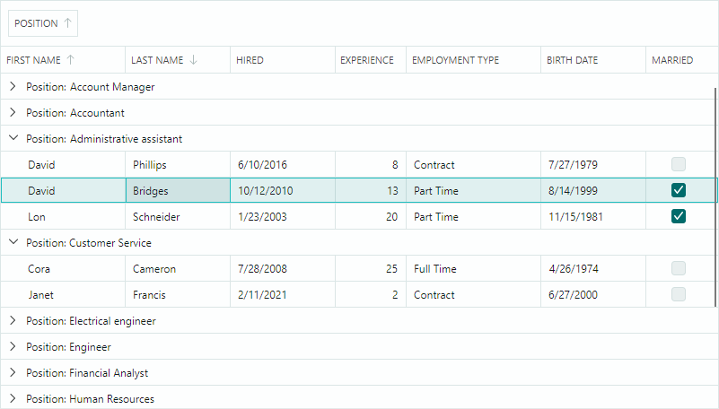

# DataGrid

`DataGridControl` 允许您以列和行的形式显示来自数据源的数据。它提供了丰富的数据格式化和编辑功能。用户可以重新排列列、编辑、排序、分组以及搜索数据。

- [数据绑定](data-binding/index.md) — 您可以将控件绑定到 IList、IBindingList、DataTable 或任何 IEnumerable 数据源。
- [数据排序](sorting.md) — 允许您按不限数量的列对数据进行排序。
- [数据分组](grouping.md) — 数据分组功能会将列值相同的行合并到同一数据组中。您可以按多个列对控件的数据进行分组。
- [样式](styles.md) — 允许您在不同状态下自定义控件元素的外观设置。
- [数据编辑操作](data-editing/index.md) — 如果启用了数据编辑功能,用户可以编辑单元格值。您可以在单元格中嵌入 Eremex 编辑器和自定义编辑器,以特定方式编辑和呈现单元格值。
- 数据验证 — 验证机制可帮助您检查用户输入和数据源的值,并在单元格中显示错误。
- [内置和自定义上下文菜单](context-menus.md)
- [未绑定列](data-binding/unbound-columns.md) — 您可以添加未绑定列(即未绑定到数据源字段的列),并通过事件手动为其填充数据。
- 列的调整大小和移动操作
- [列筛选菜单](filter-and-search.md#column-filters) — 您可以使用显示唯一列值的下拉菜单来筛选网格数据。单击任意列标题中的筛选按钮即可访问筛选选项。
- [搜索面板](filter-and-search.md#search-panel) — 帮助用户根据行中包含的数据快速定位行。
- [自动筛选行](filter-and-search.md#auto-filter-row) — 一种特殊行,允许用户按列筛选数据。
- [行拖放](row-drag-and-drop.md) — 用户可以在控件内以及拖动到另一个控件中拖放行。
- [列组](bands.md) — 允许您在一个共同的标题下对多个列进行可视化分组。
- [固定列](columns.md#fixed-columns) — 允许特定列保持可见并固定在网格的左边缘或右边缘,而其他列可水平滚动。
- [最佳匹配](columns.md#best-fit) — 此功能会将列调整为完整显示列内容(值和标题)且不被截断所需的最小宽度。
- 列标题模板 — 允许您在列标题中显示自定义内容,包括图像。
- 多行选择(高亮显示) — 您可以启用多行选择模式,允许用户一次选择(高亮显示)多行。
- [数据注释特性支持](columns.md#automatic-column-generation) — DataGrid 控件会考虑应用于数据源属性的专用数据注释特性。您可以使用数据注释特性为自动生成的列指定自定义可见性、位置、只读状态和显示名称。
- [大数据量的高性能表现](performance-and-data-virtualization.md) — 用于垂直和水平滚动的数据虚拟化机制可在显示大量行和列时提升控件的性能。
- [导出为 XLSX、PDF、CSV 和图像格式](export.md)

 
 

* 本页面使用机器翻译技术翻译。
