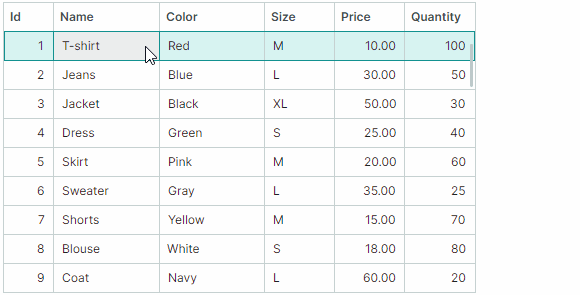

# 行拖放

Data Grid 支持 grid control 内和外部控件的行拖放功能。



当您拖动行时，会显示行预览。但是，如果启用基于平台的行拖放（[dragging rows between applications](#enable-row-drag-and-drop-between-applications) 需要），则行预览不可用。

## 启用行拖放

Set the `DataGridControl.AllowDragDrop` property to `true` to enable row drag-and-drop. In this mode a user can drag a row within the Data Grid control and outside the control.
拖放操作将一行移动到另一个 position，并且还会更改数据源中相应业务对象的 position。

如果将一行拖到外部control，则Data Grid的default behavior将从当前control中删除该行，并从control的数据源中删除相应的业务对象。有关如何防止删除行和业务对象的信息，请参阅 [Row Drag-and-Drop Between Controls](#row-drag-and-drop-between-controls)。

如果使用 `DataControlBase.SelectionMode` 属性启用多行选择（请参阅 [Rows - Multiple Row Selection (Highlight)](rows.md#multiple-row-selection-highlight)），则支持多行拖放。

Data Grid 在拖放过程中不维护自动复制操作。 Pressing the CTRL key is not in effect.


### 在应用程序之间启用行拖放

要允许在应用程序之间拖动行，请为作为拖放操作源的 control 启用 `UsePlatformRowDragDrop` 属性。

!!!提示

The `UsePlatformRowDragDrop` property enables a drag-and-drop mode in which operations are handled by the Avalonia platform.在基于平台的行拖动操作期间不显示行预览。

## 行拖动模式 - 在单元格中开始拖动操作或使用特殊的拖动手柄

Data Grid 支持两种行拖放模式，其不同之处在于启动拖放操作的方式。您可以使用 control 的 `RowDragMode` 属性选择所需的模式。

- `RowDragMode.Row` 模式（默认）— 用户可以在任何行单元格中启动拖放操作。


在此模式下，默认的单元格编辑器激活行为如下：
    
1. 用户需要先聚焦一个单元格。
    
2. 在聚焦的单元格内单击，然后激活单元格编辑器。
    
要通过单击激活单元格编辑器，请在释放鼠标 button 时启用单元格编辑器激活。将 control 的 `DataControlBase.EditorShowMode` 属性设置为 `EditorShowMode.PointerReleased`。

- `RowDragMode.DragHandle` 模式（从 v1.4 开始新增）— 用户可以通过拖动特殊的拖动手柄来启动拖放操作。拖动手柄显示在行指示器区域中，当您激活 `RowDragMode.DragHandle` 模式时，该区域会自动显示在行的左侧。


在 `DragHandle` 模式下，默认情况下，在单元格内按一下即可激活单元格编辑器。您可以使用 control 的 `DataControlBase.EditorShowMode` 属性来更改此行为。

启用多行选择后，将为每个选定的行显示拖动手柄。


**相关API：**

- `RowIndicatorWidth` — 指定显示拖动手柄的行指示器区域的宽度。


## 拖放已排序和分组的数据

当grid control的数据为[sorted](sorting.md)或[grouped](grouping.md)时，默认禁用行拖放操作。将 `DataGridControl.AllowDragDropSortedRows` 属性设置为 `true` 以在排序/分组控件中启用拖放操作。

如果数据已排序，并且将一行拖到另一行之前或之后的 position，则 control 会自动更新已排序的 column 中拖动的行的值，以保持当前排序顺序。排序列中拖动的行的值将设置为目标行的相应值。

## 使用事件处理拖放操作

数据 Grid control 包含用于管理和响应行拖放操作的事件。

### 开始拖放

当拖放操作即将开始时，将触发 `DataGridControl.StartDrag` 事件。使用以下事件参数获取有关当前拖放操作的信息。

- `e.Data` — 指定包含当前拖放操作数据的 `DragDropData` 对象。
- `e.DragElement` — control 的内部视觉元素被拖动。
- `e.Effects` — 指定拖放效果。将此参数设置为`DragDropEffects.None`可取消当前的拖放操作。拖放效果还决定了鼠标指针图标。 
- `e.Items` — 与所拖动的行相对应的数据源项（业务对象）数组。如果拖动组行，则 `e.Items` 数组包含与该组行内显示的数据行对应的业务对象。要确定是否正在拖动组行，请参阅 `e.DragRowIndexes`。
- `e.DragRowIndexes` — 被拖动的行的索引数组。数据行的索引为非负，而组行的索引为负。有关详细信息，请参阅以下主题：[Identify and Get Rows](rows.md#identify-and-get-rows)


### 示例 - 防止对特定数据行启动拖放操作

以下 `StartDrag` 事件处理程序禁用 _Position_ 列中包含“Manager”字符串的行的拖放操作。

``` cs
private void DataGrid_StartDrag(object sender, DataGridStartDragEventArgs e)
{
    // It is assumed that items in the grid's data source are EmployeeInfo objects. 
    // The EmployeeInfo class contains the Position property of the string type.
    foreach(EmployeeInfo item in e.Items)
    {
        if(item.Position.Contains("Manager"))
        {
            e.Effects = Avalonia.Input.DragDropEffects.None;
            return;
        }
    }
}
```

### 示例 - 防止组行的拖放操作

以下示例处理 `StartDrag` 事件以禁用组行的拖放操作。组行具有负索引，因此 `StartDrag` 事件处理程序检查 `e.DragRowIndexes` 数组是否包含负索引。

``` cs
private void DataGrid_StartDrag(object sender, DataGridStartDragEventArgs e)
{
    foreach(int rowIndex in e.DragRowIndexes)
        if(rowIndex < 0) e.Effects = Avalonia.Input.DragDropEffects.None;
}
```

## 在拖放过程中处理拖动阶段

当用户将一行拖到另一行上时，会重复引发 `DataGridControl.DragOver` 事件。该事件的参数允许您识别与当前拖放操作相关的信息：

- `e.Items` — 与所拖动的行相对应的数据源项（业务对象）数组。如果拖动组行，则 `e.Items` 数组包含与该组行内显示的数据行对应的业务对象。
- `e.TargetRowIndex` — 在其上拖动行的行的 [index](rows.md#identify-and-get-rows)。
- `e.DropPosition` — 指定相对于目标行的电位下降 position。可用选项包括： 
    - `DropPosition.Before` — 所拖动的行（如果被删除）将添加到目标行之前的同一层次结构级别。
    - `DropPosition.After` — 拖动的行（如果被删除）将添加到目标行之后的相同层次结构级别。
    - `DropPosition.Inside` — 拖动的行（如果被放下）将被添加为目标组行的子行。当拖动组行时，此 option 有效。

- `e.KeyModifiers` — 指定在 `DragOver` 事件期间是否按下 ALT、SHIFT 和/或 CTRL 键。
- `e.Data` — 指定包含当前拖放操作数据的 `DragDropData` 对象。
- `e.Effects` — 指定拖放效果。将此参数设置为`DragDropEffects.None`可取消当前的拖放操作。拖放效果还决定了鼠标指针图标。


### 示例 - 防止行被删除到组行上

以下 `DragOver` 事件处理程序可防止行被删除到组行上。

``` cs
private void DataGrid_DragOver(object sender, DataGridDragEventArgs e)
{
    if(e.TargetRowIndex < 0) 
        e.Effects = Avalonia.Input.DragDropEffects.None;
}
```


## 完成拖放

您可以处理两个事件，以在拖放操作期间删除行时执行操作：

- `DataGridControl.Drop` — 当一行即将被放到另一个网格行上时触发。该事件的参数与 `DataGridControl.DragOver` 事件的参数匹配。

要在特定情况下取消删除操作，请处理 `Drop` 事件并将其 `e.Handled` 参数设置为 `true`。

如果一行被放置在当前数据 Grid control 之外，则该控件不会触发 `Drop` 事件。有关详细信息，请参阅下面的 `DataGridControl.CompleteDragDrop` 事件描述。

### 示例 — 修改删除行的值

以下 `Drop` 事件处理程序会在拖放行时更改其值。假设数据源包含_“EmploymentType”_字段。下面的代码将删除行的 _"EmploymentType"_ 字段设置为目标行的 _"EmploymentType"_ 字段值。

    ``` cs
    private void DataGrid_Drop(object sender, DataGridDragEventArgs e)
    {
        DataGridControl grid = sender as DataGridControl;
        GridColumn colEmploymentType = grid.Columns["EmploymentType"];
        EmploymentType newEmploymentType = (EmploymentType)grid.GetCellValue(e.TargetRowIndex, colEmploymentType);
        foreach (EmployeeInfo item in e.Items)
        {
            item.EmploymentType = newEmploymentType;
        }
    }
    ```

<!-- TODO
Почему передаются айтемы, а не row indexы?
В ивент надо добавить e.DragRowIndexes (по аналогии с StartDrag) ?
 -->


- `DataGridControl.CompleteDragDrop` — 在当前 control 内或当前控件外完成拖放操作后触发。

`DataGridControl.CompleteDragDrop` 事件在 `DataGridControl.Drop` 事件之后触发。

以下参数可用于 `DataGridControl.CompleteDragDrop` 事件：

- `e.Items` — 与删除的行相对应的项目（业务对象）数组。
    - `e.Effects` — 返回已在其上放置行的 control 的 `Drop` 事件处理程序中设置的拖放效果。

另请参阅：[Row Drag-and-Drop Between Controls](#row-drag-and-drop-between-controls)

    
## 拖放选项

Data Grid 包含以下选项来自定义行拖放操作：

- `DataGridControl.AutoExpandOnDrag` — 获取或设置在拖放操作期间悬停时折叠的组行是否自动展开。
- `DataGridControl.AutoExpandDelayOnDrag` — 获取或设置在拖放操作期间鼠标悬停在折叠组行上时自动展开折叠组行之前的延迟。
- `DataGridControl.AllowScrollingOnDrag` — 获取或设置当您在 control 的顶部或底部边缘拖动行时 Data Grid 是否自动滚动行。


## 在控件之间进行行拖放

`DataGridControl`、`TreeListControl` 和 `TreeViewControl` 控件之间自动支持行拖放。使用这些 controls 公开的 `AllowDragDrop` option 来启用它们的拖放功能。

### 拖放的视觉指示

拖动行时，`DataGridControl`、`TreeListControl` 和 `TreeViewControl` controls 直观地指示潜在的放置位置。


### 将行及其项目从源控件自动移动到目标控件

`DataGridControl`、`TreeListControl` 和 `TreeViewControl` 支持在拖放操作期间在这些 controls 之间自动移动拖动的行：包含拖动数据的新行将添加到目标 control，然后从源控件中删除拖动的行。相应的 item（业务对象）也会在源 QZX​​0004Q 和目标 item 源之间传输。

如果源 QZX​​0001Q 中的项目的数据类型与目标控件中的项目的数据类型匹配或兼容，则会自动移动行和相应的 item。参见`Type.IsAssignableFrom` method，用于检查数据类型的兼容性。

要防止在对外部 controls 进行拖放操作期间删除源 QZX​​0001Q 中的行和 item，您可以执行以下操作之一：

- 处理目标control的`Drop`事件并将其`e.Effects`事件参数设置为`Avalonia.Input.DragDropEffects.None`。

- 处理源control的`DataGridControl.CompleteDragDrop`事件，并将`e.Handled`事件参数设置为`true`。

    ``` cs
    private void DataGrid_CompleteDragDrop(object sender, DataGridCompleteDragDropEventArgs e)
    {
        e.Handled = true;
    }
    ```

### 拖放到其他控件

`DataGridControl`、`TreeListControl` 和 `TreeViewControl` controls 不维护将行自动拖放到其他 controls（例如，标准 Avalonia `DataGrid`）。要允许将行拖动到这些 controls，请使用 `Avalonia.Input.DragDrop.AllowDrop` 附加属性为其启用拖放功能。处理目标 control 的 `Avalonia.Input.DragDrop.Drop` 附加事件以接受拖动的行。处理 `DragDrop.Drop` 事件时，您可以从 `Data` 事件参数访问拖动的行。

<br>
<br>

<sup>*</sup> 本页面使用机器翻译技术翻译。
