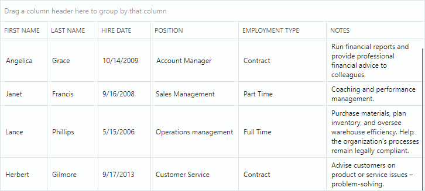
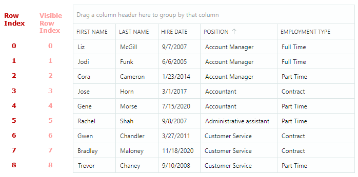
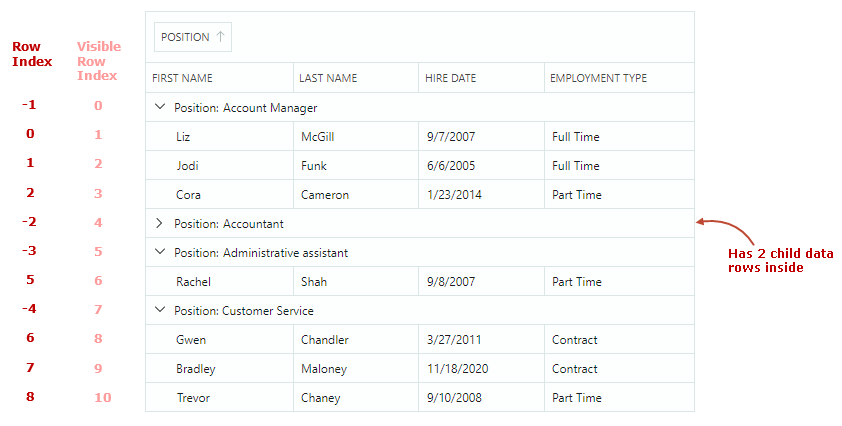

# 行

数据行表示来自绑定项源的项。当您对数据进行分组时，DataGrid 会创建组行，用于合并具有相同分组值的行。组行在项源中并不存在。


## 行高

所有行最初具有相同的高度，足以显示一行文本。DataGrid 允许您设置自定义行高，还可以启用自动行高计算功能，以显示单元格中的大量文本数据。

### 自定义行高

- `DataControlBase.RowMinHeight` 属性 — 获取或设置最小行高。

  如果禁用了自动行高功能，则所有行都具有由 `DataControlBase.RowMinHeight` 属性指定的相同高度。

### 行自动高度

对于包含较长文本的列，您可以启用文本换行，以动态调整行高并显示完整的单元格内容。



要为列单元格启用文本换行，请将 `TextEditorProperties` 对象（或其派生类，例如 `ButtonEditorProperties`）分配给 `GridColumn.EditorProperties` 属性，并将 `TextEditorProperties.TextWrapping` 选项设置为 `Wrap`。

!!! tip

    `TextEditorProperties` 对象用于为列配置内嵌的 `TextEditor` 编辑器。在运行时，编辑器会使用这些设置进行实例化。有关更多信息，请参阅[数据编辑](data-editing/index.md)。

以下代码为网格列启用了文本换行。

``` xml
<mxdg:GridColumn FieldName="Notes" Width="*" MinWidth="80">
    <mxdg:GridColumn.EditorProperties>
        <mxe:TextEditorProperties TextWrapping="Wrap"/>
    </mxdg:GridColumn.EditorProperties>
</mxdg:GridColumn>
```

#### 水平滚动期间的自动行高调整

DataGrid 的水平[虚拟化](performance-and-data-virtualization.md)通过缩短加载时间来提升控件的性能。

启用此功能（默认）后，行高会根据当前可见单元格的内容自动计算。视口之外的单元格不会影响行高计算。当您滚动到具有不同内容高度的单元格时，行高会动态调整。要防止在水平滚动期间动态更改行高，请使用 `DataGridControl.AllowHorizontalVirtualization` 属性禁用水平虚拟化。

``` xml
<mxdg:DataGridControl x:Name="dataGrid" AllowHorizontalVirtualization="False">
```


## 识别和获取行

为了实现行的识别，DataGrid 会为数据行和组行分配**行索引**。行索引用于在 API 成员中标识行，这些成员用于[获取和设置单元格值](#get-and-set-row-values)、在行之间移动焦点以及遍历行。


- 行索引反映数据行和组行在 DataGrid 中的顺序。
- 数据行使用从零开始的非负行索引进行编号。第一行数据的行索引为 **0**，第二行数据的行索引为 **1**，以此类推。
- 组行使用负数行索引进行编号。第一个组行的行索引为 **-1**，第二个组行的行索引为 **-2**，以此类推。
- 行索引用于标识可见行和隐藏行（折叠组内的行）。
- 当行的顺序发生变化时（例如，对数据进行排序或分组时），行会根据其新位置获得新的行索引。
- 由于数据过滤而隐藏的行不会被分配行索引。

当数据未分组时，行索引与可见行索引相匹配：



当数据已分组时，行索引与可见行索引不匹配：



### 特殊行索引

DataGrid 保留以下预定义的行索引，用于标识特殊行：

- `DataControlBase.AutoFilterRowIndex` 常量 — 标识**自动筛选行**。此行允许用户在其单元格中输入文本，以针对相应列筛选数据。有关更多信息，请参阅以下主题：[搜索和筛选](filter-and-search.md)。

  **示例**：您可以将 `DataControlBase.AutoFilterRowIndex` 值赋给 `DataGridControl.FocusedRowIndex` 属性，以将焦点设置到**自动筛选行**。

  <!-- TODO
  The following code does not work:
  dataGrid.FocusedRowIndex = DataGridControl.AutoFilterRowIndex;
  dataGrid.SetCellValue(DataGridControl.AutoFilterRowIndex, "FirstName", "Alex");
   -->

- `DataGridControl.InvalidRowIndex` 常量 — 标识在 DataGrid 控件中不存在的行。用于获取行索引的 DataGrid 方法可能会返回此常量。

  **示例**：`GetParentRowIndex` 方法允许您在数据已分组时返回某行的父组行。对于没有父组行的行，此方法返回 `DataGridControl.InvalidRowIndex` 值。

### 源项和源项索引

数据行对应于绑定项源（`DataControlBase.ItemsSource`）中的项（业务对象）。项在项源中的位置称为**源项索引**。

您可以使用以下方法获取数据行的底层源项及其源项索引。

- `GetSourceItemByRowIndex` — 返回由行索引指定的行的源项（业务对象）。
- `GetSourceItemByVisibleRowIndex` — 返回由可见索引指定的行的源项（业务对象）。
- `GetSourceItemIndexByRowIndex` — 返回由行索引指定的行的源项索引（业务对象在项源中的索引）。
- `GetSourceItemIndexByVisibleRowIndex` — 返回由可见索引指定的行的源项索引（业务对象在项源中的索引）。

要执行相反的索引转换，请参阅以下方法：

- `GetRowIndexBySourceItemIndex` — 返回由源项索引指定的行的行索引。
- `GetVisibleRowIndexBySourceItemIndex` — 返回由源项索引（业务对象在项源中的索引）指定的行的可见索引。


源项索引从零开始。当您对行进行排序、分组或筛选时，网格行的源项索引不会改变。

组行在项源中没有对应的项，因此无法使用源项和源项索引来定位组行。

### 相关 API

DataGrid 提供了用于按索引获取行，以及在行索引、可见行索引和数据源项索引之间进行转换的 API 成员。以下列表总结了这些 API 成员：

- `FocusedRowIndex` — 获取或设置焦点行的索引。您可以使用此属性将焦点移动到特定行。
- `GetRowIndexBySourceItemIndex` — 返回由源项索引指定的行的行索引。
- `GetRowIndexByVisibleRowIndex` — 返回由可见索引指定的行的行索引。
- `GetSourceItemByRowIndex` — 返回由行索引指定的行的源项（业务对象）。
- `GetSourceItemByVisibleRowIndex` — 返回由可见索引指定的行的源项（业务对象）。
- `GetSourceItemIndexByRowIndex` — 返回由行索引指定的行的源项索引（业务对象在项源中的索引）。
- `GetSourceItemIndexByVisibleRowIndex` — 返回由可见索引指定的行的源项索引（业务对象在项源中的索引）。
- `GetVisibleRowIndexByRowIndex` — 返回由行索引指定的行的可见索引。
- `GetVisibleRowIndexBySourceItemIndex` — 返回由源项索引（业务对象在项源中的索引）指定的行的可见索引。
- `VisibleRowCount`

用于遍历组行及其子项的方法：

- [遍历组行](grouping.md#traverse-through-group-rows)

用于获取和设置单元格值的方法：

- [获取和设置行值](#get-and-set-row-values)

## 焦点行

使用 `DataGridControl.FocusedRowIndex` 属性获取焦点行的索引。`DataGridControl.FocusedItem` 属性允许您获取焦点行的底层数据对象。

要将焦点移动到特定行，您可以将该行的索引赋给 `DataGridControl.FocusedRowIndex` 属性。


## 多行选择（高亮）

DataGrid 支持多行选择模式，该模式允许您和您的用户一次选择（高亮显示）多行。


将 `SelectionMode` 属性设置为 `Multiple` 以启用多行选择模式。

### 使用鼠标和键盘选择行

用户可以使用鼠标和键盘选择多行。他们需要在按住 CTRL 和/或 SHIFT 键的同时单击行。

### 在代码中处理行选择

以下 API 允许您选择/取消选择行，并确定某一行是否已被选中：

- `SelectAll`
- `SelectRow`
- `SelectRange`
- `UnselectRow`
- `ClearSelection`
- `IsRowSelected`

要获取行选择内容，请使用以下成员：

- `GetSelectedRowIndexes` — 返回当前所选行的[索引](#identify-and-get-rows)集合。
- `SelectedItems` — 指定与所选行对应的数据（业务）对象集合。

处理 `SelectionChanged` 事件以响应行选择的变化。

调用任何更改行选中状态的方法都会导致 DataGrid 控件更新，并引发 `SelectionChanged` 事件。

要对行选择执行批量修改并防止多余的更新，您可以使用 `BeginSelection` 和 `EndSelection` 方法对，将修改行选中状态的代码包裹起来。在这种情况下，控件会重新绘制选择内容，并且 `SelectionChanged` 事件会在调用 `EndSelection` 方法之后触发。

``` csharp
dataGrid1.SelectionMode = Eremex.AvaloniaUI.Controls.DataControl.RowSelectionMode.Multiple;
// Start a batch update of the row selection.
dataGrid1.BeginSelection();
dataGrid1.ClearSelection();
dataGrid1.SelectRow(row1);
dataGrid1.SelectRow(row2);
//...
// Finish the batch update.
dataGrid1.EndSelection();
```
### 焦点行与所选行

焦点行是接收用户输入的行。在多行选择模式下，焦点行可能与所选（高亮显示）的行不同步。有关详细信息，请参阅以下各节。

#### 单选模式下的焦点行

在单选模式下，焦点行会自动获得选中状态。您可以使用 `FocusedRowIndex` 属性和 `GetSelectedRowIndexes` 方法来获取焦点行。


#### 多选模式下的焦点行

在多行选择模式下，焦点状态和选中状态是不同的。
一行是否被选中，可以通过该行的高亮显示来判断。只有被选中的行才会高亮显示。

在多选模式下，单击某一行会同时使该行获得焦点并被选中。但是，用户可以通过以下操作切换焦点行的选中状态：

- 按下 CTRL+SPACE。
- 在按住 CTRL 键的同时单击焦点行。

当您在代码中选择某一行时，在多选模式下，该行不会获得焦点状态，反之亦然。


## 获取和设置行值

DataGrid 提供以下方法来获取和设置行单元格中的值：

- `DataGridControl.GetCellValue` — 返回由行和列（或字段名）寻址的特定单元格的值。

    以下代码从焦点行中获取绑定到 _FirstName_ 字段的列的值：

    ``` csharp
    string firstName = dataGrid.GetCellValue(dataGrid.FocusedRowIndex, "FirstName") as String;
    ```

- `DataGridControl.SetCellValue` — 设置特定单元格中的值。

- `DataGridControl.GetCellDisplayText` — 返回由行和列（或字段名）寻址的特定单元格的显示文本。显示文本根据应用于内嵌编辑器的格式化选项生成。您还可以处理 `CustomColumnDisplayText` 事件，为单元格提供自定义显示文本。要为组行提供自定义值显示文本，请处理 `DataGridControl.CustomGroupValueDisplayText` 事件。

您还可以使用以下 API 成员获取源项及其值：

- `DataControlBase.FocusedItem` — 允许您获取当前焦点行的源项对象。
- `GetSourceItem` — 通过数据源中的索引返回源对象。
- `GetSourceItemValue` — 返回数据源中指定索引处特定字段的值。
- `DataGridControl.GetSourceItemByRowIndex` — 通过行索引返回源项对象。
- `DataGridControl.GetSourceItemByVisibleRowIndex` — 通过行的可见索引返回源项对象。

以下代码为焦点行的业务对象设置 _HiredDate_ 属性：

``` csharp
EmployeeInfo emp = dataGrid.FocusedItem as EmployeeInfo;
if (employee != null )
{
    employee.HiredDate = DateTime.Today;
}
```

## 处理行的单击和双击

`DataGridControl.RowClick` 事件允许您在用户连续单击某行/单元格一次或多次时执行操作。事件的 `e.ClickCount` 参数返回连续鼠标单击的次数。

请注意，默认情况下，单击单元格一次会激活单元格编辑器。在该单元格内的后续单击会被激活的单元格编辑器拦截，因此不会为这些单击引发 `DataGridControl.RowClick` 事件。请参阅以下部分，了解如何处理此场景：[示例 - 在启用单元格编辑时处理行的双击](#example-handle-a-row-double-click-when-cell-editing-is-enabled)

### 示例 - 在禁用单元格编辑时处理行的双击

以下示例处理 `RowClick` 事件，以便在禁用单元格编辑操作时检测行的双击。

``` cs
dataGrid.AllowEditing = false;
//...
private void DataGrid_RowClick(object sender, Eremex.AvaloniaUI.Controls.DataGrid.DataGridRowClickEventArgs e)
{
    if (e.ClickCount == 2)
    {
        //Row double-clicked
        //...
    }
}
```

### 示例 - 在启用单元格编辑时处理行的双击

下面的示例展示了在启用单元格编辑操作时如何处理行的双击。此示例结合使用 `RowClick` 和 `ShowingEditor` 事件来手动控制单元格编辑器的激活。
实现了以下场景：

- 单击一次会（在短暂延迟后）激活单元格编辑器。编辑器通过在 `RowClick` 事件处理程序中启动的计时器进行激活。
- 双击（以及多次连续单击）会阻止单元格编辑器被激活。请在 `RowClick` 事件处理程序中对行/单元格的双击执行自定义操作。


``` xml
<mxdg:DataGridControl x:Name="dataGrid" 
                      RowClick="DataGrid_RowClick"
                      ShowingEditor="DataGrid_ShowingEditor"
                      AllowEditing="True"
                      >
```

``` cs
using Avalonia.Input;

public partial class MainView : UserControl 
{
    public MainView() 
    {
        InitializeComponent();
        this.Loaded += MainView_Loaded;
        dataGrid.EditorShowMode = Eremex.AvaloniaUI.Controls.DataControl.EditorShowMode.PointerPressed;
    }

    bool canShowEditor = false;
    DispatcherTimer clickTimer;

    private void MainView_Loaded(object sender, Avalonia.Interactivity.RoutedEventArgs e)
    {
        var root = (IInputRoot)this.GetVisualRoot();
        var settings = root.PlatformSettings;
        var doubleClickTimeSpan = settings.GetDoubleTapTime(PointerType.Mouse);

        clickTimer = new DispatcherTimer() { Interval = doubleClickTimeSpan };
        clickTimer.Tick += ClickTimer_Tick;

        dataGrid.ShowingEditor += DataGrid_ShowingEditor;
    }

    private void DataGrid_ShowingEditor(object sender, Eremex.AvaloniaUI.Controls.DataGrid.DataGridShowingEditorEventArgs e)
    {
        e.Cancel = !canShowEditor;
    }

    private void DataGrid_RowClick(object sender, Eremex.AvaloniaUI.Controls.DataGrid.DataGridRowClickEventArgs e)
    {
        canShowEditor = false;
        if (e.ClickCount > 1)
        {
            clickTimer.Stop();
            if (e.ClickCount == 2)
            {
                // Do something when a row is double-clicked
            }
        }
        else
        {
            clickTimer.Start();
        }
    }

    private void ClickTimer_Tick(object sender, EventArgs e)
    {
        clickTimer.Stop();
        canShowEditor = true;
        dataGrid.ShowEditor();
    }
}
```

<br>
<br>

<sup>*</sup> 本页面使用机器翻译技术翻译。
