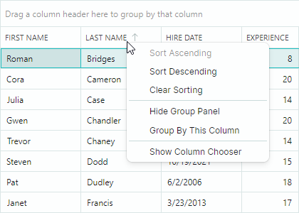

# Sorting

Data Grid 允许您针对无限数量的列对数据进行排序。用户可以通过单击列标题或使用列标题的上下文菜单对列数据进行排序。

## 最终用户操作

在运行时，用户可以单击列标题一次以按升序对数据进行排序。再次单击会反转排序顺序。要清除排序，请按住 CTRL 键并单击列标题。


如果数据已排序，并且需要对另一列进行额外排序，请按住 SHIFT 键并单击该列标题。控件将首先按第一次单击的列对数据进行排序，然后按第二列排序，依此类推。

要按特定列对数据进行排序，用户也可以使用列标题的上下文菜单。该菜单包含 "Sort Ascending" 和 "Sort Descending" 命令。如果某列已排序，菜单中会包含 "Clear Sorting" 命令。



您可以阻止用户对特定列进行排序。为此，请使用以下属性：

- `DataGridControl.AllowSorting` — 指定用户是否可以按任意列进行排序/分组。
- `ColumnBase.AllowSorting` — 指定用户是否可以对特定列进行排序和分组。

这些属性不会阻止您在代码中对数据进行排序。

## 字母数字排序

对于显示文本的列，您可以使用 `DataGridControl.TextSortMode` 属性在字母排序和字母数字排序之间进行选择。

- `Alphabetical` 排序（默认）：此模式逐字符比较字符串。如果文本包含数字，排序算法会将其视为单个字符，而不是数字。例如：

    


- `Alphanumeric` 排序（自然排序）：此模式适用于同时包含文本和数字的字符串。排序算法通过将数字视为数值而不仅仅是字符，以符合人类直觉的逻辑顺序排列字符串。例如：

    

    以下代码应用了字母数字排序顺序：

    ``` xml
    <mxdg:DataGridControl Name="dataGrid1" AutoGenerateColumns="True" ItemsSource="{Binding MyData}"
                        TextSortMode="Alphanumeric"
                        />
    ```

`DataGridControl.TextSortMode` 属性会影响所有显示文本值的列的排序。

下图展示了更多比较字母排序模式和字母数字排序模式的示例：


## 在代码中排序

您可以使用以下属性来指定列的排序设置：

- `ColumnBase.SortDirection` — 指定排序顺序。您可以将此属性设置为 `Ascending` 或 `Descending` 以对该列进行排序。当您初始化此属性时，该列会被添加到 Data Grid 的内部排序列集合中。将 `SortDirection` 属性设置为 `null` 以清除该列的排序，并将其从排序列集合中移除。

- `ColumnBase.SortIndex` — 指定该列在排序列集合中的从零开始的索引。Data Grid 控件首先按第一个排序列对数据进行排序，然后按第二个排序列排序，依此类推。您可以将 `SortIndex` 属性设置为非负值，以按升序对该列进行排序。将 `SortIndex` 设置为 `-1` 以清除该列的排序。

调用控件继承的 `DataControlBase.ClearSorting` 方法，以移除应用于所有列的排序。

以下代码清除排序，然后按两列对数据进行排序：

``` csharp
dataGrid1.ClearSorting();
gridColumn1.SortDirection = ListSortDirection.Ascending;
gridColumn3.SortDirection = ListSortDirection.Descending;
```

您可以使用 `BeginDataUpdate` 和 `EndDataUpdate` 方法包裹您的代码，以防止在更改控件的多个设置（包括排序设置）时产生多余的更新。

``` csharp
dataGrid1.BeginDataUpdate();
dataGrid1.ClearSorting();
gridColumn1.SortIndex = 0;
gridColumn3.SortIndex = 1;
gridColumn2.SortDirection = ListSortDirection.Descending;
dataGrid1.EndDataUpdate();
```

## 自定义排序逻辑

Data Grid 可以按编辑值、显示值或根据自定义排序算法对列进行排序（和[分组](grouping.md)）。默认的排序（和分组）模式取决于列的内嵌编辑器以及绑定属性的数据类型：

- 按编辑值排序/分组 — 除包含内嵌 ComboBoxEditor 的列以外的所有列。
- 按显示文本排序/分组 — 包含内嵌 ComboBoxEditor 的列。
- 不排序/不分组 — 绑定到未实现 `IComparable` 接口的对象的列。例如，图像数据类型未实现此接口，因此默认情况下，相应列不支持排序。有关如何强制对这些列进行排序的信息，请参阅下面的 [Custom Sorting](#custom-sorting) 部分。

使用 `ColumnBase.SortMode` 属性更改列的排序/分组模式。以下选项可用：

- `SortMode.Value` — 按单元格编辑值排序/分组。
- `SortMode.DisplayText` — 按单元格显示文本排序/分组。
- `SortMode.Custom` — 启用自定义排序和分组。将 `SortMode` 属性设置为 `Custom`，然后处理 `DataGridControl.CustomColumnSort` 和/或 `DataGridControl.CustomColumnGroup` 事件，以实现自定义排序和/或自定义分组逻辑。有关更多信息，请参阅以下链接：

    - [Custom Sorting](#custom-sorting)
    - [Custom Grouping](grouping.md#custom-grouping)

### Custom Sorting

`CustomColumnSort` 事件允许您为特定列实现自定义排序逻辑。将 `ColumnBase.SortMode` 属性设置为 `Custom` 以启用此事件。

如果某列绑定的数据类型未实现 `IComparable` 接口（例如图像数据类型），Data Grid 默认会阻止对该列进行排序。但是，您可以按如下方式为该列启用排序：

- 将该列的 `AllowSorting` 属性设置为 `true`（此属性的默认值为 `null`）。
- 将该列的 `SortMode` 属性设置为 `Custom`。
- 处理 `CustomColumnSort` 事件以实现自定义排序。

在处理 `CustomColumnSort` 事件时，您应该比较事件参数中指定的两行。按如下方式将比较结果赋给 `Result` 事件参数：

- 如果按升序对数据进行排序时第一行应显示在第二行上方，则将 `Result` 设置为 `-1`。

- 如果按升序对数据进行排序时第一行应显示在第二行下方，则将 `Result` 设置为 `1`。

 - 如果两行相等，则将 `Result` 设置为 `0`。


以下示例处理 `DataGridControl.CustomColumnSort` 事件，以自定义方式对 "_FileName_" 列中的数据进行排序。"_FileName_" 列以标准的 "_filename.ext_" 格式存储文件名。自定义排序例程按文件名的扩展名对文件名进行排序。

``` csharp
<mxdg:DataGridControl Name="dataGrid1" CustomColumnSort="DataGrid_CustomColumnSort">
    <mxdg:DataGridControl.Columns>
        <mxdg:GridColumn  Width="*" FieldName="FileName"  SortMode="Custom" />
    </mxdg:DataGridControl.Columns>
</mxdg:DataGridControl>

private void DataGrid_CustomColumnSort(object? sender, DataGridCustomColumnSortEventArgs e)
{
    if (e.Column.FieldName == "FileName")
    {
        string fileName1 = Convert.ToString(e.Value1);
        string fileName2 = Convert.ToString(e.Value2);

        string newfileName1 = extractFileExtension(fileName1) + "." + fileName1;
        string newfileName2 = extractFileExtension(fileName2) + "." + fileName2;
        e.Result = String.Compare(newfileName1, newfileName2);
    }
}

string extractFileExtension(string fileName)
{
    string res = "";
    int dotIndex = fileName.LastIndexOf('.');
    if (dotIndex > 0)
        res = fileName.Substring(dotIndex + 1);
    return res;
}
```

## 响应数据排序

处理以下事件，以在数据排序时执行自定义操作：

- `DataControlBase.StartSorting` — 在数据即将被排序时触发。
- `DataControlBase.EndSorting` — 在数据排序完成时触发。

<br>
<br>

<sup>*</sup> 本页面使用机器翻译技术翻译。
