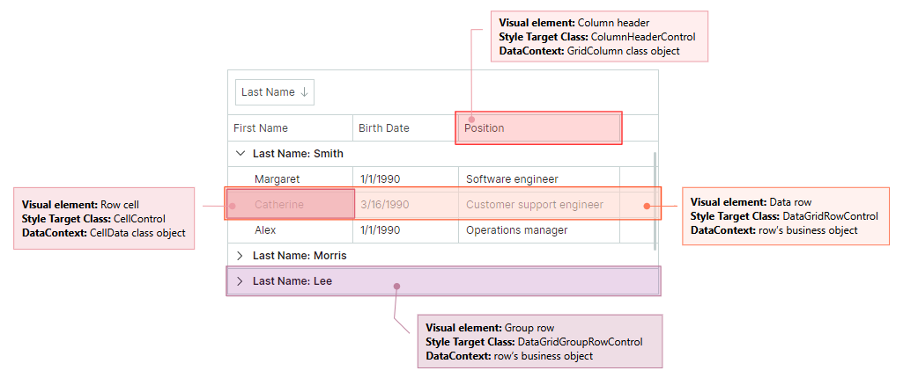
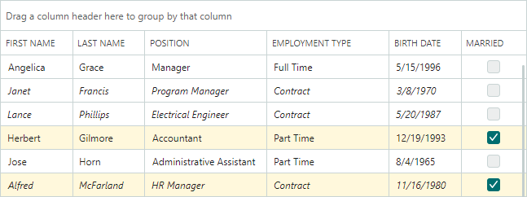

# Styles

Avalonia 样式系统允许您自定义 Eremex Avalonia 控件的设置以及 controls 组成的特定视觉元素的设置。本主题展示如何使用样式自定义数据 Grid control 的以下视觉元素：

- 列标题
- 行
- 分组行
- 行单元格

使用 `DataGridControl.Styles` 属性更改 control 的样式。

典型的样式具有样式选择器和属性设置器的集合。选择器指定封装视觉元素的目标 Control 对象。属性设置器指定目标 control 的属性及其值。

以下代码创建一个简单的样式，将所有数据行的背景设置为相同的颜色。

``` xml
xmlns:mxdg="https://schemas.eremexcontrols.net/avalonia/datagrid"
xmlns:mxdgvis="clr-namespace:Eremex.AvaloniaUI.Controls.DataGrid.Visuals;assembly=Eremex.Avalonia.Controls"

<mxdg:DataGridControl.Styles>
    <Style Selector="mxdgvis|DataGridRowControl">
        <Setter Property="Background" Value="Ivory" />
    </Style>
</mxdg:DataGridControl.Styles>
```

## 将样式应用于特定的控制状态

Avalonia 中的样式选择器支持伪类。伪类是添加到选择器的关键字。它指定应用样式的目标 control 的状态。

DataGrid 提供自定义伪类来处理 controls 视觉元素的特定状态。以下部分列出了 controls 视觉元素支持的自定义伪类。

下面的代码创建一个针对 DataGrid 行的样式选择器。 `:focusedAndSelectedState` 伪类用于仅将样式应用于处于焦点状态的行。

``` xml
xmlns:mxdgvis="clr-namespace:Eremex.AvaloniaUI.Controls.DataGrid.Visuals;assembly=Eremex.Avalonia.Controls"

<Style Selector="mxdgvis|DataGridRowControl:focusedAndSelectedState">
    ...
</Style>
```

## 视觉元素的控件

样式选择器的语法 should 指定应用样式的目标 control（封装可视元素的 Control 对象）。下面的 image 显示了 Data Grid 的视觉元素和相应的目标控件。



<!--TODO
Group row's DataContext?
-->

## 设置数据行样式

数据行显示包含数据的单元格。

使用以下信息自定义数据行的样式：

### 目标控制类 
`DataGridRowControl`

### 数据上下文
一行的数据（业务）对象

### 自定义伪类

<!--TODO
uncomment when multiple selection is implemented

- ":selectedState" — 一行已被选中，但未获得焦点。该状态在多行选择模式下有效。
- ":focusedState" — 一行已获得焦点，但未被选中。该状态在多行选择模式下有效。 
-->

- ":focusedAndSelectedState" — 一行获得焦点。

 <!--TODO
 uncomment when multiple selection is implemented
  and selected. This state is in effect in multiple- and single row selection modes. -->

- ":editingState" — 一行有一个活动的 in-place 编辑器。

### 示例 - 如何自定义焦点行的样式

以下代码创建一个自定义焦点行背景的样式。

Data Grid 行根据预定义的模板呈现。该模板包含一个 `Border` 对象（名为 _RowBorder_），该对象用边框和背景装饰单元格。 
下面的示例更改焦点行的 _RowBorder_ 对象的 `Background` setting。

``` xml
xmlns:mxdg="https://schemas.eremexcontrols.net/avalonia/datagrid"
xmlns:mxdgvis="clr-namespace:Eremex.AvaloniaUI.Controls.DataGrid.Visuals;assembly=Eremex.Avalonia.Controls"

<mxdg:DataGridControl.Styles>
    <Style Selector="mxdgvis|DataGridRowControl:focusedAndSelectedState /template/ Border#RowBorder">
        <Setter Property="Background" Value="SkyBlue" />
    </Style>
</mxdg:DataGridControl.Styles>
```

<!--TODO
The code for the DataGrid differs from TreeList
``` xml
xmlns:mxdg="https://schemas.eremexcontrols.net/avalonia/datagrid"
xmlns:mxdgvis="clr-namespace:Eremex.AvaloniaUI.Controls.DataGrid.Visuals;assembly=Eremex.Avalonia.Controls"

<mxdg:DataGridControl.Styles>
    <Style Selector="mxdgvis|TreeListRowControl:focusedAndSelectedState">
        <Setter Property="Background" Value="SkyBlue" />
    </Style>
</mxdg:DataGridControl.Styles>
``` 

-->

### 示例 - 如何根据单元格值自定义行的外观设置

以下代码根据行值自定义行的背景颜色和字体设置。



_EmploymentType_ column 中具有 _Contract_ 值的行以斜体绘制。
当行单元格不处于编辑模式时，它们将使用 _TextBlock_ 控件呈现。创建的样式会修改 _TextBlock.FontStyle_ attached property 以调整所有行单元格中文本的字体样式。实际的字体样式由 _EmploymentTypeToFontStyleConverter_ 对象确定。

状态为 _Married_ 的行的背景颜色设置为 _CornSilk_。 `Binding` 对象从 DataContext 获取 _Married_ 布尔属性值，其中包含行的业务对象。然后，它使用 `Eremex.AvaloniaUI.Controls.BoolToObjectConverter` 转换器将布尔值转换为画笔。


``` xml
xmlns:mxdg="https://schemas.eremexcontrols.net/avalonia/datagrid"
xmlns:mx="https://schemas.eremexcontrols.net/avalonia"
xmlns:mxdgvis="clr-namespace:Eremex.AvaloniaUI.Controls.DataGrid.Visuals;assembly=Eremex.Avalonia.Controls"
xmlns:views="using:DemoCenter.Views"

<UserControl.Resources>
    <views:EmploymentTypeToFontStyleConverter x:Key="employmentTypeToFontStyleConverter" />
</UserControl.Resources>

<mxdg:DataGridControl.Styles>
    <Style Selector="mxdgvis|DataGridRowControl">
        <Setter Property="TextBlock.FontStyle" Value="{Binding EmploymentType, 
         Converter={StaticResource employmentTypeToFontStyleConverter}}"/>
        <Setter Property="Background">
            <Setter.Value>
                <Binding Path="Married">
                    <Binding.Converter>
                        <mx:BoolToObjectConverter>
                            <mx:BoolToObjectConverter.TrueValue>
                                <SolidColorBrush>Cornsilk</SolidColorBrush>
                            </mx:BoolToObjectConverter.TrueValue>
                        </mx:BoolToObjectConverter>
                    </Binding.Converter>
                </Binding>
            </Setter.Value>
        </Setter>
    </Style>
</mxdg:DataGridControl.Styles>
```
``` csharp
public class EmploymentTypeToFontStyleConverter : IValueConverter
{
    static Brush lightRedBrush = new SolidColorBrush(0xFFffe6e6);
    public object Convert(object value, Type targetType, object parameter, CultureInfo culture)
    {
        if (value == null) return null;
        EmploymentType empType = (EmploymentType)value;

        if (empType == EmploymentType.Contract)
            return FontStyle.Italic;

        return null;
    }

    public object ConvertBack(object value, Type targetType, object parameter, CultureInfo culture)
    {
        throw new NotImplementedException();
    }
}
```

## 设置行单元格样式

数据行中的单元格显示网格列的值。

要自定义行单元格的样式，请使用以下信息：

### 目标控制类

`CellControl`

### 数据上下文

一个 `Eremex.AvaloniaUI.Controls.DataControl.Visuals.CellData` 对象。 `CellData` 对象公开的主要属性是：

- `Column` — 显示单元格的 column（`GridColumn` 对象）。 
- `DataControl` — 当前 `DataGridControl` 对象。
- `Row` — 行的 underlying 数据（业务）对象。
- `ValidationInfo` — 包含单元格 validation 信息的对象。
- `Value` — 单元格的值。

### 自定义伪类

自定义伪类与应用于行对象的伪类相匹配。它们如下所示：

<!--TODO
uncomment when multiple selection is implemented

- ":selectedState" — 一行已被选中，但未获得焦点。该状态在多行选择模式下有效。
- ":focusedState" — 一行已获得焦点，但未被选中。该状态在多行选择模式下有效。 -->

- ":focusedAndSelectedState" — 一行获得焦点。

 <!--TODO
uncomment when multiple selection is implemented

并选择。该状态在多行和单行选择模式下有效。 
 -->

- ":editingState" — 单元格的 in-place 编辑器处于活动状态。

### 示例 - 如何根据单元格值自定义单元格样式

下面代码中的 Style 对象设置 _OnVacation_ 行属性中包含 `true` 值的单元格的背景。

样式将单元格 controls（`CellControl` 对象）的 `Background` 属性设置为自定义 _OnVacationCellValueToBrushConverter_ 转换器返回的画笔。 converter 根据单元格的 column 和值返回画笔。

``` xml
xmlns:mxdg="https://schemas.eremexcontrols.net/avalonia/datagrid"
xmlns:mxvis="clr-namespace:Eremex.AvaloniaUI.Controls.DataControl.Visuals;
 assembly=Eremex.Avalonia.Controls"
xmlns:local="clr-namespace:AvaloniaApplication1.Views"

<Grid.Resources>
    <local:OnVacationCellValueToBrushConverter x:Key="myOnVacationCellValueToBrushConverter" />
</Grid.Resources>

<mxdg:DataGridControl.Styles>
    <Style Selector="mxvis|CellControl">
        <Setter Property="Background">
            <Setter.Value>
                <MultiBinding Converter="{StaticResource myOnVacationCellValueToBrushConverter}">
                    <Binding Path="Row.OnVacation" />
                    <Binding Path="Column" />
                </MultiBinding>
            </Setter.Value>
        </Setter>
    </Style>
</mxdg:DataGridControl.Styles>
```

``` csharp
using Eremex.AvaloniaUI.Controls.DataGrid;

namespace AvaloniaApplication1.Views;

public class OnVacationCellValueToBrushConverter : IMultiValueConverter
{
    public object? Convert(IList<object?> values, Type targetType, 
     object? parameter, CultureInfo culture)
    {
        bool onVacation = (bool)values[0];
        GridColumn column = (GridColumn)values[1];
        if (column.FieldName == "OnVacation" && onVacation)
            return new SolidColorBrush(Colors.Aqua);
        return null;
    }
}
```

<!--TODO
bool onVacation = (bool)values[0]; - InvalidCastException
bug - MX-114
-->

## 设置组行样式

当您按 column 对数据进行分组时，分组行会合并其他行。

要自定义组行的样式，请使用以下信息：

### 目标控制类

`DataGridGroupRowControl`

<!--TODO
### DataContext
??
-->

<!--TODO
### Custom Pseudo Classes
check:

自定义伪类与应用于行对象的伪类相匹配。它们如下所示：

- ":selectedState" — 一行已被选中，但未获得焦点。该状态在多行选择模式下有效。
- ":focusedState" — 一行已获得焦点，但未被选中。该状态在多行选择模式下有效。
- ":focusedAndSelectedState" — 一行已获得焦点并被选中。该状态在多行和单行选择模式下有效。
- ":editingState" — 节点具有活动的 in-place 编辑器。 -->

### 示例 - 如何自定义组行的外观设置

以下代码显示如何将 paint 组行的文本以粗体显示。

``` xml
xmlns:mxdg="https://schemas.eremexcontrols.net/avalonia/datagrid"
xmlns:mxdgvis="clr-namespace:Eremex.AvaloniaUI.Controls.DataGrid.Visuals;assembly=Eremex.Avalonia.Controls"

<mxdg:DataGridControl.Styles>
    <Style Selector="mxdgvis|DataGridGroupRowControl">
        <Setter Property="FontWeight" Value="SemiBold"/>
    </Style>
</mxdg:DataGridControl.Styles>
```

## 设置列标题的样式

column 标头显示 column 的标题和排序指示符。

使用以下信息自定义 column 标头的样式：

### 目标控制类

`ColumnHeaderControl`

### 数据上下文

`GridColumn`

### 自定义伪类

- ":sortascending" — column 按升序排序。
- ":sortdescending" — column 按降序排序。
- ":dragging" — 正在拖动 column。

### 示例 - 如何自定义特定 column 标头的外观设置

以下代码将 _OnVacation_ column 标头绘制为粗体。

``` xml
xmlns:mxdg="https://schemas.eremexcontrols.net/avalonia/datagrid"
xmlns:mxvis="clr-namespace:Eremex.AvaloniaUI.Controls.DataControl.Visuals;
 assembly=Eremex.Avalonia.Controls"
xmlns:local="clr-namespace:AvaloniaApplication1.Views"

<Grid.Resources>
    <local:ColumnToFontWeightConverter x:Key="myColumnToFontWeightConverter" />
</Grid.Resources>

<mxdg:DataGridControl.Styles>
    <Style Selector="mxvis|ColumnHeaderControl">
        <Setter Property="FontWeight" 
         Value="{Binding Converter={StaticResource myColumnToFontWeightConverter}}">
        </Setter>
    </Style>
</mxdg:DataGridControl.Styles>
```
``` csharp
using Eremex.AvaloniaUI.Controls.DataGrid;

public class ColumnToFontWeightConverter : IValueConverter
{
    public object? Convert(object? value, Type targetType, object? parameter, CultureInfo culture)
    {
        GridColumn col = value as GridColumn;
        if (col != null && col.FieldName == "OnVacation")
        {
            return FontWeight.Bold;
        }

        return null;
    }

    public object? ConvertBack(object? value, Type targetType, object? parameter, CultureInfo culture)
    {
        throw new NotImplementedException();
    }
}
```

<br>
<br>

<sup>*</sup> 本页面使用机器翻译技术翻译。
