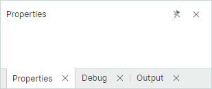
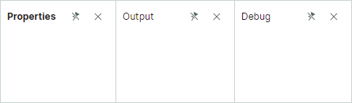

# 停靠面板和容器

停靠窗格（`Eremex.AvaloniaUI.Controls.Docking.DockPane`）是一种面板，可以被停靠、变为浮动、自动隐藏，并且可以组合到选项卡组（容器）中。

停靠窗格和[文档窗格](document-panes.md)是 Docking UI 的基本元素。停靠窗格允许您创建工具面板，而文档窗格允许您创建带选项卡的 MDI（多文档界面）。


在运行时，用户可以使用拖放操作和上下文菜单重新排列面板布局：面板可以并排停靠、自动隐藏、显示为选项卡，或显示在浮动窗口中。所有这些运行时操作都会重新组织停靠项的内部结构。

当您在 XAML 或代码隐藏文件中定义面板布局时，通常需要使用专门的停靠容器来组合面板，并以特定方式呈现它们。


支持以下停靠容器：

- `DockGroup`（拆分容器）— 水平或垂直并排显示停靠项（停靠窗格和容器）。子停靠项之间由分隔条隔开，分隔条支持调整面板大小。
- `TabbedGroup`（选项卡容器）— 将停靠项显示为选项卡。
- `AutoHideGroup` — 该容器的子停靠窗格具有自动隐藏功能。当用户单击面板的标题时，自动隐藏的面板会展开显示。
- `FloatGroup` — 在浮动窗口中显示停靠项。

当用户在运行时重新排列面板时，停靠容器会被自动创建和销毁。


以下 XAML 文件演示了如何创建上图所示的停靠项结构：

``` xml
xmlns:mxd="https://schemas.eremexcontrols.net/avalonia/docking"

<mxd:DockManager>
    <mxd:DockGroup Orientation="Horizontal">
        <mxd:DockGroup Orientation="Vertical" DockWidth="3*">
            <mxd:DocumentGroup DockHeight="2*">
                <mxd:DocumentPane Header="BarItemsPageView.axaml"/>
                <mxd:DocumentPane Header="PageViewModelBase.cs"/>
            </mxd:DocumentGroup>
            <mxd:DockGroup Orientation="Horizontal" DockHeight="*">
                <mxd:DockPane Header="Error List"/>
                <mxd:DockPane Header="Output"/>
            </mxd:DockGroup>
        </mxd:DockGroup>
        <mxd:TabbedGroup DockWidth="*">
            <mxd:DockPane Header="Properties"/>
            <mxd:DockPane Header="Debug"/>
        </mxd:TabbedGroup>
    </mxd:DockGroup>
    <mxd:DockManager.AutoHideGroups>
        <mxd:AutoHideGroup Dock="Left">
            <mxd:DockPane Header="Explorer"/>
        </mxd:AutoHideGroup>
    </mxd:DockManager.AutoHideGroups>
    <mxd:DockManager.FloatGroups>
        <mxd:FloatGroup FloatLocation="300,300">
            <mxd:DockPane Header="Search"/>
        </mxd:FloatGroup>
    </mxd:DockManager.FloatGroups>
</mxd:DockManager>
```

## 使用 MVVM 创建 Docking UI

您可以使用 MVVM 设计模式，用停靠项（停靠窗格和文档窗格）填充 Docking UI。为此，请使用以下 API 成员：

- `DockManager.ItemsSource` — 指定需要渲染为停靠项的对象列表。
- `DockManager.ItemTemplate` — 指定用于将 `DockManager.ItemsSource` 列表中的对象渲染为停靠项的模板。

有关更多信息，请参阅[使用 MVVM 模式填充停靠项](use-mvvm-pattern-to-populate-dock-items.md)。


## 停靠窗格的内容和大小

### 指定内容

您可以使用 `DockPane.Content` 属性来定义面板的内容。在 XAML 中，您可以在起始和结束的 __&lt;DockPane&gt;__ 标签之间定义面板的内容。

`DockPane.ContentTemplate` 属性允许您指定用于渲染 `Content` 对象的模板。


### 指定大小

对于显示在[拆分容器](#split-panels)（`DockGroup`）中的停靠项（面板和容器），以下属性允许您设置项的大小：

- `DockWidth`（用于在父容器中水平排列的面板）
- `DockHeight`（用于在父容器中垂直排列的面板）

这些属性不会影响浮动模式和自动隐藏模式下面板的大小。
请参阅以下链接以了解更多信息：

- [设置浮动边界](#set-floating-bounds)
- [设置展开的自动隐藏面板的大小](#set-size-for-expanded-auto-hide-panels)


### 指定标题文本和图标

使用 `DockPane.Header` 和 `DockPane.HeaderTemplate` 属性设置停靠面板的标题。要显示图像，请使用 `DockPane.Glyph` 和 `DockPane.GlyphSize` 属性。

当面板托管在选项卡容器中时，您可以为其指定不同的标题选项。为此，请使用 `DockPane.TabHeader`、`DockPane.TabHeaderTemplate`、`DockPane.TabGlyph` 和 `DockPane.TabGlyphSize` 属性。

#### 相关 API

- `DockPane.ShowGlyphMode` — 指定面板标题中图标的可见性和位置。
- `DockPane.ShowTabGlyphMode` — 当面板托管在选项卡组中时，指定选项卡中图标的可见性和位置。

## 激活面板

`DockPane.IsActive` 属性允许您将焦点移动到特定面板。例如，如果面板处于自动隐藏状态，当您将 `DockPane.IsActive` 属性设置为 `true` 时，该面板将展开并获得焦点。

使用 `DockManager.ActiveDockItem` 属性获取当前活动的停靠项。

当多个面板组合在选项卡容器（`TabbedGroup`）中时，您可以使用 `TabbedGroup.SelectedIndex` 属性来选择特定面板。

## 关闭面板

每个停靠面板都会显示“关闭”按钮，允许用户关闭该面板。在代码中，您可以使用 `DockManager.Close` 方法关闭面板。


使用 `DockPane.AllowClose` 属性隐藏面板的“关闭”按钮，从而防止用户通过该按钮关闭面板。

当面板关闭时，会触发 `DockPane.CloseCommand` 命令。已关闭的面板可以从 `DockManager.ClosedPanes` 集合中访问。

当多个面板组合在选项卡容器中时，该容器的 `CloseButtonShowMode` 属性允许您在选项卡条区域中显示额外的“关闭”按钮。您可以选择在所有选项卡中、在活动选项卡中，或在选项卡条区域中显示“关闭”按钮。



对于浮动的选项卡容器，选项卡容器标题中的“关闭”按钮既可以关闭活动面板，也可以关闭所有面板。使用 `DockManager.CloseOnlyActivePane` 属性选择所需的行为。

`DockManager.DockOperationStarting` 事件允许您阻止特定面板被关闭，或在面板关闭时执行自定义操作。


## 停靠面板的运行时选项

`DockPane` 对象包含一些设置，允许您在运行时禁用特定的用户操作：

- `DockPane.AllowAutoHide` — 获取或设置面板的“固定”按钮和“自动隐藏”上下文菜单项是否可用。将此属性设置为 `false` 可阻止用户为特定面板启用[自动隐藏模式](#auto-hide-panels)。
- `DockPane.AllowClose` — 获取或设置用户是否可以关闭面板。将此属性设置为 `false` 可隐藏面板的“x”（关闭）按钮。请参阅[关闭面板](#close-panels)。
- `DockPane.AllowFloat` — 获取或设置用户是否可以使面板浮动。请参阅[浮动面板](#floating-panels)。
- `DockPane.AllowMaximize` — 指定面板处于浮动状态时“最大化”按钮的可见性。
- `DockPane.AllowMinimize` — 指定面板处于浮动状态时“最小化”按钮的可见性。

这些选项不会阻止您在代码中对面板执行相应的操作。

您还可以处理 `DockManager.DockOperationStarting` 事件，以动态阻止某些停靠操作，或在这些操作发生时运行自定义逻辑。

## 拆分面板

停靠项（面板和组）可以水平或垂直并排排列。要创建这种布局，需要将停靠项组合到 `DockGroup` 容器（拆分容器）中。



用户可以将一个面板拖放到另一个面板的左侧、右侧、顶部或底部停靠提示上，以将该面板停靠到相应位置。停靠项之间的分隔条支持调整大小。


`DockGroup` 容器的子项可以是面板（`DockPane` 和 `DocumentPane`），也可以是其他容器（`DockGroup` 和 `DocumentGroup`）。

`DockGroup` 中项的默认排列方式为水平排列。将 `DockGroup.Orientation` 属性设置为 `Vertical` 可垂直排列各项。


### 示例 - 创建简单的停靠面板布局

以下 XAML 代码创建了下图所示的停靠面板布局。


``` xml
<mxd:DockManager Grid.Column="0" Grid.Row="1">
    <mxd:DockGroup Name="rootDockGroup">
        <mxd:DockGroup Name="dockGroup1" DockWidth="3*" Orientation="Vertical">
            <mxd:DockGroup Name="dockGroup2" DockHeight="4*">
                <mxd:DockPane DockWidth="*" Header="Explorer"/>
                <mxd:DocumentGroup DockWidth="3*">
                    <mxd:DocumentPane Header="File1.cs"/>
                    <mxd:DocumentPane Header="File2.cs"/>
                </mxd:DocumentGroup>
            </mxd:DockGroup>
            <mxd:DockPane Header="Error List" DockHeight="*"/>
        </mxd:DockGroup>
        <mxd:DockPane Header="Properties" DockWidth="*"/>
    </mxd:DockGroup>
</mxd:DockManager>
```

### 在代码隐藏文件中拆分面板

要在代码隐藏文件中将某个面板停靠到另一个面板（或组）旁边，请使用 `DockManager.Dock` 方法，并将 _dockType_ 参数设置为 `DockType.Left`、`DockType.Right`、`DockType.Top` 或 `DockType.Bottom`。

`DockManager.Dock` 方法不一定会创建新的 `DockGroup`。如果所需方向与目标组的方向相匹配，源面板会被添加到目标面板的父组中。如果新组的方向与目标组的方向不匹配，则会创建新的 `DockGroup`。

假设目标面板位于一个子项水平排列的 `DockGroup` 中。当您将另一个（源）面板停靠到目标面板的左侧或右侧时，不会创建新的 `DockGroup`；相反，源面板会被添加到目标面板的父组中。当您将源面板停靠到目标面板的顶部或底部边缘时，会创建一个新的垂直 `DockGroup`。

### 示例 - 在代码隐藏文件中并排显示面板

以下代码将 _Explorer_ 和 _Error List_ 面板停靠在 _Properties_ 面板旁边。


``` csharp
using Eremex.AvaloniaUI.Controls.Docking;

dockManager1.Dock(dockPaneExplorer, dockPaneProperties, DockType.Left);
dockManager1.Dock(dockPaneErrorList, dockPaneProperties, DockType.Bottom);
```

### 相关 API

- `DockManager.Dock` — 允许您将一个停靠项（例如面板）停靠到另一个停靠项旁边。将 _dockType_ 参数设置为 `DockType.Left`、`DockType.Right`、`DockType.Top` 或 `DockType.Bottom` 以创建拆分容器。
- `DockItemBase.DockParent` — 允许您获取 `DockPane` 对象或其他停靠项的直接父级。


## 浮动面板

Docking 库支持浮动面板，用户可以在可用的屏幕空间内自由移动这些面板。浮动面板托管在浮动窗口中。


用户可以用鼠标将面板从其停靠状态拖出，使其变为浮动状态。


### 访问浮动窗口

当面板变为浮动状态时，会创建一个用于承载该面板的浮动窗口（容器）。浮动窗口由 `FloatGroup` 对象封装。您可以通过面板的 `DockItemBase.FloatGroup` 属性访问该面板所在的父浮动窗口。如果面板不处于浮动状态，此属性返回 **null**。

您可以使用以下 API 成员来指定浮动窗口的位置、大小、标题和图标：

- `FloatGroup.FloatHeight`
- `FloatGroup.FloatLocation`
- `FloatGroup.FloatWidth`
- `FloatGroup.Glyph`
- `FloatGroup.Header`
- `FloatGroup.HeaderTemplate`


### 使面板浮动

要在 XAML 中定义浮动面板，请将一个 `FloatGroup` 容器添加到 `DockManager.FloatGroups` 集合中，然后将 `DockPane` 面板添加到该 `FloatGroup` 容器中。

在代码隐藏文件中，使用 `DockManager.Float` 方法创建浮动停靠项。

#### 示例 - 在 XAML 中定义浮动面板

以下示例在 XAML 中创建一个浮动面板，并设置所创建浮动窗口的位置和大小。

``` xml
<mxd:DockManager.FloatGroups>
    <mxd:FloatGroup FloatLocation="600,600">
        <mxd:DockPane Name="dockPaneExplorer1" Header="Explorer-float">
            ...
        </mxd:DockPane>
    </mxd:FloatGroup>
</mxd:DockManager.FloatGroups>
```

#### 示例 - 在代码隐藏文件中创建浮动面板并自定义浮动窗口

以下代码使一个面板变为浮动状态，然后将另一个面板停靠到该浮动面板旁边。这将创建一个承载两个面板的浮动窗口（`FloatGroup`）。所创建的 `FloatGroup` 被定位在 DockManager 的右下角。

``` csharp
dockManager1.Float(dockPaneExplorer);
dockManager1.Dock(dockPaneSearch, dockPaneExplorer, DockType.Right);
FloatGroup floatingWindow = dockPaneExplorer.FloatGroup;
floatingWindow.Header = "My App";
floatingWindow.FloatWidth = 300;
floatingWindow.FloatHeight = 200;
floatingWindow.FloatLocation = dockManager1.PointToScreen(
    new Point(dockManager1.Bounds.Right - floatingWindow.FloatWidth, 
    dockManager1.Bounds.Bottom - floatingWindow.FloatHeight));
```


### 设置浮动窗口的标题和图像

当两个或多个面板在浮动状态下并排停靠时，浮动窗口（`FloatGroup`）最初显示为空标题。


您可以使用以下属性来指定浮动窗口标题的内容：

- `FloatGroup.Glyph` — 在标题中显示的图像。
- `FloatGroup.GlyphSize` — 图像的大小。
- `FloatGroup.Header` — 要在标题中渲染的对象。使用 `FloatGroup.WindowTitle` 可指定在标题中显示的字符串，而不是对象。
- `FloatGroup.HeaderTemplate` — 用于渲染 `FloatGroup.Header` 对象的模板。
- `FloatGroup.ShowGlyphMode` — 获取或设置 `FloatGroup.Glyph` 图像在标题中的位置和可见性。
- `FloatGroup.WindowIcon` — 一个 `WindowIcon` 对象，表示要在标题中渲染的图标。如果未指定 `WindowIcon`，标题将显示由 `Glyph` 属性指定的图像。
- `FloatGroup.WindowTitle` — 要在标题中渲染的文本。如果未指定 `WindowTitle`，标题将显示 `Header` 对象的文本表示形式。


浮动窗口是在面板变为浮动状态时动态创建的。要初始化动态创建的浮动窗口的属性，请处理 `DockManager.RegisterDockItem` 事件。


``` cs
private void DockManager1_RegisterDockItem(object sender, Eremex.AvaloniaUI.Controls.Docking.DockItemEventArgs e)
{
    if (e.Item is FloatGroup floatGroup)
    {
        floatGroup.Header = "Demo App";
    }
}
```


### 设置浮动边界

当面板变为浮动状态时，其先前的大小将决定浮动窗口的初始大小。您可以设置附加属性 `FloatGroup.FloatWidth`、`FloatGroup.FloatHeight` 和 `FloatGroup.FloatLocation` 来指定自定义的浮动边界。

``` xml
<mxd:DockPane DockWidth="*" Header="Properties"
              mxd:FloatGroup.FloatWidth="300"
              mxd:FloatGroup.FloatHeight="150"
              />
```

停靠项变为浮动状态后，您可以访问其所在的父浮动窗口（`FloatGroup`）并设置其边界。

以下示例使某个停靠窗格变为浮动状态，访问所创建的浮动窗口，并设置其大小。

``` csharp
using Eremex.AvaloniaUI.Controls.Docking;

dockManager1.Float(dockPane1);
FloatGroup floatingWindow = dockPane1.FloatGroup;
floatingWindow.FloatWidth = 400;
floatingWindow.FloatHeight = 300;
floatingWindow.FloatLocation = dockManager1.PointToScreen(new Point(100, 100));
```

另一种为已创建的 FloatGroup 对象指定设置的方法是处理 `DockOperationCompleted` 事件，以访问新创建的 `FloatGroup` 对象并自定义其设置。


<!-- TODO
DockOperationCompleted does not work
 -->


<!-- TODO

#### Example - Customize Floating Window Dynamically

-->


### 相关 API

- `DockPane.FloatGroup` — 当面板处于浮动状态时，返回包含当前面板的浮动窗口（`FloatGroup` 对象）。如果面板不处于浮动状态，则返回 **null**。
- `FloatGroup.FloatLocation` — 指定浮动组相对于屏幕左上角的位置。
- `FloatGroup.FloatHeight` — 指定 `FloatGroup` 的高度。
- `FloatGroup.FloatWeight` — 指定 `FloatGroup` 的宽度。
- `FloatGroup.Header` — 指定 `FloatGroup` 的标题文本。
- `FloatGroup.HeaderTemplate` — 指定 `FloatGroup` 的标题模板。
- `FloatGroup.Glyph` — 指定 `FloatGroup` 的图标。
- `DockManager.Float` — 使某个停靠项（例如 `DockPane` 对象）变为浮动状态。
- `DockManager.FloatGroups` — 浮动组（浮动窗口）的集合。


## 选项卡

用户可以将一个面板拖放到另一个面板的中心，以将这些面板组合到一个选项卡容器中。


要在代码中将面板排列为选项卡，请将它们组合到一个 `TabbedGroup` 容器中。


### 示例 - 在 XAML 中将停靠面板显示为选项卡

以下 XAML 代码创建了下图所示的停靠面板布局。

``` xml
<mxd:DockManager Grid.Column="0" Grid.Row="1">
    <mxd:DockGroup Name="rootDockGroup">
        <mxd:DockGroup Name="dockGroup1" DockWidth="3*" Orientation="Vertical">
            <mxd:DockGroup Name="dockGroup2" DockHeight="4*">
                <mxd:DockPane DockWidth="*" Header="Explorer"/>
                <mxd:DocumentGroup DockWidth="3*">
                    <mxd:DocumentPane Header="File1.cs"/>
                    <mxd:DocumentPane Header="File2.cs"/>
                </mxd:DocumentGroup>
            </mxd:DockGroup>
            <mxd:DockPane Header="Error List" DockHeight="*"/>
        </mxd:DockGroup>
        <mxd:DockPane Header="Properties" DockWidth="*"/>
    </mxd:DockGroup>
</mxd:DockManager>
```

要在代码隐藏文件中将面板组合到选项卡容器中，请使用 `DockManager.Dock` 方法，并将 _dockType_ 参数设置为 `DockType.Fill`。如果您将源面板停靠到已经托管在选项卡容器中的另一个面板上，源面板将作为附加选项卡显示在该选项卡容器中。

### 示例 - 在代码隐藏文件中将停靠面板显示为选项卡

以下代码创建了一个拥有三个停靠面板的选项卡容器。


``` csharp
using Eremex.AvaloniaUI.Controls.Docking;

dockManager1.Dock(dockPaneExplorer, dockPaneProperties, DockType.Fill);
dockManager1.Dock(dockPaneErrorList, dockPaneProperties, DockType.Fill);
```

### 访问选项卡容器

对于位于选项卡容器中的面板，使用 `DockPane.DockParent` 属性可返回其父选项卡容器（`TabbedGroup` 对象）。


### 相关 API

- `DockManager.Dock` — 允许您将一个项（例如面板）停靠到另一个项上。将该方法的 _dockType_ 参数设置为 `DockType.Fill` 以创建选项卡容器。
- `DockItemBase.DockParent` — 允许您获取 `DockPane` 对象或其他停靠项的直接父级。对于组合在选项卡容器中的面板，`DockParent` 属性返回其父 `TabbedGroup` 对象。
- `DockPane.CloseCommand` — 关闭面板时调用的命令。用户可以通过单击“关闭”按钮来关闭面板（请参阅 `DockPane.AllowClose` 和 `TabbedGroup.CloseButtonShowMode`）。
已关闭的面板可以从 `DockManager.ClosedPanes` 集合中访问。
- `DockPane.ShowTabGlyphMode` — 当面板托管在选项卡容器中时，指定面板标题（选项卡）中图标的可见性和位置。
- `DockPane.TabGlyphSize` — 指定选项卡图标（`DockPane.TabGlyph`）的大小。当面板托管在选项卡容器中时，此属性生效。
- `DockPane.TabGlyph` — 指定在选项卡中显示的图标。当面板托管在选项卡容器中时，此属性生效。
- `DockPane.TabHeaderTemplate` — 指定用于渲染选项卡的模板。当面板托管在选项卡容器中时，此属性生效。
- `DockPane.TabHeader` — 指定在选项卡中显示的文本。当面板托管在选项卡容器中时，此属性生效。

- `TabbedGroup.AllowFloat` — 指定用户是否可以使选项卡容器变为浮动状态。
- `TabbedGroup.CloseButtonShowMode` — 指定是否以及在何处为选项卡区域中的子面板显示“关闭”按钮：不在选项卡区域中显示、在每个面板中显示、在活动面板中显示，或在选项卡条区域中显示。`TabbedGroup.CloseButtonShowMode` 属性不影响面板标题中“关闭”按钮的显示。请参阅[关闭面板](#close-panels)。
- `TabbedGroup.SelectTabOnClose` — 指定关闭某个选项卡时选择哪个选项卡：最近打开的选项卡、后一个选项卡，或前一个选项卡。
- `TabbedGroup.SelectedIndex` — 指定当前选项卡容器中所选选项卡的从零开始的索引。您可以使用 `SelectedIndex` 属性来选择特定选项卡。
- `TabbedGroup.ShowTabStripForSingleChild` — 指定当选项卡容器只包含一个子项时是否显示选项卡条。如果将此属性设置为 `true`，则只有当容器拥有两个或更多子项时才会显示选项卡条。
- `TabbedGroup.TabHeaderOrientation` — 指定选项卡是水平排列还是垂直排列。在 `TabHeaderOrientation.Auto` 模式下，如果 `TabbedGroup.TabStripPlacement` 属性设置为 `Top` 或 `Bottom`，选项卡将水平排列；如果 `TabbedGroup.TabStripPlacement` 属性设置为 `Left` 或 `Right`，选项卡将垂直排列。
- `TabbedGroup.TabStripLayoutType` — 指定选项卡的显示方式。`TabStripLayoutType.Scroll` — 选项卡标题的宽度足以显示其内容；如果没有足够的空间完整显示所有选项卡标题，选项卡标题区域中会出现滚动按钮。`TabStripLayoutType.Stretch` — 所有选项卡标题排成一行，并拉伸以适应控件的宽度；根据选项卡条的位置（请参阅 `TabbedGroup.TabStripPlacement`），它们具有相同的宽度或高度。`TabStripLayoutType.MultiLine` — 如果没有足够的空间在一行中显示所有选项卡标题，选项卡标题将排列成多行。
- `TabbedGroup.TabStripPlacement` — 指定选项卡显示所沿的边缘。

## 自动隐藏面板

在运行时，用户可以单击面板的“固定”按钮（），或从上下文菜单中选择“自动隐藏”命令，以为该面板启用自动隐藏模式。


在默认模式下，当焦点移动到另一个面板时，自动隐藏面板会自动折叠。折叠后的自动隐藏面板只有标题保持可见。单击折叠面板的标题可将其展开。另请参阅：[内联自动隐藏面板](#inline-auto-hide-panels)。

要在代码中创建自动隐藏面板，请使用 `AutoHideGroup` 容器。请参阅[创建自动隐藏面板](#create-auto-hide-panels)。

### 隐藏“固定”按钮
将 `DockPane.AllowAutoHide` 选项设置为 `false`，可阻止用户为特定面板启用自动隐藏模式。此选项会隐藏该面板的“固定”按钮和“自动隐藏”上下文菜单项。

浮动面板不提供“固定”按钮。


### 自动隐藏选项卡面板

当多个面板在 DockManager 的某条边缘以选项卡形式显示时，默认情况下，单击任意面板的“固定”按钮都会为当前选项卡容器中的所有面板启用自动隐藏功能。此操作会在 DockManager 的指定边缘创建一个 `AutoHideGroup` 容器，并将选项卡容器中的所有面板移动到该 `AutoHideGroup` 容器中。反之，当您在此 `AutoHideGroup` 中取消固定任意面板时，该 `AutoHideGroup` 将转换为选项卡容器（`TabGroup`）。


将 `DockManager.AutoHideOnlyActivePane` 属性设置为 `true`，可使自动隐藏功能只针对活动面板生效，而保持选项卡容器/自动隐藏容器中其他面板不受影响。

### 创建自动隐藏面板

要在 XAML 中创建自动隐藏面板，请将带有面板的 `AutoHideGroup` 容器添加到 `DockManager.AutoHideGroups` 集合中。`AutoHideGroup.Dock` 属性允许您指定自动隐藏容器将显示在 DockManager 的哪条边缘。

要在代码隐藏文件中为面板启用自动隐藏功能，请使用 `DockManager.AutoHide` 方法。


#### 示例 - 在 XAML 中创建自动隐藏面板

以下代码在 DockManager 的左右两侧边缘创建两个自动隐藏容器。

<!--TODO
 AutoHideGroup.AutoHideWidth should be defined as a simple, but not attached property -->


``` xml
<mxd:DockManager Name="dockManager1" Grid.Column="0" Grid.Row="1">
    <mxd:DockManager.AutoHideGroups>
        <mxd:AutoHideGroup Dock="Right">
            <mxd:DockPane Name="dockPaneExplorer1" Header="Explorer" mxd:AutoHideGroup.AutoHideWidth="200" />
            <mxd:DockPane Name="dockPaneErrors1" Header="Error List" mxd:AutoHideGroup.AutoHideWidth="200"/>
            <mxd:DockPane Name="dockPaneProperties1" Header="Properties" mxd:AutoHideGroup.AutoHideWidth="200"/>
        </mxd:AutoHideGroup>
        <mxd:AutoHideGroup Dock="Left">
            <mxd:DockPane Name="dockPaneCallStack1" Header="Call Stack" mxd:AutoHideGroup.AutoHideWidth="200"/>
            <mxd:DockPane Name="dockPaneWatch1" Header="Watch" mxd:AutoHideGroup.AutoHideWidth="200"/>
        </mxd:AutoHideGroup>
    </mxd:DockManager.AutoHideGroups>

    <mxd:DockGroup Margin="6" Name="rootDockGroup">
        <mxd:DocumentGroup DockWidth="*">
            <mxd:DocumentPane Header="File1.cs"/>
            <mxd:DocumentPane Header="File2.cs"/>
        </mxd:DocumentGroup>
    </mxd:DockGroup>
</mxd:DockManager>
```

### 示例 - 在代码隐藏文件中为面板启用自动隐藏功能

以下代码为某个面板应用自动隐藏功能，然后将其展开。

``` csharp
dockManager1.AutoHide(dockPaneExplorer1);
dockManager1.ExpandAutoHidePanel(dockPaneExplorer1);
```

### 访问自动隐藏容器

要访问托管某个自动隐藏面板的 `AutoHideGroup` 容器，请使用 `DockItemBase.AutoHideGroup` 属性。

### 展开和折叠自动隐藏面板

`DockManager.ExpandAutoHidePanel` 和 `DockManager.CollapseAutoHidePanel` 方法允许您展开和折叠自动隐藏面板。`DockPane.IsActive` 属性允许您为任意面板设置焦点。对于自动隐藏面板，该属性会先展开面板（如果面板处于折叠状态），然后再为其设置焦点。

### 设置展开的自动隐藏面板的大小

当面板变为自动隐藏状态时，其先前的宽度/高度将作为该自动隐藏面板在展开状态下的默认大小。
您可以使用附加属性 `AutoHideGroup.AutoHideWidth` 和 `AutoHideGroup.AutoHideHeight`，为自动隐藏面板设置自定义的展开宽度/高度。

``` xml
<mxd:DockPane Name="dockPane1" DockWidth="*" Header="Properties"
             mxd:AutoHideGroup.AutoHideWidth="200" />
```

如果用户在展开状态下调整了面板大小，新的大小会被保存到 `AutoHideGroup.AutoHideWidth` 或 `AutoHideGroup.AutoHideHeight` 属性中，并在下次展开该面板时重新应用。


### 内联自动隐藏面板

`DockManager.AutoHideMode` 属性允许您指定自动隐藏面板在展开时的显示方式。支持以下显示模式：

- `AutoHideMode.Default`（默认模式）— 展开时，自动隐藏面板会覆盖在其他停靠项之上。
  
  

- `AutoHideMode.Inline` — 展开时，自动隐藏面板会推移相邻的停靠项。

  

### 相关 API

- `DockManager.AutoHideGroups` — 用于托管自动隐藏面板的 `AutoHideGroup` 对象集合。使用此集合添加自动隐藏面板并访问它们。
- `DockManager.AutoHideMode` — 指定展开后的自动隐藏面板是覆盖相邻的停靠项，还是推移它们。
- `DockManager.AutoHideOnlyActivePane` — 指定单击面板的“固定”按钮是否只切换该面板本身的自动隐藏功能。如果此属性设置为 `false`（默认值），且当前面板属于某个选项卡组，则该选项卡组中的所有面板都会启用自动隐藏功能。
- `DockPane.AutoHideGroup` — 返回包含该面板的 `AutoHideGroup` 容器。如果面板不在自动隐藏组中，则返回 **null**。
- `DockPane.AllowAutoHide` — 获取或设置面板的“固定”按钮和“自动隐藏”上下文菜单项是否可用。将此属性设置为 `false` 可阻止用户为特定面板启用自动隐藏模式。
- `AutoHideGroup.Dock` — 指定 `AutoHideGroup` 容器沿 DockManager 哪条边缘显示。
- `AutoHideGroup.AutoHideHeight` — 附加属性。应用于面板时，指定当自动隐藏功能启用、且父级 `AutoHideGroup` 停靠在 DockManager 的顶部或底部边缘时该面板的高度。
- `AutoHideGroup.AutoHideWidth` — 附加属性。应用于面板时，指定当自动隐藏功能启用、且父级 `AutoHideGroup` 停靠在 DockManager 的左侧或右侧边缘时该面板的宽度。

<!--TODO
 AutoHideGroup.AutoHideWidth should be defined as a simple, but not attached property -->

<!-- TODO
To be implemented:

- DockManager.ShowAutoHideExpandButton
- DockManager.AutoHideSelectionMode 
-->

## 另请参阅

- [如何在代码隐藏文件中创建复杂的停靠布局](examples/how-to-create-a-complex-docking-layout-in-code-behind.md)

<br>
<br>

<sup>*</sup> 本页面使用机器翻译技术翻译。
