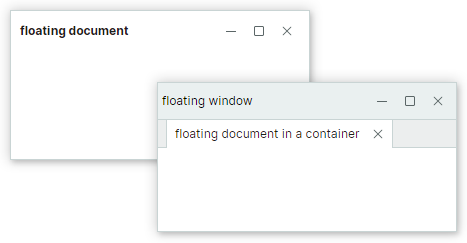
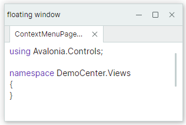

# 文档面板

文档面板对象（`DocumentPane`）允许您在应用程序中创建带选项卡的 MDI（多文档界面）。文档面板专门用于显示窗口的主要内容。
当您将它们组合到 `DocumentGroup` 容器中时，它们将以选项卡形式呈现。


拖放操作和上下文菜单允许您更改文档面板的顺序、将文档面板移动到另一个容器，或使其浮动。


您还可以将常规的 [Dock 面板](dock-panes-and-containers.md) 添加到 `DocumentGroup` 容器中。添加到 `DocumentGroup` 容器中的所有项都将以选项卡形式呈现。

`DocumentPane` 和 `DockPane` 共享许多功能，因为 `DocumentPane` 是 `DockPane` 类的派生类。`DocumentGroup` 是 [TabbedGroup](dock-panes-and-containers.md#tabs) 的派生类。因此，这些对象具有许多共同的功能。

与 Dock 面板一样，`DocumentPane` 和 `DocumentGroup` 对象可以与其他 Docking 项组合在[拆分容器](dock-panes-and-containers.md#split-panels)（`DockGroup` 容器）中，该容器可将其子项水平或垂直并排排列。


以下 XAML 代码创建了上图所示的 Docking 项布局。

``` xml
xmlns:mxd="https://schemas.eremexcontrols.net/avalonia/docking"

<mxd:DockManager>
    <mxd:DockGroup Orientation="Horizontal">
        <mxd:DocumentGroup>
            <mxd:DocumentPane Header="BarsGroupView.axaml"/>
            <mxd:DocumentPane Header="BarItemsPageView.axaml"/>
        </mxd:DocumentGroup>
        <mxd:DockPane Header="Properties"/>
    </mxd:DockGroup>
</mxd:DockManager>
```

`DocumentPane` 和 `DocumentGroup` 对象不支持自动隐藏功能。

## 使用 MVVM 创建 Docking 界面

您可以使用 MVVM 设计模式，用 Docking 项（Dock 面板和文档面板）填充 Docking 界面。为此，请使用以下 API 成员：

- `DockManager.ItemsSource` — 指定需要呈现为 Docking 项的对象列表。
- `DockManager.ItemTemplate` — 指定用于将 `DockManager.ItemsSource` 列表中的对象呈现为 Docking 项的模板。

有关更多信息，请参阅[使用 MVVM 模式填充 Docking 项](use-mvvm-pattern-to-populate-dock-items.md)。


## 文档面板的内容和大小


### 指定内容

您可以使用继承的 `DockPane.Content` 属性在代码中定义文档面板的内容。在 XAML 中，您可以在起始和结束的 __&lt;DocumentPane&gt;__ 标签之间定义面板的内容。

继承的 `DockPane.ContentTemplate` 属性允许您指定用于呈现 `Content` 对象的模板。


### 指定大小

对于显示在[拆分容器](dock-panes-and-containers.md#split-panels)（`DockGroup` 对象）内的 Docking 项（面板和容器），以下属性允许您设置项的大小：

- `DockWidth`（用于在父容器中水平排列的面板）
- `DockHeight`（用于在父容器中垂直排列的面板）

!!! note

    当文档面板位于 Document Group 容器内时，它们会以选项卡形式呈现。您只能更改 Document Group 容器的大小，而不能更改其子文档面板的大小。如果文档面板未以选项卡形式呈现，则可以设置各个文档面板的大小。

以下示例将 `DocumentGroup` 和 `DockPane` 水平排列在一个拆分容器中，并将 `DocumentGroup` 的宽度设置为 `DockPane` 宽度的 4 倍。


``` xml
xmlns:mxd="https://schemas.eremexcontrols.net/avalonia/docking"

<mxd:DockManager Grid.Row="1" Name="dockManager1">
    <mxd:DockGroup Orientation="Horizontal">
        <mxd:DocumentGroup DockWidth="4*">
            <mxd:DocumentPane Name="documentPane1" Header="Document 1"/>
            <mxd:DocumentPane Name="documentPane2" Header="Document 2"/>
        </mxd:DocumentGroup>
        <mxd:DockPane DockWidth="*" Header="Properties"/>
    </mxd:DockGroup>
</mxd:DockManager>
```

`DockWidth` 和 `DockHeight` 属性不会影响处于浮动状态的文档面板的大小。请参阅以下链接了解更多信息：

- [设置浮动边界](#set-floating-bounds)


### 指定标题设置

使用继承的 `DockPane.Header` 和 `DockPane.HeaderTemplate` 属性为文档面板设置标题。要显示图像，请使用继承的 `DockPane.Glyph` 和 `DockPane.GlyphSize` 属性。

通常，文档面板放置在 `DocumentGroup` 容器中，并以选项卡形式呈现。在这种情况下，您还可以使用继承的 `DockPane.TabHeader`、`DockPane.TabHeaderTemplate`、`DockPane.TabGlyph` 和 `DockPane.TabGlyphSize` 属性来指定标题文本和图像。如果未设置这些属性，则 `DockPane.Header`、`DockPane.HeaderTemplate`、`DockPane.Glyph` 和 `DockPane.GlyphSize` 属性将指定选项卡中显示的文本和图像。


#### 相关 API

- `DockPane.ShowGlyphMode` — 指定面板标题中图标的可见性和位置。
- `DockPane.ShowTabGlyphMode` — 指定当面板托管在选项卡容器（例如 `DocumentGroup`）中时，选项卡中图标的可见性和位置。


## 创建带选项卡的界面

您可以将文档面板组合到 `DocumentGroup` 容器中，以创建带选项卡的 MDI（多文档界面）。`DocumentGroup` 与其祖先（`TabbedGroup`）一样，是一个将其子项呈现为选项卡的容器。


以下示例创建了一个包含三个 `DocumentPane` 对象的 `DocumentGroup` 容器。

``` xml
xmlns:mxd="https://schemas.eremexcontrols.net/avalonia/docking"

<mxd:DocumentGroup Name="documentGroup1" DockWidth="5*" >
    <mxd:DocumentPane Name="document1" Header="Document 1"></mxd:DocumentPane>
    <mxd:DocumentPane Name="document2" Header="Document 2"></mxd:DocumentPane>
    <mxd:DocumentPane Name="document3" Header="Document 3"></mxd:DocumentPane>
</mxd:DocumentGroup>
```

要在 code-behind 中将文档面板组合到选项卡容器中，请使用 `DockManager.Dock` 方法，并将 _dockType_ 参数设置为 `DockType.Fill`。如果将文档停靠到已托管在选项卡容器中的另一个文档，则源面板将作为选项卡容器中的附加选项卡显示。

``` csharp
// 将文档停靠到另一个文档
dockManager1.Dock(document4, document1, DockType.Fill);
// 或将文档停靠到组：
dockManager1.Dock(document5, documentGroup1, DockType.Fill);
```

### 访问选项卡容器

对于位于 `DocumentGroup` 容器中的文档面板，使用继承的 `DockPane.DockParent` 属性返回父选项卡容器。


### 相关 API

以下列表显示了用于自定义 `DocumentPane` 和 `DocumentGroup` 对象的常用 API 成员。这些设置大多数继承自对象的基类。

- `DockManager.Dock` — 允许您将一个项（例如 `DocumentPane` 对象）停靠到另一个项。将该方法的 _dockType_ 参数设置为 `DockType.Fill` 以创建选项卡容器。
- `DockItemBase.DockParent` — 允许您获取 Docking 对象的直接父项。对于组合在 `DocumentGroup` 容器中的 `DocumentPane` 对象，`DockParent` 属性返回该容器。
- `DockPane.CloseCommand` — 面板关闭时调用的命令。用户可以通过单击“关闭”按钮来关闭面板（参见 `DockPane.AllowClose` 和 `TabbedGroup.CloseButtonShowMode`）。
已关闭的面板可以从 `DockManager.ClosedPanes` 集合中访问。
- `DockPane.ShowTabGlyphMode` — 指定当面板托管在选项卡容器中时，面板标题（选项卡）中图标的可见性和位置。
- `DockPane.TabGlyphSize` — 指定选项卡图标（`DockPane.TabGlyph`）的大小。当面板托管在选项卡容器中时，此属性生效。
- `DockPane.TabGlyph` — 指定选项卡中显示的图标。当面板托管在选项卡容器中时，此属性生效。
- `DockPane.TabHeaderTemplate` — 指定用于呈现选项卡的模板。当面板托管在选项卡容器中时，此属性生效。
- `DockPane.TabHeader` — 指定要在选项卡中显示的文本。当面板托管在选项卡容器中时，此属性生效。

- `TabbedGroup.AllowFloat` — 指定用户是否可以使选项卡容器浮动。
- `TabbedGroup.CloseButtonShowMode` — 指定是否以及在何处显示子面板在选项卡区域中的“关闭”按钮：选项卡区域中不显示、在每个面板中显示、在活动面板中显示，或在选项卡条区域中显示。`TabbedGroup.CloseButtonShowMode` 属性不影响面板标题中“关闭”按钮的显示。参见[关闭文档面板](#close-document-panes)。
- `TabbedGroup.SelectTabOnClose` — 指定关闭某个选项卡时选择哪个选项卡：最近打开的选项卡、后一个选项卡或前一个选项卡。
- `TabbedGroup.SelectedIndex` — 指定当前选项卡容器中所选选项卡的从零开始的索引。您可以使用 `SelectedIndex` 属性来选择特定选项卡。
- `TabbedGroup.ShowTabStripForSingleChild` — 指定当选项卡容器只包含一个子项时是否显示选项卡条。如果此属性设置为 `true`，则仅当容器拥有两个或更多子项时才显示选项卡条。
- `TabbedGroup.TabHeaderOrientation` — 指定选项卡是水平排列还是垂直排列。在 `TabHeaderOrientation.Auto` 模式下，如果 `TabbedGroup.TabStripPlacement` 属性设置为 `Top` 或 `Bottom`，则选项卡水平排列。如果 `TabbedGroup.TabStripPlacement` 属性设置为 `Left` 或 `Right`，则选项卡垂直排列。
- `TabbedGroup.TabStripLayoutType` — 指定选项卡的显示方式。`TabStripLayoutType.Scroll` — 选项卡标题的宽度足以显示其内容。如果没有足够的空间显示所有选项卡标题的完整内容，则选项卡标题区域会出现滚动按钮。`TabStripLayoutType.Stretch` — 所有选项卡标题排列成一行，并拉伸以适应控件的宽度。根据选项卡条的位置（参见 `TabbedGroup.TabStripPlacement`），它们具有相同的宽度或高度。`TabStripLayoutType.MultiLine` — 如果没有足够的空间在单行中显示所有选项卡标题，则选项卡标题将排列成多行。
- `TabbedGroup.TabStripPlacement` — 指定显示选项卡所沿的边缘。


## 激活文档面板

文档面板继承的 `DockPane.IsActive` 属性允许您将焦点移动到特定的文档面板。使用 `DockManager.ActiveDockItem` 属性获取活动的 Docking 项。

当文档面板组合到 `DocumentGroup` 容器中时，您可以使用 `DocumentGroup.SelectedIndex` 属性来选择特定的文档面板。

## 关闭文档面板

当文档面板放置在 `DocumentGroup` 容器中时，它们会在选项卡中显示“关闭”按钮。“关闭”按钮允许用户关闭面板。在代码中，您可以使用 `DockManager.Close` 方法关闭面板。


使用 `DockPane.AllowClose` 属性隐藏面板的“关闭”按钮，从而防止通过该按钮关闭面板。

当面板关闭时，将激活继承的 `DockPane.CloseCommand` 命令。

所有已关闭的面板都可以从 `DockManager.ClosedPanes` 集合中访问。

MVVM 设计模式允许您从 `DockManager.ItemsSource` 集合中提供文档面板。关闭文档面板时，您可以将该面板从 `DockManager.ItemsSource` 集合中移除。在这种情况下，该面板也会从 `DockManager.ClosedPanes` 集合中移除。

以下来自“IDE Layout”演示的代码展示了为新打开的文档指定 `CloseCommand` 命令。该命令会将该面板从 _Documents_ 集合（`DockManager.ItemsSource`）中移除。完整示例请参见“IDE Layout”演示。

``` csharp
public void Open(SolutionFile solutionFile)
{
    var document = Documents.FirstOrDefault(x => x.Uri == solutionFile.Uri);
    if (document == null)
    {
        document = new IdeLayoutDocumentViewModel
        {
            Header = solutionFile.Filename,
            Uri = solutionFile.Uri
        };
        document.CloseCommand = new RelayCommand(() => Documents.Remove(document));
        Documents.Add(document);
    }
    document.IsActive = true;
}
```

`DocumentGroup` 的 `CloseButtonShowMode` 属性允许您在选项卡条区域中显示额外的“关闭”按钮。您可以在所有选项卡中、活动选项卡中或选项卡条区域中显示“关闭”按钮。下图显示了选项卡条区域中的“关闭”按钮（`CloseButtonShowMode` 属性设置为 `TabControlCloseButtonShowMode.InHeaderPanel`）。


`DockManager.DockOperationStarting` 事件允许您阻止特定面板被关闭，或在面板关闭时执行自定义操作。如果在面板关闭时该面板已从 `DockManager.ItemsSource` 集合中移除，则此事件不会触发。


## 文档面板的运行时选项

`DocumentPane` 对象包含允许您在运行时禁用特定用户操作的设置。这些设置继承自基类 `DockPane`。

- `DockPane.AllowClose` — 获取或设置用户是否可以关闭面板。将此属性设置为 `false` 以隐藏面板的 `x`（关闭）按钮。参见[关闭文档面板](#close-document-panes)。
- `DockPane.AllowFloat` — 获取或设置用户是否可以使面板浮动。参见[浮动文档面板](#floating-document-panes)。
- `DockPane.AllowMaximize` — 指定面板在浮动状态下“最大化”按钮的可见性。
- `DockPane.AllowMinimize` — 指定面板在浮动状态下“最小化”按钮的可见性。

这些选项不会阻止您在代码中对面板执行相应的操作。

您还可以处理 `DockManager.DockOperationStarting` 事件，以动态阻止某些 Docking 操作，或在这些操作发生时运行自定义逻辑。


### 示例 - 阻止文档面板浮动

此示例展示了如何禁用文档面板的浮动状态。以下代码处理 `DockManager.RegisterDockItem` 事件，以禁用新创建文档的 `AllowFloat` 选项。

``` cs
private void DockManager_RegisterDockItem(object sender, Eremex.AvaloniaUI.Controls.Docking.DockItemEventArgs e)
{
    if(e.Item is DocumentPane document)
    {
        document.AllowFloat = false;
    }
}
```


## 浮动文档面板


与 Dock 面板一样，文档面板也可以浮动。在浮动状态下，用户可以在可用的屏幕空间内移动文档面板。浮动文档托管在浮动窗口中。


请参阅以下示例，了解如何阻止文档浮动：

- [示例 - 阻止文档面板浮动](#example-prevent-document-panes-from-floating)

### 访问浮动窗口

当面板变为浮动状态时，会创建一个托管该面板的浮动窗口（容器）。浮动窗口由 `FloatGroup` 对象封装。您可以使用面板的 `DockItemBase.FloatGroup` 属性访问面板的父浮动窗口。如果面板不处于浮动状态，则此属性返回 **null**。

您可以使用以下 API 成员来指定浮动窗口的位置、大小、标题和图标：

- `FloatGroup.FloatHeight`
- `FloatGroup.FloatLocation`
- `FloatGroup.FloatWidth`
- `FloatGroup.Glyph`
- `FloatGroup.Header`
- `FloatGroup.HeaderTemplate`
- `DockManager.DefaultFloatGroupHeader`
- `DockManager.DefaultFloatGroupGlyph`

### 使文档面板浮动

要在 XAML 中定义浮动文档面板，请将一个 `FloatGroup` 对象添加到 `DockManager.FloatGroups` 集合中，然后将 `DocumentPane` 面板添加到该 `FloatGroup` 对象中。您还可以将 `DocumentPane` 对象包装在 `DocumentGroup` 容器中，以将该文档显示为选项卡。

使用 `DockManager.Float` 方法在 code-behind 中创建浮动 Docking 项。

#### 示例 - 在 XAML 中定义浮动文档

以下示例创建了两个浮动窗口。第一个窗口包含一个 `DocumentPane` 对象。第二个窗口显示一个包含 `DocumentPane` 对象的 `DocumentGroup` 容器。



``` xml
<mxd:DockManager.FloatGroups>
    <mxd:FloatGroup FloatLocation="200,200" FloatWidth="300" FloatHeight="150" >
        <mxd:DocumentPane Header="floating document"></mxd:DocumentPane>
    </mxd:FloatGroup>
    <mxd:FloatGroup FloatLocation="400,400" FloatWidth="300" FloatHeight="150" Header="floating window">
        <mxd:DocumentGroup>
            <mxd:DocumentPane Header="floating document in a container"></mxd:DocumentPane>
        </mxd:DocumentGroup>
    </mxd:FloatGroup>
</mxd:DockManager.FloatGroups>
```

#### 示例 - 在 Code Behind 中创建浮动文档并自定义浮动窗口

以下代码使活动文档浮动，并为创建的浮动窗口设置边界和标题。



``` csharp
DocumentPane document = dockManager1.ActiveDockItem as DocumentPane;
if(document != null)
{
    dockManager1.Float(document);
    FloatGroup floatingWindow = document.FloatGroup;
    floatingWindow.FloatWidth = 300;
    floatingWindow.FloatHeight = 200;
    floatingWindow.Header = "floating window";
    document.FloatGroup.FloatLocation = dockManager1.PointToScreen(
        new Point(dockManager1.Bounds.Right - floatingWindow.FloatWidth,
        dockManager1.Bounds.Bottom - floatingWindow.FloatHeight));
}
```


### 设置浮动窗口的标题和图标

当文档面板变为浮动状态时，会创建一个浮动窗口（`FloatGroup`）来托管该文档。此浮动窗口的标题最初为空。


您可以使用以下属性来指定浮动窗口标题的内容：

- `FloatGroup.Glyph` — 要在标题中显示的图像。
- `FloatGroup.GlyphSize` — 图像大小。
- `FloatGroup.Header` — 要在标题中呈现的对象。使用 `FloatGroup.WindowTitle` 可指定要在标题中显示的字符串以代替对象。
- `FloatGroup.HeaderTemplate` — 用于呈现 `FloatGroup.Header` 对象的模板。
- `FloatGroup.ShowGlyphMode` — 获取或设置标题中 `FloatGroup.Glyph` 图像的位置和可见性。
- `FloatGroup.WindowIcon` — 表示要在标题中呈现的图标的 `WindowIcon` 对象。如果未指定 `WindowIcon`，则标题将显示 `Glyph` 属性指定的图像。
- `FloatGroup.WindowTitle` — 要在标题中呈现的文本。如果未指定 `WindowTitle`，则标题将显示 `Header` 对象的文本表示形式。


浮动窗口是在面板变为浮动状态时动态创建的。要初始化这些动态创建的浮动窗口的属性，请处理 `DockManager.RegisterDockItem` 事件。


``` cs
private void DockManager1_RegisterDockItem(object sender, Eremex.AvaloniaUI.Controls.Docking.DockItemEventArgs e)
{
    if (e.Item is FloatGroup floatGroup)
    {
        floatGroup.Header = "Demo App";
    }
}
```


### 设置浮动边界

当文档面板变为浮动状态时，其先前的大小决定了浮动窗口的初始大小。您可以设置 `FloatGroup.FloatWidth`、`FloatGroup.FloatHeight` 和 `FloatGroup.FloatLocation` 附加属性来指定自定义的浮动边界。

``` xml
<mxd:DocumentPane Name="documentPane1" Header="Document 1"
    mxd:FloatGroup.FloatWidth="500" mxd:FloatGroup.FloatHeight="400"/>
```

当一个 Docking 项变为浮动状态后，您可以访问其父浮动窗口（`FloatGroup`）并设置其边界。

以下示例使一个文档面板浮动，访问创建的浮动窗口，并设置其大小。

``` csharp
using Eremex.AvaloniaUI.Controls.Docking;

dockManager1.Float(documentPane1);
FloatGroup floatingWindow = documentPane1.FloatGroup;
floatingWindow.FloatWidth = 400;
floatingWindow.FloatHeight = 300;
floatingWindow.FloatLocation = dockManager1.PointToScreen(new Point(100,100));
```


### 相关 API

- `DockPane.FloatGroup` — 当面板处于浮动状态时，返回包含当前面板的浮动窗口（`FloatGroup` 对象）。如果面板不处于浮动状态，则返回 **null**。
- `FloatGroup.FloatLocation` — 指定浮动组相对于屏幕左上角的位置。
- `FloatGroup.FloatHeight` — 指定 `FloatGroup` 的高度。
- `FloatGroup.FloatWeight` — 指定 `FloatGroup` 的宽度。
- `FloatGroup.Header` — 指定 `FloatGroup` 的标题文本。
- `FloatGroup.HeaderTemplate` — 指定 `FloatGroup` 的标题模板。
- `FloatGroup.Glyph` — 指定 `FloatGroup` 的图标。
- `DockManager.Float` — 使 Docking 项（例如 `DocumentPane` 对象）浮动。
- `DockManager.FloatGroups` — 浮动组（浮动窗口）的集合。
- `DockPane.AllowFloat` — 获取或设置用户是否可以使面板浮动。

## 另请参阅

- [如何在 Code Behind 中创建复杂的 Docking 布局](examples/how-to-create-a-complex-docking-layout-in-code-behind.md)

<br>
<br>

<sup>*</sup> 本页面使用机器翻译技术翻译。
