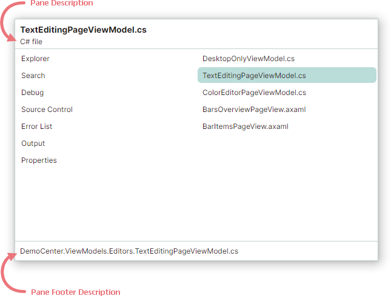

# 文档切换器

文档切换器提供了一种经典的解决方案，可通过键盘切换到特定的文档或面板。要打开文档切换器，请使用以下快捷键：

- 按住 CTRL 键，然后按 TAB

    或

- 按住 CTRL 键，然后按 SHIFT+TAB

快速按下 CTRL+TAB 或 CTRL+SHIFT+TAB 会立即分别切换到上一个或下一个最近使用的文档。

文档切换器在左侧显示面板列表（[Dock 面板](dock-panes-and-containers.md)），在右侧显示文档列表（[文档面板](document-panes.md)）。

只要按住 CTRL 键，文档切换器就会保持打开状态。
要在活动的文档切换器中的 Docking 项之间导航，请保持按住 CTRL 键，然后使用以下快捷键：

- TAB 和 SHIFT+TAB — 在活动列表中向前和向后导航。
- 向下箭头和向上箭头键 — 相当于 TAB 和 SHIFT+TAB 快捷键。
- 向左箭头和向右箭头键 — 在左侧的面板列表和右侧的文档列表之间切换。

要关闭文档切换器并激活所选的面板或文档，请释放 CTRL 键或用鼠标单击该面板/文档。

## 禁用文档切换器

将 `DockManager.AllowDocumentSwitcher` 属性设置为 `false` 可禁用文档切换器。此设置还会禁用用于在 Docking 项之间导航的 CTRL+TAB 和 CTRL+SHIFT+TAB 快捷键。

## 在文档切换器中显示面板

要阻止某个面板显示在文档切换器中，请禁用 `DockPane.ShowInDocumentSwitcher` 选项。

已关闭的面板无法在文档切换器中访问。

## 在文档切换器中显示面板描述

文档切换器支持两个区域，用于显示所选面板的描述。

使用以下属性来指定要在文档切换器中显示的面板描述：

- `DockPane.DocumentSwitcherDescription` — 指定要在文档切换器顶部显示的面板描述。
- `DockPane.DocumentSwitcherFooterDescription` — 指定要在文档切换器底部显示的面板描述。

 
 

* 本页面使用机器翻译技术翻译。
