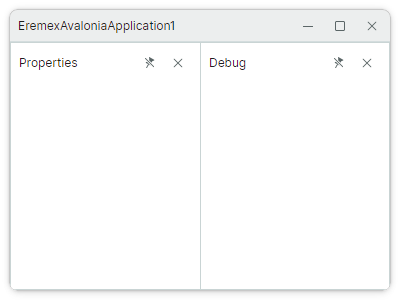
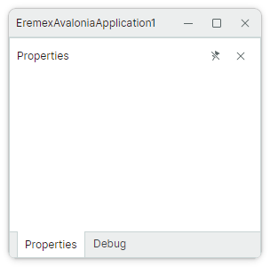
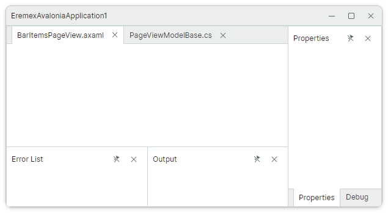

# Docking 入门指南

本教程展示如何从零开始设置下图所示的 dock 面板布局。
首先,我们将创建一个已停靠面板的布局,然后展示如何定义自动隐藏和浮动面板。


本示例演示了构成 Docking 界面的 dock 项:

- Dock 面板(`DockPane`)——可以停靠、变为浮动、自动隐藏,并组合到选项卡组(容器)中的面板。

- Document 面板(`DocumentPane`)——用于显示窗口主要内容的容器。您可以使用 Document 面板实现带选项卡的 MDI(多文档界面, Multiple Document Interface)。


要构建上图所示的已停靠面板布局,需要将各个面板组合到组(容器)中。容器指定其子项的显示模式和行为。您可以将容器聚合到其他容器中,以创建复杂的面板布局。

Docking 库支持以下容器:

- `DockGroup`(拆分容器)——水平或垂直并排显示 dock 项(Dock 面板和容器)。子 dock 项由分隔条分隔,可用于调整面板大小。
- `TabbedGroup`(选项卡容器)——以选项卡形式显示 Dock 面板。
- `DocumentGroup`(选项卡容器)——以选项卡形式显示 Document 面板。
- `AutoHideGroup`——该容器的子 Dock 面板具有自动隐藏功能。当用户单击面板标题时,自动隐藏的面板会显示出来。
- `FloatGroup`——在浮动窗口中显示 dock 项。


## 1. 创建 DockManager 组件

创建一个[使用 Eremex 控件的新 Avalonia UI 应用程序](../../get-started/index.md)。
打开 MainWindow.axaml 文件,并在 XAML 中定义一个 `DockManager` 组件。

``` xml
xmlns:mxd="https://schemas.eremexcontrols.net/avalonia/docking"

<mxd:DockManager>
</mxd:DockManager>
```

`DockManager` 是一个控件,用于管理 dock 项(Dock 面板和 Document 面板)的创建,维护对 dock 项的运行时操作,提供上下文菜单,并执行 Docking 界面的序列化和反序列化。


## 2. 定义根组

在 `DockManager` 控件下添加一个 `DockGroup` 对象作为子元素。该对象用于初始化根 dock 组(即标记了 `ContentAttribute` 特性的 `DockManager.Root` 属性)。

``` xml
xmlns:mxd="https://schemas.eremexcontrols.net/avalonia/docking"

<mxd:DockManager>
    <mxd:DockGroup>
    </mxd:DockGroup>
</mxd:DockManager>
```

根 dock 组是处于已停靠状态的所有面板和文档的容器。


## 3. 添加 "Properties" 和 "Debug" 面板

将 "Properties" 和 "Debug" 这两个 `DockPane` 对象添加到根组中。

``` xml
xmlns:mxd="https://schemas.eremexcontrols.net/avalonia/docking"

<mxd:DockManager>
    <mxd:DockGroup>
        <mxd:DockPane Header="Properties"/>
        <mxd:DockPane Header="Debug"/>
    </mxd:DockGroup>
</mxd:DockManager>
```

`DockGroup` 容器默认水平排列面板。您可以通过 `DockGroup.Orientation` 属性将方向改为垂直。




## 4. 将面板组合到选项卡容器中

将 "Properties" 和 "Debug" 面板包装到一个 `TabbedGroup` 容器中。该容器以选项卡形式呈现其子元素。

``` xml
xmlns:mxd="https://schemas.eremexcontrols.net/avalonia/docking"

<mxd:DockManager>
    <mxd:DockGroup>
        <mxd:TabbedGroup>
            <mxd:DockPane Header="Properties"/>
            <mxd:DockPane Header="Debug"/>
        </mxd:TabbedGroup>
    </mxd:DockGroup>
</mxd:DockManager>
```




## 5. 添加 "Error List" 面板

在 `TabbedGroup` 对象之前定义 "Error List" 面板。

``` xml
xmlns:mxd="https://schemas.eremexcontrols.net/avalonia/docking"

<mxd:DockManager>
    <mxd:DockGroup>
        <mxd:DockPane Header="Error List"/>
        <mxd:TabbedGroup>
            <mxd:DockPane Header="Properties"/>
            <mxd:DockPane Header="Debug"/>
        </mxd:TabbedGroup>
    </mxd:DockGroup>
</mxd:DockManager>
```

`DockGroup` 容器将 "Error List" 面板和 `TabbedGroup` 沿水平方向排列。


## 6. 在 "Error List" 面板上方添加文档组

要在 "Error List" 面板顶部显示 `DocumentGroup`,首先创建一个方向为垂直的新 `DockGroup` 容器。然后将 "Error List" 面板和一个新的 `DocumentGroup` 对象放入该容器中。

``` xml
xmlns:mxd="https://schemas.eremexcontrols.net/avalonia/docking"

<mxd:DockManager>
    <mxd:DockGroup>
        <mxd:DockGroup Orientation="Vertical">
            <mxd:DocumentGroup></mxd:DocumentGroup>
            <mxd:DockPane Header="Error List"/>
        </mxd:DockGroup>
        <mxd:TabbedGroup>
            <mxd:DockPane Header="Properties"/>
            <mxd:DockPane Header="Debug"/>
        </mxd:TabbedGroup>
    </mxd:DockGroup>
</mxd:DockManager>
```


## 7. 添加 "Output" 面板

"Output" 面板需要显示在 "Error List" 面板的右侧。目前,"Error List" 面板属于一个垂直排列其子元素的容器。因此,我们需要将 "Error List" 和 "Output" 面板聚合到一个方向为水平的新容器(`DockGroup`)中。

``` xml
xmlns:mxd="https://schemas.eremexcontrols.net/avalonia/docking"

<mxd:DockManager>
    <mxd:DockGroup>
        <mxd:DockGroup Orientation="Vertical">
            <mxd:DocumentGroup></mxd:DocumentGroup>
            <mxd:DockGroup Orientation="Horizontal">
                <mxd:DockPane Header="Error List"/>
                <mxd:DockPane Header="Output"/>
            </mxd:DockGroup>
        </mxd:DockGroup>
        <mxd:TabbedGroup>
            <mxd:DockPane Header="Properties"/>
            <mxd:DockPane Header="Debug"/>
        </mxd:TabbedGroup>
    </mxd:DockGroup>
</mxd:DockManager>
```


## 8. 使用选项卡填充文档组

向 `DocumentGroup` 容器添加两个 `DocumentPane` 对象。`DocumentGroup` 以选项卡形式显示其子元素,从而实现带选项卡的 MDI。

``` xml
xmlns:mxd="https://schemas.eremexcontrols.net/avalonia/docking"

<mxd:DockManager>
    <mxd:DockGroup>
        <mxd:DockGroup Orientation="Vertical">
            <mxd:DocumentGroup>
                <mxd:DocumentPane Header="BarItemsPageView.axaml"/>
                <mxd:DocumentPane Header="PageViewModelBase.cs"/>
            </mxd:DocumentGroup>
            <mxd:DockGroup Orientation="Horizontal">
                <mxd:DockPane Header="Error List"/>
                <mxd:DockPane Header="Output"/>
            </mxd:DockGroup>
        </mxd:DockGroup>
        <mxd:TabbedGroup>
            <mxd:DockPane Header="Properties"/>
            <mxd:DockPane Header="Debug"/>
        </mxd:TabbedGroup>
    </mxd:DockGroup>
</mxd:DockManager>
```


## 9. 设置已停靠面板的大小

默认情况下,任何拆分容器(`DockGroup`)的空间都在其子元素之间平均分配。您可以使用 `DockWidth` 和 `DockHeight` 属性为容器的子 dock 项设置自定义大小。这些属性的类型为 `Avalonia.Controls.GridLength`,因此您可以将它们设置为以下值:

- 像素数(绝对值)。
- 可用空间的加权比例,使用 "星号(`*`)大小" 表示法。例如,`3*`。
- "Auto" 值——该项将自动调整大小以适应其内容。

下面的代码使用 `DockWidth` 和 `DockHeight` 属性为面板和容器设置比例大小。

``` xml
xmlns:mxd="https://schemas.eremexcontrols.net/avalonia/docking"

<mxd:DockManager>
    <mxd:DockGroup>
        <mxd:DockGroup Orientation="Vertical" DockWidth="3*">
            <mxd:DocumentGroup DockHeight="2*">
                <mxd:DocumentPane Header="BarItemsPageView.axaml"/>
                <mxd:DocumentPane Header="PageViewModelBase.cs"/>
            </mxd:DocumentGroup>
            <mxd:DockGroup Orientation="Horizontal" DockHeight="*">
                <mxd:DockPane Header="Error List"/>
                <mxd:DockPane Header="Output"/>
            </mxd:DockGroup>
        </mxd:DockGroup>
        <mxd:TabbedGroup DockWidth="*">
            <mxd:DockPane Header="Properties"/>
            <mxd:DockPane Header="Debug"/>
        </mxd:TabbedGroup>
    </mxd:DockGroup>
</mxd:DockManager>
```




## 10. 创建自动隐藏面板

自动隐藏面板在失去焦点时会自动折叠。折叠的自动隐藏面板只显示标题。

要在 XAML 中创建自动隐藏面板,请在 `DockManager.AutoHideGroups` 集合中添加一个 `AutoHideGroup` 容器,然后在 `AutoHideGroup` 容器中定义一个 `DockPane` 面板。

``` xml
xmlns:mxd="https://schemas.eremexcontrols.net/avalonia/docking"

<mxd:DockManager>
    <!--...-->
    <mxd:DockManager.AutoHideGroups>
        <mxd:AutoHideGroup Dock="Left">
            <mxd:DockPane Header="Explorer"/>
        </mxd:AutoHideGroup>
    </mxd:DockManager.AutoHideGroups>
</mxd:DockManager>
```

`AutoHideGroup.Dock` 属性允许您指定自动隐藏容器显示在哪条边上。


## 11. 创建浮动面板

用户可以用鼠标将面板从已停靠状态拖出,使其变为浮动状态。

您也可以在 XAML 中定义浮动面板。为此,请在 `DockManager.FloatGroups` 集合中添加一个 `FloatGroup` 容器,然后向 `FloatGroup` 容器添加一个 `DockPane` 面板。

``` xml
xmlns:mxd="https://schemas.eremexcontrols.net/avalonia/docking"

<mxd:DockManager>
    <!--...-->
    <mxd:DockManager.FloatGroups>
        <mxd:FloatGroup FloatLocation="300,300" FloatWidth="150" FloatHeight="100">
            <mxd:DockPane Header="Search"/>
        </mxd:FloatGroup>
    </mxd:DockManager.FloatGroups>
</mxd:DockManager>
```


使用 `FloatWidth` 和 `FloatHeight` 属性指定浮动窗口的大小。
您也可以将 `FloatGroup.FloatWidth` 和 `FloatGroup.FloatHeight` 附加属性应用到任何面板,即使该面板处于已停靠状态。这些设置将指定面板变为浮动时的初始浮动大小。


## 12. 设置面板标题和图标

您可以使用 `Header` 和 `Glyph` 属性为 Dock 面板和 Document 面板指定标题和图标。

以下 XAML 为 "Properties" 和 "Debug" 面板初始化了标题,并在标题中显示 SVG 图像。假设本示例中使用的 SVG 图像的 `Build Action` 属性已设置为 `AvaloniaResource`。

``` xml
<mxd:TabbedGroup DockWidth="*">
    <mxd:DockPane 
        Header="Properties"
        Glyph="{SvgImage 'avares://EremexAvaloniaApplication1/Images/settings.svg'}"
        GlyphSize="16,16"/>
    <mxd:DockPane 
        Header="Debug"
        Glyph="{SvgImage 'avares://EremexAvaloniaApplication1/Images/debug2.svg'}"
        GlyphSize="16,16"/>
</mxd:TabbedGroup>
```


## 13. 指定面板内容

使用 `DockPane.Content` 属性定义 Dock 面板和 Document 面板的内容。在 XAML 中,您可以在开始和结束的 __&lt;DockPane&gt;__ 与 __&lt;DocumentPane&gt;__ 标签之间定义面板的内容。

``` xml
xmlns:mxd="https://schemas.eremexcontrols.net/avalonia/docking"
xmlns:mxe="https://schemas.eremexcontrols.net/avalonia/editors"
xmlns:mxi="https://schemas.eremexcontrols.net/avalonia/icons"

<mxd:DockPane Header="Search">
    <Grid RowDefinitions="Auto *">
        <StackPanel>
            <mxe:ButtonEditor Watermark="Search" Margin="5">
                <mxe:ButtonEditor.Buttons>
                    <mxe:ButtonSettings ToolTip.Tip="Match case"
                                        Glyph="{x:Static mxi:Filter.Starts_with }"
                                        ButtonKind="Toggle"/>
                    <mxe:ButtonSettings ToolTip.Tip="Match whole word"
                                        Glyph="{x:Static mxi:Painting.Report_text_column }"
                                        ButtonKind="Toggle"/>
                </mxe:ButtonEditor.Buttons>
            </mxe:ButtonEditor>
            <mxe:ButtonEditor Watermark="Replace" Margin="5"/>
        </StackPanel>
        <TextBlock Grid.Row="1"
                    Text="No search results available"
                    TextWrapping="Wrap"
                    TextAlignment="Center"
                    HorizontalAlignment="Center"
                    VerticalAlignment="Center"/>
    </Grid>
</mxd:DockPane>
```


有关创建复杂 dock 面板布局并为各个面板指定内容的示例,请参阅 "IDE Layout" 演示。

## 14. 完整代码

以下是本教程的完整代码。本示例中使用的 SVG 图像作为 "Avalonia Resources" 包含在项目中。

_MainWindow.axaml_:

``` xml
<mx:MxWindow xmlns="https://github.com/avaloniaui"
             xmlns:x="http://schemas.microsoft.com/winfx/2006/xaml"
             xmlns:d="http://schemas.microsoft.com/expression/blend/2008"
             xmlns:mc="http://schemas.openxmlformats.org/markup-compatibility/2006"
             xmlns:mx="https://schemas.eremexcontrols.net/avalonia"
             xmlns:mxd="https://schemas.eremexcontrols.net/avalonia/docking"
             xmlns:mxe="https://schemas.eremexcontrols.net/avalonia/editors"
             xmlns:mxi="https://schemas.eremexcontrols.net/avalonia/icons"
             mc:Ignorable="d" d:DesignWidth="800" d:DesignHeight="450"
             x:Class="EremexAvaloniaApplication1.MainWindow"
             Title="EremexAvaloniaApplication1"
             >
    <mxd:DockManager>
        <mxd:DockGroup>
            <mxd:DockGroup Orientation="Vertical" DockWidth="3*">
                <mxd:DocumentGroup DockHeight="2*">
                    <mxd:DocumentPane Header="BarItemsPageView.axaml"/>
                    <mxd:DocumentPane Header="PageViewModelBase.cs"/>
                </mxd:DocumentGroup>
                <mxd:DockGroup Orientation="Horizontal" DockHeight="*">
                    <mxd:DockPane Header="Error List"/>
                    <mxd:DockPane Header="Output"/>
                </mxd:DockGroup>
            </mxd:DockGroup>
            <mxd:TabbedGroup DockWidth="*">
                <mxd:DockPane
                    Header="Properties"
                    Glyph="{SvgImage 'avares://EremexAvaloniaApplication1/Images/settings.svg'}"
                    GlyphSize="16,16"/>
                <mxd:DockPane
                    Header="Debug"
                    Glyph="{SvgImage 'avares://EremexAvaloniaApplication1/Images/debug2.svg'}"
                    GlyphSize="16,16"/>
            </mxd:TabbedGroup>
        </mxd:DockGroup>
        <mxd:DockManager.AutoHideGroups>
            <mxd:AutoHideGroup Dock="Left">
                <mxd:DockPane Header="Explorer"/>
            </mxd:AutoHideGroup>
        </mxd:DockManager.AutoHideGroups>
        <mxd:DockManager.FloatGroups>
            <mxd:FloatGroup FloatLocation="300,300" FloatWidth="200" FloatHeight="250">
                <mxd:DockPane Header="Search">
                    <Grid RowDefinitions="Auto *">
                        <StackPanel>
                            <mxe:ButtonEditor Watermark="Search" Margin="5">
                                <mxe:ButtonEditor.Buttons>
                                    <mxe:ButtonSettings ToolTip.Tip="Match case"
                                                        Glyph="{x:Static mxi:Filter.Starts_with }"
                                                        ButtonKind="Toggle"/>
                                    <mxe:ButtonSettings ToolTip.Tip="Match whole word"
                                                        Glyph="{x:Static mxi:Painting.Report_text_column }"
                                                        ButtonKind="Toggle"/>
                                </mxe:ButtonEditor.Buttons>
                            </mxe:ButtonEditor>
                            <mxe:ButtonEditor Watermark="Replace" Margin="5"/>
                        </StackPanel>
                        <TextBlock Grid.Row="1"
                                    Text="No search results available"
                                    TextWrapping="Wrap"
                                    TextAlignment="Center"
                                    HorizontalAlignment="Center"
                                    VerticalAlignment="Center"/>
                    </Grid>
                </mxd:DockPane>
            </mxd:FloatGroup>
        </mxd:DockManager.FloatGroups>
    </mxd:DockManager>
</mx:MxWindow>
```


## 参阅

- [Dock Manager](dock-manager.md)
- [Dock 面板与容器](dock-panes-and-containers.md)
- [Document 面板](document-panes.md)
- [使用 MVVM 模式填充 Dock 项](use-mvvm-pattern-to-populate-dock-items.md)
- [保存和恢复面板布局](save-and-restore-layout.md)

<br>
<br>

<sup>*</sup> 本页面使用机器翻译技术翻译。
