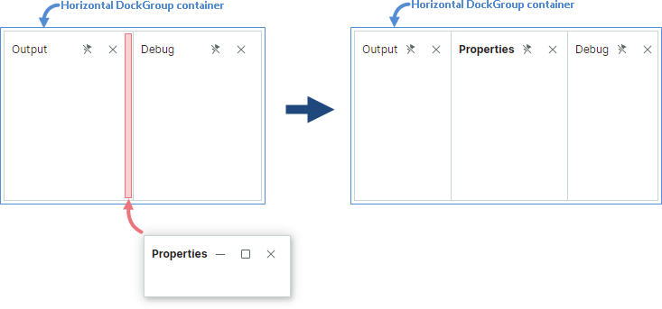
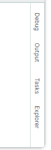
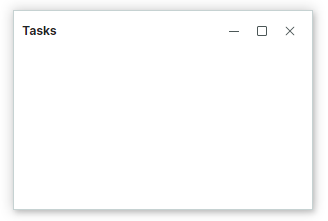
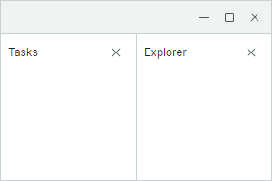

# 在代码中执行停靠操作

本主题介绍了在代码隐藏文件中对停靠面板执行的操作。

## 创建停靠面板

您可以通过构造函数创建 `DockPane` 和 `DocumentPane` 对象。创建面板后，您通常需要将其相对于另一个面板或[容器（组）](dock-panes-and-containers.md)显示在特定位置。`DockManager.Dock` 方法允许您将面板停靠到另一个面板的某条边缘、将面板添加到现有容器中，以及将面板组合到带选项卡的界面中。要将面板添加为现有容器的子项，您也可以使用该容器的 `Add` 方法。


`DockManager.Dock` 方法最常用的重载定义如下：

``` cs
public bool Dock(DockItemBase item, DockItemBase target, DockType dockType)
```

`target` 参数指定源项（作为 `item` 参数传入）将相对其停靠的面板或容器。

`dockType` 参数指定如何将某项相对于目标项进行停靠：

- `DockType.Fill` — 源面板和目标面板会组合到一个选项卡容器（`TabGroup`）中。如果目标面板已经属于某个选项卡容器，源面板会被添加到该容器中；不会创建额外的选项卡容器。

- `DockType.Left`、`DockType.Right`、`DockType.Top`、`DockType.Bottom` — 源停靠项会停靠到目标停靠项对应的一侧。必要时，`DockManager.Dock` 方法会创建一个额外的水平或垂直拆分容器（`DockGroup`），具体如下所述。

  假设您将源面板停靠到属于**垂直**拆分容器的目标面板的顶部或底部。

  ``` cs
  dockManager1.Dock(paneProperties, paneDebug, DockType.Top);
  ```

  在这种情况下，源面板会被添加为现有容器的子项。

  
  
  如果您将面板停靠到目标面板的左侧或右侧，会创建一个额外的水平拆分容器，将源面板和目标面板组合在一起。

  ``` cs
  dockManager1.Dock(paneProperties, paneDebug, DockType.Left);
  ```

  

  当面板停靠到位于**水平**拆分容器中的目标面板旁边时，同样的逻辑也适用。如果您将源面板停靠到目标面板的左侧或右侧，源面板会被添加为现有水平容器的子项。

  ``` cs
  dockManager1.Dock(paneProperties, paneOutput, DockType.Right);
  ```

  

  如果您将面板停靠到目标面板的顶部或底部，会创建一个额外的垂直拆分容器，将源面板和目标面板组合在一起。

  ``` cs
  dockManager1.Dock(paneProperties, paneOutput, DockType.Bottom);
  ```

  
  
  当面板托管在拆分容器中时，使用 `DockPane.DockWidth` 和 `DockPane.DockHeight` 属性来设置面板的大小。


### 示例 - 创建并并排显示面板

以下代码创建 `DockPane` 和 `DocumentPane` 对象，并按下图所示进行排列。`DocumentPane` 对象被放置在一个 `DocumentGroup` 容器中，以选项卡的形式呈现。


``` cs
DockPane paneProperties = new DockPane()
{
    Header = "Properties",
    Glyph = ImageLoader.LoadSvgImage(Assembly.GetExecutingAssembly(), "Images/settings.svg"),
    GlyphSize = new Avalonia.Size(16, 16)
};
DockPane paneDebug = new DockPane()
{
    Header = "Debug",
    Glyph = ImageLoader.LoadSvgImage(Assembly.GetExecutingAssembly(), "Images/debug2.svg"),
    GlyphSize = new Avalonia.Size(16, 16)
};
DockPane paneOutput = new DockPane() { Header = "Output" };

dockManager1.Root = new DockGroup();
dockManager1.Dock(paneProperties, dockManager1.Root, DockType.Right);
paneProperties.DockWidth = new GridLength(150, GridUnitType.Pixel);

dockManager1.Dock(paneOutput, paneProperties, DockType.Left);
dockManager1.Dock(paneDebug, paneOutput, DockType.Bottom);
paneDebug.DockHeight = new GridLength(150, GridUnitType.Pixel);

```


另请参阅：

- [管理自动隐藏面板](#manage-auto-hide-panels)
- [管理浮动面板](#manage-floating-panels)

更多示例：

- [如何在代码隐藏文件中创建复杂的停靠布局](examples/how-to-create-a-complex-docking-layout-in-code-behind.md)

### 访问停靠项的父项和子项

`DockPane.DockParent` 属性允许您返回任意停靠项（面板或容器）的直接父项。例如，当某个面板位于拆分容器（`DockGroup`）中时，`DockPane.DockParent` 返回该拆分容器。对于组合在选项卡容器中的面板，`DockPane.DockParent` 返回该父级选项卡容器（`TabbedGroup` 或 `DocumentGroup` 对象）。

要获取停靠容器的直接子项，请使用其 `Items` 属性。

另请参阅：[访问停靠面板和容器](#access-dock-panels-and-containers)。

#### 示例 - 访问父项并设置其大小

以下代码创建了一个由三个面板组成的停靠界面。该示例为“Properties”面板以及组合了“Output”和“Debug”面板的垂直拆分容器设置了相对宽度。


``` cs
DockPane paneProperties = new DockPane() { Header = "Properties" };
DockPane paneDebug = new DockPane() { Header = "Debug" };
DockPane paneOutput = new DockPane() { Header = "Output" };

dockManager1.Root = new DockGroup();
dockManager1.Root.Add(paneProperties);
dockManager1.Dock(paneDebug, paneProperties, DockType.Right);
dockManager1.Dock(paneOutput, paneDebug, DockType.Top);
paneProperties.DockWidth = new GridLength(1, GridUnitType.Star);
paneDebug.DockParent.DockWidth = new GridLength(2, GridUnitType.Star);
```


## 关闭面板

`DockManager.Close` 方法允许您临时隐藏某个面板或容器。当用户单击面板的“关闭”（“x”）按钮时，会调用此方法。


当对某个容器（组）调用时，`Close` 方法会隐藏该容器中的所有面板。

已关闭的面板可以从 `DockManager.ClosedPanes` 集合中访问。

使用 `DockPane.AllowClose` 属性隐藏面板的“关闭”按钮，从而阻止用户通过该按钮关闭面板。此选项不会阻止通过 `DockManager.Close` 方法关闭面板。

当面板关闭时，会触发 `DockPane.CloseCommand` 命令。

## 移除面板

您可以使用 `DockManager.Remove` 方法将某个面板从 `DockManager` 中移除。此方法不会释放该面板及其内容。

`DockManager` 不会保留对已移除面板的引用。

## 将面板组合到选项卡容器中

您可以将面板组合到选项卡容器（`TabGroup`）中。为此，请使用以下 `DockManager.Dock` 方法重载：

``` cs
public bool Dock(DockItemBase item, DockItemBase target, DockType dockType)
```

`target` 参数可以是一个面板，也可以是一个已存在的选项卡容器。

`dockType` 参数指定如何停靠面板。将此参数设置为 `DockType.Fill`，可将面板组合到带选项卡的界面中。

当您将一个 `DockPane` 对象停靠到另一个 `DockPane` 对象中时，会创建一个 `TabGroup` 容器。当您将一个 `DocumentPane` 停靠到另一个 `DocumentPane` 对象中时，会创建一个 `DocumentGroup` 容器。

您也可以使用选项卡容器的 `Add` 方法，将新项添加为一个选项卡。

### 示例 - 创建选项卡容器

以下代码使用 `DockManager.Dock` 方法，从两个面板创建一个选项卡容器。


``` cs
dockManager1.Root = new DockGroup();
DockPane paneDebug = new DockPane() 
{ 
    Header = "Debug", 
    DockWidth = new GridLength(250, GridUnitType.Pixel) 
};
dockManager1.Root.Add(paneDebug);
DockPane paneOutput = new DockPane() { Header = "Output" };
dockManager1.Dock(paneOutput, paneDebug, DockType.Fill);
```

### 访问选项卡容器

要获取某个面板的父级选项卡容器，请使用该面板的 `DockParent` 属性。

另请参阅：[访问停靠面板和容器](#access-dock-panels-and-containers)。

## 管理自动隐藏面板

自动隐藏面板最初处于折叠状态。用户可以单击面板的按钮来展开面板。


### 创建自动隐藏面板

在代码隐藏文件中，使用 `DockManager.AutoHide` 方法为面板启用自动隐藏功能。此方法会在面板当前或先前的停靠位置将其隐藏。

``` cs
dockManager1.AutoHide(paneOutput);
```

当某个面板即将变为自动隐藏状态时，会创建一个 `AutoHideGroup` 容器，并将该面板移动到此容器中。

您可以对 `TabGroup` 容器调用 `DockManager.AutoHide` 方法。在这种情况下，该选项卡容器中的所有面板都会变为自动隐藏状态。

#### 示例 - 自动隐藏选项卡容器

以下代码在 `DockManager` 的右侧边缘创建两个选项卡容器，然后为这两个选项卡容器启用自动隐藏功能。结果会创建两个 `AutoHideGroup` 容器，每个容器分别显示来自对应选项卡容器的面板。




``` cs
dockManager1.Root = new DockGroup();
dockManager1.Root.Add(new DocumentGroup());
DockPane paneDebug = new DockPane() { Header = "Debug" };
dockManager1.Root.Add(paneDebug);
DockPane paneOutput = new DockPane() { Header = "Output" };
// 创建一个组合了 'Debug' 和 'Output' 面板的选项卡容器
dockManager1.Dock(paneOutput, paneDebug, DockType.Fill);

DockPane paneTasks = new DockPane() { Header = "Tasks" };
dockManager1.Root.Add(paneTasks);
DockPane paneExplorer = new DockPane() { Header = "Explorer" };
//创建一个组合了 'Tasks' 和 'Explorer' 面板的选项卡容器
dockManager1.Dock(paneExplorer, paneTasks, DockType.Fill);

//自动隐藏这些选项卡容器
dockManager1.AutoHide(paneDebug.DockParent);
dockManager1.AutoHide(paneTasks.DockParent);
```


### 从自动隐藏状态恢复面板

使用 `DockManager.Dock(DockItemBase item)` 方法重载，可将面板从自动隐藏状态恢复到其先前的停靠位置。

``` cs
dockManager1.Dock(paneOutput);
```

您也可以使用 `Dock(DockItemBase item, DockItemBase target, DockType dockType)` 重载，在恢复自动隐藏面板的同时将其移动到布局中的特定位置。

``` cs
dockManager1.Dock(paneOutput, paneDebug, DockType.Right););
```

### 展开和折叠自动隐藏面板

`DockManager.ExpandAutoHidePanel` 和 `DockManager.CollapseAutoHidePanel` 方法允许您展开和折叠自动隐藏面板。`DockPane.IsActive` 属性允许您为任意面板设置焦点。对于自动隐藏面板，该属性会先展开面板（如果面板处于折叠状态），然后再为其设置焦点。

### 访问自动隐藏面板

您可以使用 `DockManager.AutoHideGroups` 集合访问所有现有的 `AutoHideGroup` 容器。`AutoHideGroup.Items` 属性允许您获取显示在特定容器中的所有自动隐藏面板。

要获取某个自动隐藏面板的父容器，请参阅 `DockPane.AutoHideGroup` 属性。

另请参阅：[访问停靠面板和容器](#access-dock-panels-and-containers)。

## 管理浮动面板


### 创建浮动面板

在代码隐藏文件中，使用 `DockManager.Float` 方法使某个面板变为浮动状态。当您使某个面板变为浮动状态时，它会被移动到一个 `FloatGroup` 容器（浮动窗口）中。浮动面板的 `DockPane.FloatGroup` 属性允许您访问其所在的父浮动窗口，并设置其边界（请参阅 `FloatGroup.FloatLocation`、`FloatGroup.FloatWidth` 和 `FloatGroup.FloatHeight`）。




``` cs
DockPane paneTasks = new DockPane() { Header = "Tasks" };
dockManager1.Float(paneTasks);
// 设置浮动窗口的边界
paneTasks.FloatGroup.FloatLocation = new Avalonia.PixelPoint(200, 200);
paneTasks.FloatGroup.FloatWidth = 300;
paneTasks.FloatGroup.FloatHeight = 200;
```

如果某个面板处于浮动状态，您可以将另一个面板停靠到它旁边，从而创建一个浮动容器。



``` cs
DockPane paneTasks = new DockPane() { Header = "Tasks" };
dockManager1.Float(paneTasks);
DockPane paneExplorer = new DockPane() { Header = "Explorer" };
dockManager1.Dock(paneExplorer, paneTasks, DockType.Right);
```

### 访问浮动面板

`DockManager.FloatGroups` 集合允许您获取现有的浮动窗口（`FloatGroup` 对象）。使用 `FloatGroup.Items` 属性获取每个浮动窗口中显示的面板列表。

另请参阅：[访问停靠面板和容器](#access-dock-panels-and-containers)。

## 访问停靠面板和容器

以下列表总结了可用于访问停靠面板和组（容器）的属性和方法。

- DockManager 的 `GetItems` 扩展方法 — 返回所有已停靠、已自动隐藏和已关闭的面板及组的线性列表。
- DockManager 的 `FindItem` 扩展方法 — 按名称返回某个项。
- `DockGroup.Items` — 获取某个容器的直接子项列表。
- `DockPane.DockParent` — 获取某个停靠项的直接父项。
- `DockPane.FloatGroup` — 返回托管处于浮动状态的面板的浮动窗口。
- `DockPane.AutoHideGroup` — 返回托管处于自动隐藏状态的面板的 `AutoHideGroup` 容器。
- `DockManager.Root` — 返回显示所有已停靠面板和容器的根组（容器）。
- `DockManager.FloatGroups` — 获取现有 `FloatGroup` 对象（浮动窗口）的集合。
- `DockManager.AutoHideGroups` — 获取现有 `AutoHideGroup` 对象的集合。
- `DockManager.ClosedPanes` — 返回已关闭面板的集合。


## 控制停靠操作

如果您需要灵活地控制用户执行的停靠操作，可以处理以下事件：

- `DockManager.DockOperationStarting` — 在某个停靠操作即将开始时触发。

- `DockManager.DockOperationCompleted` — 在某个停靠操作完成后触发。

- `DockManager.DockItemActivated` — 在某个停靠项被激活后触发。

- `DockManager.DockItemStartFloatDragging` — 在某个面板变为浮动状态，或某个浮动窗口即将被移动时触发。

- `DockManager.DockItemEndFloatDragging` — 在某个浮动窗口的拖动结束后触发。

### 示例 - 阻止关闭某个面板

以下 `DockManager.DockOperationStarting` 事件处理程序会在用户单击“Output”面板的“关闭”（“x”）按钮时阻止该面板被关闭。

``` cs
private void DockManager1_DockOperationStarting(object? sender, DockOperationStartingEventArgs e)
{
    if(e.Item is DockPane pane)
    {
        e.Cancel = e.DockOperation == DockOperation.Close && pane.Header == "Output";
    }
    
}
```


<br>
<br>

<sup>*</sup> 本页面使用机器翻译技术翻译。
