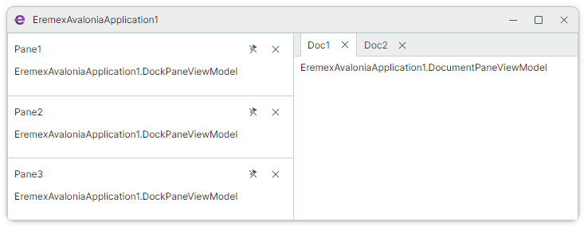

# 使用 MVVM 模式填充停靠项

`DockManager` 控件允许您使用 MVVM 设计模式，用停靠项（例如 `DocumentPane` 和 `DockPane` 对象）填充该控件。使用此方法时，您将一个停靠项集合分配给 `DockManager` 组件，并指定用于渲染这些停靠项的模板。

## 使用来自项源的项填充 DockManager

使用 `DockManager.ItemsSource` 属性，将 `DockManager` 绑定到需要渲染为停靠项的对象集合。这些对象转换为停靠项的方式由 `DockManager.ItemTemplate` 属性指定。

要指定用于渲染由 `DockManager.ItemsSource` 集合创建的停靠项内容的模板，请使用 `DockManager.ItemContentTemplate` 属性。

以下来自 _IDE Layout_ 演示的示例使用 `DockManager.ItemsSource` 属性，将控件绑定到主视图模型中定义的 _Documents_ 集合。该集合的元素（_IdeLayoutDocumentViewModel_ 对象）会被渲染为 `DocumentPane` 对象。

``` xml
<mxd:DockManager Grid.Column="0" Grid.Row="1"
                 BorderThickness="0" 
                 ItemsSource="{Binding Documents}"
                 ItemContentTemplate="{views:IdeLayoutDocumentContentTemplate}">
    <mxd:DockManager.ItemTemplate>
        <DataTemplate DataType="vm:IdeLayoutDocumentViewModel">
            <mxd:DocumentPane Header="{Binding Header}"
                IsActive="{Binding IsActive}"
                CloseCommand="{Binding CloseCommand}"/>
        </DataTemplate>
    </mxd:DockManager.ItemTemplate>
    <mxd:DockGroup>
        <!-- ... -->
        <!-- Created DocumentPane objects are placed in the first DocumentGroup container. -->
        <mxd:DocumentGroup DockWidth="5*">
        </mxd:DocumentGroup>
    </mxd:DockGroup>
</mxd:DockManager>
```

``` cs
public partial class IdeLayoutPageViewModel : PageViewModelBase
{
    public ObservableCollection<IdeLayoutDocumentViewModel> Documents { get; };
    //...
}

public partial class IdeLayoutDocumentViewModel : ObservableObject
{
    [ObservableProperty] private string header;
    [ObservableProperty] private string uri;
    [ObservableProperty] private bool isActive;
    [ObservableProperty] private ICommand closeCommand;
}

public class IdeLayoutDocumentContentTemplate : MarkupExtension, IDataTemplate
{
    //...
}
```

有关此示例的完整代码，请参阅演示应用程序中的 _IDE Layout_ 模块。

!!! note
 
    当 `DocumentPane` 对象是从 `DockManager.ItemsSource` 集合创建时，它们会自动作为选项卡渲染在第一个 `DocumentGroup` 容器中。请确保 `DockManager` 至少包含一个 `DocumentGroup` 容器。您可以实现**项适配器**（`DockManager.ItemAdapter`），将创建的停靠项（例如 `DocumentPane` 对象）放置到特定的停靠容器中。有关更多详细信息，请参阅下一节。


## 从项源创建多种类型的停靠项

您可能需要将 `DockManager.ItemsSource` 属性绑定到一个对象集合，这些对象应该被渲染为停靠窗格、文档窗格、自动隐藏面板和/或浮动窗格。要完成此任务，请使用以下方法：

1. 实现一个**模板选择器**，根据 `DockManager.ItemsSource` 集合中的对象创建特定的停靠项。
2. 向 `DockManager` 组件中添加应承载所创建停靠项的停靠容器。
3. 创建一个**项适配器**，将创建的停靠项放置到特定的停靠容器中。

### 示例

1. 在主视图模型中定义 _Panes_ 集合。该集合将包含以下元素：

- _DockPaneViewModel_ 对象 — 这些对象需要被渲染为[停靠窗格](dock-panes-and-containers.md)（`DockPane`）。
- _DocumentPaneViewModel_ 对象 — 这些对象需要被渲染为[文档窗格](document-panes.md)（`DocumentPane`）。

``` cs
namespace EremexAvaloniaApplication1;

public class MainViewModel : ObservableObject
{
    public ObservableCollection<PaneViewModelBase> Panes { get; } = new();
}

public partial class PaneViewModelBase : ObservableObject
{
    [ObservableProperty] private string? header;
}

public class DockPaneViewModel : PaneViewModelBase { }
public class DocumentPaneViewModel : PaneViewModelBase { }
```

2. 使用示例对象初始化 _Panes_ 集合。

``` cs
namespace EremexAvaloniaApplication1;

public partial class MainWindow : MxWindow
{
    public MainWindow()
    {
        var viewModel = new MainViewModel();
        viewModel.Panes.AddRange(new PaneViewModelBase[]
        {
            new DockPaneViewModel() { Header = "Pane1" },
            new DockPaneViewModel() { Header = "Pane2" },
            new DockPaneViewModel() { Header = "Pane3" },
            new DocumentPaneViewModel() { Header = "Doc1" },
            new DocumentPaneViewModel() { Header = "Doc2" }
        });
        DataContext = viewModel;
        
        InitializeComponent();
    }
}
```

3. 在主窗口中定义一个 `DockManager` 组件。将其绑定到 _MainViewModel.Panes_ 集合，并创建两个停靠容器：

- _paneHost_ — `DockGroup` 容器，用于显示由 _DockPaneViewModel_ 对象创建的停靠窗格。
- _documentHost_ — `DocumentGroup` 容器，用于显示由 _DocumentPaneViewModel_ 对象创建的文档窗格。

``` xml
<mx:MxWindow xmlns="https://github.com/avaloniaui"
             xmlns:x="http://schemas.microsoft.com/winfx/2006/xaml"
             xmlns:d="http://schemas.microsoft.com/expression/blend/2008"
             xmlns:mc="http://schemas.openxmlformats.org/markup-compatibility/2006"
             xmlns:mx="https://schemas.eremexcontrols.net/avalonia"
             xmlns:mxd="https://schemas.eremexcontrols.net/avalonia/docking"
             xmlns:local="clr-namespace:EremexAvaloniaApplication1"
             mc:Ignorable="d" d:DesignWidth="800" d:DesignHeight="450"
             x:Class="EremexAvaloniaApplication1.MainWindow"
             Icon="/Assets/EMXControls.ico"
             Title="EremexAvaloniaApplication1"
             x:DataType="local:MainViewModel">
    <mxd:DockManager ItemsSource="{Binding Panes}">
        <mxd:DockGroup>
            <mxd:DockGroup x:Name="paneHost" Orientation="Vertical"></mxd:DockGroup>
            <mxd:DocumentGroup x:Name="documentHost"></mxd:DocumentGroup>
        </mxd:DockGroup>
    </mxd:DockManager>
</mx:MxWindow>
```

4. 实现一个**模板选择器**，从 _DockPaneViewModel_ 元素创建 `DockPane` 对象，从 _DocumentPaneViewModel_ 元素创建 `DocumentPane` 对象。将该模板选择器赋值给 `DockManager.ItemTemplate` 属性。

``` cs
namespace EremexAvaloniaApplication1;

public class PaneTemplateSelector : MarkupExtension, IDataTemplate
{
    public IDataTemplate? DocumentTemplate { get; set; }
    public IDataTemplate? DockPaneTemplate { get; set; }
    public Control? Build(object? param)
    {
        if (param is DocumentPaneViewModel) return DocumentTemplate?.Build(param);
        return DockPaneTemplate?.Build(param);
    }

    public bool Match(object? data)
    {
        return data is PaneViewModelBase;
    }

    public override object ProvideValue(IServiceProvider serviceProvider) => this;
}
```

``` xml
<mxd:DockManager ItemsSource="{Binding Panes}">
    <mxd:DockManager.ItemTemplate>
        <local:PaneTemplateSelector>
            <local:PaneTemplateSelector.DocumentTemplate>
                <DataTemplate DataType="local:DocumentPaneViewModel">
                    <mxd:DocumentPane Header="{Binding Header}" />
                </DataTemplate>
            </local:PaneTemplateSelector.DocumentTemplate>
            <local:PaneTemplateSelector.DockPaneTemplate>
                <DataTemplate DataType="local:DockPaneViewModel">
                    <mxd:DockPane Header="{Binding Header}" />
                </DataTemplate>
            </local:PaneTemplateSelector.DockPaneTemplate>
        </local:PaneTemplateSelector>
    </mxd:DockManager.ItemTemplate>
    <mxd:DockGroup>
        <mxd:DockGroup x:Name="paneHost" Orientation="Vertical"></mxd:DockGroup>
        <mxd:DocumentGroup x:Name="documentHost"></mxd:DocumentGroup>
    </mxd:DockGroup>
</mxd:DockManager>
```

5. 创建一个**项适配器**，将创建的 `DockPane` 和 `DocumentPane` 对象放置到对应的停靠容器中。

项适配器是一个实现了 `IDockManagerItemAdapter` 接口的类。对于从 `DockManager.ItemsSource` 集合创建的每个停靠项，都会调用 `IDockManagerItemAdapter.Adapt` 方法。该方法应将某个停靠项放置到特定的停靠容器中。

使用 `DockManager.ItemAdapter` 属性来指定项适配器。

``` cs
namespace EremexAvaloniaApplication1;

public class PaneAdapter : MarkupExtension, IDockManagerItemAdapter
{
    public void Adapt(DockManager dockManager, DockItemBase dockItem, object item)
    {
        var target = dockManager.FindItem<DockGroup>(dockItem is DocumentPane ? "documentHost" : "paneHost"); 
        target?.Add(dockItem);
    }

    public override object ProvideValue(IServiceProvider serviceProvider)
    {
        return this;
    }
}
```

``` xml
<mxd:DockManager ItemsSource="{Binding Panes}" ItemAdapter="{local:PaneAdapter}">
<!-- ... -->
```

6. 运行应用程序，查看 `DockManager` 组件被 _Panes_ 集合中的停靠项填充的效果。




<br>
<br>

<sup>*</sup> 本页面使用机器翻译技术翻译。
