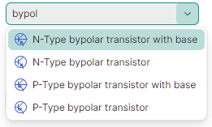

# ComboBoxEditor

`ComboBoxEditor` 控件是一种在其下拉窗口中显示项目列表的控件。用户可以根据该控件的选择模式一次选择一个或多个项目。


该控件的主要功能包括：

- 显示来自字符串列表、业务对象列表或枚举类型的值。
- 单项和多项选择模式。
- 自动完成功能。
- 在单项选择模式下于编辑框中进行文本编辑。
- 项目模板允许你以自定义方式呈现项目。
- 将该控件用作容器控件（例如 TreeList、TreeView 和 PropertyGrid）内的内嵌编辑器。

## 指定项目源

使用 `ComboBoxEditor.ItemsSource` 属性指定要在下拉列表中显示的项目列表。你可以将编辑器绑定到字符串列表、业务对象列表或枚举类型。

## 绑定到字符串列表

最简单的项目源是字符串列表。

用户可以根据当前的选择模式（见下文）选择一个或多个值。
如果编辑框中启用了文本编辑（参见 `IsTextEditable`），用户可以输入与下拉列表中任何项目都不匹配的文本。

### 示例 - 如何绑定到字符串列表
以下示例用一个字符串列表填充 `ComboBoxEditor`。

``` xml
xmlns:mxe="https://schemas.eremexcontrols.net/avalonia/editors"
xmlns:sys="clr-namespace:System;assembly=mscorlib"
xmlns:local="clr-namespace:ComboBoxTestSample"

<mxe:ComboBoxEditor x:Name="myComboBox1">
    <mxe:ComboBoxEditor.ItemsSource>
        <local:MyItemList>
            <sys:String>Moscow</sys:String>
            <sys:String>Kazan</sys:String>
            <sys:String>Tver</sys:String>
        </local:MyItemList>
    </mxe:ComboBoxEditor.ItemsSource>
</mxe:ComboBoxEditor>
```
``` csharp
public class MyItemList : List<string>
{
}
```

## 绑定到业务对象列表

你可以将 `ComboBoxEditor` 绑定到业务对象列表。在这种情况下，该控件的默认行为如下：

- 业务对象的 `ToString` 方法指定项目的默认文本表示形式。
- 当你选择一个项目时，编辑器的值（`ComboBoxEditor.EditorValue`）会被设置为对应的业务对象。

一个典型的业务对象具有多个属性。你可以指定由哪些业务对象属性提供项目显示文本和编辑值。为此请使用以下 API 成员：

- `ComboBoxEditor.DisplayMember` - 获取或设置业务对象中用于指定项目显示文本的属性名称。
- `ComboBoxEditor.ValueMember` - 获取或设置业务对象中用于指定项目值的属性名称。当你选择一个项目时，编辑器的值（`ComboBoxEditor.EditorValue`）会被设置为该项目的 `ValueMember` 属性值。

### 示例 - 如何绑定到业务对象列表

以下示例将 `ComboBoxEditor` 绑定到 _Product_ 业务对象列表。_Product.ProductName_ 属性指定项目显示文本。_Product.ProductID_ 属性指定项目值。

``` xml
xmlns:mxe="https://schemas.eremexcontrols.net/avalonia/editors"
xmlns:local="clr-namespace:ComboBoxTestSample"

<Window.DataContext>
    <local:MainViewModel/>
</Window.DataContext>

<mxe:ComboBoxEditor
    x:Name="myComboBox2"
    ItemsSource="{Binding Products}"
    DisplayMember="ProductName"
    ValueMember="ProductID"
    SelectionMode="Multiple"
/>
```
``` csharp
public MainViewModel()
{
    Products = new ObservableCollection<Product>();
    //...
}

public partial class Product :ObservableObject
{
    public Product(int productID, string productName, string category, int productPrice)
    {
        ProductID = productID;
        ProductName = productName;
        Category = category;
        ProductPrice = productPrice;
    }

    [ObservableProperty]
    public int productID;

    [ObservableProperty]
    public string productName;

    [ObservableProperty]
    public string category;

    [ObservableProperty]
    public decimal productPrice;
}
```

## 绑定到枚举

ComboBoxEditor 可以在下拉列表中显示枚举类型的值。

`Eremex.AvaloniaUI.Controls.Common.EnumItemsSource` 辅助类简化了与枚举的绑定。它的主要功能包括：

- 在下拉列表中为枚举成员显示图像。将 `Eremex.AvaloniaUI.Controls.Common.ImageAttribute` 属性应用到目标枚举成员即可指定图像。
- 为枚举成员指定自定义显示名称。使用 `System.ComponentModel.DataAnnotations.DisplayAttribute` 属性或自定义转换器来更改默认的项目显示文本。
- 为下拉项目显示工具提示。工具提示中包含目标项目的描述文字，你可以通过 `System.ComponentModel.DataAnnotations.DisplayAttribute` 属性或自定义转换器来提供该描述。

使用以下 `EnumItemsSource` 属性来设置与枚举类型的绑定：

- `EnumItemsSource.EnumType` — 指定其值将显示在 ComboBoxEditor 中的枚举类型。
- `EnumItemsSource.ShowImages` — 指定是否在下拉列表中为枚举成员显示图像。你可以使用 `Eremex.AvaloniaUI.Controls.Common.ImageAttribute` 属性提供图像。
- `EnumItemsSource.ShowNames` — 指定是否显示项目文本。将 `ShowNames` 设置为 `false`、`ShowImages` 设置为 `true`，即可仅使用图像而不使用文本呈现枚举成员。
- `EnumItemsSource.ImageSize` — 指定分配给枚举成员的图像的显示大小。
- `EnumItemsSource.NameToDisplayTextConverter` — 允许你指定一个转换器，用于获取枚举成员的自定义显示文本。
- `EnumItemsSource.NameToDescriptionConverter` — 允许你指定一个转换器，用于获取枚举成员的描述文字，当用户将鼠标悬停在下拉项目上时，该描述会以工具提示的形式显示。

### 示例 - 如何显示枚举值，并使用特性为枚举成员提供显示文本和图像

以下示例在 ComboBoxEditor 中显示 _ProductCategoryEnum_ 枚举的值。该示例使用 `EnumItemsSource` 类进行数据绑定。

`System.ComponentModel.DataAnnotations.DisplayAttribute` 和 `Eremex.AvaloniaUI.Controls.Common.ImageAttribute` 特性为枚举成员指定了自定义显示文本、描述（工具提示）和图像。

``` xml
xmlns:mx="https://schemas.eremexcontrols.net/avalonia"
xmlns:mxe="https://schemas.eremexcontrols.net/avalonia/editors"

<mxe:ComboBoxEditor Name="comboBoxEditorEnum"
 ItemsSource="{mx:EnumItemsSource 
  EnumType=local:ProductCategoryEnum, ImageSize='16, 16', 
  ShowImages=True, ShowNames=True}"
 IsTextEditable="True"
 AutoComplete="True">
</mxe:ComboBoxEditor>
```
``` csharp
using Eremex.AvaloniaUI.Controls.Common;
using System.ComponentModel.DataAnnotations;

public enum ProductCategoryEnum
{
    // The images assigned to the enumeration values below are placed 
    // in the ComboBoxTestSample/Images folder.
    // They have their "Build Action" properties set to "AvaloniaResource".
    [Image($"avares://ComboBoxTestSample/Images/Products/DairyProducts.svg")]
    [Display(Name = "Dairy Products", Description = "Products made from milk")]
    DairyProducts,

    [Image($"avares://ComboBoxTestSample/Images/Products/Beverages.svg")]
    [Display(Description = "Edible drinks")]
    Beverages,

    [Image($"avares://ComboBoxTestSample/Images/Products/Condiments.svg")]
    [Display(Description = "Flavor Enhancers")]
    Condiments,

    [Image($"avares://ComboBoxTestSample/Images/Products/Confections.svg")]
    [Display(Description = "Sweets")]
    Confections
}
```

### 示例 - 如何显示枚举值，并使用自定义转换器为枚举成员提供显示文本

以下示例使用 `EnumItemsSource` 类在 ComboBoxEditor 中显示枚举类型的值。`EnumItemsSource.NameToDisplayTextConverter` 和 `EnumItemsSource.NameToDescriptionConverter` 对象为枚举成员提供自定义显示文本和描述（工具提示）。

``` xml
xmlns:mxe="https://schemas.eremexcontrols.net/avalonia/editors"
xmlns:mx="https://schemas.eremexcontrols.net/avalonia"
xmlns:local="clr-namespace:ComboBoxTestSample"

<mxe:ComboBoxEditor Name="comboBoxEditorEnumWithConverters"
 ItemsSource="{mx:EnumItemsSource EnumType=local:ProductCategoryEnum, 
  ImageSize='16, 16', ShowImages=True, ShowNames=True, 
  NameToDisplayTextConverter={local:EnumMemberNameToDisplayTextConverter}, 
  NameToDescriptionConverter={local:EnumMemberNameToDescriptionConverter}}"
 IsTextEditable="True"
 AutoComplete="True">
</mxe:ComboBoxEditor>
```

``` csharp
using Eremex.AvaloniaUI.Controls.Common;

public enum ProductCategoryEnum
{
    // The images assigned to the enumeration values below are placed 
    // in the ComboBoxTestSample/Images folder.
    // They have their "Build Action" properties set to "AvaloniaResource".
    [Image($"avares://ComboBoxTestSample/Images/Products/DairyProducts.svg")]
    DairyProducts,

    [Image($"avares://ComboBoxTestSample/Images/Products/Beverages.svg")]
    Beverages,

    [Image($"avares://ComboBoxTestSample/Images/Products/Condiments.svg")]
    Condiments,

    [Image($"avares://ComboBoxTestSample/Images/Products/Confections.svg")]
    Confections
}

public class EnumMemberNameToDisplayTextConverter : BaseEnumConverter
{
    protected override void PopulateDictionary()
    {
        TextValueDictionary.Add("ProductCategoryEnum_DairyProducts", "Dairy");
    }
}
public class EnumMemberNameToDescriptionConverter : BaseEnumConverter
{
    protected override void PopulateDictionary()
    {
        TextValueDictionary.Add("ProductCategoryEnum_DairyProducts", "Milk Products");
    }
}

public abstract class BaseEnumConverter : MarkupExtension, IValueConverter
{
    protected Dictionary<string, string> TextValueDictionary;

    public BaseEnumConverter()
    {
        TextValueDictionary = new Dictionary<string, string>();
        PopulateDictionary();
    }

    protected abstract void PopulateDictionary();

    public override object ProvideValue(IServiceProvider serviceProvider)
    {
        return this;
    }
    public object? Convert(object? value, Type targetType, object? parameter, 
     System.Globalization.CultureInfo culture)
    {
        var type = value?.GetType();
        var memberName = value?.ToString();
        if (type == null || !type.IsEnum || string.IsNullOrEmpty(memberName))
            return null;
        return EnumMemberToString(type.Name, memberName);
    }
        
    protected virtual string EnumMemberToString(string enumName, string enumMemberName)
    {
        string fullMemberName = enumName + "_" + enumMemberName;
        if (TextValueDictionary.ContainsKey(fullMemberName))
            return TextValueDictionary[fullMemberName];
        else 
            return enumMemberName;
    }
        
    public object? ConvertBack(object? value, Type targetType, object? parameter, 
     System.Globalization.CultureInfo culture)
    {
        return null;
    }
}
```

## 指定项目选择模式

`SelectionMode` 属性允许你在单项和多项选择模式之间进行选择。

单项选择模式为默认模式。如果启用了文本编辑（参见 `IsTextEditable`），可以指定与下拉列表中任何项目都不匹配的编辑值（或编辑框中的文本）。

将 `SelectionMode` 属性设置为 `ItemSelectionMode.Multiple` 即可启用多项选择。在多选模式下，编辑器会在下拉列表的每个项目前显示复选框。用户可以切换这些复选框，向选择集中添加或移除项目。
在多选模式下，编辑框中的文本编辑被禁用。

### 获取和设置选定的项目（Item / Items）

`SelectedItem` 属性允许你在单选模式下选择和获取当前选定的项目。如果未选择任何项目，该属性返回 `null`。

`SelectedItems` 属性指定一个列表（`IList` 对象），其中包含多选模式下选定的项目。如果未选择任何项目，该属性返回一个空列表。

!!! note

    `SelectedItem` 和 `SelectedItems` 属性按以下方式保持同步。

    在单选模式下，`SelectedItems` 属性指定一个包含单个项目的列表——即选定项目（`SelectedItem` 属性的值）。如果未选择任何项目，该属性返回一个空列表。

    在多选模式下，`SelectedItem` 属性指定第一个选定的项目（`SelectedItems` 列表中的第一个项目）。如果未选择任何项目，该属性返回 `null`。

### 示例 - 如何选择项目

以下代码在以单选和多选模式运行的 ComboBoxEditor 中选择项目。

``` csharp
// Select an item in single selection mode
var itemSource1 = myComboBox1.ItemsSource as MyItemList;
if(itemSource1 != null) 
    myComboBox1.SelectedItem = itemSource1[0];

// Select items in multi-select mode
var itemSource2 = myComboBox2.ItemsSource as ObservableCollection<Product>;
if (itemSource2 != null)
    myComboBox2.SelectedItems = new List<Product>() 
     { itemSource2[0], itemSource2[1] };

```

### 多选模式下的“(Select All)”项目
在多选模式下，编辑器会在下拉列表顶部显示预定义的 _(Select All)_ 复选框。该复选框允许用户选择/取消选择所有项目。要隐藏 _(Select All)_ 复选框，请将 `ComboBoxEditor.ShowPredefinedSelectItem` 属性设置为 `false`。


**相关 API**
- `SelectAllItemText` — 允许你为“(Select All)”项目指定自定义显示文本。

### 单选模式下的“_(None)_”项目

在单选模式下，你可以将 `ComboBoxEditor.ShowPredefinedSelectItem` 属性设置为 `true`，以在下拉列表中显示预定义的 _(None)_ 项目。选择 _(None)_ 项目会将编辑器的值设置为 `null`，从而清除当前选择。


**相关 API**
- `ClearValueItemText` — 允许你为“(None)”项目指定自定义显示文本。

## 指定编辑器值

当用户输入文本、通过自动完成功能在编辑框中选择某项，或在下拉列表中选取某项时，编辑器会更改其编辑值（`EditorValue` 属性的值）。

通常情况下，编辑值与 `SelectedItem` 属性（单选模式下）或 `SelectedItems` 属性（多选模式下）的值一致，本节所述的例外情况除外。

编辑值取决于项目选择模式。在单项选择模式下，编辑值是单个值；而在多项选择模式下，编辑值是一个指定值列表的 `IList` 对象。

在以下情况下，`EditorValue` 属性与 `SelectedItem`/`SelectedItems` 属性不会保持同步：

- ComboBoxEditor 绑定到字符串列表，且编辑框中指定的文本与下拉列表中的任何项目都不匹配。此时，`SelectedItem` 属性返回 `null`，而 `EditorValue` 属性则指定编辑框中显示的文本。

    !!! tip
    
        启用 `ComboBoxEditor.IsTextEditable` 选项，以允许用户在编辑框中编辑文本。
  
    ### 示例 - 当 ComboBox 绑定到字符串列表时，如何设置编辑器值

    以下示例为绑定到字符串列表的 ComboBoxEditor 设置编辑值。

    ``` xml
    xmlns:mxe="https://schemas.eremexcontrols.net/avalonia/editors"
    xmlns:sys="clr-namespace:System;assembly=mscorlib"
    xmlns:local="clr-namespace:ComboBoxTestSample"

    <mxe:ComboBoxEditor x:Name="myComboBox1">
        <mxe:ComboBoxEditor.ItemsSource>
            <local:MyItemList>
                <sys:String>Moscow</sys:String>
                <sys:String>Kazan</sys:String>
                <sys:String>Tver</sys:String>
            </local:MyItemList>
        </mxe:ComboBoxEditor.ItemsSource>
    </mxe:ComboBoxEditor>
    ```

    ``` csharp
    myComboBox1.EditorValue = "Moscow";
    //The SelectedItem property will return "Moscow" as well.

    myComboBox1.EditorValue = "Rostov";
    //The SelectedItem property will return `null`, 
    //since the edit value does not match any item in the bound list.

    //...
    public class MyItemList : List<string>
    {
    }
    ```

- ComboBoxEditor 绑定到业务对象列表，并设置了 `ValueMember` 属性。`ValueMember` 属性指定业务对象中用于提供项目值的属性名称。当你选择一个或多个项目时，`SelectedItem`/`SelectedItems` 属性包含所选对象，而 `EditorValue` 属性则指定所选对象的值。

    ### 示例 - 当 ComboBoxEditor 绑定到业务对象列表时，如何选择项目

    在以下示例中，ComboBoxEditor 在多选模式下绑定到 _Product_ 对象列表。`ValueMember` 属性引用 _Product.ProductID_ 成员。
    因此，产品 ID 用作项目值。当用户选择项目时，`EditorValue` 属性会被设置为一个包含相应产品 ID 的列表。该示例使用 `EditorValue` 属性在代码中选择项目。

    ``` xml
    xmlns:mxe="https://schemas.eremexcontrols.net/avalonia/editors"
    xmlns:sys="clr-namespace:System;assembly=mscorlib"
    xmlns:local="clr-namespace:ComboBoxTestSample"

    <mxe:ComboBoxEditor
        x:Name="myComboBox2"
        ItemsSource="{Binding Products}"
        DisplayMember="ProductName"
        ValueMember="ProductID"
        SelectionMode="Multiple"
    />
    ```
    ``` csharp
    // Select items by their product IDs:
    var itemSource2 = myComboBox2.ItemsSource as ObservableCollection<Product>;
    if(itemSource2 != null) 
        myComboBox2.EditorValue = new List<int>() 
        { itemSource2[3].ProductID, itemSource2[5].ProductID };
    //The SelectedItems property will return a list that contains 
    //two Product objects (itemSource2[3] and itemSource2[5]).

    //...
    public partial class Product :ObservableObject
    {
        public Product(int productID, string productName, string category, int productPrice)
        {
            ProductID = productID;
            ProductName = productName;
            Category = category;
            ProductPrice = productPrice;
        }

        [ObservableProperty]
        public int productID;

        [ObservableProperty]
        public string productName;

        [ObservableProperty]
        public string category;

        [ObservableProperty]
        public decimal productPrice;
    }
    ```

## 在多选模式下立即更新编辑器值

编辑器的默认行为是在多选模式下于下拉窗口中显示“确定”和“取消”按钮。这些按钮允许用户确认或取消他们对项目的选择。
在这种模式下，编辑器的值只会在用户按下“确定”按钮后才会更新。


ComboBoxEditor 可以在用户勾选或取消勾选下拉列表中的项目时立即更新其值。要启用该模式，请将 `PopupFooterButtons` 属性设置为 `None`，以隐藏“确定”和“取消”按钮。

``` xml
<mxe:ComboBoxEditor x:Name="MultiSelectComboBox" 
    SelectionMode="Multiple"
    PopupFooterButtons="None"/>
```


## 指定项目模板

默认情况下，ComboBoxEditor 使用项目显示文本来渲染下拉列表中的每个项目。默认的项目显示文本由项目的 `ToString` 方法指定。当编辑器绑定到业务对象列表时，你可以使用 `DisplayMember` 属性指定提供项目显示文本的属性。

你可以使用 `ItemTemplate` 属性指定一个数据模板，以自定义方式呈现下拉列表中的项目。例如，数据模板可以帮助你为项目显示图像，如下例所示。

启用 `ComboBoxEditor.ApplyItemTemplateToEditBox` 选项，可将指定的项目模板（`ItemTemplate` 属性）应用到编辑框。如果启用了文本编辑（`IsTextEditable` 选项设置为 `true`），该属性将不起作用。

### 示例 - 如何使用 DataTemplate 为 ComboBox 项目显示图像

以下示例使用 `ItemTemplate` 属性指定一个数据模板，用于在下拉列表中为 ComboBox 项目显示图像。

ComboBoxEditor 绑定到一个存储 _Product_ 对象的列表。_Product_ 对象包含 _Category_ 属性，用于指定产品类别（Beverages、Condiments、Seafood 或 Produce）。

假设项目在“_ComboBoxTestSample/Images/Products_”文件夹中存储了产品类别的 SVG 图像。这些图像的名称分别为“_Beverages.svg_”“_Condiments.svg_”“_Seafood.svg_”和“_Produce.svg_”，并标记有“_AvaloniaResource_”标志。

创建的项目数据模板会显示产品名称，以及与产品类别对应的图像。

``` xml
xmlns:mxe="https://schemas.eremexcontrols.net/avalonia/editors"
xmlns:sys="clr-namespace:System;assembly=mscorlib"
xmlns:local="clr-namespace:ComboBoxTestSample"

<Window.DataContext>
    <local:MainViewModel/>
</Window.DataContext>
<Window.Resources>
    <local:NameToSvgConverter x:Key="NameToSvgConverter"/>
    <DataTemplate x:Key="ProductItemTemplate">
        <Grid>
            <Grid.ColumnDefinitions>
                <ColumnDefinition Width="Auto"/>
                <ColumnDefinition Width="*"/>
            </Grid.ColumnDefinitions>
            <Image Width="16" Height="16" Source="{Binding Path=Category, 
             Converter={StaticResource NameToSvgConverter}}"/>
            <TextBlock VerticalAlignment="Center" Grid.Column="1" Margin="6,0,0,0" 
             Text="{Binding Path=ProductName}"/>
        </Grid>
    </DataTemplate>
</Window.Resources>

<mxe:ComboBoxEditor
    x:Name="myComboBox2"
    ItemsSource="{Binding Products}"
    DisplayMember="ProductName"
    ValueMember="ProductID"
    SelectionMode="Multiple"
    ItemTemplate="{StaticResource ProductItemTemplate}"
/>
```

```csharp
using Avalonia.Svg.Skia;
using Eremex.AvaloniaUI.Controls.Utils;

public partial class MainViewModel : ViewModelBase
{
    [ObservableProperty]
    public ObservableCollection<Product> products;

    public MainViewModel()
    {
        Products = new ObservableCollection<Product>();
        Products.Add(new Product(0, "Chai", "Beverages", 200));
        Products.Add(new Product(1, "Chang", "Beverages", 100));
        Products.Add(new Product(2, "Aniseed Syrup", "Condiments", 150));
        Products.Add(new Product(3, "Ikura", "Seafood", 500));
        Products.Add(new Product(4, "Konbu", "Seafood", 390));
        Products.Add(new Product(5, "Tofu", "Produce", 430));
    }
}

public partial class Product :ObservableObject
{
    public Product(int productID, string productName, string category, int productPrice)
    {
        ProductID = productID;
        ProductName = productName;
        Category = category;
        ProductPrice = productPrice;
    }

    [ObservableProperty]
    public int productID;

    [ObservableProperty]
    public string productName;

    [ObservableProperty]
    public string category;

    [ObservableProperty]
    public decimal productPrice;
}

public class NameToSvgConverter : MarkupExtension, IValueConverter
{
    public object? Convert(object? value, Type targetType, object? parameter, 
     CultureInfo culture)
    {
        if(value == null) 
            return null;
        string name = value.ToString();

        return ImageLoader.LoadSvgImage(Assembly.GetExecutingAssembly(), $"Images/Products/{name}.svg");
    }

    public object? ConvertBack(object? value, Type targetType, object? parameter, 
     CultureInfo culture)
    {
        throw new NotImplementedException();
    }

    public override object ProvideValue(IServiceProvider serviceProvider)
    {
        return this;
    }
}
```

## 添加自定义按钮

ComboBoxEditor 是 ButtonEditor 控件的派生类。因此，你可以在编辑框中默认的下拉按钮旁边添加自定义按钮。使用 `ComboBoxEditor.Buttons` 集合来添加自定义按钮。

### 示例 - 如何添加自定义按钮

以下示例向 ComboBoxEditor 添加了一个普通按钮和一个复选按钮。该编辑器通过 `EnumItemsSource` 辅助类绑定到 _ProductCategoryEnum_ 枚举。

第一个按钮是普通按钮（其 `ButtonKind` 属性设置为 `Simple`）。点击该按钮会调用 _ResetValue_ 命令，将编辑器的值设置为默认值（所绑定枚举类型的第一个元素）。

第二个按钮是复选按钮（其 `ButtonKind` 属性设置为 `Toggle`）。点击该按钮会切换编辑器的 `IsTextEditable` 属性值。_LockedStateToSvgNameConverter_ 转换器会根据按钮的选中状态，为按钮的图形分配“_locked.svg_”或“_unlocked.svg_”图像。这些图像存储在 _ComboBoxTestSample/Images_ 文件夹中，并标记有“_AvaloniaResource_”标志。

``` xml
xmlns:mxe="https://schemas.eremexcontrols.net/avalonia/editors"
xmlns:mx="https://schemas.eremexcontrols.net/avalonia"
xmlns:local="clr-namespace:ComboBoxTestSample"

<mxe:ComboBoxEditor Name="comboBoxEditorEnum"
 ItemsSource="{mx:EnumItemsSource EnumType=local:ProductCategoryEnum, 
  ImageSize='16, 16', ShowImages=True, ShowNames=True}"
 IsTextEditable="True"
 AutoComplete="True">
    <mxe:ComboBoxEditor.Buttons>
        <mxe:ButtonSettings ButtonKind="Simple" 
         Glyph="{SvgImage 'avares://ComboBoxTestSample/Images/square_dot_icon.svg'}"
         Command="{Binding ResetValueCommand}" 
         CommandParameter="{Binding #comboBoxEditorEnum}">
        </mxe:ButtonSettings>
        <mxe:ButtonSettings ButtonKind="Toggle" 
         Glyph="{Binding $self.IsChecked, Converter={local:LockedStateToSvgNameConverter}}" 
         IsChecked="{Binding !$parent.IsTextEditable}">
        </mxe:ButtonSettings>
    </mxe:ComboBoxEditor.Buttons>
</mxe:ComboBoxEditor>
```

```csharp
using CommunityToolkit.Mvvm.Input;
using Eremex.AvaloniaUI.Controls.Editors;
using Avalonia.Svg.Skia;
using Eremex.AvaloniaUI.Controls.Utils;

public partial class MainViewModel : ViewModelBase
{
    // Sets the editor's value to the first element.
    [RelayCommand]
    void ResetValue(ComboBoxEditor editor)
    {
        // Get the first item in the ComboBoxEditor's bound list.
        var enumerator = editor.ItemsSource.GetEnumerator();
        enumerator.MoveNext();
        object firstItem = enumerator.Current;
        // When the ComboBoxEditor is bound to an EnumItemsSource, 
        // the editor's items are EnumMemberInfo objects.
        EnumMemberInfo mInfo = firstItem as EnumMemberInfo;
        if (mInfo != null)
            editor.EditorValue = mInfo.Id;
    }
}

public class LockedStateToSvgNameConverter : MarkupExtension, IValueConverter
{
    public object? Convert(object? value, Type targetType, object? parameter, 
    CultureInfo culture)
    {
        if (value == null)
            return null;
        bool isLocked = (bool)value;
        string lockedState = isLocked ? "locked" : "unlocked";

        if (isLocked)
            lockedState = "locked";

        return ImageLoader.LoadSvgImage(Assembly.GetExecutingAssembly(), $"Images/{lockedState}.svg");
    }

    public object? ConvertBack(object? value, Type targetType, object? parameter, 
     CultureInfo culture)
    {
        throw new NotImplementedException();
    }

    public override object ProvideValue(IServiceProvider serviceProvider)
    {
        return this;
    }
}

public enum ProductCategoryEnum
{
    [Image($"avares://ComboBoxTestSample/Images/Products/DairyProducts.svg")]
    [Display(Name = "Dairy Products", Description = "Products made from milk")]
    DairyProducts,

    [Image($"avares://ComboBoxTestSample/Images/Products/Beverages.svg")]
    [Display(Description = "Edible drinks")]
    Beverages,

    [Image($"avares://ComboBoxTestSample/Images/Products/Condiments.svg")]
    [Display(Description = "Flavor Enhancers")]
    Condiments,

    [Image($"avares://ComboBoxTestSample/Images/Products/Confections.svg")]
    [Display(Description = "Sweets")]
    Confections
}
```


## 文本自动完成 

将 `AutoComplete` 选项设置为 `true` 以启用文本自动完成功能。如果用户输入的文本与下拉列表中的某个项目匹配，此功能会自动补全该文本。

在以下情况下，ComboBoxEditor 不支持文本自动完成：

- 文本编辑被禁用（`IsTextEditable` 属性设置为 `false`）。
- 使用多项选择模式（`SelectionMode` 属性设置为 `Multiple`）。

## 自动过滤

如果[自动完成功能](#文本自动完成)被禁用，ComboBox 编辑器会使用自动过滤机制来过滤下拉列表中的项目，以匹配用户在编辑器中输入的文本。


`FilterCondition` 属性指定用于过滤项目的过滤运算符（`StartsWith` 或 `Contains`）。

以下示例为该编辑器应用了 `Contains` 过滤器。



``` xml
<mxe:ComboBoxEditor x:Name="comboBox1" FilterCondition="Contains" .../>
```

你可以处理 `FilterItem` 事件，在自动过滤过程中自定义过滤项目。该事件会针对下拉列表中的每个项目重复触发。该事件的参数允许你识别 combobox 项目并指定其可见性。

- `e.Item` — 表示当前正在处理的项目的对象。
- `e.SearchText` — 用户在编辑框中输入的、用于自动项目过滤的文本。
- `e.IsVisible` — 该项目在下拉列表中的可见性。

以下 `FilterItem` 事件处理程序通过在 combobox 项目的 _MyBusinessObject.InvoiceID_ 字段中搜索，对 `ComboBoxEditor` 控件中的项目进行自定义过滤。

``` cs
void ComboBox1_FilterItem(object sender, Eremex.AvaloniaUI.Controls.Editors.ComboBoxFilterEventArgs e)
{
    var invID = (e.Item as MyBusinessObject)!.InvoiceID;
    e.IsVisible = invID == null || string.IsNullOrEmpty(e.SearchText) ? 
      false : invID.Contains(e.SearchText!.Substring(0, 3));
}
```

## 防止只读编辑器弹出下拉窗口

在只读模式下，任何弹出式编辑器的默认行为都是允许用户打开编辑器的下拉窗口。但用户无法通过编辑框或下拉窗口修改值。要为只读编辑器禁用弹出窗口，请将 `ShowPopupIfReadOnly` 属性设置为 `false`。

## 阻止弹出窗口打开和关闭

你可以处理以下继承事件来取消弹出窗口的打开和关闭操作：

- `PopupEditor.PopupOpening` — 在弹出窗口即将创建时触发。
- `PopupEditor.PopupClosing` — 在弹出窗口即将关闭时触发。

这些事件提供 `e.Cancel` 参数。将其设置为 `true` 即可取消当前操作。

## 在弹出窗口出现时对其进行自定义

处理以下继承事件，以修改弹出窗口或其嵌套控件：

- `PopupEditor.PopupOpened` — 在弹出窗口创建完成之后、显示之前立即触发。这是一个通知事件，不允许你取消弹出窗口的打开操作。处理 `PopupOpened` 事件即可自定义弹出窗口或其子控件。

在处理 `PopupEditor.PopupOpened` 事件时，可使用编辑器的 `PopupContent` 属性安全地访问编辑器弹出窗口内部的控件。`PopupOpened` 事件确保在你访问该弹出窗口控件时它已经存在。对于 ComboBoxEditor 控件而言，`PopupContent` 属性返回一个 `ComboBoxPopupControl` 类的实例。

## 响应弹出窗口的关闭

使用以下继承事件，在弹出窗口关闭后执行相应操作：

- `PopupEditor.PopupClosed` — 在弹出窗口关闭后立即触发。这是一个通知事件，不允许你取消弹出窗口的关闭操作。


<br>
<br>

<sup>*</sup> 本页面使用机器翻译技术翻译。
