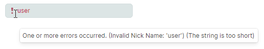

# 数据验证

Eremex 编辑器支持以下数据验证方法，可用于保持正确的数据输入、值检查，并显示无效数据的错误：

- [掩码](masks/index.md) — 允许你指定一种模式，用于限制用户在文本编辑器中输入的数据。
- 在编辑器级别进行数据验证，使用 `BaseEditor.Validate` 事件。
- 在绑定对象级别进行数据验证，使用 `DataAnnotation` 属性和 `INotifyDataErrorInfo` 接口。

<!-- TODO
 and `IDataErrorInfo` interface. -->

本主题提供有关 Eremex 编辑器中数据验证的更多详细信息。

要了解容器控件中的数据验证，请参阅以下主题：

<!--TODO
 - [DataGrid - Data Validation](../datagrid/data-validation.md) -->
- [TreeList - 数据验证](../treelist/data-validation.md)

## 自动验证

Eremex 编辑器支持对用户输入的值进行自动验证。自动验证会根据 [掩码](masks/index.md)（如果有）检查编辑器的值。如果编辑器绑定到某个属性，验证机制还会执行以下操作：

- 检查应用于该属性的 `DataAnnotation` 验证属性。
- 检查通过 `INotifyDataErrorInfo` 接口创建的错误。
- 检查输入的值是否可以转换为绑定属性的数据类型。


数据验证会在以下情况下被触发：

- 编辑器的值在代码中被更新时。
- 编辑器即将失去焦点时。
- 用户输入任意字符，前提是 `BaseEdit.ValidateOnInput` 属性设置为 `true`（默认值）。
- 用户按下 `Enter` 键，前提是 `BaseEdit.ValidateOnInput` 选项设置为 `false`。


<!-- TODO
IsModified property is missing?
Why ValidateOnInput is true by default?
 -->

### 强制数据验证

在特定情况下，你可能希望为编辑器强制触发验证机制。为此，请使用 `BaseEditor.DoValidate` 方法。

## 编辑器级别的数据验证

### “Validate” 事件

`BaseEditor.Validate` 事件允许你在代码隐藏文件中于编辑器级别执行数据验证。可用的事件参数如下：

- `ValidationEventArgs.Value` — 获取当前值。
- `ValidationEventArgs.ErrorContent` — 允许你在当前值无效时指定错误信息。如果将 `ErrorContent` 属性保持为 `null`，则当前值被视为有效。

#### 示例 - 验证输入的值是否为有效的电子邮件地址

以下示例通过处理 `BaseEditor.Validate` 事件，检查在文本编辑器中输入的字符串是否为有效的电子邮件地址。将 `ValidateOnInput` 选项设置为 `true`，可确保每次按下字符时都会触发验证。


``` xml
<mxe:TextEditor x:Name="textEditor3" 
                ValidateOnInput="true"
                Validate="textEditorValidate"/>

```
``` csharp
private void textEditorValidate(object sender, Eremex.AvaloniaUI.Controls.Editors.ValidationEventArgs e)
{
    if(e.Value == null || !IsEmailAddress(e.Value.ToString()))
    {
        e.ErrorContent = "Please enter a valid e-mail address";
    }
}

bool IsEmailAddress(string email)
{
    Regex regex = new Regex(@"^([\w\.\-]+)@([\w\-]+)((\.(\w){2,3})+)$");
    Match match = regex.Match(email);
    return match.Success;
}
```

## 绑定对象级别的数据验证


### 使用 DataAnnotation 属性进行数据验证

你可以使用 `DataAnnotations` 验证属性（`System.ComponentModel.DataAnnotations.ValidationAttribute` 的派生类）为业务对象的属性创建验证规则。当绑定到该属性时，Eremex 编辑器会自动检查该属性所指定的数据有效性规则。

下表列出了最常用的验证属性：

- [`CompareAttribute`](https://learn.microsoft.com/en-us/dotnet/api/system.componentmodel.dataannotations.compareattribute?view=net-7.0) — 提供用于比较两个属性的属性。
- [`CustomValidationAttribute`](https://learn.microsoft.com/en-us/dotnet/api/system.componentmodel.dataannotations.customvalidationattribute?view=net-7.0) — 指定用于验证属性或类实例的自定义验证方法。
- [`MaxLengthAttribute`](https://learn.microsoft.com/en-us/dotnet/api/system.componentmodel.dataannotations.maxlengthattribute?view=net-8.0) — 指定属性中允许的数组或字符串数据的最大长度。
- [`MinLengthAttribute`](https://learn.microsoft.com/en-us/dotnet/api/system.componentmodel.dataannotations.minlengthattribute?view=net-8.0) — 指定属性中允许的数组或字符串数据的最小长度。
- [`RangeAttribute`](https://learn.microsoft.com/en-us/dotnet/api/system.componentmodel.dataannotations.rangeattribute?view=net-8.0) — 指定数据字段值的数值范围约束。
- [`RegularExpressionAttribute`](https://learn.microsoft.com/en-us/dotnet/api/system.componentmodel.dataannotations.regularexpressionattribute?view=net-8.0) — 指定数据字段的值必须匹配指定的正则表达式。
- [`RequiredAttribute`](https://learn.microsoft.com/en-us/dotnet/api/system.componentmodel.dataannotations.requiredattribute?view=net-8.0) — 指定数据字段的值为必填项。
- [`StringLengthAttribute`](https://learn.microsoft.com/en-us/dotnet/api/system.componentmodel.dataannotations.stringlengthattribute?view=net-8.0) — 指定数据字段中允许的最小和最大字符长度。

#### 示例 - 使用 “RangeAttribute” 进行验证

以下示例使用 `RangeAttribute` 属性，确保某属性的值处于 10 到 100 之间的范围内。如果值超出该范围，编辑器会显示错误。


``` xml
<mxe:TextEditor x:Name="textEditor1" 
    Grid.Row="1" 
    HorizontalContentAlignment="Right" 
    EditorValue="{Binding Capacity}" />
```
``` csharp
public partial class MyViewModel : ObservableObject
{
    [ObservableProperty]
    [property: Range(10, 100, ErrorMessage = "Value for {0} must be between {1} and {2}.")]
    int capacity;
}
```


### 使用 “INotifyDataErrorInfo” 接口进行数据验证

`System.ComponentModel.INotifyDataErrorInfo` 接口允许你在业务对象级别实现自定义验证规则。该接口支持同步和异步验证、每个属性多个错误，以及跨属性错误。

#### 示例 - 实现 “INotifyDataErrorInfo” 接口

以下示例将一个文本编辑器绑定到 _MainViewModel_ 类中定义的 _NickName_ 属性。_MainViewModel_ 类实现了 `INotifyDataErrorInfo` 接口，该接口为 _NickName_ 属性定义了三条验证规则。如果 `INotifyDataErrorInfo.GetErrors` 方法为 _NickName_ 属性返回了一个或多个错误，文本编辑器就会显示错误。



``` xml
<mxe:TextEditor x:Name="textEditor2" EditorValue="{Binding NickName}"/>
```
``` csharp
public partial class MainViewModel : ObservableObject, INotifyDataErrorInfo
{
    private Dictionary<string, List<string>> propertyErrors = new Dictionary<string, List<string>>();

    [ObservableProperty]
    public string nickName;

    partial void OnNickNameChanged(string oldValue, string newValue)  => ValidateNickName();

    public bool HasErrors => propertyErrors.Any();

    public event EventHandler<DataErrorsChangedEventArgs> ErrorsChanged;

    public IEnumerable GetErrors(string propertyName)
    {
        if (propertyErrors.ContainsKey(propertyName))
            return propertyErrors[propertyName];
        else
            return null;
    }

    private void RaiseErrorsChanged(string propertyName)
    {
        ErrorsChanged?.Invoke(this, new DataErrorsChangedEventArgs(propertyName));
    }

    private void ValidateNickName()
    {
        ClearErrors(nameof(NickName));

        if (string.IsNullOrEmpty(NickName))
            AddError(nameof(NickName), "Nick Name cannot be empty.");
        if (string.Equals(NickName, "user", StringComparison.OrdinalIgnoreCase))
            AddError(nameof(NickName), "Invalid Nick Name: 'user'");
        if (NickName == null || NickName?.Length <= 5)
            AddError(nameof(NickName), "The string is too short");
    }

    private void AddError(string propertyName, string error)
    {
        if (!propertyErrors.ContainsKey(propertyName))
            propertyErrors[propertyName] = new List<string>();

        if (!propertyErrors[propertyName].Contains(error))
        {
            propertyErrors[propertyName].Add(error);
            RaiseErrorsChanged(propertyName);
        }
    }

    private void ClearErrors(string propertyName)
    {
        if (propertyErrors.ContainsKey(propertyName))
        {
            propertyErrors.Remove(propertyName);
            RaiseErrorsChanged(propertyName);
        }
    }

    public MainViewModel()
    {
        //...
        NickName = "user";
    }
}
```


## 标示错误

当数据验证过程中发生错误时，编辑器会按照 `BaseEditor.ErrorShowMode` 属性指定的方式标示该错误。支持两种错误显示模式：

### 显示内置错误图标和工具提示

如果 `ErrorShowMode` 属性设置为 `Inplace`，编辑器会在编辑框内显示一个错误图标。当用户将鼠标悬停在该图标上时，会出现带有错误描述的工具提示。


### 在编辑器下方显示错误

将 `ErrorShowMode` 属性设置为 `Full`，可在编辑框下方显示错误描述。此时内嵌的错误图标会被隐藏。


### 设置和清除错误文本

你可以执行以下操作之一来指定错误文本：

- 处理 `BaseEditor.Validate` 事件并设置 `ErrorContent` 事件参数。如果将 `ErrorContent` 事件参数保持为 `null`，则不会应用任何错误。

    要强制触发 `BaseEditor.Validate` 事件，请调用 `BaseEditor.DoValidate` 方法。

- 使用 `BaseEditor.ValidationInfo` 属性指定错误。

    以下代码在编辑器的值为 `null` 或 `0` 时，为该编辑器设置一个错误。

    ``` csharp
    if(textEditor2.EditorValue == null || 
       Convert.ToInt32(textEditor2.EditorValue)==0)
    textEditor2.ValidationInfo = new ValidationInfo("Invalid value");

    ```

    将 `BaseEditor.ValidationInfo` 属性设置为 `null` 以清除错误。


### 获取错误文本

使用 `BaseEditor.ErrorText` 属性获取错误文本。


<!-- TODO
Tell about the BaseEditor.ValidationInfo property (ValidationInfo.ErrorText, Exception)
 -->

<!-- TODO
Validate Using IDataErrorInfo ?

https://docs.devexpress.com/WPF/7076/controls-and-libraries/data-editors/common-features/input-validation#validate-using-idataerrorinfo
 -->


<br>
<br>

<sup>*</sup> 本页面使用机器翻译技术翻译。
