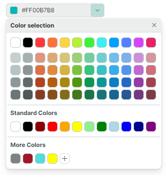
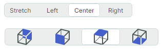

# 编辑器

Eremex Controls 库包含多种编辑器，提供高级数据编辑功能。这些编辑器允许您显示和编辑不同数据类型（数值、布尔值、日期时间、枚举等）的数据。它们支持数据验证机制，用于在数据输入过程中向用户提示错误。 

您可以将 Eremex 数据编辑器嵌入容器控件（DataGrid、TreeList、PropertyGrid 和 ToolbarManager）的单元格中，以呈现和编辑单元格数据。虽然您可以在单元格中嵌入任何自定义控件，但使用 Eremex 数据编辑器在应用程序性能方面有许多优势。

 

- [ButtonEditor](buttoneditor.md) — 一种内置自定义按钮的文本编辑器。

    

    - 普通按钮和切换按钮。
    - 在按钮中显示文本和图像。
    - 按钮左右对齐。
    - 工具提示。
    - 预定义的“x”按钮，用于清除编辑器的值。
    - 水印。

 

- [CheckEditor](checkeditor.md) — 显示一个通过点击切换状态的复选框。

    

    - 支持两种或三种选中状态（选中状态、未选中状态和不确定状态）。
    - 验证机制会修改控件的外观，以向用户提示错误。

 

- [ComboBoxEditor](comboboxeditor.md) — 允许用户从关联弹出窗口中显示的项目列表中选择一项。 

    

   - 支持的项目源：字符串列表、业务对象列表和枚举类型。
   - 支持使用数据模板以自定义方式呈现项目。
   - 单选和多选模式。
   - 多选模式下的内置复选框。
   - 在单选模式下，当用户开始在编辑框中输入文本时，文本自动完成功能会预测项目选择。

 

- [DateEditor](dateeditor.md) — 内置下拉日历的编辑器，允许用户选择日期。

    

    - 内置“Today”和“Clear”按钮。
    - 支持多种日期显示格式。
    - 下拉日历中的导航栏允许在月份和年份之间浏览。
    - 三种日历视图：月视图、年视图和年份范围视图。
    - 可限制可用日期范围的选项。

 

- [HyperlinkEditor](hyperlinkeditor.md) — 显示可点击的超链接。

    

    - 允许您指定用于处理超链接点击的命令。

 

- [MemoEditor](memoeditor.md)  — 一种下拉文本编辑器。

    
    - 嵌入在下拉窗口中的文本编辑器。
    - 为了指示下拉编辑器中存在文本，编辑框可以显示一个特殊图标或下拉文本的第一行。 

 

- [PopupColorEditor](popupcoloreditor.md) — 允许用户在弹出窗口中选择颜色。

    

    - 三种调色板 — Default、Standard、Custom。
    - Default 调色板可以在代码中初始化。
    - Standard 调色板显示预定义的标准颜色。
    - Custom 调色板允许用户使用内置 Color Picker 添加和修改颜色。
    - 支持以 RGB 和 HSB 格式指定颜色。
    
 

- `PopupEditor` — 具有下拉窗口的编辑器的基类。

<!--TODO Describe PopupEditor
 -->

 

- [SegmentedEditor](segmentededitor.md) — 显示多个分段（项目），用户可以选择其中一个。

    

    - 分段的水平排列。
    - 用户可以点击一个分段来选中它，并取消选中其他分段。
    - Ctrl+点击已选中的项目会清除选择。
    - 支持的项目源：字符串列表、业务对象列表和枚举类型。
    - 使用数据模板以自定义方式呈现项目。

 

- [SpinEditor](spineditor.md) — 允许您使用微调按钮编辑数值。

    

    - 内置微调按钮允许用户增大和减小值。
    - 限制可用的取值范围。
    - 自定义步进值。
    - 在编辑框中显示自定义前缀和后缀。

 

- [TextEditor](texteditor.md)  — 具有基本文本编辑功能的文本编辑器。

    

    - 所有基于文本的 Eremex 编辑器的基类。
    - 掩码输入。
    - 支持用于向用户显示错误的数据验证机制。

## 通用功能

- [掩码](masks/index.md)
    - 文本编辑器支持掩码输入，可防止用户输入无效值。
    - 掩码可用于在显示模式（未激活文本编辑时）下格式化容器控件中的单元格文本。
    - 支持的掩码类型：数值和日期时间。
    - DateEditor 默认使用日期时间输入掩码。
    - SpinEditor 默认使用数值输入掩码。

 

- [数据验证](data-validation.md)
    - 内置的值验证机制允许在所有文本编辑器和 CheckEditor 中向用户显示错误。
    - 文本编辑器可以在编辑框内部或下方显示验证错误。

 

- [Eremex 应用程序主题](../../controls/themes/index.md)
    - 主题定义了所有 Eremex 控件的外观。
    - 它们会自动应用于一组标准的 Avalonia UI 控件，确保与 Eremex 控件外观一致。
    - Eremex 编辑器支持每种主题的主色和辅色变体。通过更改单个属性，这些颜色变体可以为编辑器提供不同的颜色重点。

 
 

* 本页面使用机器翻译技术翻译。
</content>
