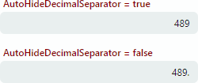
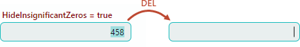

# 数字掩码

`Numeric` 掩码类型允许用户根据指定的输入掩码在编辑器中输入数值（整数、实数值、货币、百分比等）。输入掩码还可用于在显示模式下格式化数值（当文本编辑未激活时）。 `SpinEditor` control 默认启用 `Numeric` 掩码类型。要为其他文本编辑器启用此掩码类型，请将编辑器的 `TextEditor.MaskType` 属性设置为 `Numeric`。

使用编辑器的 `Mask` 属性指定输入掩码。输入掩码是一个字符串，它定义了输入或格式化数值所依据的模式。

当前的文化影响大多数数字掩码。例如，区域性定义货币符号和小数点分隔符。您可以使用 `TextEditor.MaskCulture` 属性将特定区域性强制分配给掩码。

Eremex 编辑器支持标准和自定义数字掩码。

## 标准口罩

Eremex 编辑器支持的标准数字掩码与可用于格式化 .NET 中的值的最常见 [standard numeric display formats](https://learn.microsoft.com/en-us/dotnet/standard/base-types/standard-numeric-format-strings) 相匹配。

### 例子

以下代码将 `p1` 掩码应用于 `SpinEditor`。掩码 `p` 将编辑器的值格式化为百分比。后缀 `1`（精度说明符）定义小数点右侧的位数。

``` xml
xmlns:mxe="https://schemas.eremexcontrols.net/avalonia/editors"

<mxe:SpinEditor x:Name="SpinEditor" Width="200" Value="0.3" Mask="p1" Increment="0.005"/>
```


### 标准掩码说明符

标准数字掩码由一个标准掩码说明符和一个可选的精度说明符（整数值）组成。精度说明符影响结果字符串中的位数。

下表显示了可用的标准掩码说明符。

|掩码说明符|描述 |示例|
|---|---|---|
| `C` 或 `c` |货币。 <br><br>精度说明符确定小数点右侧的小数位数。 | 12.54("c",ru-RU)&rarr;"12,54 ₽" <br><br> 71.85("c0",zh-CN)&rarr;"￥72" |
| `D` 或 `d` |十进制（整数）数字。 <br><br>精度说明符确定最小位数。 | 789("D")&rarr;"789"<br><br> -965("D5")&rarr;"-00965"|
| `F` 或 `f` <br><br>`G` 或 `g` |定点数。 <br><br>精度说明符确定小数位数。默认精度说明符由 `CultureInfo.NumberFormatInfo.NumberDecimalDigits` 定义。 | 1234.5678("F",ru-RU)&rarr;"1234,57" <br><br> 1234.56("F4",hi-IN)&rarr;"-1234.5600" |
| `N` 或 `n` |带组分隔符的实数。 <br><br>精度说明符确定小数位数。默认精度说明符由 `CultureInfo.NumberFormatInfo.NumberDecimalDigits` 定义。 | 1234.5678("N",ru-RU)&rarr;"1 234,57" <br><br> -1234.56("N3",en-US)&rarr;"-1,234.560" |
| `P` |根据系统模式，数字按原样显示并带有百分比符号。 <br><br>系统模式由 `CultureInfo.NumberFormatInfo.PercentNegativePattern` 和 `CultureInfo.NumberFormatInfo.PercentPositivePattern` 属性指定。<br><br> 精度说明符确定小数位数。默认精度说明符由 `CultureInfo.NumberFormatInfo.PercentDecimalDigits` 定义。 | 12("P",zh-CN)&rarr;"12.00%" <br><br> -15.6("P0",ru-RU)&rarr;"-16 %" |
| `p` |当要显示underlying数字时，将其乘以100，并根据系统模式以百分号显示。在编辑器中键入数字时，向后转换会将数字除以 100，并将其存储在编辑值中。<br><br>系统模式由 `CultureInfo.NumberFormatInfo.PercentNegativePattern` 和 `CultureInfo.NumberFormatInfo.PercentPositivePattern` 属性指定。<br><br> 精度说明符确定小数位数（默认精度说明符由 `CultureInfo.NumberFormatInfo.PercentDecimalDigits` 定义）。 | 12("p",en-US)&rarr;"1,200.00%" <br><br> -0.2567("P0",ru-RU)&rarr;"-26 %"|


## 定制面具

如果标准蒙版不能满足您的特定需求，您可以创建自定义蒙版。自定义掩码由一个或多个自定义掩码说明符组成。

### 例子

以下代码将 `#,##0.##` 自定义掩码应用于 `SpinEditor`。该掩码允许用户输入 -9999.99 到 9999.99 范围内的实数。编辑器的 `Minimum` 和 `Maximum` 属性将范围限制为 [0;5000]。

`,` 掩码说明符用于在三位数组之间插入本地化分隔符。


``` xml
xmlns:mxe="https://schemas.eremexcontrols.net/avalonia/editors"

<mxe:SpinEditor x:Name="SpinEditor" Value="1234.5" Mask="#,##0.##" Minimum="0" Maximum="5000" Increment="0.5"/>
```

### 自定义掩码说明符

下表显示了支持的自定义掩码说明符。

|掩码说明符|描述 |示例|
|---|---|---|
| `0` |数字 (0-9) 的零占位符。当该位置没有数字时，该占位符显示“0”。  | -12.345("0000")&rarr;"-0012"<br><br>78.97("000.0", ru-RU)&rarr;"079,0" |
| `#` |数字占位符。当该位置没有数字时，该占位符不显示任何内容。 | 12.34("####")&rarr;"12"<br><br>-0.123("####.##",ru-RU)&rarr;"-,12" |
| `.` |小数点。指定结果字符串中小数点的位置。<br><br>`CultureInfo.NumberFormatInfo.NumberDecimalSeparator` 属性确定在当前区域性中用作小数分隔符的字符。 | 0.9876("0.00",zh-CN)&rarr;0.99<br><br>0.01("####0.#")&rarr;"0" |
| `,` |组分隔符。您可以将组分隔符放置在掩码内的任何 position 处，以使用本地化的组分隔符分隔小数点左侧的数字组。<br><br> `CultureInfo.NumberFormatInfo.NumberGroupSeparator` 属性指定默认组分隔符。 `CultureInfo.NumberFormatInfo.NumberGroupSizes` 属性指定每个组中的默认位数。<br><br> 如果掩码包含“%”字符（见下文），则 `CultureInfo.NumberFormatInfo.PercentGroupSeparator` 和 `CultureInfo.NumberFormatInfo.PercentGroupSizes` 属性分别指定组分隔符和组长度。<br><br>如果掩码包含“$”字符（见下文），则 `CultureInfo.NumberFormatInfo.CurrencyGroupSeparator`改为使用 `CultureInfo.NumberFormatInfo.CurrencyGroupSizes` 属性。| 12345678.91("#,########.#",en-US)&rarr;"12,345,678.9" |
| `%` |百分比。当要显示 underlying 数字时，将其乘以 100，并以百分号显示。当在编辑器中键入数字时，向后转换会将数字除以 100，并将其存储在编辑值中。 <br><br> `%` 说明符定义结果字符串中本地化百分号 (`CultureInfo.NumberFormat.PercentSymbol`) 的 position。 0.31415("% ##0.00",en-US)&rarr;"% 31.41"<br><br>0.5567("##.0 %",ru-RU)&rarr;"55,7 %" |
| `%%` |百分比字符。按原样显示值，并将本地化百分比符号 (`CultureInfo.NumberFormat.PercentSymbol`) 添加到结果字符串的指定位置。 |0.31415("%% ##0.00",en-US)&rarr;"% 0.31"<br><br>0.1256("#0.00 %%",ru-RU)&rarr;"0,13 %" |
| `\` |逃脱角色。转义字符后面的字符被解释为文字而不是掩码说明符。使用“&bsol;&bsol;”插入反斜杠字符作为文字。  | 123456("&bsol;########&bsol;#")&rarr;"#123456#" |
| `;` |定义正数和负数掩码的部分的分隔符。<br><br>`;` 字符之前的部分指定正数的掩码。 `;` 字符后面的部分指定负数的掩码。如果负数部分为空，则用户无法输入负值。 | 10.25("#0.##;(#0.##)", en-US)&rarr;"10.25"<br><br> -10.25("#0.##;(#0.##)", en-US)&rarr;"(10.25)" |
| `$` |货币符号。在指定位置插入货币符号 (`CultureInfo.NumberFormatInfo.CurrencySymbol`)。 | 35("###0 $",zh-CN)&rarr;"35 元" |
|所有其他角色 |这些字符以只读模式按原样显示。它们不存储在编辑器的编辑值中。 | 36.6("#0.##°",hi-IN)&rarr;"36.6°" | 36.6("#0.##°",hi-IN)&rarr;"36.6°"

## 数字掩码设置

您可以使用其他设置自定义数字掩码行为。这些设置可从 `Eremex.AvaloniaUI.Controls.Editors.NumericMaskOptions` 类公开的附加属性中获得。

### 自动隐藏小数分隔符

`NumericMaskOptions.AutoHideDecimalSeparator` 属性指定当当前数字没有小数部分时是否隐藏或显示小数点分隔符。



### 例子

以下示例防止隐藏小数点分隔符。

``` xml
xmlns:mxe="https://schemas.eremexcontrols.net/avalonia/editors"

<mxe:TextEditor Name="textEditor1" MaskType="Numeric" Mask="####0.#" mxe:NumericMaskOptions.AutoHideDecimalSeparator="False"/>
```

以下代码设置 `AutoHideDecimalSeparator` 属性 in code-behind：

``` csharp
textEditor1.MaskType = Eremex.AvaloniaUI.Controls.Editors.MaskType.Numeric;
textEditor1.Mask = "##0.##";
textEditor1.SetValue(NumericMaskOptions.AutoHideDecimalSeparatorProperty, false);
```

### 显示“0”或零值不显示

“#”掩码说明符确定一个占位符，当该位置没有数字时，该占位符不显示任何内容。当掩码仅由“#”数字占位符组成且编辑器的值为“0”时，编辑器可以显示“0”字符串（默认模式）或不显示任何内容。

当掩码由“#”字符组成时，`NumericMaskOptions.HideInsignificantZeros` 属性允许您选择“0”值的渲染模式。

- `HideInsignificantZeros` 设置为 `false`（默认）— 当 the edit value 为“0”时，编辑器显示“0”。


- `HideInsignificantZeros` 设置为 `true` — 当 the edit value 为“0”时，编辑器不显示任何内容。



### 例子

以下示例将 `HideInsignificantZeros` 属性设置为 `true`，以便在 the edit value 为“0”时不显示任何内容。

``` xml
xmlns:mxe="https://schemas.eremexcontrols.net/avalonia/editors"

<mxe:TextEditor Name="textEditor1" MaskType="Numeric" Mask="#####.##" mxe:NumericMaskOptions.HideInsignificantZeros="True"/>
```

以下代码设置 `HideInsignificantZeros` 属性 in code-behind：

``` csharp
textEditor1.MaskType = Eremex.AvaloniaUI.Controls.Editors.MaskType.Numeric;
textEditor1.Mask = "#####.##";
textEditor1.SetValue(NumericMaskOptions.HideInsignificantZeros, true);
```

<br>
<br>

<sup>*</sup> 本页面使用机器翻译技术翻译。
